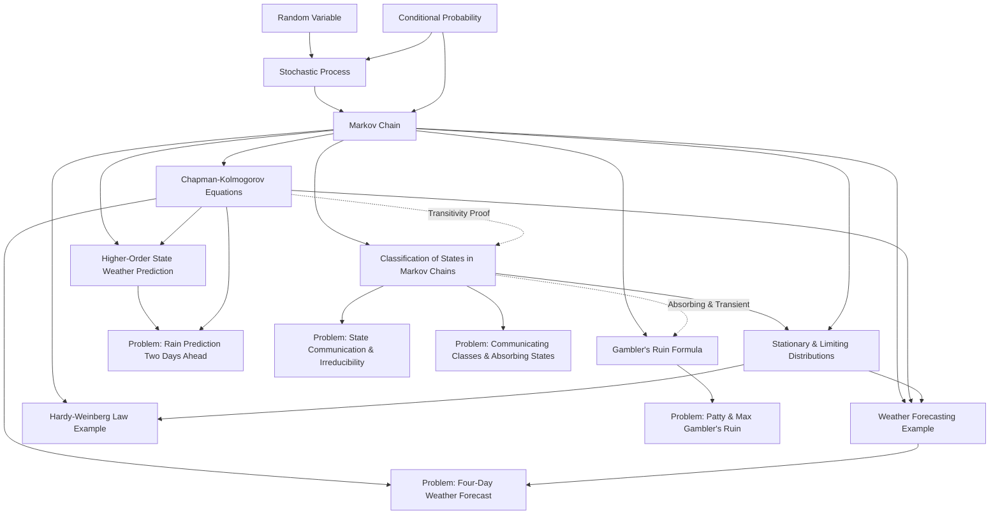

# CSE301 — Dependency Map

This map outlines conceptual prerequisites, core dependencies, and learning pathways for CSE301 topics.

---

## Visual Dependency Graph

---

## Detailed Prerequisite Chains

### 1. Markov Chains Pathway
1. `[[Random Variable]]` + `[[Conditional Probability]]`
   $$\downarrow$$
2. `[[Stochastic Process]]`
   $$\downarrow$$
3. `[[Markov Chain]]`
   - Defines one-step transition matrix $P$ and row-stochasticity.
   $$\downarrow$$
4. `[[Chapman-Kolmogorov Equations]]`
   - Proves $P^{(n)} = P^n$ and establishes transitivity of reachability.
   $$\downarrow$$
5. `[[Classification of States in Markov Chains]]`
   - Establishes accessibility, communicating classes, irreducibility, periodicity, recurrence, and transience.
   $$\downarrow$$
6. `[[Stationary and Limiting Distributions in Markov Chains]]`
   - Balance equations $\pi P = \pi$, ergodic theorem conditions, difference between stationary and limiting distributions.

### 2. Random Walk and Gambler's Ruin Pathway
1. `[[Markov Chain]]` (Absorbing barriers at $0$ and $N$)
   $$\downarrow$$
2. `[[Classification of States in Markov Chains]]` (States $0, N$ are absorbing; $\{1, \dots, N-1\}$ are transient)
   $$\downarrow$$
3. `[[Gambler's Ruin Formula]]` (Second-order difference equation solved via telescoping geometric sequence)
   $$\downarrow$$
4. `[[Problem — Patty and Max Gambler's Ruin]]`

---

## Application and Problem Mapping

| Knowledge Note | Directly Tested / Applied By |
|---|---|
| `[[Markov Chain]]` | `[[Weather Forecasting Markov Chain Example]]`, `[[Problem — Four-Day Weather Forecast]]` |
| `[[Chapman-Kolmogorov Equations]]` | `[[Problem — Four-Day Weather Forecast]]`, `[[Problem — Rain Prediction Two Days Ahead]]` |
| `[[Classification of States in Markov Chains]]` | `[[Problem — State Communication and Irreducibility Verification]]`, `[[Problem — Identification of Communicating Classes and Absorbing States]]` |
| `[[Stationary and Limiting Distributions in Markov Chains]]` | `[[Hardy-Weinberg Law Markov Chain Example]]`, `[[Weather Forecasting Markov Chain Example]]` |
| `[[Gambler's Ruin Formula]]` | `[[Problem — Patty and Max Gambler's Ruin]]` |
