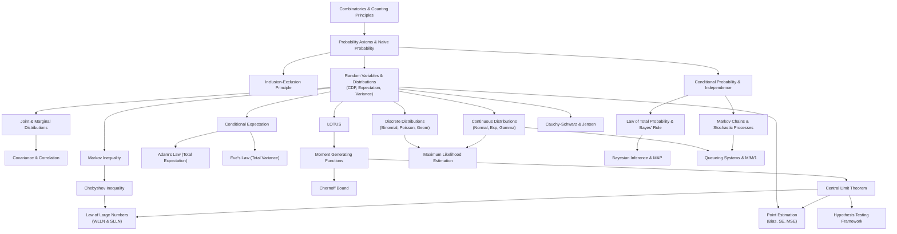

# CSE301 — Dependency Map

This map outlines conceptual prerequisites, core dependencies, and learning pathways for CSE301 topics.

---

## High-Level Visual Architecture

---

## Detailed Learning Pathways

### Pathway 0: Foundations of Probability, Conditioning, and Limit Theorems
1. `[[Combinatorics and Counting Principles]]` + `[[Probability Axioms and Naive Probability]]` $\to$ `[[Inclusion-Exclusion Principle]]` (Naive probability, sample spaces, and union bounds).
2. `[[Random Variables and Probability Distributions]]` $\to$ `[[Discrete Probability Distributions]]` & `[[Continuous Probability Distributions]]` (Distribution stories, PMF/PDF, moments).
3. `[[Joint and Marginal Distributions]]` $\to$ `[[Covariance and Correlation]]` (Multivariate interactions, independence vs uncorrelatedness).
4. `[[Conditional Probability and Independence]]` $\to$ `[[Law of Total Probability and Bayes' Rule]]` (Conditioning and belief revision).
5. `[[Conditional Expectation]]` $\to$ `[[Adam's Law (Law of Total Expectation)]]` & `[[Eve's Law (Law of Total Variance)]]` (Tower property, compound sums, ANOVA decomposition).
6. `[[Markov Inequality]]` $\to$ `[[Chebyshev Inequality]]` $\to$ `[[Chernoff Bound]]` (Moment-based concentration inequalities).
7. `[[Moment Generating Functions]]` $\to$ `[[Central Limit Theorem]]` & `[[Law of Large Numbers]]` (Asymptotic convergence in distribution and probability).

### Pathway 1: Statistical Inference & Point Estimation

1. `[[Random Variables and Probability Distributions|Probability Foundations]]` $\to$ `[[Point Estimation]]` (Defines estimators as random variables, bias, and standard error).
2. `[[Point Estimation]]` $\to$ `[[Bias-Variance Decomposition]]` (Proves $\text{MSE} = \text{bias}^2 + \text{Var}$).
3. `[[Bias-Variance Decomposition]]` $\to$ `[[Estimator Consistency and Convergence]]` (Establishes consistency criteria and quadratic mean convergence).
4. `[[Point Estimation]]` + `[[Central Limit Theorem]]` $\to$ `[[Confidence Intervals and Confidence Sets]]` (Frequentist coverage vs. subjective certainty).
5. `[[Confidence Intervals and Confidence Sets]]` $\to$ `[[Normal-Based Large-Sample Confidence Interval]]` (Standard Wald-type $z$-intervals).

### Pathway 2: Maximum Likelihood Estimation
1. Calculus & `[[Joint and Marginal Distributions|Joint Likelihood]]` $\to$ `[[Likelihood and Score Equations]]` (Score function, Fisher information, curvature).
2. `[[Point Estimation]]` + `[[Likelihood and Score Equations]]` $\to$ `[[Maximum Likelihood Estimation]]` (Definition, equivariance, asymptotic normality).
3. `[[Maximum Likelihood Estimation]]` $\to$ `[[Normal Distribution Parameter MLE Derivation Example]]` (Derives Gaussian MLE and downward bias of sample variance).
4. `[[Maximum Likelihood Estimation]]` $\to$ `[[Uniform Distribution Non-Regular MLE Example]]` (Non-regular parameter-dependent boundary maximization).

### Pathway 3: Bayesian Inference & MAP
1. `[[Law of Total Probability and Bayes' Rule|Bayes' Rule]]` $\to$ `[[Bayesian Inference]]` (Parameters as random variables, posterior updating $\text{Posterior} \propto \text{Likelihood} \times \text{Prior}$).
2. `[[Bayesian Inference]]` + `[[Maximum Likelihood Estimation]]` $\to$ `[[Maximum A Posteriori (MAP) Estimation]]` (Mode of posterior; proves equivalence to MLE under flat prior and connects to $L_1/L_2$ regularization).
3. `[[Bayesian Inference]]` $\to$ `[[Credible Intervals]]` (Direct posterior probability statements; contrasts with frequentist confidence intervals).
4. `[[Bayesian Inference]]` $\to$ `[[Beta-Binomial Conjugate Updating Formula]]` (Pseudocounts, weighted averages, Laplace's Rule of Succession).
5. `[[Bayesian Inference]]` $\to$ `[[Normal-Normal Conjugate Updating Formula]]` (Precision addition and weighted posterior means).

### Pathway 4: Hypothesis Testing & Multiplicity
1. Decision Theory $\to$ `[[Hypothesis Testing Framework]]` (Null/alternative, Type I/II errors, power function, size).
2. `[[Hypothesis Testing Framework]]` $\to$ `[[p-Values and Significance]]` (Sliding critical threshold, null distribution $P \sim \text{Uniform}(0, 1)$).
3. `[[Maximum Likelihood Estimation]]` + `[[p-Values and Significance]]` $\to$ `[[Wald Test Statistic]]` (Asymptotic standard normal test).
4. `[[Discrete Probability Distributions|Multinomial Distribution]]` $\to$ `[[Pearson's Chi-Square Goodness-of-Fit Test]]` (Degrees of freedom $k - 1$, Mendel's peas).
5. Non-parametric Exchangeability $\to$ `[[Permutation Test Algorithm]]` (Exact permutation distribution and Monte Carlo test).
6. Multiplicity Dilemma $\to$ `[[Multiple Testing and False Discovery Rate]]` (FWER inflation vs. False Discovery Rate).
7. `[[Multiple Testing and False Discovery Rate]]` $\to$ `[[Benjamini-Hochberg Procedure Algorithm]]` (Adaptive linear rank thresholding).

### Pathway 5: Queueing Theory
1. `[[Markov Chain|Continuous-Time Markov Chains]]` $\to$ `[[Queueing Systems and Kendall Notation]]` ($A/S/c/K$ taxonomy, $L, L_Q, W, W_Q$).
2. Conservation Principles $\to$ `[[Little's Law]]` (Ross's Fundamental Cost Identity $R = \lambda_a G \implies L = \lambda_a W$).
3. `[[Continuous Probability Distributions|Poisson Process Properties]]` $\to$ `[[PASTA Property and Inspection Paradox]]` (Independent increments prove $a_n = P_n$).
4. Birth-Death Processes $\to$ `[[M-M-1 Queue]]` (Balance equations, telescoping geometric steady state, $\rho < 1$).
5. `[[M-M-1 Queue]]` $\to$ `[[M-M-1 Performance Formulas]]` (Closed-form formulas and exponential latency tails).
6. `[[M-M-1 Queue]]` $\to$ `[[Finite Capacity M-M-1-N Queue]]` (Finite state space, stability for all $\lambda$, blocking probability, effective throughput $\lambda_{\text{eff}}$).
7. Burke's Theorem $\to$ `[[Jackson Networks and Tandem Queues]]` (Tandem queues, Jackson traffic equations $\boldsymbol{\lambda}^T = \mathbf{r}^T(\mathbf{I} - \mathbf{P})^{-1}$, product-form joint distributions).
