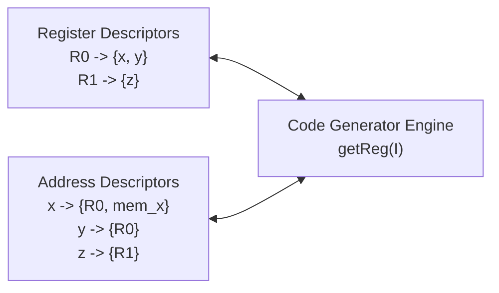

# A Simple Code Generator Algorithm

> 📖 **Reading Order:** Step 37 of 55 | **Module 4: Code Generation**  
> ◄ **Previous:** [[DAG Construction and Local Optimization of Basic Blocks]] | ► **Next:** [[Peephole Optimization Techniques]]

---

## The Problem and Earlier Tools

The Dragon Book defines a classic, robust code generation algorithm that translates a basic block of Three-Address Code into machine instructions statement-by-statement. 

To track where values are currently located without redundant loads and stores, the algorithm maintains two dynamic tracking structures:
1. **Register Descriptors:** For each physical register $R$, tracks the set of variable names whose current values are currently held in $R$.
2. **Address Descriptors:** For each variable name $x$, tracks the set of memory locations (registers, stack slots, memory addresses) where the current value of $x$ can currently be found.

---

## Developing the Core Idea

For a three-address instruction $I: x = y + z$, the function `getReg(I)` selects a physical register $R_x$ to hold the result $x$:

1. If $y$ is currently stored in a register $R_y$, and $R_y$ holds *only* $y$, and $y$ has **no next use** after statement $I$ (i.e., $y$ is dead):
   - Allocate $R_y$ as $R_x$! (Reuse $y$'s register for $x$).
2. Else, if there is an **empty (unallocated) register** $R$:
   - Return $R$.
3. Else, if all registers are full, pick an occupied register $R$ to **spill**:
   - For every variable $v$ currently in $R$:
     - If the address descriptor for $v$ shows that $v$ is *not* already in memory, emit:
       $$\text{ST } v, R$$
       and add memory location $v$ to $v$'s address descriptor.
     - Remove $R$ from the address descriptor of $v$.
   - Clear register descriptor for $R$ and return $R$.

---

## Inputs

- Sequence of Three-Address Code (TAC) instructions within a basic block, initial register descriptor, and address descriptor.

---

## Outputs

- Target machine assembly instructions (loads, operations, stores) with updated descriptor state.

---

## How It Works

### End of Basic Block Actions

At the end of a basic block:
- If variable $x$ is **live at block exit**, and the current value of $x$ resides only in a register $R_x$ (not in memory):
  - Emit:
    $$\text{ST } x, R_x$$
- Any temporary variable whose lifetime does not extend beyond the block is simply discarded without storing.

---

## Pseudocode

### The Code Generation Algorithm for $x = y + z$

1. Consult address descriptor of $y$ to determine its current location $L_y$:
   - Prefer a register holding $y$. If $y$ is only in memory, $L_y = y$.
2. Consult address descriptor of $z$ to determine its location $L_z$.
3. Call `getReg(x = y + z)` to choose a destination register $R_x$.
4. If $y$ is not already in register $R_x$:
   - Emit instruction: $\text{LD } R_x, L_y$.
5. Emit instruction: $\text{ADD } R_x, R_x, L_z$.
6. **Update Descriptors:**
   - Set register descriptor of $R_x$ to $\{ x \}$.
   - Set address descriptor of $x$ to $\{ R_x \}$ (and remove memory $x$, since memory is now stale!).
   - Remove $R_x$ from the address descriptors of any other variables that previously occupied it.
7. **Free Dead Registers:**
   - If $y$ has no next use and is in register $R_y \ne R_x$, remove $y$ from $R_y$'s descriptor.
   - If $z$ has no next use and is in register $R_z$, remove $z$ from $R_z$'s descriptor.

---

## Example

Concrete step-by-step simulations and traces are cataloged in the associated Example and Problem notes.

---

## Complexity

- **Time Complexity:** $O(N \cdot K)$ where $N$ is the number of TAC statements in the basic block and $K$ is the number of hardware registers (scanning register descriptors takes $O(K)$ time).
- **Space Complexity:** $O(V + K)$ storing descriptors for $V$ variables and $K$ registers.

---

## Properties

- **Termination:** Provably terminates on all well-formed compiler inputs.
- **Correctness:** Preserves the underlying language semantics and program data dependencies.

---

## Limitations

- Greedy, local decision making; does not optimize across basic block boundaries.
- Can emit redundant stores if variable liveness is computed conservatively.

---

## Common Mistakes

- Forgetting to update liveness information or next-use pointers.
- Misinterpreting index bounds during stack or interval scans.

---

## Exam Relevance

Frequently tested on final examinations via hand-simulation of A Simple Code Generator Algorithm on given code fragments or graphs.

---

## Related Concepts

- [[Basic Blocks and Control Flow Graphs]]
- [[Liveness and Next-Use Analysis within Basic Blocks]]
- [[Peephole Optimization Techniques]]

---

## Prerequisites

- [[Liveness and Next-Use Analysis within Basic Blocks]]

---

## Problems

- [[Problem — Basic Block Partitioning and Next-Use Table]]

---

## Sources

- **Lecture Slides:** [[cse309/01 - Sources/Lectures/KMS Merged.pdf|KMS Merged.pdf]], Chapter 8 (Slides 348–358).
- **Textbook:** Aho, Lam, Sethi, Ullman, *Compilers: Principles, Techniques, & Tools* (2nd Ed.), Section 8.6.
