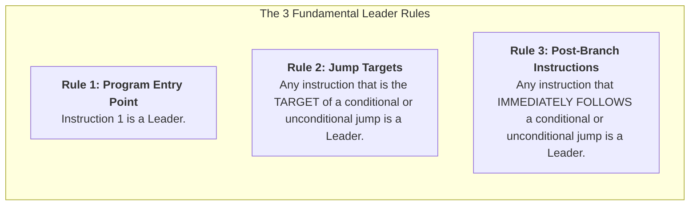
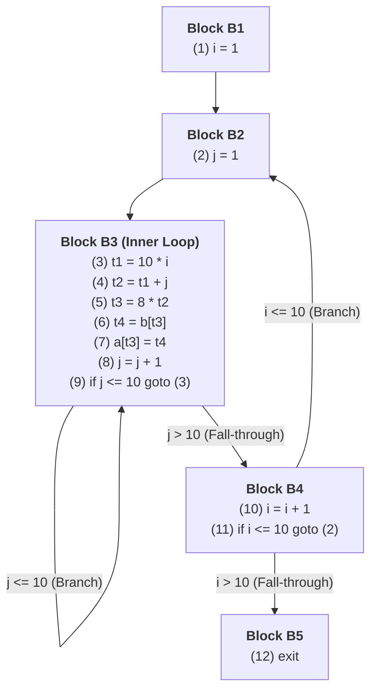

# Basic Block Partitioning Algorithm

> 📖 **Reading Order:** Step 34 of 55 | **Module 4:** Code Generation  
> ◄ **Previous:** [[Basic Blocks and Control Flow Graphs]] | ► **Next:** [[Liveness and Next-Use Analysis within Basic Blocks]]

---

---

---

---

---

## The Problem and Earlier Tools

Before a compiler can apply code generation, instruction scheduling, or local register allocation, it must break down arbitrary Three-Address Code (TAC) into straight-line sequences with no internal branches.

These sequences are **Basic Blocks**:
- They possess the **Single-Entry, Single-Exit** invariant.
- Once the first instruction of a basic block executes, **every instruction in that block will execute strictly in order**.

To find these blocks without an exhaustive search, the compiler identifies the boundary instructions that begin each block. These boundary instructions are called **Leaders**.

---

---

---

---

---

## Developing the Core Idea

Given a linear array of Three-Address Code instructions indexed $1$ to $N$:



### Formal Definitions:
1. **Rule 1 (First Instruction):** Instruction $1$ is a leader.
2. **Rule 2 (Target of Jumps):** For any instruction $i$ containing `goto L` or `if ... goto L`, the instruction at target address $L$ is a leader.
3. **Rule 3 (Following Jumps):** For any instruction $i$ containing `goto L` or `if ... goto L`, the instruction immediately following it ($i + 1$) is a leader (if $i + 1 \le N$).

---

---

---

---

---

## Inputs

- Intermediate representation (Three-Address Code instructions, parse tree nodes, live intervals, or interference graph).

---

## Outputs

- Partitioned blocks, DAG nodes, allocated physical registers, or evacuated memory blocks.

---

## How It Works

### Inputs

- Intermediate representation (Three-Address Code instructions, parse tree nodes, live intervals, or interference graph).

---
### Outputs

- Partitioned blocks, DAG nodes, allocated physical registers, or evacuated memory blocks.

---
### How It Works

### Inputs

- Intermediate representation (Three-Address Code instructions, parse tree nodes, live intervals, or interference graph).

---
### Outputs

- Partitioned blocks, DAG nodes, allocated physical registers, or evacuated memory blocks.

---
### How It Works

### Inputs

- Intermediate representation (Three-Address Code instructions, parse tree nodes, live intervals, or interference graph).

---
### Outputs

- Partitioned blocks, DAG nodes, allocated physical registers, or evacuated memory blocks.

---
### How It Works

The algorithm transitions through defined phases.

---
### Properties

### Formal Proof: Necessity and Sufficiency of the 3 Leader Rules

Why do these three rules guarantee that every generated block is strictly single-entry and single-exit?

### Theorem: Soundness and Completeness of Leader Partitioning
*A partitioning of Three-Address Code instructions into blocks starting at leaders and extending to immediately before the next leader produces a set of maximal sequences satisfying:*
1. *Single-Entry: Control enters the block strictly at the first instruction.*
2. *Single-Exit: Control leaves the block strictly at the last instruction.*

### Proof:

#### 1. Single-Entry Invariant:
- Suppose, for contradiction, that control can enter block $B$ at an internal instruction $k$ (where $k > \text{leader}(B)$).
- How could control reach instruction $k$? Only in two possible ways:
  - **Case A (Via Branch):** Some instruction $j$ anywhere in the program executed a conditional or unconditional jump to $k$. But by **Rule 2**, any instruction targeted by a jump is classified as a leader! If $k$ is a leader, it begins its own block; it cannot be an internal instruction of $B$. Contradiction.
  - **Case B (Via Sequential Fall-Through):** Control fell through from instruction $k - 1$. If $k-1 \notin B$, then $k-1$ belonged to a preceding block that must have ended. If $k-1$ was a branch, then by **Rule 3**, instruction $k$ is a leader! If $k-1$ was not a branch, then $k-1$ and $k$ are in the same straight-line sequence, meaning $k-1 \in B$.
- Therefore, no instruction inside $B$ can be entered from the outside. Control enters strictly at the leader.

#### 2. Single-Exit Invariant:
- Suppose, for contradiction, that control can leave block $B$ before its final instruction, say at instruction $m$ (where $m < \text{last}(B)$).
- How could control leave at $m$?
  - **Case A (Via Branch):** Instruction $m$ is a conditional or unconditional jump. But by **Rule 3**, the instruction immediately succeeding a jump ($m + 1$) is classified as a leader! If $m + 1$ is a leader, then by definition, block $B$ terminates at instruction $m$. Thus, $m$ must be the last instruction of $B$. Contradiction.
  - **Case B (Via Halt / Exit):** If instruction $m$ halts execution, control does not proceed to $m + 1$. The compiler treats halts as unconditional exits, ending the block at $m$.
- Therefore, no internal instruction can prematurely branch out. Control leaves strictly at the last instruction. $\blacksquare$

---

---
### Related Concepts

- [[Basic Blocks and Control Flow Graphs]]
- [[Live Ranges and Live Intervals in Register Allocation]]
- [[Register Interference Graphs and Graph Coloring Principles]]

---
### Prerequisites

- [[Basic Blocks and Control Flow Graphs]]

---
### Problems

- [[Problem — Linear Scan Register Allocation Simulation]]
- [[Problem — Chaitin Graph Coloring Register Allocation]]

---

---
### Properties

- **Termination:** Provably terminates on all well-formed compiler inputs.
- **Correctness:** Preserves the underlying language semantics and program data dependencies.

---
### Related Concepts

- [[Basic Blocks and Control Flow Graphs]]
- [[Live Ranges and Live Intervals in Register Allocation]]
- [[Register Interference Graphs and Graph Coloring Principles]]

---
### Prerequisites

- [[Basic Blocks and Control Flow Graphs]]

---
### Problems

- [[Problem — Linear Scan Register Allocation Simulation]]
- [[Problem — Chaitin Graph Coloring Register Allocation]]

---

---
### Properties

- **Termination:** Provably terminates on all well-formed compiler inputs.
- **Correctness:** Preserves the underlying language semantics and program data dependencies.

---
### Related Concepts

- [[Basic Blocks and Control Flow Graphs]]
- [[Live Ranges and Live Intervals in Register Allocation]]
- [[Register Interference Graphs and Graph Coloring Principles]]

---
### Prerequisites

- [[Basic Blocks and Control Flow Graphs]]

---
### Problems

- [[Problem — Linear Scan Register Allocation Simulation]]
- [[Problem — Chaitin Graph Coloring Register Allocation]]

---

---

## Pseudocode

### Pseudocode

### Pseudocode

### Pseudocode

### The Partitioning Algorithm Implementation

```python
class BasicBlockPartitioner:
    def __init__(self, instructions):
        # 1-indexed list of TAC instructions
        self.instructions = instructions
        self.n = len(instructions)

    def find_leaders(self) -> set:
        leaders = set()
        if self.n == 0:
            return leaders

        # Rule 1: Instruction 1 is always a leader
        leaders.add(1)

        # Rules 2 & 3: Scan for branches
        for i in range(1, self.n + 1):
            inst = self.instructions[i - 1]
            if inst.is_branch(): # conditional or unconditional jump
                # Rule 2: Target of jump is a leader
                target = inst.get_jump_target_index()
                if 1 <= target <= self.n:
                    leaders.add(target)
                
                # Rule 3: Instruction immediately following jump is a leader
                if i + 1 <= self.n:
                    leaders.add(i + 1)

        return leaders

    def partition(self):
        leaders = sorted(list(self.find_leaders()))
        blocks = []
        for idx in range(len(leaders)):
            start = leaders[idx]
            # End is one before the next leader, or the last instruction of program
            end = leaders[idx + 1] - 1 if idx + 1 < len(leaders) else self.n
            block_instructions = self.instructions[start - 1 : end]
            blocks.append({
                "block_id": f"B{idx + 1}",
                "start": start,
                "end": end,
                "instructions": block_instructions
            })
        return blocks
```

---

---

---

---

---

## Example

Concrete step-by-step simulations and traces are cataloged in the associated Example and Problem notes.

---

## Complexity

- **Time Complexity:** **$O(N)$**, where $N$ is the number of TAC instructions.
  - Phase 1 scans instructions $1 \dots N$ once to identify leaders.
  - Phase 2 slices the instruction array into blocks in $O(N)$ time.
- **Space Complexity:** **$O(N)$** to store block descriptor records.

---

---

---

---

---

## Properties

- **Termination:** Provably terminates on all well-formed compiler inputs.
- **Correctness:** Preserves the underlying language semantics and program data dependencies.

---

## Limitations

### Limitations

### Limitations

### Limitations

- Conservative heuristics may yield suboptimal allocations or require register spilling when demand exceeds hardware resources.

---

---

---

---

## Common Mistakes

### Common Mistakes

### Common Mistakes

### Common Mistakes

- Forgetting to update liveness information or next-use pointers.
- Misinterpreting index bounds during stack or interval scans.

---

---

---

---

## Exam Relevance

### Example

Concrete step-by-step simulations and traces are cataloged in the associated Example and Problem notes.

---
### Exam Relevance

### Example

Concrete step-by-step simulations and traces are cataloged in the associated Example and Problem notes.

---
### Exam Relevance

### Example

### End-to-End Walkthrough: Complex 12-Instruction Loop

Consider the following Three-Address Code program implementing a 2D matrix assignment:

```text
(1)  i = 1
(2)  j = 1
(3)  t1 = 10 * i
(4)  t2 = t1 + j
(5)  t3 = 8 * t2
(6)  t4 = b[t3]
(7)  a[t3] = t4
(8)  j = j + 1
(9)  if j <= 10 goto (3)
(10) i = i + 1
(11) if i <= 10 goto (2)
(12) exit
```

### Step 1: Identifying Leaders
1. **Rule 1 (First Instruction):**
   - Instruction `(1)` $\implies$ **Leader: (1)**
2. **Rule 2 (Jump Targets):**
   - Instruction `(9)` is `if j <= 10 goto (3)` $\implies$ **Leader: (3)**
   - Instruction `(11)` is `if i <= 10 goto (2)` $\implies$ **Leader: (2)**
3. **Rule 3 (Following Jumps):**
   - Instruction following `(9)` is `(10)` $\implies$ **Leader: (10)**
   - Instruction following `(11)` is `(12)` $\implies$ **Leader: (12)**

**Sorted Leader Set:** $\{ (1), (2), (3), (10), (12) \}$

---

### Step 2: Assembling the Basic Blocks

```
Block Boundaries:
  B1: [1 .. 1]   (Leader 1 up to before Leader 2)
  B2: [2 .. 2]   (Leader 2 up to before Leader 3)
  B3: [3 .. 9]   (Leader 3 up to before Leader 10)
  B4: [10 .. 11] (Leader 10 up to before Leader 12)
  B5: [12 .. 12] (Leader 12 to end of program)
```



---

---
### Exam Relevance

Frequently tested on final examinations via hand-simulation of Basic Block Partitioning Algorithm on given code fragments or graphs.

---

---

---

---

## Related Concepts

- [[Basic Blocks and Control Flow Graphs]]
- [[Live Ranges and Live Intervals in Register Allocation]]
- [[Register Interference Graphs and Graph Coloring Principles]]

---

## Prerequisites

- [[Basic Blocks and Control Flow Graphs]]

---

## Problems

- [[Problem — Linear Scan Register Allocation Simulation]]
- [[Problem — Chaitin Graph Coloring Register Allocation]]

---

## Sources

- **Lecture Slides:** [[cse309/01 - Sources/Lectures/KMS Merged.pdf|KMS Merged.pdf]], Chapter 8 (Slides 323–328).
- **Textbook:** Aho, Lam, Sethi, Ullman, *Compilers: Principles, Techniques, & Tools* (2nd Ed.), Section 8.4.1 (Basic Blocks).
