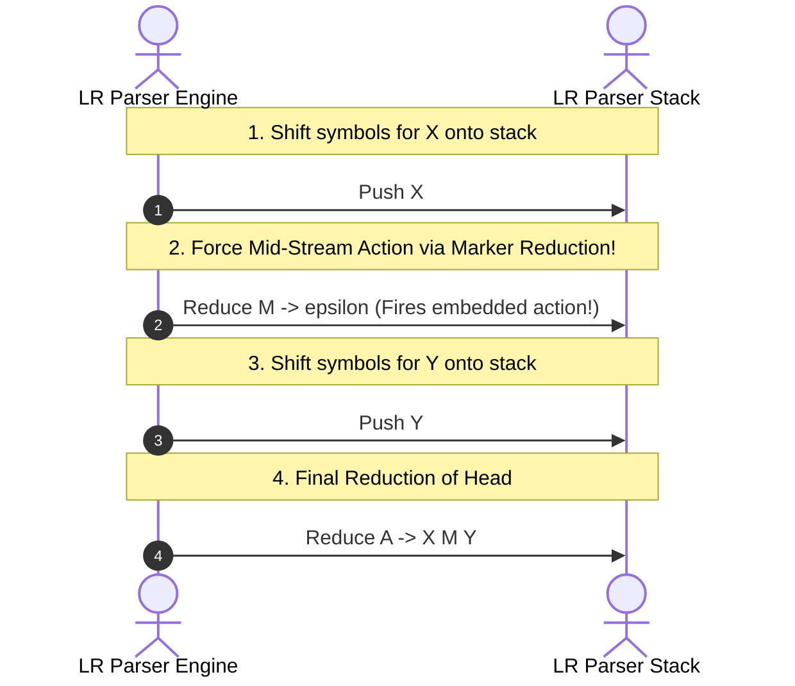

# Bottom-Up Evaluation of L-Attributed SDDs

> 📖 **Reading Order:** Step 06 of 55 | **Module 1: Syntax-Directed Translation**  
> ◄ **Previous:** [[Eliminating Left Recursion from SDTs]] | ► **Next:** [[Arithmetic Expression Desk Calculator SDD Example]]

---

## The Problem and Earlier Tools

Most industry-standard compiler front-ends (such as Yacc, Bison, and CUP) are **Bottom-Up LALR(1) Parsers**.

As we learned in [[S-Attributed and L-Attributed SDDs]], bottom-up parsers are perfectly designed for **S-attributed definitions**: whenever a reduction occurs ($A \to X Y Z$), the children $X, Y, Z$ are sitting on top of the stack, their synthesized values are popped, and the result is pushed.

**The Dilemma:**  
What happens when your programming language naturally requires **Inherited Attributes** (e.g., passing variable types down in `int a, b, c;` or passing code labels into loops)?

In bottom-up parsing, reductions occur at the **very end** of a production. But an inherited attribute must be evaluated **before** the children are parsed! 

How can a bottom-up parser evaluate inherited attributes without building an explicit parse tree?

Compiler designers invented two foundational techniques:
1. **Marker Non-Terminals ($\epsilon$-productions):** To force semantic actions to fire mid-production.
2. **Parser Stack Relative Indexing (Negative Offsets):** To reach down into the runtime parser stack and retrieve attributes computed by earlier siblings!

---

## Developing the Core Idea

Suppose you have an action that must execute in the middle of a production:
$$A \longrightarrow X \; \{ \text{action} \} \; Y$$

An LR parser cannot execute actions mid-production because it only executes code upon a reduction!

### The Marker Transformation:
To force an LR parser to execute an action mid-stream, we introduce a dummy non-terminal $M$ that derives the empty string $\epsilon$:
$$A \longrightarrow X \; M \; Y$$
$$M \longrightarrow \epsilon \quad \{ \text{action} \}$$



### The Dark Side: The Marker Conflict Hazard
> [!WARNING] The LALR(1) Marker Conflict Trap
> Introducing $\epsilon$-markers is not free! Because the parser must decide to reduce $M \to \epsilon$ based on only 1 token of lookahead, introducing markers often creates **Shift/Reduce** or **Reduce/Reduce conflicts** in a grammar that was previously conflict-free. Always test whether an $\epsilon$-marker breaks LALR(1) compliance!

---

## Inputs

- L-Attributed SDD grammar productions, underlying LR parsing table, and input token stream.

---

## Outputs

- LR parse stack augmented with attribute values and marker non-terminals for synthesized and inherited attribute evaluations.

---

## How It Works

### Technique 2: Finding Inherited Attributes on the Parser Stack

In an LR parser, the parser stack does not just hold grammatical symbols; it holds an array of attribute values:
$$\text{val}[0 \dots top]$$

If an inherited attribute is passed from a symbol $C$ to a sibling $B$ to its right, **symbol $C$ is already sitting on the stack beneath $B$!**

### Walkthrough: Type Declarations on the LR Stack
Consider the standard variable declaration grammar:
1. $D \longrightarrow T \; L$
2. $T \longrightarrow \mathbf{int} \quad \{ T.type = \text{'integer'}; \}$
3. $T \longrightarrow \mathbf{float} \quad \{ T.type = \text{'float'}; \}$
4. $L \longrightarrow L_1 , \; \mathbf{id} \quad \{ \text{addType}(\mathbf{id}.entry, L.inh); \}$
5. $L \longrightarrow \mathbf{id} \quad \{ \text{addType}(\mathbf{id}.entry, L.inh); \}$

Notice that $L.inh = T.type$.

Let us trace the parser stack for the input string:
```c
int a, b, c;
```

When the parser has shifted `int` and reduced $T \to \mathbf{int}$, and then shifted `a` and is about to reduce $L \to \mathbf{id}$:

```
Physical Parser Stack Layout:
Index:        ... |  top - 1              |  top
--------------------------------------------------------------
Grammar Sym:  ... |  T                    |  id ('a')
Stack Value:  ... |  val[top-1] = 'int'   |  val[top] = entry('a')
--------------------------------------------------------------
```

Look at where $T.type$ is located!
It is sitting at:
$$\text{val}[top - 1]$$

Therefore, the semantic action for $L \to \mathbf{id}$ does **NOT** need an explicit variable $L.inh$. It can reach directly into the stack at index `top - 1`!
$$L \longrightarrow \mathbf{id} \quad \{ \text{addType}(\text{val}[top].entry, \; \text{val}[top - 1]); \}$$

In Yacc / Bison syntax, this is written using **negative offset notation**:
```yacc
L : ID  { addType($1, $-1); }  /* $-1 accesses the symbol immediately below L on the stack! */
```

---

### Generalizing Stack Access: Copy Rules and Constant Offsets

Can you always access inherited attributes at a fixed offset like `val[top - 1]`?

Only if the distance between the target symbol and the provider symbol is a **compile-time constant across all productions**.

### Case A: Constant Distance
Consider:
$$A \longrightarrow B \; C \; D$$
If $D$ needs an inherited attribute from $B$:
- When reducing $D$, $C$ is at `top - 1`, and $B$ is at `top - 2`.
- Distance is always $2$. $D$ can safely access `val[top - 2]`!

### Case B: Variable Distance (The Problem)
What if symbol $L$ appears in two productions with different stack depths?
- Production 1: $S \longrightarrow T \; L$ (distance to $T$ is $1$)
- Production 2: $S \longrightarrow A \; B \; T \; L$ (distance to $T$ is $1$, but what if $L$ needs $A$? Distance is $3$!)

### The Marker Non-Terminal Solution for Variable Distances:
If the distance to the needed attribute varies, insert a marker non-terminal $M$ whose only job is to **copy the attribute to a predictable stack position**:
$$S \longrightarrow A \; B \; M \; L$$
$$M \longrightarrow \epsilon \quad \{ \text{val}[top] = \text{val}[top - 2]; \}$$

Now, $M$ sits at a fixed offset immediately below $L$, guaranteeing that $L$ can always find the value at `val[top - 1]`!

---

### Summary: Rules for Bottom-Up L-Attributed Evaluation

| Grammar Pattern | Bottom-Up LR Stack Mechanism | Code Notation (Yacc/Bison) |
| :--- | :--- | :--- |
| **Action in middle of production** | Insert empty marker non-terminal $M \to \epsilon$ | Embedded `{ action }` |
| **Inherited attribute at constant distance $k$** | Direct stack index access: `val[top - k]` | Negative dollar index: `$-k` |
| **Inherited attribute at variable distance** | Insert marker non-terminal to copy attribute to fixed slot | Marker `{ \$\$ = \$-(k); }` |

---

## Pseudocode

The complete algorithmic procedure is detailed in the sections above.

---

## Example

Concrete step-by-step simulations and traces are cataloged in the associated Example and Problem notes.

---

## Complexity

### Time Complexity
$O(N)$ to $O(N^2)$ depending on basic block length, graph density, or live intervals.

### Space Complexity
$O(N)$ for auxiliary state tables, stacks, or free lists.

---

## Properties

- **Termination:** Provably terminates on all well-formed compiler inputs.
- **Correctness:** Preserves the underlying language semantics and program data dependencies.

---

## Limitations

- Variable attribute distances require marker non-terminals, which can introduce reduce/reduce or shift/reduce grammar conflicts in LR parsers.

---

## Common Mistakes

- Forgetting to update liveness information or next-use pointers.
- Misinterpreting index bounds during stack or interval scans.

---

## Exam Relevance

Frequently tested on final examinations via hand-simulation of Bottom-Up Evaluation of L-Attributed SDDs on given code fragments or graphs.

---

## Related Concepts

- [[Syntax-Directed Definitions and Translation Schemes]]
- [[S-Attributed and L-Attributed SDDs]]
- [[Eliminating Left Recursion from SDTs]]

---

## Prerequisites

- [[S-Attributed and L-Attributed SDDs]]

---

## Problems

- [[Problem — Desk Calculator SDD and Annotated Parse Tree]]

---

## Sources

- **Lecture Slides:** [[cse309/01 - Sources/Lectures/KMS Merged.pdf|KMS Merged.pdf]], Chapter 5 (Slides 76–80).
- **Textbook:** Aho, Lam, Sethi, Ullman, *Compilers: Principles, Techniques, & Tools* (2nd Ed.), Section 5.5.
