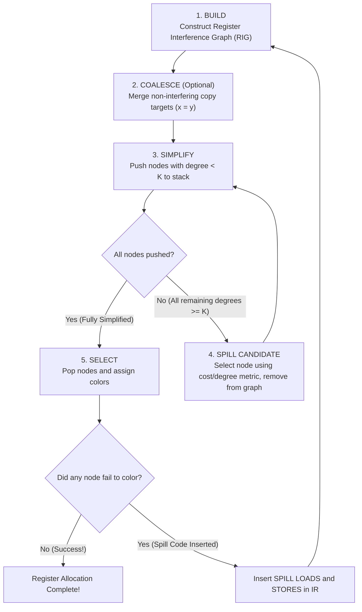

# Chaitin's Graph Coloring Register Allocation Algorithm

> 📖 **Reading Order:** Step 46 of 55 | **Module 5: Register Allocation**  
> ◄ **Previous:** [[Linear Scan Register Allocation Algorithm]] | ► **Next:** [[Linear Scan Register Allocation Step-by-Step Example]]

---

## The Problem and Earlier Tools

**Chaitin's Algorithm** (IBM 1981, 1982) is the foundational graph-coloring register allocation algorithm used in production ahead-of-time optimizing compilers (such as GCC and LLVM).

It formalizes register allocation into an iterative 5-phase loop:

---

## Developing the Core Idea

### Phase 1: Build (Construct RIG)
- Perform liveness analysis across the program CFG.
- Create a node for every live range.
- Add an undirected edge $(u, v)$ between any two live ranges that are simultaneously live at any program point.

---

### Phase 2: Coalesce (Register Copy Elimination)
- If the program contains a copy instruction $x = y$, and the nodes for $x$ and $y$ do **not interfere** (no edge exists between them), attempt to merge nodes $x$ and $y$ into a single unified node.
- *Benefit:* Eliminates the instruction $x = y$ entirely! Both variables share the exact same hardware register.
- *Conservative Coalescing (Briggs / George):* Only merge if the resulting unified node does not create an uncolorable degree $\ge K$ subgraph.

---

### Phase 3: Simplify (Kempe's Reduction)
- Find a node $v$ whose current degree in the graph satisfies:
  $$\text{degree}(v) < K$$
- Remove $v$ and all its incident edges from the graph.
- Push $v$ onto the **Coloring Stack**.
- Removing $v$ decrements the degree of each neighbor of $v$.
- Repeat until the graph is empty OR all remaining nodes have degree $\ge K$.

---

### Phase 4: Spill (Handling High-Degree Nodes)
- If Kempe's rule is stuck (every remaining node has degree $\ge K$), the compiler must pick a node to **spill to memory**.
- **Chaitin Spill Heuristic:** Pick the node $s$ that minimizes the ratio of spill cost to degree:
  $$\text{Metric}(s) = \frac{\text{SpillCost}(s)}{\text{degree}(s)}$$
  where $\text{SpillCost}(s) = \sum_{\text{defs}, \text{uses of } s} 10^{\text{loop\_nesting\_depth}}$.
- *Intuition:* Spilling a node used inside a deeply nested loop is disastrous for performance ($10^2 = 100\times$ penalty). Pick a variable with low usage and high degree (spilling it reduces the degrees of many neighbors!).
- Remove $s$ from the graph, mark it as a potential spill (or push to stack), and resume Phase 3 (Simplify).

---

### Phase 5: Select (Color Assignment)
- Pop nodes from the Coloring Stack one-by-one in reverse order of removal:
- For popped node $v$:
  - Inspect the colors currently assigned to all neighbors of $v$ that are already in the graph.
  - If there is an available color $c \in \{ 1, 2, \dots, K \}$ not used by any neighbor:
    $$\text{Color}(v) = c$$
  - If **no color is available** (can happen for nodes marked in Phase 4):
    - Node $v$ is an **Actual Spill**!

---

## Inputs

- Register Interference Graph (RIG) $G = (V, E)$ and number of available physical registers $K$.

---

## Outputs

- Valid $K$-coloring of $V$ mapping live ranges to physical registers, or an annotated set of spilled temporaries.

---

## How It Works

---

## Pseudocode

The complete algorithmic procedure is detailed in the sections above.

---

## Example

Concrete step-by-step simulations and traces are cataloged in the associated Example and Problem notes.

---

## Complexity

- **Building RIG:** $O(V \cdot E)$ or $O(V^2)$ where $V$ is the number of live ranges.
- **Simplification / Coloring:** $O(V + E)$ using adjacency lists and degree buckets.
- **Total Time Complexity:** Typically converges in 1 to 3 iterations, giving practical runtime $O(V^2)$.
- **Space Complexity:** $O(V^2)$ storing the interference matrix.

---

## Properties

- **Termination:** Provably terminates on all well-formed compiler inputs.
- **Correctness:** Preserves the underlying language semantics and program data dependencies.

---

## Limitations

### What Happens When an Actual Spill Occurs? (Chaitin Reloaded)

If a variable $x$ cannot be colored and must be spilled:
1. The compiler allocates a private stack slot in the procedure's activation record for $x$ (e.g., `[ebp - 12]`).
2. Immediately after every instruction that defines $x$, emit a store:
   $$\text{ST } [\text{ebp} - 12], R_{\text{temp}}$$
3. Immediately before every instruction that reads/uses $x$, emit a load:
   $$\text{LD } R_{\text{temp}}, [\text{ebp} - 12]$$
4. **The Dramatic Effect on Live Ranges:**
   - Instead of one massive live range spanning the entire program, $x$ now has **multiple tiny live ranges** that exist for only a single instruction!
5. **Re-run the Algorithm:** Recompute liveness, rebuild the RIG, and repeat! Since the new live ranges are microscopic, the new graph has drastically lower degrees and almost always colors successfully on the next pass.

---

## Common Mistakes

- Forgetting to update liveness information or next-use pointers.
- Misinterpreting index bounds during stack or interval scans.

---

## Exam Relevance

Frequently tested on final examinations via hand-simulation of Chaitin's Graph Coloring Register Allocation Algorithm on given code fragments or graphs.

---

## Related Concepts

- [[Register Interference Graphs and Graph Coloring Principles]]
- [[Live Ranges and Live Intervals in Register Allocation]]
- [[Linear Scan Register Allocation Algorithm]]

---

## Prerequisites

- [[Register Interference Graphs and Graph Coloring Principles]]

---

## Problems

- [[Problem — Chaitin Graph Coloring Register Allocation]]

---

## Sources

- **Lecture Slides:** [[cse309/01 - Sources/Lectures/KMS Merged.pdf|KMS Merged.pdf]], Register Allocation (Slides 444–531).
- **Textbook / Papers:** Chaitin, "Register Allocation & Spilling via Graph Coloring", ACM SIGPLAN Notices 1982; Briggs et al., "Improvements to Graph Coloring Register Allocation", ACM TOPLAS 1994.
