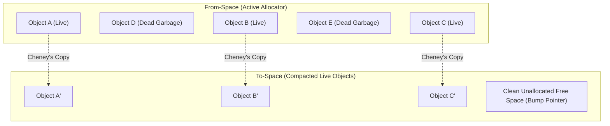

# Copying Garbage Collection Algorithm

> 📖 **Reading Order:** Step 28 of 55 | **Module 3: Run-Time Environments**  
> ◄ **Previous:** [[Mark-and-Sweep Garbage Collection Algorithm]] | ► **Next:** [[Display Maintenance and Non-Local Access Simulation Example]]

---

## The Problem and Earlier Tools

In 1969, Robert R. Fenichel and Jerome C. Yochelson introduced the revolutionary concept of **Semispace Copying Garbage Collection**:
- Divide the heap into two equal-sized zones: **From-space** (where the program allocates) and **To-space** (dormant reserve).
- When From-space fills, suspend the program, traverse all live objects reachable from the Root Set, copy them compactly into To-space, and instantly swap the spaces.

However, early implementations faced a terrifying chicken-and-egg dilemma:
> *If the heap is completely full of memory allocations, how can the garbage collector allocate memory for a Breadth-First Search (BFS) queue or recursion stack to traverse the graph?*
> If memory is exhausted, allocating an auxiliary queue in RAM will cause the garbage collector itself to crash with an Out-Of-Memory error or Stack Overflow!

In 1970, **C. J. Cheney** published a seminal paper solving this dilemma with pure mathematical genius:
**Use To-space itself as the BFS queue!**
Cheney's algorithm performs a complete breadth-first graph traversal, copying, pointer forwarding, and compaction using strictly **zero extra auxiliary memory ($O(1)$ auxiliary space)**!



---

## Developing the Core Idea

Cheney's algorithm governs To-space using two simple memory pointers:
- **`free` Pointer:** Points to the beginning of unallocated memory in To-space (where the next live object will be copied). Acts as the **Tail (Back)** of the BFS queue.
- **`scan` Pointer:** Points to the next copied object in To-space whose outgoing pointer fields have **not yet been examined or updated**. Acts as the **Head (Front)** of the BFS queue.

```
To-space Internal Layout during Collection:
┌──────────────────────────────┬──────────────────────────────┬──────────────────────────────┐
│ Objects Fully Scanned        │ Objects Waiting to be Scanned│ Unallocated Empty Space      │
│ (Black State: All fields fixed)│ (Grey State: The BFS Queue)  │ (Ready for next copy)        │
└──────────────────────────────┴──────────────────────────────┴──────────────────────────────┘
▲                              ▲                              ▲
To-space Base                  scan                           free
```

### The Invariant States:
1. **$0 \le \text{offset} < scan$:** Objects that have been copied and whose outgoing pointers have already been updated to point to new To-space locations (**Scanned / Black**).
2. **$scan \le \text{offset} < free$:** Objects that have been copied into To-space, but their internal pointer fields still point to old objects in From-space (**Unscanned / Grey**). **This contiguous memory region IS the BFS Queue!**
3. **$\text{offset} \ge free$:** Untouched, pristine free memory.

When the queue is empty:
$$\mathbf{scan == free}$$
the entire collection terminates!

---

## Inputs

- Memory heap divided into From-space and To-space, and root set pointers from CPU registers and runtime stack frames.

---

## Outputs

- Fully compacted live objects copied contiguously into To-space with updated pointers; reclaimed From-space.

---

## How It Works

### Architectural Evaluation & The Weak Generational Hypothesis

| Metric | Mark-and-Sweep | Cheney's Copying Collector |
| :--- | :--- | :--- |
| **Time Complexity** | $O(\text{Heap Size})$ (Must sweep all dead memory) | **$O(\text{Live Volume})$** (Zero cost for dead objects) |
| **Auxiliary Memory Needed** | Requires recursion stack or bit array | **$O(1)$ Zero extra RAM** (Uses To-space as queue) |
| **Heap Compaction** | None (causes severe external fragmentation) | **100% Compaction** (Objects packed contiguously) |
| **Allocation Cost** | Free list search ($O(1)$ to $O(N)$) | **Bump Pointer:** `p = free; free += size;` ($O(1)$ 2 CPU cycles) |
| **Memory Utilization** | $100\%$ of heap available | **$50\%$** (Must reserve half the heap as To-space) |

### The Generational Superpower:
The **Weak Generational Hypothesis** states that in virtually all programs, **over 95% of objects die within milliseconds of allocation** (temporary strings, loop variables, iterators).

Because Cheney's collector cost is proportional *only to live objects*, running Cheney's collector on a young generation where 95% of objects are dead means the collector finishes in sub-millisecond time while reclaiming 95% of the memory! This is the core engine powering the **Java HotSpot Young Generation (Eden/Survivor Spaces)** and the **V8 JavaScript engine**.

---

## Pseudocode

### The Complete Algorithmic Implementation

```python
class CheneyCollector:
    def __init__(self, from_space, to_space):
        self.from_space = from_space
        self.to_space = to_space

    def copy(self, obj_ptr, free):
        """Copies an object to To-space or returns existing forwarding address."""
        if obj_ptr is None:
            return None, free

        # Case 1: Object has ALREADY been copied during this cycle
        if obj_ptr.has_forwarding_address():
            # Return new destination in To-space
            return obj_ptr.forwarding_address, free

        # Case 2: Object encountered for the first time
        new_addr = free
        copy_bytes(src=obj_ptr, dst=new_addr, size=obj_ptr.size)
        free += obj_ptr.size

        # Leave a forwarding address in the old From-space header!
        obj_ptr.set_forwarding_address(new_addr)
        return new_addr, free

    def collect(self, root_set):
        scan = self.to_space.start
        free = self.to_space.start

        # Step 1: Copy all immediate Root Set objects into To-space
        for i in range(len(root_set)):
            root_set[i], free = self.copy(root_set[i], free)

        # Step 2: Traverse the implicit BFS Queue using 'scan' pointer
        while scan < free:
            current_obj = deref(scan)
            for field in current_obj.get_pointer_fields():
                child_ptr = getattr(current_obj, field)
                # Forward child: copies child to To-space and updates field
                new_child_addr, free = self.copy(child_ptr, free)
                setattr(current_obj, field, new_child_addr)

            # Advance 'scan' past current object (dequeues object from BFS queue)
            scan += current_obj.size

        # Step 3: Swap roles of From-space and To-space
        self.from_space, self.to_space = self.to_space, self.from_space
        return free  # New allocation pointer for mutator
```

---

## Example

Concrete step-by-step simulations and traces are cataloged in the associated Example and Problem notes.

---

## Complexity

### Time Complexity
### Theorem: Correctness and Graph Isomorphism
*Cheney's Copying Garbage Collection algorithm produces a compact, isomorphic copy of the reachable graph $\text{Reachable}(G, R)$ in To-space, updates all references consistently, and runs in time strictly proportional to the number and size of live objects:*
$$\text{Time Complexity} = O(L) \quad \text{where } L = |\text{Reachable}(G, R)|$$

### Proof:
1. **Queue Property:**
   - In Step 1, all roots are copied to To-space. They occupy addresses $[to\_space.start, free_0)$. Since $scan = to\_space.start$, the queue initially contains the depth-0 reachable objects.
   - At iteration $k$, the object at `scan` is dequeued. For each outgoing pointer $p$, `copy()` is called.
   - If the child was not previously copied, it is appended at `free` (enqueued), and its old header is tagged with a forwarding pointer.
   - If the child was already copied (by a previous parent sharing the reference), `copy()` reads the forwarding pointer without duplicating the object.
   - Because the queue operates in first-in, first-out order, objects are visited in exact Breadth-First Search order.
2. **Termination:**
   - Since $V$ is finite, each reachable object is copied at most once (enforced by the forwarding pointer check).
   - Each copied object advances `free` by a finite size.
   - In each loop iteration, `scan` advances by the size of the current object.
   - Therefore, `scan` strictly increases toward `free`. Since no new objects can be enqueued once all reachable objects are visited, `scan` must eventually equal `free`. The loop terminates.
3. **Pointer Consistency (Isomorphism):**
   - For every edge $(u, v)$ in the original heap: when $u_{new}$ is scanned, its pointer field to $v$ is replaced by $v_{new}$ (either newly copied or retrieved via forwarding pointer).
   - Thus, $(u_{new}, v_{new})$ exists in To-space. All pointers in the root set and inside live objects point exclusively to valid To-space addresses.
4. **Time Complexity:**
   - Notice what happens to unreachable garbage: **Unreachable objects in From-space are NEVER visited, NEVER inspected, and NEVER copied.**
   - Total operations equal $\sum_{v \in \text{Reachable}} \text{size}(v)$.
   - Therefore, the time complexity is strictly $O(L)$, completely independent of total heap capacity $H$! $\blacksquare$

---

### Space Complexity
$O(N)$ auxiliary memory for data structures.

---

## Properties

- **Termination:** Provably terminates on all well-formed compiler inputs.
- **Correctness:** Preserves the underlying language semantics and program data dependencies.

---

## Limitations

- Halves the immediately usable heap space by requiring two semi-spaces.
- Long-lived objects are repeatedly copied unless generational promotion is employed.

---

## Common Mistakes

- Forgetting to update liveness information or next-use pointers.
- Misinterpreting index bounds during stack or interval scans.

---

## Exam Relevance

Frequently tested on final examinations via hand-simulation of Copying Garbage Collection Algorithm on given code fragments or graphs.

---

## Related Concepts

- [[Garbage Collection Fundamentals and Reference Counting]]
- [[Trace-Based Garbage Collection Algorithms]]
- [[Mark-and-Sweep Garbage Collection Algorithm]]

---

## Prerequisites

- [[Trace-Based Garbage Collection Algorithms]]

---

## Problems

- [[Problem — Activation Record and Display Table Tracing]]

---

## Sources

- **Lecture Slides:** [[cse309/01 - Sources/Lectures/KMS Merged.pdf|KMS Merged.pdf]], Chapter 7 (Slides 285–293).
- **Textbook:** Aho, Lam, Sethi, Ullman, *Compilers: Principles, Techniques, & Tools* (2nd Ed.), Section 7.6.3 (Copying Collectors).
- **Cheney, C. J.:** *A Nonrecursive List Compacting Algorithm*, Communications of the ACM, Vol. 13, No. 11, 1970.
