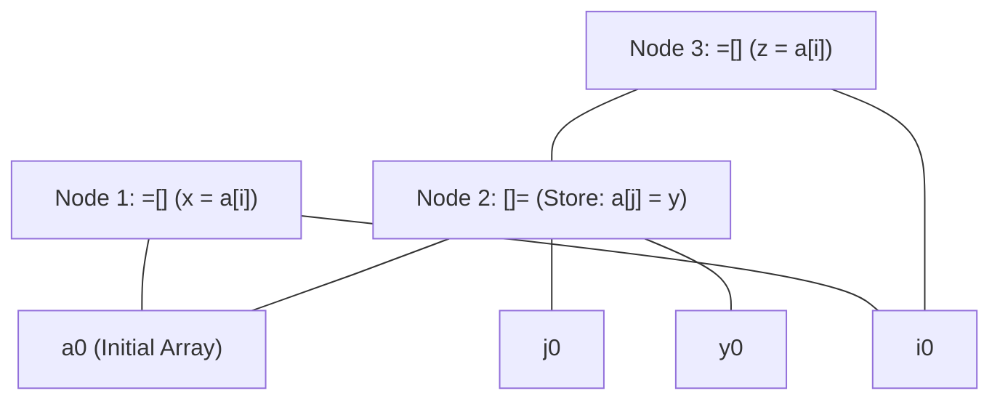

# DAG Construction and Local Optimization of Basic Blocks

> 📖 **Reading Order:** Step 36 of 55 | **Module 4:** Code Generation  
> ◄ **Previous:** [[Liveness and Next-Use Analysis within Basic Blocks]] | ► **Next:** [[A Simple Code Generator Algorithm]]

---

---

---

---

---

## The Problem and Earlier Tools

In [[Value-Number Method for DAG Construction]], we saw how a DAG eliminates common subexpressions within single mathematical expressions where variables are immutable.

However, inside a **Basic Block**, variables are dynamically reassigned:
```text
(1)  t1 = a + b
(2)  a = c + d       // Variable 'a' is redefined!
(3)  t2 = a + b      // Looks identical to line 1, but is NOT a common subexpression!
```
If a compiler naively reused `t1` for `t2`, it would produce a fatal bug because `a` has changed!

Furthermore, consider array assignments:
```text
(1)  x = a[i]
(2)  a[j] = y        // Could index 'j' be equal to 'i'?
(3)  z = a[i]        // Can we reuse 'x' for 'z'?
```
At compile time, the values of $i$ and $j$ are unknown runtime variables. If $i == j$, then $z$ must read the new value $y$! If the compiler naively reused $x$, it would read stale data.

To optimize basic blocks safely, compilers employ **DAG Construction with Dynamic Label Re-attachment and Array Kill Rules**.

---

---

---

---

---

## Developing the Core Idea

A basic block DAG consists of:
1. **Leaf Nodes:** Represent the initial values of variables entering the block (labeled $a_0, b_0, \dots$) or constant literals.
2. **Interior Nodes:** Represent arithmetic, relational, or memory operations.
3. **Attached Variable Names:** Every node maintains a list of variable names whose current value is held by that node:
   - When instruction $x = y + z$ is processed, name $x$ is attached to the node for $y + z$.
   - **The Detach Invariant:** If $x$ was previously attached to any other node, **$x$ is deleted from that node's label list**! A variable name can label at most one node in the DAG at any point during construction.

```
       Visualizing Variable Reassignment in the DAG:
       
         (+) Node 1                     (+) Node 2
        /   \                          /   \
       a0    b0                       c0    d0
       [ Labels: t1, a ] <── (1)      [ Labels: a ] <── (2) 'a' moved here!
```

---

---

---

---

---

## Inputs

- Intermediate representation (Three-Address Code instructions, parse tree nodes, live intervals, or interference graph).

---

## Outputs

- Partitioned blocks, DAG nodes, allocated physical registers, or evacuated memory blocks.

---

## How It Works

### Inputs

- Intermediate representation (Three-Address Code instructions, parse tree nodes, live intervals, or interference graph).

---
### Outputs

- Partitioned blocks, DAG nodes, allocated physical registers, or evacuated memory blocks.

---
### How It Works

### Inputs

- Intermediate representation (Three-Address Code instructions, parse tree nodes, live intervals, or interference graph).

---
### Outputs

- Partitioned blocks, DAG nodes, allocated physical registers, or evacuated memory blocks.

---
### How It Works

### Inputs

- Intermediate representation (Three-Address Code instructions, parse tree nodes, live intervals, or interference graph).

---
### Outputs

- Partitioned blocks, DAG nodes, allocated physical registers, or evacuated memory blocks.

---
### How It Works

### The Array Store "Kill" Rule & Memory Dependencies

How does a DAG represent memory arrays without allowing stale common subexpression reuse?

### The Specialized Memory Operators:
1. **Array Read (Load):** Node labeled `=[](array_node, index_node)`
   - Represents evaluating $a[i]$.
2. **Array Write (Store):** Node labeled `[]=(array_node, index_node, value_node)`
   - Represents executing $a[j] = y$.
   - **Crucial Structure:** The `[]=` node has **three children**: the array base, the index, and the value being stored.
   - **The Store Result:** The `[]=` node produces a **new version of the entire array**!



### Formal Theorem: The Array Kill Invariant

#### Theorem:
*Unless the compiler can formally prove at compile time that indices $i$ and $j$ are strictly disjoint ($i \neq j$), any array store $a[j] = y$ must kill all existing `=[]` nodes referencing array $a$, forcing subsequent reads of $a[i]$ to depend directly on the store node.*

#### Proof:
1. Let array $a$ reside at base address $B$. The memory cell addressed by $a[i]$ is $M[B + i \times w]$ and for $a[j]$ is $M[B + j \times w]$.
2. If $i = j$ at runtime, the store instruction $a[j] = y$ overwrites the exact bytes $M[B + i \times w] \leftarrow y$.
3. If the compiler were to reuse the previous load node `Node 1: =[](a0, i0)` for statement $z = a[i]$, statement $z$ would receive the value stored in $M[B + i \times w]$ *before* the write $a[j] = y$.
4. Whenever $i = j$, this yields $z \neq y$, violating operational program semantics.
5. In the absence of an alias analysis proof that $i \neq j$, the possibility $i = j$ cannot be ruled out.
6. Therefore, the DAG must treat $a[j] = y$ as generating a new version of array $a$ (Node 2: `[]=`). Any subsequent load $z = a[i]$ must construct a new load node taking `Node 2` as its array parent.
7. Hence, semantic correctness is strictly preserved. $\blacksquare$

---
### Reassembling an Optimized Basic Block from the DAG

Once all statements of the basic block have been processed into the DAG:

### Step 1: Dead Code Elimination
1. Inspect the set of variables that are **Live at Block Exit** (computed via [[Liveness and Next-Use Analysis within Basic Blocks]]).
2. Any root node in the DAG that has **no live variables attached** (and contains no side-effects like stores or I/O) is completely deleted from the graph.
3. Recursively delete any child nodes that now have zero parents.

### Step 2: Topological Sorting & Code Emission
1. Select an evaluation order of the remaining DAG nodes such that for every node $N$, all of $N$'s children are evaluated *before* $N$.
2. For each interior node:
   - Emit a Three-Address Code instruction computing the operation.
   - Assign the result to one of the live variable names attached to the node.
   - If multiple live names are attached to the same node, emit simple copy statements (e.g., $x = y$).

---

---
### Properties

- **Termination:** Provably terminates on all well-formed compiler inputs.
- **Correctness:** Preserves the underlying language semantics and program data dependencies.

---
### Related Concepts

- [[Basic Blocks and Control Flow Graphs]]
- [[Live Ranges and Live Intervals in Register Allocation]]
- [[Register Interference Graphs and Graph Coloring Principles]]

---
### Prerequisites

- [[Basic Blocks and Control Flow Graphs]]

---
### Problems

- [[Problem — Linear Scan Register Allocation Simulation]]
- [[Problem — Chaitin Graph Coloring Register Allocation]]

---

---
### Properties

- **Termination:** Provably terminates on all well-formed compiler inputs.
- **Correctness:** Preserves the underlying language semantics and program data dependencies.

---
### Related Concepts

- [[Basic Blocks and Control Flow Graphs]]
- [[Live Ranges and Live Intervals in Register Allocation]]
- [[Register Interference Graphs and Graph Coloring Principles]]

---
### Prerequisites

- [[Basic Blocks and Control Flow Graphs]]

---
### Problems

- [[Problem — Linear Scan Register Allocation Simulation]]
- [[Problem — Chaitin Graph Coloring Register Allocation]]

---

---
### Properties

- **Termination:** Provably terminates on all well-formed compiler inputs.
- **Correctness:** Preserves the underlying language semantics and program data dependencies.

---
### Related Concepts

- [[Basic Blocks and Control Flow Graphs]]
- [[Live Ranges and Live Intervals in Register Allocation]]
- [[Register Interference Graphs and Graph Coloring Principles]]

---
### Prerequisites

- [[Basic Blocks and Control Flow Graphs]]

---
### Problems

- [[Problem — Linear Scan Register Allocation Simulation]]
- [[Problem — Chaitin Graph Coloring Register Allocation]]

---

---

## Pseudocode

### Pseudocode

### Pseudocode

### Pseudocode

The complete algorithmic procedure is detailed in the sections above.

---

---

---

---

## Example

Concrete step-by-step simulations and traces are cataloged in the associated Example and Problem notes.

---

## Complexity

### Time Complexity
$O(N)$ to $O(N^2)$ depending on basic block length, graph density, or live intervals.

### Space Complexity
$O(N)$ for auxiliary state tables, stacks, or free lists.

---

---

---

---

## Properties

- **Termination:** Provably terminates on all well-formed compiler inputs.
- **Correctness:** Preserves the underlying language semantics and program data dependencies.

---

## Limitations

### Limitations

### Limitations

### Limitations

- Conservative heuristics may yield suboptimal allocations or require register spilling when demand exceeds hardware resources.

---

---

---

---

## Common Mistakes

### Common Mistakes

### Common Mistakes

### Common Mistakes

- Forgetting to update liveness information or next-use pointers.
- Misinterpreting index bounds during stack or interval scans.

---

---

---

---

## Exam Relevance

### Example

Concrete step-by-step simulations and traces are cataloged in the associated Example and Problem notes.

---
### Exam Relevance

### Example

Concrete step-by-step simulations and traces are cataloged in the associated Example and Problem notes.

---
### Exam Relevance

### Example

Concrete step-by-step simulations and traces are cataloged in the associated Example and Problem notes.

---
### Exam Relevance

Frequently tested on final examinations via hand-simulation of DAG Construction and Local Optimization of Basic Blocks on given code fragments or graphs.

---

---

---

---

## Related Concepts

- [[Basic Blocks and Control Flow Graphs]]
- [[Live Ranges and Live Intervals in Register Allocation]]
- [[Register Interference Graphs and Graph Coloring Principles]]

---

## Prerequisites

- [[Basic Blocks and Control Flow Graphs]]

---

## Problems

- [[Problem — Linear Scan Register Allocation Simulation]]
- [[Problem — Chaitin Graph Coloring Register Allocation]]

---

## Sources

- **Lecture Slides:** [[cse309/01 - Sources/Lectures/KMS Merged.pdf|KMS Merged.pdf]], Chapter 8 (Slides 335–347).
- **Textbook:** Aho, Lam, Sethi, Ullman, *Compilers: Principles, Techniques, & Tools* (2nd Ed.), Section 8.5 (Optimization of Basic Blocks).
