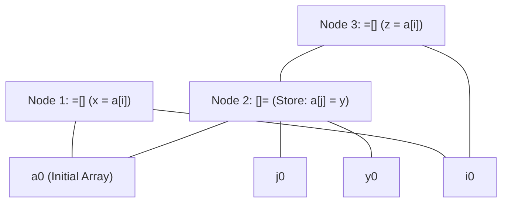

# DAG Construction and Local Optimization of Basic Blocks

> 📖 **Reading Order:** Step 36 of 55 | **Module 4:** Code Generation  
> ◄ **Previous:** [[Liveness and Next-Use Analysis within Basic Blocks]] | ► **Next:** [[A Simple Code Generator Algorithm]]

---

## Building the idea

A basic-block DAG records computed values and their dependencies. Leaf nodes denote incoming values; operation nodes combine child values; variable labels show which names currently denote each result.

When assigning x, move x's label to its new value node. This is why identical names in repeated text do not automatically identify the same expression: the names may now refer to different nodes. Matching operator and child-value identities permits local common-subexpression reuse under the expression's semantic assumptions.

Dead-result removal also needs care. A pure unused computation may disappear, but stores, calls, volatile accesses, or operations with observable exceptions cannot be erased merely because an ordinary result label is dead.

An array store changes memory on which later loads may depend. [[Value-Number Method for DAG Construction]] handles pure structural identity; this optimization adds a memory version or conservative kill rule so a later `a[i]` is not silently tied to a stale load.

## How It Works

### The Array Store "Kill" Rule & Memory Dependencies

How does a DAG represent memory arrays without allowing stale common subexpression reuse?

### The Specialized Memory Operators:
1. **Array Read (Load):** Node labeled `=`
   - Represents evaluating $a[i]$.
2. **Array Write (Store):** Node labeled `[]=(array_node, index_node, value_node)`
   - Represents executing $a[j] = y$.
   - **Crucial Structure:** The `[]=` node has **three children**: the array base, the index, and the value being stored.
   - **The Store Result:** The `[]=` node produces a **new version of the entire array**!

### Formal Theorem: The Array Kill Invariant

#### Theorem:
*Unless the compiler can formally prove at compile time that indices $i$ and $j$ are strictly disjoint ($i \neq j$), any array store $a[j] = y$ must kill all existing `=[]` nodes referencing array $a$, forcing subsequent reads of $a[i]$ to depend directly on the store node.*

#### Proof:
1. Let array $a$ reside at base address $B$. The memory cell addressed by $a[i]$ is $M[B + i \times w]$ and for $a[j]$ is $M[B + j \times w]$.
2. If $i = j$ at runtime, the store instruction $a[j] = y$ overwrites the exact bytes $M[B + i \times w] \leftarrow y$.
3. If the compiler were to reuse the previous load node `Node 1: =` for statement $z = a[i]$, statement $z$ would receive the value stored in $M[B + i \times w]$ *before* the write $a[j] = y$.
4. Whenever $i = j$, this yields $z \neq y$, violating operational program semantics.
5. In the absence of an alias analysis proof that $i \neq j$, the possibility $i = j$ cannot be ruled out.
6. Therefore, the DAG must treat $a[j] = y$ as generating a new version of array $a$ (Node 2: `[]=`). Any subsequent load $z = a[i]$ must construct a new load node taking `Node 2` as its array parent.
7. Hence, semantic correctness is strictly preserved. $\blacksquare$

---
### Reassembling an Optimized Basic Block from the DAG

Once all statements of the basic block have been processed into the DAG:

### Step 1: Dead Code Elimination
1. Inspect the set of variables that are **Live at Block Exit** (computed via [[Liveness and Next-Use Analysis within Basic Blocks]]).
2. Any root node in the DAG that has **no live variables attached** (and contains no side-effects like stores or I/O) is completely deleted from the graph.
3. Recursively delete any child nodes that now have zero parents.

### Step 2: Topological Sorting & Code Emission
1. Select an evaluation order of the remaining DAG nodes such that for every node $N$, all of $N$'s children are evaluated *before* $N$.
2. For each interior node:
   - Emit a Three-Address Code instruction computing the operation.
   - Assign the result to one of the live variable names attached to the node.
   - If multiple live names are attached to the same node, emit simple copy statements (e.g., $x = y$).

---

## Complexity

### Time Complexity
Hash-consing pure expressions can give expected linear work in block operations; memory invalidation and conservative alias checks can add work. State the chosen implementation before claiming a tighter bound.

### Space Complexity
The DAG and variable-value mappings use space proportional to distinct retained values and names in the block.

---

## Exam Relevance

---

### Exam Relevance

Frequently tested on final examinations via hand-simulation of DAG Construction and Local Optimization of Basic Blocks on given code fragments or graphs.

---

## What to carry forward

[[Problem — DAG Optimization of Basic Block with Array Store]] exposes the i==j case. Reassemble code in dependency order while preserving side-effect order and all live-out values, not merely the remaining variable labels.

## Related notes

- [[Value-Number Method for DAG Construction]]
- [[Problem — DAG Optimization of Basic Block with Array Store]]

## Sources

- **Lecture Slides:** [[cse309/01 - Sources/Lectures/KMS Merged.pdf|KMS Merged.pdf]], Chapter 8 (Slides 335–347).
- **Textbook:** Aho, Lam, Sethi, Ullman, *Compilers: Principles, Techniques, & Tools* (2nd Ed.), Section 8.5 (Optimization of Basic Blocks).
