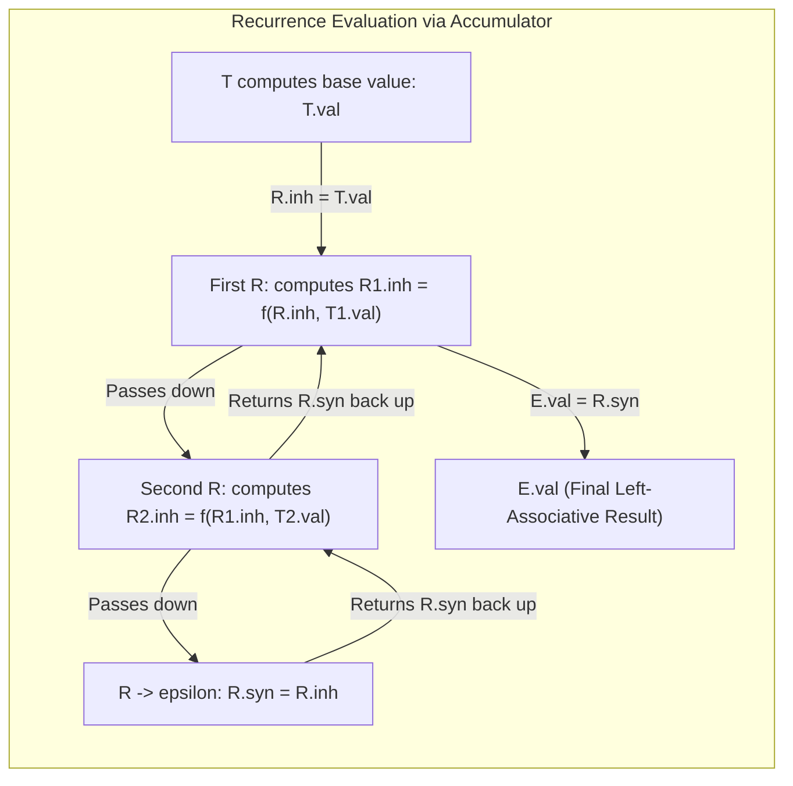

# Eliminating Left Recursion from SDTs

> 📖 **Reading Order:** Step 5 of 55 | **Module 1:** Syntax-Directed Translation
> ◄ **Previous:** [[Abstract Syntax Tree Construction with SDDs]] | ► **Next:** [[Bottom-Up Evaluation of L-Attributed SDDs]]

---

## Building the idea

Removing left recursion changes the grammar's shape, but translation must preserve the program's meaning and action order. For `9-5-2`, a left-recursive grammar naturally builds `(9-5)-2=2`. A naive right-recursive evaluation can instead build `9-(5-2)=6`.

Carry the accumulated result as inherited information into the new tail nonterminal. After reading 9, the accumulator is 9; after `-5`, it becomes 4; after `-2`, it becomes 2. The tail then returns the completed value. The parse proceeds rightward while evaluation retains left association.

For actions that emit output, preserve where the action occurs relative to consuming operands. For attribute computations, preserve which values feed each computation. These are different transformation obligations, even when the syntactic left-recursion elimination is the same.

[[Synthesized and Inherited Attributes]] supplies the accumulator mechanism. Compare old and new translations on a non-associative operator; addition alone can conceal an incorrect regrouping.

## How It Works

### Case 2: Actions Computing Synthesized Attributes

What if the semantic actions do *not* print strings, but instead calculate a mathematical value ($E.val = E_1.val - T.val$)?

Moving the output actions as if they were extra grammar symbols does not, by itself, preserve attribute computations. In $E \to T R$ and $R \to - T R \mid \epsilon$, each operand is parsed by a T occurrence; the tail R must combine them with the earlier accumulated value.

A naive rule that recursively subtracts a synthesized tail can regroup the operands from right to left:
$$9 - (5 - 2) = 9 - 3 = 6 \quad \text{\bf (WRONG! Correct is } (9 - 5) - 2 = 2\text{\bf)}$$

### The Master Solution: The Inherited Accumulator

To preserve left-associativity, we introduce an **inherited attribute on $R$** ($R.inh$) that acts as an **accumulator**:
1. $T$ computes the first operand and hands it to $R.inh$.
2. $R$ takes the accumulator $R.inh$, applies the operator with the next operand $T.val$, and hands the updated accumulator down to the next $R_1.inh$!
3. When $R$ reaches $\epsilon$, it returns the accumulated total back up through synthesized attribute $R.syn$.

---

### Original Left-Recursive SDT:
$$A \longrightarrow A_1 \; Y \quad \{ A.val = f(A_1.val, Y.val); \}$$
$$A \longrightarrow X \quad \{ A.val = g(X.val); \}$$

### Transformed Non-Left-Recursive L-Attributed SDT:
$$A \longrightarrow X \quad \{ R.inh = g(X.val); \} \quad R \quad \{ A.val = R.syn; \}$$
$$R \longrightarrow Y \quad \{ R_1.inh = f(R.inh, Y.val); \} \quad R_1 \quad \{ R.syn = R_1.syn; \}$$
$$R \longrightarrow \epsilon \quad \{ R.syn = R.inh; \}$$

---

### The Mathematical Proof of Semantic Equivalence:
> **Theorem:** For any input sequence $X \; Y_1 \; Y_2 \dots Y_k$, the transformed SDT computes the exact same value as the original left-recursive SDT.
>
> **Proof by Induction on $k$:**
>
> **Original SDT Evaluation:**  
> In the original left-recursive grammar, the parse tree is left-heavy. The reduction sequence evaluates:
> $$\text{val}_0 = g(X.val)$$
> $$\text{val}_1 = f(\text{val}_0, Y_1.val)$$
> $$\text{val}_2 = f(\text{val}_1, Y_2.val)$$
> In general, for $k$ terms:
> $$\text{Result}_{\text{orig}} = f(\dots f(f(g(X), Y_1), Y_2) \dots, Y_k)$$
>
> **Transformed SDT Evaluation:**  
> In the transformed grammar, $A \to X R$ initializes:
> $$R^{(0)}.inh = g(X.val) = \text{val}_0$$
> Each application of $R \to Y_j R_{j+1}$ computes:
> $$R^{(j)}.inh = f(R^{(j-1)}.inh, Y_j.val) = \text{val}_j$$
> When $R^{(k)} \to \epsilon$, the base case rule fires:
> $$R^{(k)}.syn = R^{(k)}.inh = \text{val}_k$$
> Each parent copies its child's synthesized attribute:
> $$R^{(j-1)}.syn = R^{(j)}.syn = \dots = R^{(0)}.syn = \text{val}_k$$
> Finally, $A.val = R^{(0)}.syn = \text{val}_k$.
>
> Because $\text{val}_k$ in both systems satisfies the identical recurrence relation:
> $$\text{val}_j = f(\text{val}_{j-1}, Y_j), \quad \text{with } \text{val}_0 = g(X)$$
> the values computed for all inputs are mathematically identical. $\blacksquare$

---

## Complexity

### Time Complexity
Transforming productions/actions costs time proportional to the grammar material copied or generated. The transformed parser's input-processing cost depends on its parsing method and semantic actions.

### Space Complexity
Storage is proportional to the transformed grammar and its action data.

---

## Exam Relevance

---

### Concrete Worked Example: Desk Calculator Subtraction

Let us transform the classic left-recursive subtraction grammar:
$$E \longrightarrow E_1 - T \quad \{ E.val = E_1.val - T.val; \} \mid T \quad \{ E.val = T.val; \}$$

### Transformed L-Attributed SDT:
1. $E \longrightarrow T \quad \{ R.inh = T.val; \} \quad R \quad \{ E.val = R.syn; \}$
2. $R \longrightarrow - \; T \quad \{ R_1.inh = R.inh - T.val; \} \quad R_1 \quad \{ R.syn = R_1.syn; \}$
3. $R \longrightarrow \epsilon \quad \{ R.syn = R.inh; \}$

### Trace on Input `9 - 5 - 2`:
1. $E$ expands to $T \; R$. $T$ evaluates `9` $\implies T.val = 9$.
2. Action initializes: $R.inh = 9$.
3. First $R$ matches `-`, $T$ evaluates `5` $\implies T.val = 5$.
4. Action computes accumulator update:
   $$R_1.inh = R.inh - T.val = 9 - 5 = 4$$
5. Second $R$ ($R_1$) matches `-`, $T$ evaluates `2` $\implies T.val = 2$.
6. Action computes accumulator update:
   $$R_2.inh = R_1.inh - T.val = 4 - 2 = 2$$
7. Third $R$ ($R_2$) matches $\epsilon$.
8. Base rule fires: $R_2.syn = R_2.inh = 2$.
9. Synthesized attributes propagate up the call stack:
   $$R_1.syn = R_2.syn = 2$$
   $$R.syn = R_1.syn = 2$$
   $$E.val = R.syn = 2$$

**Result:** The left-associative calculation $((9 - 5) - 2) = 2$ is computed flawlessly inside a top-down parser!

---

## What to carry forward

Language equivalence is insufficient: the transformed SDT must also preserve its specified translation. Trace subtraction, emitted output, and accumulator updates to verify action timing and associativity.

## Related notes

- [[Synthesized and Inherited Attributes]]

## Sources

- **Lecture Slides:** [[cse309/01 - Sources/Lectures/KMS Merged.pdf|KMS Merged.pdf]], Chapter 5 (Slides 63–71).
- **Textbook:** Aho, Lam, Sethi, Ullman, *Compilers: Principles, Techniques, & Tools* (2nd Ed.), Section 5.4.
