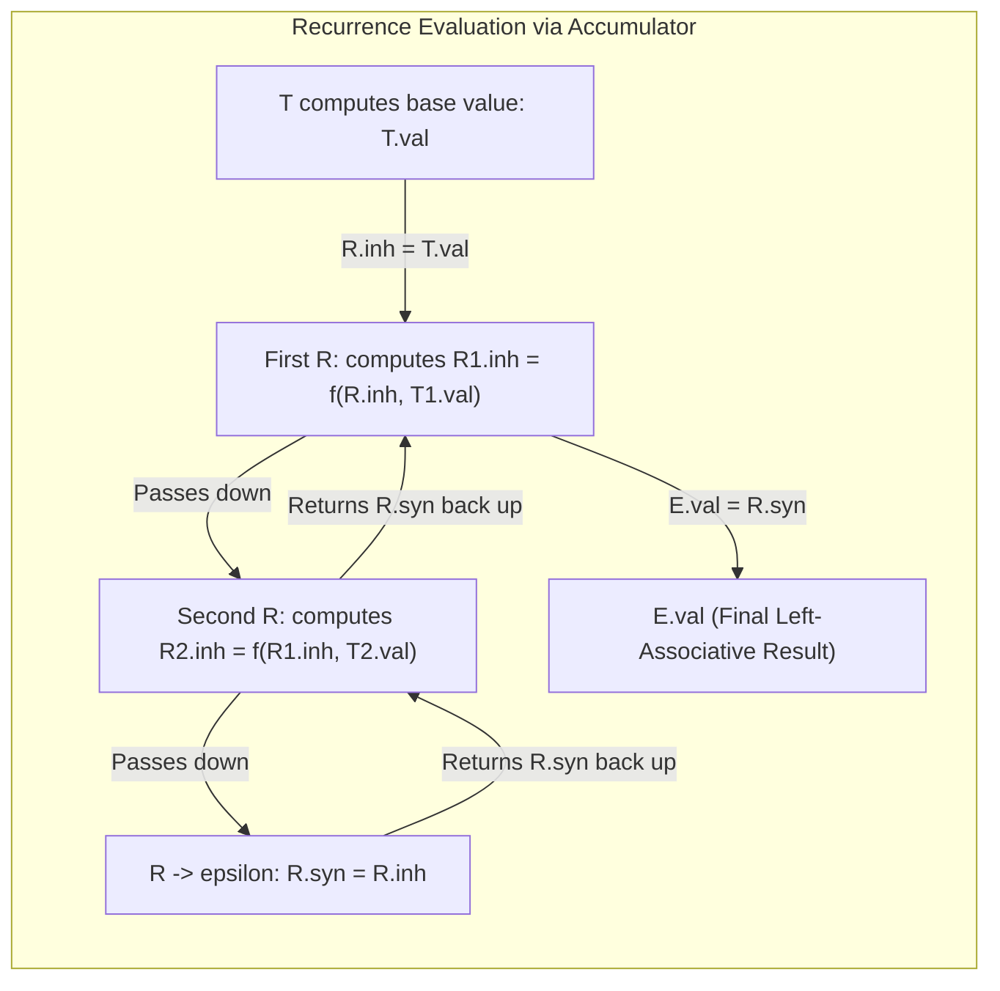

# Eliminating Left Recursion from SDTs

> 📖 **Reading Order:** Step 55 of 55 | **Module 1:** Syntax-Directed Translation  
> ◄ **Previous:** [[Abstract Syntax Tree Construction with SDDs]] | ► **Next:** [[Bottom-Up Evaluation of L-Attributed SDDs]]

---

---

---

---

---

## The Problem and Earlier Tools

Top-down parsers (LL(1) and recursive-descent) cannot parse **left-recursive** grammars. If a production contains $A \longrightarrow A \alpha$, a top-down parser attempting to expand $A$ will call $A$ again without consuming any input tokens, entering an **infinite recursive loop**.

In pure syntax parsing, removing immediate left recursion is a standard textbook formula:
$$A \longrightarrow A \alpha \mid \beta \quad \Longrightarrow \quad A \longrightarrow \beta R, \quad R \longrightarrow \alpha R \mid \epsilon$$

However, in real-world compilers, we do not have pure context-free grammars. We have **Syntax-Directed Translation Schemes (SDTs)** where executable semantic actions $\{ \dots \}$ are embedded directly inside the productions!

If you blindly eliminate left recursion without accounting for semantic actions, you break the compiler:
- Output strings print out of order.
- Synthesized attribute calculations lose their operands.
- Mathematical operations like subtraction evaluate right-to-left instead of left-to-right!

To eliminate left recursion safely, we must distinguish two fundamentally different cases:
1. **Case 1:** Semantic actions perform **side effects** (e.g., printing tokens).
2. **Case 2:** Semantic actions compute **synthesized attributes** (e.g., evaluating arithmetic or building ASTs).

---

---

---

---

---

## Developing the Core Idea

When semantic actions merely print text or produce external output without returning attributes, we can use a brilliant conceptual insight:

> **The Dummy Terminal Trick:**  
> Treat every semantic action block $\{ a_i \}$ as if it were a regular grammar terminal symbol (like a comma or letter). Since the standard left-recursion elimination algorithm works for *any* arbitrary sequence of grammar symbols, it will mechanically place the actions in the exact positions required to preserve their execution order!

### Mathematical Formulation:
Given the left-recursive SDT:
$$A \longrightarrow A \, \{ a_1 \} \, \alpha \, \{ a_2 \} \mid \beta \, \{ a_3 \}$$

Let $X = \{ a_1 \} \, \alpha \, \{ a_2 \}$ be the recursive tail, and let $Y = \beta \, \{ a_3 \}$ be the non-recursive base.

Applying the standard left-recursion elimination rule ($A \to Y R, \; R \to X R \mid \epsilon$):
$$\mathbf{A \longrightarrow \beta \, \{ a_3 \} \, R}$$
$$\mathbf{R \longrightarrow \{ a_1 \} \, \alpha \, \{ a_2 \} \, R \mid \epsilon}$$

### Walkthrough: Infix to Postfix Translation
Consider translating infix subtraction into postfix notation:
```
E -> E1 - T  { print('-'); }
E -> T
T -> num     { print(num.val); }
```

Here:
- Non-recursive base: $T$
- Recursive tail: `- T { print('-'); }`

Applying the formula:
```
E -> T R
R -> - T { print('-'); } R | epsilon
T -> num { print(num.val); }
```

### Trace on Input `9 - 5 - 2`:
1. $E$ expands to $T \; R$.
2. $T$ matches `9` $\implies$ executes $\{ \text{print}(9) \}$. **Output: `9`**
3. $R$ matches `-`, $T$ matches `5` $\implies$ executes $\{ \text{print}(5) \}$. **Output: `9 5`**
4. Action in $R$ executes $\{ \text{print}('-') \}$. **Output: `9 5 -`**
5. Next $R$ matches `-`, $T$ matches `2` $\implies$ executes $\{ \text{print}(2) \}$. **Output: `9 5 - 2`**
6. Action in $R$ executes $\{ \text{print}('-') \}$. **Output: `9 5 - 2 -`**
7. Final $R$ matches $\epsilon$.

The postfix output `9 5 - 2 -` is generated in the **exact same order** as the original grammar!

---

---

---

---

---

## Inputs

- Intermediate representation (Three-Address Code instructions, parse tree nodes, live intervals, or interference graph).

---

## Outputs

- Partitioned blocks, DAG nodes, allocated physical registers, or evacuated memory blocks.

---

## How It Works

### Inputs

- Intermediate representation (Three-Address Code instructions, parse tree nodes, live intervals, or interference graph).

---
### Outputs

- Partitioned blocks, DAG nodes, allocated physical registers, or evacuated memory blocks.

---
### How It Works

### Inputs

- Intermediate representation (Three-Address Code instructions, parse tree nodes, live intervals, or interference graph).

---
### Outputs

- Partitioned blocks, DAG nodes, allocated physical registers, or evacuated memory blocks.

---
### How It Works

### Inputs

- Intermediate representation (Three-Address Code instructions, parse tree nodes, live intervals, or interference graph).

---
### Outputs

- Partitioned blocks, DAG nodes, allocated physical registers, or evacuated memory blocks.

---
### How It Works

### Case 2: Actions Computing Synthesized Attributes

What if the semantic actions do *not* print strings, but instead calculate a mathematical value ($E.val = E_1.val - T.val$)?

Now, the "dummy terminal" trick fails catastrophically. In right-recursive grammar $E \to T R, \; R \to - T R \mid \epsilon$, the second operand is parsed by $R$, but the first operand was parsed by $T$! 

If you make $R$ synthesize its value bottom-up, it evaluates from right to left:
$$9 - (5 - 2) = 9 - 3 = 6 \quad \text{\bf (WRONG! Correct is } (9 - 5) - 2 = 2\text{\bf)}$$

### The Master Solution: The Inherited Accumulator

To preserve left-associativity, we introduce an **inherited attribute on $R$** ($R.inh$) that acts as an **accumulator**:
1. $T$ computes the first operand and hands it to $R.inh$.
2. $R$ takes the accumulator $R.inh$, applies the operator with the next operand $T.val$, and hands the updated accumulator down to the next $R_1.inh$!
3. When $R$ reaches $\epsilon$, it returns the accumulated total back up through synthesized attribute $R.syn$.



---

---
### Properties

### The Transformation Template and Mathematical Proof

### Original Left-Recursive SDT:
$$A \longrightarrow A_1 \; Y \quad \{ A.val = f(A_1.val, Y.val); \}$$
$$A \longrightarrow X \quad \{ A.val = g(X.val); \}$$

### Transformed Non-Left-Recursive L-Attributed SDT:
$$A \longrightarrow X \quad \{ R.inh = g(X.val); \} \quad R \quad \{ A.val = R.syn; \}$$
$$R \longrightarrow Y \quad \{ R_1.inh = f(R.inh, Y.val); \} \quad R_1 \quad \{ R.syn = R_1.syn; \}$$
$$R \longrightarrow \epsilon \quad \{ R.syn = R.inh; \}$$

---

### The Mathematical Proof of Semantic Equivalence:
> **Theorem:** For any input sequence $X \; Y_1 \; Y_2 \dots Y_k$, the transformed SDT computes the exact same value as the original left-recursive SDT.
>
> **Proof by Induction on $k$:**
> 
> **Original SDT Evaluation:**  
> In the original left-recursive grammar, the parse tree is left-heavy. The reduction sequence evaluates:
> $$\text{val}_0 = g(X.val)$$
> $$\text{val}_1 = f(\text{val}_0, Y_1.val)$$
> $$\text{val}_2 = f(\text{val}_1, Y_2.val)$$
> In general, for $k$ terms:
> $$\text{Result}_{\text{orig}} = f(\dots f(f(g(X), Y_1), Y_2) \dots, Y_k)$$
>
> **Transformed SDT Evaluation:**  
> In the transformed grammar, $A \to X R$ initializes:
> $$R^{(0)}.inh = g(X.val) = \text{val}_0$$
> Each application of $R \to Y_j R_{j+1}$ computes:
> $$R^{(j)}.inh = f(R^{(j-1)}.inh, Y_j.val) = \text{val}_j$$
> When $R^{(k)} \to \epsilon$, the base case rule fires:
> $$R^{(k)}.syn = R^{(k)}.inh = \text{val}_k$$
> Each parent copies its child's synthesized attribute:
> $$R^{(j-1)}.syn = R^{(j)}.syn = \dots = R^{(0)}.syn = \text{val}_k$$
> Finally, $A.val = R^{(0)}.syn = \text{val}_k$.
> 
> Because $\text{val}_k$ in both systems satisfies the identical recurrence relation:
> $$\text{val}_j = f(\text{val}_{j-1}, Y_j), \quad \text{with } \text{val}_0 = g(X)$$
> the values computed for all inputs are mathematically identical. $\blacksquare$

---

---
### Related Concepts

- [[Basic Blocks and Control Flow Graphs]]
- [[Live Ranges and Live Intervals in Register Allocation]]
- [[Register Interference Graphs and Graph Coloring Principles]]

---
### Prerequisites

- [[Basic Blocks and Control Flow Graphs]]

---
### Problems

- [[Problem — Linear Scan Register Allocation Simulation]]
- [[Problem — Chaitin Graph Coloring Register Allocation]]

---

---
### Properties

- **Termination:** Provably terminates on all well-formed compiler inputs.
- **Correctness:** Preserves the underlying language semantics and program data dependencies.

---
### Related Concepts

- [[Basic Blocks and Control Flow Graphs]]
- [[Live Ranges and Live Intervals in Register Allocation]]
- [[Register Interference Graphs and Graph Coloring Principles]]

---
### Prerequisites

- [[Basic Blocks and Control Flow Graphs]]

---
### Problems

- [[Problem — Linear Scan Register Allocation Simulation]]
- [[Problem — Chaitin Graph Coloring Register Allocation]]

---

---
### Properties

- **Termination:** Provably terminates on all well-formed compiler inputs.
- **Correctness:** Preserves the underlying language semantics and program data dependencies.

---
### Related Concepts

- [[Basic Blocks and Control Flow Graphs]]
- [[Live Ranges and Live Intervals in Register Allocation]]
- [[Register Interference Graphs and Graph Coloring Principles]]

---
### Prerequisites

- [[Basic Blocks and Control Flow Graphs]]

---
### Problems

- [[Problem — Linear Scan Register Allocation Simulation]]
- [[Problem — Chaitin Graph Coloring Register Allocation]]

---

---

## Pseudocode

### Pseudocode

### Pseudocode

### Pseudocode

The complete algorithmic procedure is detailed in the sections above.

---

---

---

---

## Example

Concrete step-by-step simulations and traces are cataloged in the associated Example and Problem notes.

---

## Complexity

### Time Complexity
$O(N)$ to $O(N^2)$ depending on basic block length, graph density, or live intervals.

### Space Complexity
$O(N)$ for auxiliary state tables, stacks, or free lists.

---

---

---

---

## Properties

- **Termination:** Provably terminates on all well-formed compiler inputs.
- **Correctness:** Preserves the underlying language semantics and program data dependencies.

---

## Limitations

### Limitations

### Limitations

### Limitations

- Conservative heuristics may yield suboptimal allocations or require register spilling when demand exceeds hardware resources.

---

---

---

---

## Common Mistakes

### Common Mistakes

### Common Mistakes

### Common Mistakes

- Forgetting to update liveness information or next-use pointers.
- Misinterpreting index bounds during stack or interval scans.

---

---

---

---

## Exam Relevance

### Example

Concrete step-by-step simulations and traces are cataloged in the associated Example and Problem notes.

---
### Exam Relevance

### Example

Concrete step-by-step simulations and traces are cataloged in the associated Example and Problem notes.

---
### Exam Relevance

### Example

Concrete step-by-step simulations and traces are cataloged in the associated Example and Problem notes.

---
### Exam Relevance

### Concrete Worked Example: Desk Calculator Subtraction

Let us transform the classic left-recursive subtraction grammar:
$$E \longrightarrow E_1 - T \quad \{ E.val = E_1.val - T.val; \} \mid T \quad \{ E.val = T.val; \}$$

### Transformed L-Attributed SDT:
1. $E \longrightarrow T \quad \{ R.inh = T.val; \} \quad R \quad \{ E.val = R.syn; \}$
2. $R \longrightarrow - \; T \quad \{ R_1.inh = R.inh - T.val; \} \quad R_1 \quad \{ R.syn = R_1.syn; \}$
3. $R \longrightarrow \epsilon \quad \{ R.syn = R.inh; \}$

### Trace on Input `9 - 5 - 2`:
1. $E$ expands to $T \; R$. $T$ evaluates `9` $\implies T.val = 9$.
2. Action initializes: $R.inh = 9$.
3. First $R$ matches `-`, $T$ evaluates `5` $\implies T.val = 5$.
4. Action computes accumulator update:
   $$R_1.inh = R.inh - T.val = 9 - 5 = 4$$
5. Second $R$ ($R_1$) matches `-`, $T$ evaluates `2` $\implies T.val = 2$.
6. Action computes accumulator update:
   $$R_2.inh = R_1.inh - T.val = 4 - 2 = 2$$
7. Third $R$ ($R_2$) matches $\epsilon$.
8. Base rule fires: $R_2.syn = R_2.inh = 2$.
9. Synthesized attributes propagate up the call stack:
   $$R_1.syn = R_2.syn = 2$$
   $$R.syn = R_1.syn = 2$$
   $$E.val = R.syn = 2$$

**Result:** The left-associative calculation $((9 - 5) - 2) = 2$ is computed flawlessly inside a top-down parser!

---

---

---

---

---

## Related Concepts

- [[Basic Blocks and Control Flow Graphs]]
- [[Live Ranges and Live Intervals in Register Allocation]]
- [[Register Interference Graphs and Graph Coloring Principles]]

---

## Prerequisites

- [[Basic Blocks and Control Flow Graphs]]

---

## Problems

- [[Problem — Linear Scan Register Allocation Simulation]]
- [[Problem — Chaitin Graph Coloring Register Allocation]]

---

## Sources

- **Lecture Slides:** [[cse309/01 - Sources/Lectures/KMS Merged.pdf|KMS Merged.pdf]], Chapter 5 (Slides 63–71).
- **Textbook:** Aho, Lam, Sethi, Ullman, *Compilers: Principles, Techniques, & Tools* (2nd Ed.), Section 5.4.
