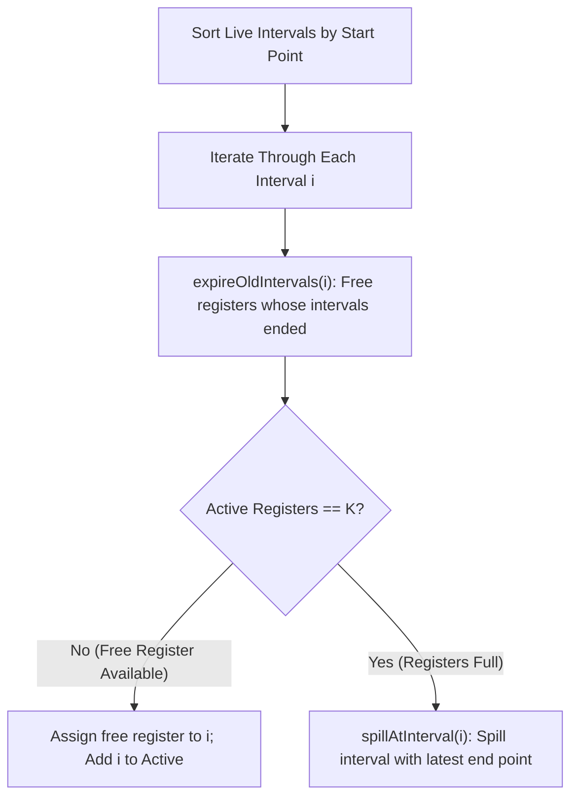

# Linear Scan Register Allocation Algorithm

> 📖 **Reading Order:** Step 45 of 55 | **Module 5:** Register Allocation  
> ◄ **Previous:** [[Register Interference Graphs and Graph Coloring Principles]] | ► **Next:** [[Chaitin's Graph Coloring Register Allocation Algorithm]]

---

---

---

---

---

## The Problem and Earlier Tools

While graph coloring produces near-optimal register allocation, building the interference graph takes $O(V^2)$ time and graph coloring is NP-hard. In **Just-In-Time (JIT) compilers** (such as Java JVM HotSpot C1, JavaScript V8, and .NET Core CLR), compilation occurs during program execution. Spending milliseconds on complex graph coloring introduces noticeable latency.

**Massimiliano Poletto and Vivek Sarkar (1999)** invented **Linear Scan Register Allocation**:
- Replaces interference graphs with **1-dimensional live intervals** $[s, e]$.
- Processes intervals in a single linear pass sorted by starting point.
- Achieves **$O(V \log R)$ or $O(V)$ time complexity**!
- Generates code that runs within $12\%$ of the quality of full graph coloring while compiling **orders of magnitude faster**.



---

---

---

---

---

## Developing the Core Idea

1. `intervals`: List of all variable intervals $[start_i, end_i]$, sorted in ascending order of $start_i$.
2. `active`: A list of currently active intervals that currently hold physical registers, maintained in **ascending order of their end points** ($end_j$).
3. `R`: The number of available physical registers.
4. `free_registers`: A pool of currently unassigned hardware registers.

---

---

---

---

---

## Inputs

- Intermediate representation (Three-Address Code instructions, parse tree nodes, live intervals, or interference graph).

---

## Outputs

- Partitioned blocks, DAG nodes, allocated physical registers, or evacuated memory blocks.

---

## How It Works

### Inputs

- Intermediate representation (Three-Address Code instructions, parse tree nodes, live intervals, or interference graph).

---
### Outputs

- Partitioned blocks, DAG nodes, allocated physical registers, or evacuated memory blocks.

---
### How It Works

### Inputs

- Intermediate representation (Three-Address Code instructions, parse tree nodes, live intervals, or interference graph).

---
### Outputs

- Partitioned blocks, DAG nodes, allocated physical registers, or evacuated memory blocks.

---
### How It Works

### Inputs

- Intermediate representation (Three-Address Code instructions, parse tree nodes, live intervals, or interference graph).

---
### Outputs

- Partitioned blocks, DAG nodes, allocated physical registers, or evacuated memory blocks.

---
### How It Works

The algorithm transitions through defined phases.

---
### Properties

- **Termination:** Provably terminates on all well-formed compiler inputs.
- **Correctness:** Preserves the underlying language semantics and program data dependencies.

---
### Related Concepts

- [[Basic Blocks and Control Flow Graphs]]
- [[Live Ranges and Live Intervals in Register Allocation]]
- [[Register Interference Graphs and Graph Coloring Principles]]

---
### Prerequisites

- [[Basic Blocks and Control Flow Graphs]]

---
### Problems

- [[Problem — Linear Scan Register Allocation Simulation]]
- [[Problem — Chaitin Graph Coloring Register Allocation]]

---

---
### Properties

- **Termination:** Provably terminates on all well-formed compiler inputs.
- **Correctness:** Preserves the underlying language semantics and program data dependencies.

---
### Related Concepts

- [[Basic Blocks and Control Flow Graphs]]
- [[Live Ranges and Live Intervals in Register Allocation]]
- [[Register Interference Graphs and Graph Coloring Principles]]

---
### Prerequisites

- [[Basic Blocks and Control Flow Graphs]]

---
### Problems

- [[Problem — Linear Scan Register Allocation Simulation]]
- [[Problem — Chaitin Graph Coloring Register Allocation]]

---

---
### Properties

- **Termination:** Provably terminates on all well-formed compiler inputs.
- **Correctness:** Preserves the underlying language semantics and program data dependencies.

---
### Related Concepts

- [[Basic Blocks and Control Flow Graphs]]
- [[Live Ranges and Live Intervals in Register Allocation]]
- [[Register Interference Graphs and Graph Coloring Principles]]

---
### Prerequisites

- [[Basic Blocks and Control Flow Graphs]]

---
### Problems

- [[Problem — Linear Scan Register Allocation Simulation]]
- [[Problem — Chaitin Graph Coloring Register Allocation]]

---

---

## Pseudocode

### Pseudocode

### Pseudocode

### Pseudocode

### The Algorithmic Implementation

```python
def linear_scan_register_allocation(intervals, R):
    # Sort all intervals by their start point
    intervals.sort(key=lambda x: x.start)
    
    active = []
    free_registers = list(range(R))  # Pool of registers 0 .. R-1
    allocation = {}                  # interval -> register or 'spilled'

    def expire_old_intervals(current_interval):
        # Remove any interval from active whose end point precedes current start
        nonlocal active, free_registers
        remaining_active = []
        for j in active:
            if j.end < current_interval.start:
                # Interval j has expired: reclaim its physical register!
                reg = allocation[j]
                free_registers.append(reg)
            else:
                remaining_active.append(j)
        active = remaining_active

    def spill_at_interval(current_interval):
        # Spills either current_interval or the active interval with latest end
        nonlocal active, allocation
        # active is sorted by end point; candidate is the last item
        candidate = active[-1]
        
        if candidate.end > current_interval.end:
            # Candidate lives longer: spill candidate, give its register to current!
            reg = allocation[candidate]
            allocation[candidate] = "spilled"
            allocation[current_interval] = reg
            
            # Replace candidate with current_interval in active list
            active.remove(candidate)
            active.append(current_interval)
            active.sort(key=lambda x: x.end)
        else:
            # Current interval lives longer: spill current interval directly!
            allocation[current_interval] = "spilled"

    # Main allocation loop
    for i in intervals:
        expire_old_intervals(i)
        
        if len(active) == R:
            # All registers are full: must spill!
            spill_at_interval(i)
        else:
            # Allocate a free register
            reg = free_registers.pop(0)
            allocation[i] = reg
            active.append(i)
            active.sort(key=lambda x: x.end)
            
    return allocation
```

---

---

---

---

---

## Example

Concrete step-by-step simulations and traces are cataloged in the associated Example and Problem notes.

---

## Complexity

- **Sorting Intervals:** $O(V \log V)$, where $V$ is the number of variables.
- **Allocation Loop:** Each interval is inserted and removed from the `active` list at most once. Since $|active| \le R$, each operation takes $O(R)$ or $O(\log R)$ with a priority queue.
- **Overall Time Complexity:** **$\mathbf{O(V \log V + V \log R)}$** (linear in practice).
- **Space Complexity:** $O(V)$ storing live intervals.

---

---

---

---

---

## Properties

- **Termination:** Provably terminates on all well-formed compiler inputs.
- **Correctness:** Preserves the underlying language semantics and program data dependencies.

---

## Limitations

### Limitations

### Limitations

### Limitations

### Key Mechanics: Why Spill the Latest End Point?

When all $R$ registers are occupied and interval $i$ arrives:
$$\text{Candidate} = \arg\max_{j \in \text{active} \cup \{ i \}} (j.end)$$

Spilling the variable whose lifetime extends **farthest into the future**:
1. Keeps registers available for variables that need them soon.
2. Minimizes future register contention.
3. This directly implements **Belady's MIN replacement algorithm** (proven optimal for fixed cache replacement)!

---

---

---

---

---

## Common Mistakes

### Common Mistakes

### Common Mistakes

### Common Mistakes

- Forgetting to update liveness information or next-use pointers.
- Misinterpreting index bounds during stack or interval scans.

---

---

---

---

## Exam Relevance

### Example

Concrete step-by-step simulations and traces are cataloged in the associated Example and Problem notes.

---
### Exam Relevance

### Example

Concrete step-by-step simulations and traces are cataloged in the associated Example and Problem notes.

---
### Exam Relevance

### Example

Concrete step-by-step simulations and traces are cataloged in the associated Example and Problem notes.

---
### Exam Relevance

Frequently tested on final examinations via hand-simulation of Linear Scan Register Allocation Algorithm on given code fragments or graphs.

---

---

---

---

## Related Concepts

- [[Basic Blocks and Control Flow Graphs]]
- [[Live Ranges and Live Intervals in Register Allocation]]
- [[Register Interference Graphs and Graph Coloring Principles]]

---

## Prerequisites

- [[Basic Blocks and Control Flow Graphs]]

---

## Problems

- [[Problem — Linear Scan Register Allocation Simulation]]
- [[Problem — Chaitin Graph Coloring Register Allocation]]

---

## Sources

- **Lecture Slides:** [[cse309/01 - Sources/Lectures/KMS Merged.pdf|KMS Merged.pdf]], Register Allocation (Slides 391–425).
- **Textbook / Papers:** Poletto & Sarkar, "Linear Scan Register Allocation", ACM TOPLAS 1999.
