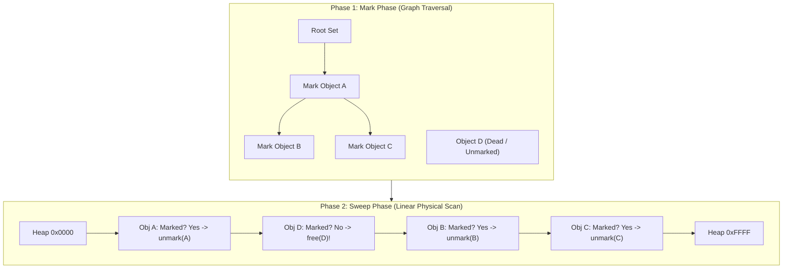

# Mark-and-Sweep Garbage Collection Algorithm

> 📖 **Reading Order:** Step 27 of 55 | **Module 3:** Run-Time Environments  
> ◄ **Previous:** [[Trace-Based Garbage Collection Algorithms]] | ► **Next:** [[Copying Garbage Collection Algorithm]]

---

---

---

---

---

## The Problem and Earlier Tools

In 1960, John McCarthy invented the **Mark-and-Sweep** algorithm for the Lisp programming language, introducing the world's first automatic trace-based garbage collector.

Before Mark-and-Sweep, computer scientists assumed that reclaiming memory required tracking each object individually at the moment it was discarded. McCarthy realized a profound mathematical duality:
> *Instead of trying to prove that an object is dead, prove which objects are alive! Anything not provably alive from the Root Set is dead by definition.*

Mark-and-Sweep operates in two strictly decoupled phases:
1. **The Mark Phase:** A graph-reachability traversal (DFS or BFS) starting from the Root Set that marks all accessible live objects.
2. **The Sweep Phase:** A single linear, physical memory scan across the entire heap from bottom to top. Unmarked memory blocks are returned to the free list; marked blocks are preserved, and their mark bits are reset to zero for the next cycle.



---

---

---

---

---

## Developing the Core Idea

```python
class MarkSweepCollector:
    def __init__(self, heap_start: int, heap_end: int):
        self.heap_start = heap_start
        self.heap_end = heap_end
        self.free_list = []

    def collect(self, root_set: list):
        # =========================================================
        # PHASE 1: MARK PHASE (Graph Reachability)
        # =========================================================
        worklist = []  # The Unscanned (Grey) Queue

        # 1. Seed worklist with all non-null roots
        for root in root_set:
            if root is not None and not root.marked:
                root.marked = True      # Transition: Unreached -> Unscanned
                worklist.append(root)

        # 2. Exhaust worklist (BFS / DFS traversal)
        while len(worklist) > 0:
            current = worklist.pop()    # Transition: Unscanned -> Scanned
            for child in current.get_outgoing_pointers():
                if child is not None and not child.marked:
                    child.marked = True # Discovered reachable child
                    worklist.append(child)

        # =========================================================
        # PHASE 2: SWEEP PHASE (Linear Physical Memory Scan)
        # =========================================================
        curr_ptr = self.heap_start
        while curr_ptr < self.heap_end:
            chunk = get_chunk_at(curr_ptr)
            if chunk.is_allocated:
                if not chunk.marked:
                    # Object is unreachable garbage: reclaim it!
                    chunk.is_allocated = False
                    self.free_list.append(chunk)
                else:
                    # Object is alive: reset mark bit for next collection cycle
                    chunk.marked = False

            # Advance linearly to the next physical chunk in memory
            curr_ptr += chunk.size
```

---

---

---

---

---

## Inputs

- Intermediate representation (Three-Address Code instructions, parse tree nodes, live intervals, or interference graph).

---

## Outputs

- Partitioned blocks, DAG nodes, allocated physical registers, or evacuated memory blocks.

---

## How It Works

### Inputs

- Intermediate representation (Three-Address Code instructions, parse tree nodes, live intervals, or interference graph).

---
### Outputs

- Partitioned blocks, DAG nodes, allocated physical registers, or evacuated memory blocks.

---
### How It Works

### Inputs

- Intermediate representation (Three-Address Code instructions, parse tree nodes, live intervals, or interference graph).

---
### Outputs

- Partitioned blocks, DAG nodes, allocated physical registers, or evacuated memory blocks.

---
### How It Works

### Inputs

- Intermediate representation (Three-Address Code instructions, parse tree nodes, live intervals, or interference graph).

---
### Outputs

- Partitioned blocks, DAG nodes, allocated physical registers, or evacuated memory blocks.

---
### How It Works

### Performance Bottlenecks & Modern Industrial Optimizations

While Mark-and-Sweep is elegant, naive implementations suffer from two severe hardware bottlenecks:

### 1. The $O(\text{Heap Size})$ Sweep Penalty
- Notice that Phase 2 scans the **entire physical heap from beginning to end**, checking every memory word.
- Suppose an enterprise application has a **64-gigabyte heap**, but only **100 megabytes** of live data.
- The Sweep Phase must still touch and scan all 64 gigabytes of memory pages! This induces massive hardware page faults and cache thrashing just to discover dead space.

### 2. Cache-Line Pollution (In-Header Mark Bits)
- If `marked` is stored as a bit inside the object header, the sweep phase writes to the header of every surviving object to clear the bit (`chunk.marked = False`).
- Writing to every live object marks every CPU cache line as "dirty", forcing the CPU cache controller to write back gigabytes of data to physical DRAM.

### Industrial Solution: Bitmap Marking
Modern production runtimes (such as Go and the Java HotSpot JVM) do **not** store mark bits inside object headers:
- They maintain a separate, dense, contiguous **Mark Bitmap** stored in a small dedicated memory table (1 bit per 8 or 16 bytes of heap).
- Scanning and sweeping 64GB of heap requires inspecting only a compact 512MB bitmap!
- The CPU can test and clear bits using 64-bit word operations (`word == 0`) and bitwise instructions, executing the sweep phase orders of magnitude faster.

---

---
### Properties

### Formal Proof of Correctness

### Theorem: Correctness of Mark-and-Sweep
*Upon termination of the Mark-and-Sweep algorithm:*
1. *Every heap object reachable from the root set remains allocated and uncorrupted.*
2. *Every heap object unreachable from the root set is reclaimed into the free list.*
3. *All mark bits of surviving objects are restored to zero.*

### Proof:
1. **Correctness of Mark Phase:**
   - Let $G = (V, E)$ be the heap graph and $R$ be the root set.
   - We claim: an object $v \in V$ has $v.marked == \mathbf{True}$ at the end of Phase 1 iff $v \in \text{Reachable}(G, R)$.
   - *Base Case:* All $r \in R$ are marked and pushed to `worklist`.
   - *Inductive Step:* A node $u$ is popped from `worklist`. For every outgoing edge $(u, w) \in E$, if $w$ is unmarked, it is marked and pushed. By standard properties of graph search (Breadth-First or Depth-First Search), the algorithm visits the transitive closure of $R$.
   - Since $V$ is finite, the search terminates. Upon termination, $v.marked == \mathbf{True} \iff \exists r \in R, r \rightsquigarrow v$.
2. **Correctness of Sweep Phase:**
   - The loop sequentially visits every contiguous allocated chunk $c$ in $[heap\_start, heap\_end)$.
   - **Case 1 ($c$ was reachable):** By Step 1, $c.marked == \mathbf{True}$. The sweep branch executes:
     $$c.is\_allocated = \mathbf{True} \quad (\text{remains live}), \quad c.marked = \mathbf{False}$$
     The object is preserved, and its mark bit is cleanly reset.
   - **Case 2 ($c$ was unreachable):** By Step 1, $c.marked == \mathbf{False}$. The sweep branch executes:
     $$c.is\_allocated = \mathbf{False}, \quad \text{add\_to\_free\_list}(c)$$
     The object is reclaimed into the free memory pool.
3. Therefore, exactly the unreachable objects are freed, all live objects are preserved, and all mark bits are restored. $\blacksquare$

---

---
### Related Concepts

- [[Basic Blocks and Control Flow Graphs]]
- [[Live Ranges and Live Intervals in Register Allocation]]
- [[Register Interference Graphs and Graph Coloring Principles]]

---
### Prerequisites

- [[Basic Blocks and Control Flow Graphs]]

---
### Problems

- [[Problem — Linear Scan Register Allocation Simulation]]
- [[Problem — Chaitin Graph Coloring Register Allocation]]

---

---
### Properties

- **Termination:** Provably terminates on all well-formed compiler inputs.
- **Correctness:** Preserves the underlying language semantics and program data dependencies.

---
### Related Concepts

- [[Basic Blocks and Control Flow Graphs]]
- [[Live Ranges and Live Intervals in Register Allocation]]
- [[Register Interference Graphs and Graph Coloring Principles]]

---
### Prerequisites

- [[Basic Blocks and Control Flow Graphs]]

---
### Problems

- [[Problem — Linear Scan Register Allocation Simulation]]
- [[Problem — Chaitin Graph Coloring Register Allocation]]

---

---
### Properties

- **Termination:** Provably terminates on all well-formed compiler inputs.
- **Correctness:** Preserves the underlying language semantics and program data dependencies.

---
### Related Concepts

- [[Basic Blocks and Control Flow Graphs]]
- [[Live Ranges and Live Intervals in Register Allocation]]
- [[Register Interference Graphs and Graph Coloring Principles]]

---
### Prerequisites

- [[Basic Blocks and Control Flow Graphs]]

---
### Problems

- [[Problem — Linear Scan Register Allocation Simulation]]
- [[Problem — Chaitin Graph Coloring Register Allocation]]

---

---

## Pseudocode

### Pseudocode

### Pseudocode

### Pseudocode

The complete algorithmic procedure is detailed in the sections above.

---

---

---

---

## Example

Concrete step-by-step simulations and traces are cataloged in the associated Example and Problem notes.

---

## Complexity

### Time Complexity
$O(N)$ to $O(N^2)$ depending on basic block length, graph density, or live intervals.

### Space Complexity
$O(N)$ for auxiliary state tables, stacks, or free lists.

---

---

---

---

## Properties

- **Termination:** Provably terminates on all well-formed compiler inputs.
- **Correctness:** Preserves the underlying language semantics and program data dependencies.

---

## Limitations

### Limitations

### Limitations

### Limitations

- Conservative heuristics may yield suboptimal allocations or require register spilling when demand exceeds hardware resources.

---

---

---

---

## Common Mistakes

### Common Mistakes

### Common Mistakes

### Common Mistakes

- Forgetting to update liveness information or next-use pointers.
- Misinterpreting index bounds during stack or interval scans.

---

---

---

---

## Exam Relevance

### Example

Concrete step-by-step simulations and traces are cataloged in the associated Example and Problem notes.

---
### Exam Relevance

### Example

Concrete step-by-step simulations and traces are cataloged in the associated Example and Problem notes.

---
### Exam Relevance

### Example

Concrete step-by-step simulations and traces are cataloged in the associated Example and Problem notes.

---
### Exam Relevance

Frequently tested on final examinations via hand-simulation of Mark-and-Sweep Garbage Collection Algorithm on given code fragments or graphs.

---

---

---

---

## Related Concepts

- [[Basic Blocks and Control Flow Graphs]]
- [[Live Ranges and Live Intervals in Register Allocation]]
- [[Register Interference Graphs and Graph Coloring Principles]]

---

## Prerequisites

- [[Basic Blocks and Control Flow Graphs]]

---

## Problems

- [[Problem — Linear Scan Register Allocation Simulation]]
- [[Problem — Chaitin Graph Coloring Register Allocation]]

---

## Sources

- **Lecture Slides:** [[cse309/01 - Sources/Lectures/KMS Merged.pdf|KMS Merged.pdf]], Chapter 7 (Slides 270–278).
- **Textbook:** Aho, Lam, Sethi, Ullman, *Compilers: Principles, Techniques, & Tools* (2nd Ed.), Section 7.6.1 (Mark-and-Sweep Garbage Collection).
- **McCarthy, J.:** *Recursive Functions of Symbolic Expressions and Their Computation by Machine, Part I*, Communications of the ACM, 1960.
