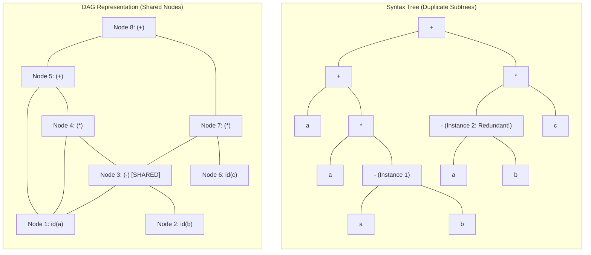

# Value-Number Method for DAG Construction

> 📖 **Reading Order:** Step 11 of 55 | **Module 2: Intermediate Code Generation**  
> ◄ **Previous:** [[Intermediate Representations and Three-Address Code]] | ► **Next:** [[Type Expressions and Storage Layout]]

---

## The Problem and Earlier Tools

Consider what happens when a programmer writes:
$$x = a + a \times (a - b) + (a - b) \times c$$
If the compiler constructs a standard **Abstract Syntax Tree (AST)**, every textual token becomes a separate tree node:
- The subexpression $(a - b)$ appears twice.
- The syntax tree allocates two distinct `-` nodes, each with its own child leaves for $a$ and $b$.

When the compiler generates assembly or Three-Address Code (TAC) from this tree, it emits:
```text
t1 = a - b      // First computation of (a - b)
t2 = a * t1
t3 = a + t2
t4 = a - b      // REDUNDANT CPU WORK! Re-subtracting the exact same variables!
t5 = t4 * c
t6 = t3 + t5
```
Notice instruction `t4`: the CPU burns cycles recalculating $a - b$, consumes an extra physical register, and pollutes cache lines.

A **Directed Acyclic Graph (DAG)** solves this directly during Intermediate Code Generation. Unlike a tree—where every node has at most one parent—a DAG allows a node to have **multiple parents**. Once $(a - b)$ is constructed, any subsequent occurrence simply points to the existing node!

The **Value-Number Method** is the foundational, $O(1)$-per-node algorithm that builds DAGs on-the-fly using a hash table of canonical computational signatures.



---

## Developing the Core Idea

The algorithm represents the DAG as a compact **Node Array** (indexed by integers called **Value Numbers**) paired with a **Hash Table** for instantaneous $O(1)$ duplicate detection:

### 2.1 The Node Array
Every unique computational entity receives an integer index $1, 2, 3, \dots, N$:
1. **Leaf Records:** Store a token type and its symbol name/literal value:
   $$\text{Leaf Record} = \langle \mathbf{LEAF}, \; \text{symbol\_or\_constant} \rangle$$
2. **Interior Operator Records:** Store the operator and the integer **value numbers** of its children:
   $$\text{Interior Record} = \langle \mathbf{INTERIOR}, \; \text{op}, \; \text{left\_val\_num}, \; \text{right\_val\_num} \rangle$$

### 2.2 The Signature Hash Map
To determine whether an expression has already been evaluated, we define a canonical **Hash Key (Signature)**:
- For a leaf: $\text{Key} = (\text{LEAF}, \text{identifier\_name})$
- For an interior node: $\text{Key} = (\text{op}, \text{left\_val\_num}, \text{right\_val\_num})$

The hash map maps:
$$\text{Signature} \longrightarrow \text{Value Number (Array Index)}$$

---

## Inputs

- Sequence of Three-Address Code statements within a basic block, and initial symbol table mapping variable names to node indices.

---

## Outputs

- Array of unique DAG node records (value numbers) and updated variable-to-node mapping.

---

## How It Works

### Advanced Compiler Extensions: Commutative Value Numbering

What happens if the code has:
$$x = a + b; \quad y = b + a;$$
In a naive value-number method:
- $a + b$ produces key `('+', 1, 2)` $\implies$ Value Number 3.
- $b + a$ produces key `('+', 2, 1)` $\implies$ Key not found! Creates redundant Value Number 4!

### The Commutative Normalization Rule:
For any symmetric operator $\oplus \in \{+, *, ==, \neq, \land, \lor\}$:
$$\text{Signature} = \left( \oplus, \; \min(\text{val}_L, \text{val}_R), \; \max(\text{val}_L, \text{val}_R) \right)$$
Because $\min(1, 2) = 1$ and $\max(1, 2) = 2$, both $a + b$ and $b + a$ generate the identical signature `('+', 1, 2)`. Modern compilers (LLVM, GCC) enforce this canonical sorting during GVN (Global Value Numbering).

---

### Properties

### Formal Proof of Correctness (Common Subexpression Detection)

Why does this simple hash lookup guarantee mathematical equivalence for pure expressions?

### Theorem:
*Assuming deterministic, side-effect-free semantics, two subexpressions $e_1$ and $e_2$ evaluate to identical values for all variable assignments if and only if the Value-Number Algorithm assigns them the same value number:*
$$\text{ValueNumber}(e_1) = \text{ValueNumber}(e_2) \iff \forall \sigma, \; [\![e_1]\!]_\sigma = [\![e_2]\!]_\sigma$$

### Proof by Structural Induction:
Let height $h(e)$ be the height of expression $e$'s parse tree.

1. **Base Case ($h = 0$, Leaves):**
   - A leaf is either a constant literal $k$ or a variable identifier $x$.
   - If $e_1 = x$ and $e_2 = x$, their signatures are identical: $(\mathbf{LEAF}, x)$. The first call creates value number $v$; the second call finds key $(\mathbf{LEAF}, x)$ in `signature_map` and returns $v$. Thus, $\text{val}(e_1) = \text{val}(e_2) = v$. Under any environment $\sigma$, $[\![x]\!]_\sigma = \sigma(x) = [\![x]\!]_\sigma$.
   - If $e_1 = x$ and $e_2 = y$ ($x \neq y$), their signatures differ. The hash table allocates distinct indices $v_x \neq v_y$. Clearly, there exists $\sigma$ where $\sigma(x) \neq \sigma(y)$.
   - The base case holds.

2. **Inductive Hypothesis:**
   - Assume that for all subexpressions of height $h < k$, $\text{ValueNumber}(u) = \text{ValueNumber}(w) \iff \forall \sigma, [\![u]\!]_\sigma = [\![w]\!]_\sigma$.

3. **Inductive Step ($h = k$):**
   - Consider two interior expressions $e_1 = l_1 \odot r_1$ and $e_2 = l_2 \otimes r_2$, where $h(e_1) \le k$ and $h(e_2) \le k$.
   - The children $l_1, r_1, l_2, r_2$ all have height $< k$.
   - **Forward Direction ($\impliedby$):**
     - Suppose $\forall \sigma, [\![e_1]\!]_\sigma = [\![e_2]\!]_\sigma$.
     - For free syntactic expressions, equality across all interpretations requires identical root operators ($\odot = \otimes$) and identical component values: $\forall \sigma, [\![l_1]\!]_\sigma = [\![l_2]\!]_\sigma$ and $[\![r_1]\!]_\sigma = [\![r_2]\!]_\sigma$.
     - By the induction hypothesis, $\text{val}(l_1) = \text{val}(l_2) = v_L$ and $\text{val}(r_1) = \text{val}(r_2) = v_R$.
     - When $e_1$ is processed, `get_node(op, v_L, v_R)` records signature $(\odot, v_L, v_R)$ and returns value number $V$.
     - When $e_2$ is processed, its signature lookup key is $(\otimes, \text{val}(l_2), \text{val}(r_2)) = (\odot, v_L, v_R)$.
     - This key is found in the hash map, returning the exact same value number $V$.
   - **Reverse Direction ($\implies$):**
     - Suppose $\text{ValueNumber}(e_1) = \text{ValueNumber}(e_2) = V$.
     - A single value number $V$ in `node_array` corresponds to a unique record $\langle \mathbf{INTERIOR}, \text{op}, v_L, v_R \rangle$.
     - Therefore, $e_1$ and $e_2$ must have matched the identical signature:
       $$\odot = \otimes = \text{op}, \quad \text{val}(l_1) = \text{val}(l_2) = v_L, \quad \text{val}(r_1) = \text{val}(r_2) = v_R$$
     - By the induction hypothesis, $\forall \sigma, [\![l_1]\!]_\sigma = [\![l_2]\!]_\sigma$ and $[\![r_1]\!]_\sigma = [\![r_2]\!]_\sigma$.
     - By compositional denotational semantics:
       $$[\![e_1]\!]_\sigma = [\![l_1]\!]_\sigma \odot [\![r_1]\!]_\sigma = [\![l_2]\!]_\sigma \otimes [\![r_2]\!]_\sigma = [\![e_2]\!]_\sigma$$
4. By induction, the equivalence holds for all expression trees of any finite height. $\blacksquare$

---

## Pseudocode

### The Value-Number Construction Algorithm

```python
class ValueNumberDAGBuilder:
    def __init__(self):
        # 1-indexed list of nodes: node_array[val_num - 1]
        self.node_array = []
        # Hash map: signature tuple -> integer value number
        self.signature_map = {}

    def get_leaf(self, token_type: str, val: str) -> int:
        """Returns the value number for a leaf (variable or constant)."""
        signature = (token_type, val)
        if signature in self.signature_map:
            # Already exists! Reuse existing value number
            return self.signature_map[signature]
        
        # New leaf: allocate next available value number
        val_num = len(self.node_array) + 1
        node = {"type": "LEAF", "val": val, "id": val_num}
        self.node_array.append(node)
        self.signature_map[signature] = val_num
        return val_num

    def get_node(self, op: str, left_val: int, right_val: int) -> int:
        """Returns the value number for an interior operator node."""
        # Algebraic commutativity optimization (optional):
        # if op in ('+', '*'): left_val, right_val = sorted([left_val, right_val])
        
        signature = (op, left_val, right_val)
        if signature in self.signature_map:
            # Common subexpression eliminated!
            return self.signature_map[signature]
        
        # New operation: create interior node record
        val_num = len(self.node_array) + 1
        node = {"type": "INTERIOR", "op": op, "left": left_val, "right": right_val, "id": val_num}
        self.node_array.append(node)
        self.signature_map[signature] = val_num
        return val_num
```

---

## Example

### Concrete Execution Trace: Step-by-Step

Let us trace $x = a + a \times (a - b) + (a - b) \times c$:

| Call # | Function Invocation | Signature Key Checked | Found in Hash? | Assigned Value Number | Action Taken |
| :---: | :--- | :--- | :---: | :---: | :--- |
| **1** | `get_leaf(ID, 'a')` | `('ID', 'a')` | **No** | **1** | Create Node 1: `(LEAF, a)` |
| **2** | `get_leaf(ID, 'a')` | `('ID', 'a')` | **YES** | **1** | Reused Node 1 |
| **3** | `get_leaf(ID, 'a')` | `('ID', 'a')` | **YES** | **1** | Reused Node 1 |
| **4** | `get_leaf(ID, 'b')` | `('ID', 'b')` | **No** | **2** | Create Node 2: `(LEAF, b)` |
| **5** | `get_node('-', 1, 2)` | `('-', 1, 2)` | **No** | **3** | Create Node 3: `('-', 1, 2)` representing $(a-b)$ |
| **6** | `get_node('*', 1, 3)` | `('*', 1, 3)` | **No** | **4** | Create Node 4: `('*', 1, 3)` representing $a * (a-b)$ |
| **7** | `get_node('+', 1, 4)` | `('+', 1, 4)` | **No** | **5** | Create Node 5: `('+', 1, 4)` representing $a + a*(a-b)$ |
| **8** | `get_leaf(ID, 'a')` | `('ID', 'a')` | **YES** | **1** | Reused Node 1 |
| **9** | `get_leaf(ID, 'b')` | `('ID', 'b')` | **YES** | **2** | Reused Node 2 |
| **10**| `get_node('-', 1, 2)` | `('-', 1, 2)` | **YES!** | **3** | **ELIMINATED!** Common subexpression $(a-b)$ reused! |
| **11**| `get_leaf(ID, 'c')` | `('ID', 'c')` | **No** | **6** | Create Node 6: `(LEAF, c)` |
| **12**| `get_node('*', 3, 6)` | `('*', 3, 6)` | **No** | **7** | Create Node 7: `('*', 3, 6)` representing $(a-b) * c$ |
| **13**| `get_node('+', 5, 7)` | `('+', 5, 7)` | **No** | **8** | Create Node 8: `('+', 5, 7)` Root node! |

### The Resulting Node Array:

```
Index | Type     | Op/Val | Left | Right | Mathematical Meaning
--------------------------------------------------------------
1     | LEAF     | a      | -    | -     | Variable a
2     | LEAF     | b      | -    | -     | Variable b
3     | INTERIOR | -      | 1    | 2     | (a - b)  [Reused by 4 & 7]
4     | INTERIOR | *      | 1    | 3     | a * (a - b)
5     | INTERIOR | +      | 1    | 4     | a + a * (a - b)
6     | LEAF     | c      | -    | -     | Variable c
7     | INTERIOR | *      | 3    | 6     | (a - b) * c
8     | INTERIOR | +      | 5    | 7     | Entire Expression
```

---

## Complexity

- **Time Complexity:**
  - Hash lookup per token/node: $O(1)$ expected time.
  - For an expression with $N$ tokens: **$O(N)$ total time**.
- **Space Complexity:**
  - Hash table entries: $O(U)$ where $U \le N$ is the number of **unique** subexpressions.
  - Node array: $O(U)$ records.

---

## Properties

- **Termination:** Provably terminates on all well-formed compiler inputs.
- **Correctness:** Preserves the underlying language semantics and program data dependencies.

---

## Limitations

- Local to a single basic block; does not track value equivalence across control flow branches or procedure boundaries.

---

## Common Mistakes

- Forgetting to update liveness information or next-use pointers.
- Misinterpreting index bounds during stack or interval scans.

---

## Exam Relevance

Frequently tested on final examinations via hand-simulation of Value-Number Method for DAG Construction on given code fragments or graphs.

---

## Related Concepts

- [[Intermediate Representations and Three-Address Code]]
- [[DAG Construction and Local Optimization of Basic Blocks]]
- [[Global Common Subexpression Elimination and Copy Propagation]]

---

## Prerequisites

- [[Intermediate Representations and Three-Address Code]]

---

## Problems

- [[Problem — DAG Optimization of Basic Block with Array Store]]

---

## Sources

- **Lecture Slides:** [[cse309/01 - Sources/Lectures/KMS Merged.pdf|KMS Merged.pdf]], Chapter 6 (Slides 93–101).
- **Textbook:** Aho, Lam, Sethi, Ullman, *Compilers: Principles, Techniques, & Tools* (2nd Ed.), Section 6.1 (Directed Acyclic Graphs for Expressions).
