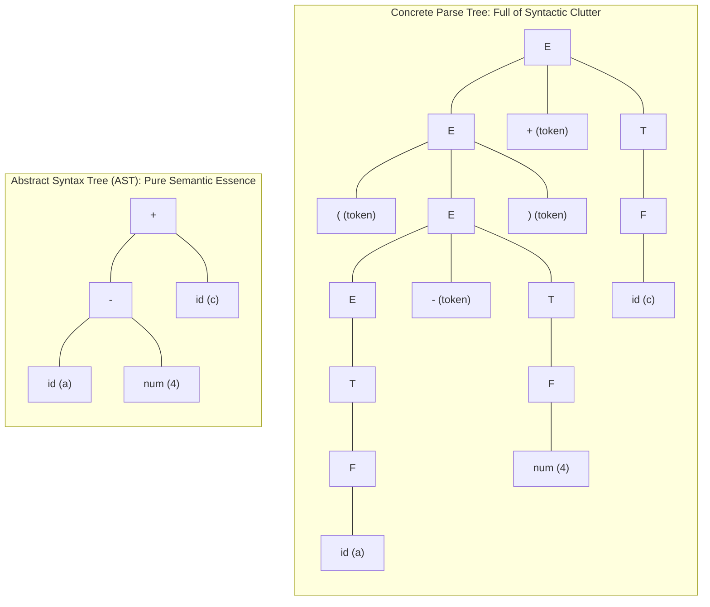
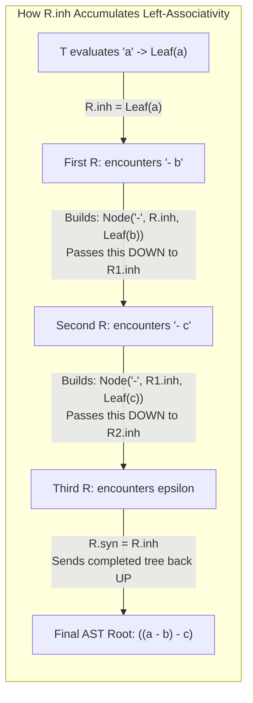

# Abstract Syntax Tree Construction with SDDs

> 📖 **Reading Order:** Step 4 of 55 | **Module 1:** Syntax-Directed Translation  
> ◄ **Previous:** [[S-Attributed and L-Attributed SDDs]] | ► **Next:** [[Eliminating Left Recursion from SDTs]]

---

---

---

---

---

## Starting Point and the Problem

To appreciate why Abstract Syntax Trees exist, you have to look at the sheer, ridiculous waste of a **Concrete Parse Tree**.

Suppose a programmer writes:
```c
( ( a - 4 ) ) + c
```

Look at what a concrete parser creates:
- For every pair of parentheses, it allocates three nodes: `(`, the inner expression `E`, and `)`.
- Because the grammar enforces precedence ($E \to T \to F \to \mathbf{id}$), it creates tall, skinny towers of single-child chain reductions: an `E` that only points to a `T`, which only points to an `F`, which only points to an `id`.
- The resulting tree has **15 to 20 nodes** in memory just to represent three variables and two operators!



### The AST Breakthrough:
An **Abstract Syntax Tree (AST)** strips away all punctuation, parentheses, and single-child chains. It stores **only the operators and operands**:
- **Interior Nodes:** Represent executable operations (e.g., `+`, `-`, `*`, `if`, `while`).
- **Leaf Nodes:** Represent pure operands (e.g., variables `a`, `c`, numbers `4`).
- **Parentheses vanish completely!** Why? Because the tree's physical hierarchy already encodes precedence and grouping without needing punctuation tokens!

---

---

---

---

---

## Developing the Idea

In a compiler's object model, AST nodes are created using object constructors:

1. **`new Leaf(tag, val)`:**
   - Creates a leaf node representing an operand.
   - For identifiers: `new Leaf(id, id.entry)` (stores pointer to symbol table entry).
   - For constants: `new Leaf(num, num.val)` (stores literal numeric value).
2. **`new Node(op, left, right)`:**
   - Creates an interior operator node labeled with `op` and attaches pointers to the `left` and `right` subtrees.

---

---

---

---

---

## Definition

**Abstract Syntax Tree Construction with SDDs** is a formal compiler mechanism that structures syntax-directed translation, intermediate representations, runtime environments, or code generation.

---

---

---

---

## How It Works

### How It Works

### How It Works

### How It Works

### S-Attributed SDD: Bottom-Up AST Construction

When parsing bottom-up (LR parser), constructing an AST is simple. Each non-terminal has a single synthesized attribute `.node` holding a pointer to its AST subtree:

### Productions and Rules:
| Production | Semantic Rule | Physical Action |
| :--- | :--- | :--- |
| $E \longrightarrow E_1 + T$ | $E.node = \text{new Node}('+', E_1.node, T.node)$ | Combines left and right subtrees under a `+` node. |
| $E \longrightarrow E_1 - T$ | $E.node = \text{new Node}('-', E_1.node, T.node)$ | Combines left and right subtrees under a `-` node. |
| $E \longrightarrow T$ | $E.node = T.node$ | Passes child pointer straight up (bypasses chain reduction!). |
| $T \longrightarrow ( E )$ | $T.node = E.node$ | **Punctuation Stripping:** Discards `(` and `)`, passes $E.node$ up! |
| $T \longrightarrow \mathbf{id}$ | $T.node = \text{new Leaf}(\mathbf{id}, \mathbf{id}.entry)$ | Allocates leaf operand. |
| $T \longrightarrow \mathbf{num}$ | $T.node = \text{new Leaf}(\mathbf{num}, \mathbf{num}.val)$ | Allocates leaf operand. |

### Step-by-Step Construction for `a - 4 + c`:
1. Lexer reads `a` $\implies p_1 = \text{Leaf}(\mathbf{id}, \text{'a'})$.
2. $T \to \mathbf{id} \implies T.node = p_1$.
3. $E \to T \implies E_1.node = p_1$.
4. Lexer reads `4` $\implies p_2 = \text{Leaf}(\mathbf{num}, 4)$.
5. $T \to \mathbf{num} \implies T.node = p_2$.
6. Reduction $E \to E_1 - T$ fires:
   $$p_3 = \text{Node}('-', p_1, p_2); \quad E.node = p_3$$
7. Lexer reads `c` $\implies p_4 = \text{Leaf}(\mathbf{id}, \text{'c'})$.
8. $T \to \mathbf{id} \implies T.node = p_4$.
9. Reduction $E \to E_1 + T$ fires:
   $$p_5 = \text{Node}('+', p_3, p_4); \quad E.node = p_5$$

The root pointer $p_5$ points to the completed, clean AST.

---
### The Mind-Bending Challenge: Top-Down L-Attributed AST Construction

Now, prepare for one of the most brilliant conceptual tricks in compiler design.

Suppose you are using a **Top-Down (LL(1) / Recursive-Descent) Parser**.
In an LL grammar, **immediate left recursion is forbidden**. You cannot use $E \to E + T$.
You are forced to transform the grammar into right-recursive form:
$$E \longrightarrow T \; R$$
$$R \longrightarrow + \; T \; R_1 \mid - \; T \; R_1 \mid \epsilon$$

### The Catastrophic Associativity Inversion:
Look at what right recursion does to the grammar tree for `a - b - c`:
In the grammar tree, $R$ recurses to the **RIGHT**:
$$E \implies T(a) \; R(- \; T(b) \; R(- \; T(c) \; \epsilon))$$

If you naively build the AST using synthesized attributes, the deeper right child will be constructed first:
$$\text{AST} = a - (b - c) = a - b + c \quad \text{\bf (COMPLETELY WRONG!)}$$
Subtraction is **left-associative** ($((a - b) - c)$). How on earth can a right-recursive top-down parser construct a left-associative tree?

---
### The Solution: The Accumulator Pattern (Inherited Attributes)

The compiler solves this using an **Accumulator Pattern** via inherited attribute $R.inh$:



### The Formal L-Attributed SDD:
| Production | Semantic Rules | The Deep Intuition |
| :--- | :--- | :--- |
| $E \longrightarrow T \; R$ | $R.inh = T.node$ <br/> $E.node = R.syn$ | $T$ builds the leftmost leaf (`a`). We drop it into $R$'s "accumulator bucket" ($R.inh$). When $R$ finishes, it returns the final tree via $R.syn$. |
| $R \longrightarrow - \; T \; R_1$ | $R_1.inh = \text{new Node}('-', R.inh, T.node)$ <br/> $R.syn = R_1.syn$ | **The Masterstroke:** We build a new `-` node whose **LEFT child is the accumulator** ($R.inh$) and whose right child is $T$! We pass this expanded tree down to $R_1.inh$! |
| $R \longrightarrow + \; T \; R_1$ | $R_1.inh = \text{new Node}('+', R.inh, T.node)$ <br/> $R.syn = R_1.syn$ | Same logic for addition. |
| $R \longrightarrow \epsilon$ | $R.syn = R.inh$ | When the input ends, the accumulator holds the finished tree! Hand it back up through $R.syn$. |

### Trace on Input `a - 4 + c`:
1. $T$ parses `a` $\implies T.node = p_1 = \text{Leaf}(\mathbf{id}, \text{'a'})$.
2. $E$ passes $p_1$ into $R$: $R.inh = p_1$.
3. $R$ matches `-`, $T$ parses `4` $\implies T.node = p_2 = \text{Leaf}(\mathbf{num}, 4)$.
4. Rule for $R \to - T R_1$ creates:
   $$p_3 = \text{new Node}('-', R.inh, p_2) = \text{new Node}('-', p_1, p_2)$$
   Notice: $p_1$ (`a`) is the **LEFT** child of `-`!
5. $R_1.inh$ receives $p_3$.
6. $R_1$ matches `+`, $T$ parses `c` $\implies T.node = p_4 = \text{Leaf}(\mathbf{id}, \text{'c'})$.
7. Rule for $R_1 \to + T R_2$ creates:
   $$p_5 = \text{new Node}('+', R_1.inh, p_4) = \text{new Node}('+', p_3, p_4)$$
   Notice: $p_3$ (`a - 4`) is the **LEFT** child of `+`!
8. $R_2$ matches $\epsilon$:
   $$R_2.syn = R_2.inh = p_5$$
9. Values propagate up: $R_1.syn = p_5 \implies R.syn = p_5 \implies E.node = p_5$.

The resulting tree is precisely:
$$((a - 4) + c)$$
Left-associativity is completely preserved despite using a right-recursive grammar!

---

---
### Technical Details

Target architecture and ABI specifications govern low-level alignment and register assignments.

---
### Important Properties and Why They Hold

- **Semantic Soundness:** Preserves program execution equivalence.
- **Algorithmic Efficiency:** Operates in low polynomial or linear time over the program structure.

---
### Related Concepts

- [[Syntax-Directed Definitions and Translation Schemes]]
- [[Intermediate Representations and Three-Address Code]]
- [[Basic Blocks and Control Flow Graphs]]

---
### Prerequisites

- [[Syntax-Directed Definitions and Translation Schemes]]

---
### Problems

- [[Problem — Desk Calculator SDD and Annotated Parse Tree]]
- [[Problem — Array Reference Three-Address Code Generation]]

---

---
### Technical Details

Target architecture and ABI specifications govern low-level alignment and register assignments.

---
### Important Properties and Why They Hold

- **Semantic Soundness:** Preserves program execution equivalence.
- **Algorithmic Efficiency:** Operates in low polynomial or linear time over the program structure.

---
### Related Concepts

- [[Syntax-Directed Definitions and Translation Schemes]]
- [[Intermediate Representations and Three-Address Code]]
- [[Basic Blocks and Control Flow Graphs]]

---
### Prerequisites

- [[Syntax-Directed Definitions and Translation Schemes]]

---
### Problems

- [[Problem — Desk Calculator SDD and Annotated Parse Tree]]
- [[Problem — Array Reference Three-Address Code Generation]]

---

---
### Technical Details

Target architecture and ABI specifications govern low-level alignment and register assignments.

---
### Important Properties and Why They Hold

- **Semantic Soundness:** Preserves program execution equivalence.
- **Algorithmic Efficiency:** Operates in low polynomial or linear time over the program structure.

---
### Related Concepts

- [[Syntax-Directed Definitions and Translation Schemes]]
- [[Intermediate Representations and Three-Address Code]]
- [[Basic Blocks and Control Flow Graphs]]

---
### Prerequisites

- [[Syntax-Directed Definitions and Translation Schemes]]

---
### Problems

- [[Problem — Desk Calculator SDD and Annotated Parse Tree]]
- [[Problem — Array Reference Three-Address Code Generation]]

---

---

## Example

Detailed walkthroughs and traces are provided in the corresponding example and problem notes.

---

## Technical Details

Target architecture and ABI specifications govern low-level alignment and register assignments.

---

## Important Properties and Why They Hold

- **Semantic Soundness:** Preserves program execution equivalence.
- **Algorithmic Efficiency:** Operates in low polynomial or linear time over the program structure.

---

## Common Mistakes

### Common Mistakes

### Common Mistakes

### Common Mistakes

- Confusing syntactic validity with semantic correctness.
- Overlooking variable scoping or memory aliasing side effects.

---

---

---

---

## Exam Relevance

### Example

Detailed walkthroughs and traces are provided in the corresponding example and problem notes.

---
### Exam Relevance

### Example

Detailed walkthroughs and traces are provided in the corresponding example and problem notes.

---
### Exam Relevance

### Example

Detailed walkthroughs and traces are provided in the corresponding example and problem notes.

---
### Exam Relevance

Tested regularly in compiler examinations via syntax-directed translation proofs, activation record diagrams, and control flow optimization problems.

---

---

---

---

## Related Concepts

- [[Syntax-Directed Definitions and Translation Schemes]]
- [[Intermediate Representations and Three-Address Code]]
- [[Basic Blocks and Control Flow Graphs]]

---

## Prerequisites

- [[Syntax-Directed Definitions and Translation Schemes]]

---

## Problems

- [[Problem — Desk Calculator SDD and Annotated Parse Tree]]
- [[Problem — Array Reference Three-Address Code Generation]]

---

## Sources

- **Lecture Slides:** [[cse309/01 - Sources/Lectures/KMS Merged.pdf|KMS Merged.pdf]], Chapter 5 (Slides 41–47).
- **Textbook:** Aho, Lam, Sethi, Ullman, *Compilers: Principles, Techniques, & Tools* (2nd Ed.), Section 5.3.
