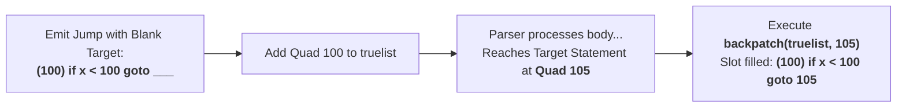

# Backpatching in Intermediate Code Generation

> 📖 **Reading Order:** Step 16 of 55 | **Module 2: Intermediate Code Generation**  
> ◄ **Previous:** [[Control Flow Translation and Boolean Expressions]] | ► **Next:** [[Backpatching Control-Flow Code Generation Algorithm]]

---

## Starting Point and the Problem

Compilers require formal semantic translations to bridge the gap between abstract syntax trees and concrete target machine instructions.

---

## Developing the Idea

**Backpatching** is the foundational technique that resolves forward jumps in a single pass without multi-pass tree traversals:

1. **Emit with Unfilled Slots:** Whenever a branch instruction (conditional or unconditional) must be emitted to a target that is not yet known, the compiler emits the instruction with its target field left **blank** (or placeholder $0$):
   $$\mathbf{(100) \quad if \; x < 100 \; goto \; \underline{\quad\quad}}$$
2. **Track in Lists:** The instruction index (quad $100$) is added to a list of incomplete jumps (`truelist` or `falselist`).
3. **Resolve upon Discovery:** As soon as the parser reaches the actual destination instruction in the source stream (say, at instruction index $105$), the compiler executes a **backpatch operation**: it iterates through the list and fills in the blank slot:
   $$\mathbf{(100) \quad if \; x < 100 \; goto \; 105}$$



---

## Definition

**Backpatching in Intermediate Code Generation** is a formal compiler mechanism that structures syntax-directed translation, intermediate representations, runtime environments, or code generation.

---

## How It Works

### The Three Synthesized Attributes

Unlike the inherited label scheme described in [[Control Flow Translation and Boolean Expressions]], Backpatching operates **strictly using Synthesized Attributes**. Because information flows exclusively from children to parents, backpatching integrates seamlessly with standard bottom-up shift-reduce LR parsers (Yacc, Bison).

| Synthesized Attribute | Definition | Physical Role |
| :--- | :--- | :--- |
| `B.truelist` | A list of instruction indices (quads) | Jump instructions that must transfer control to the target when boolean expression $B$ evaluates to **true**. |
| `B.falselist` | A list of instruction indices (quads) | Jump instructions that must transfer control to the target when boolean expression $B$ evaluates to **false**. |
| `S.nextlist` | A list of instruction indices (quads) | Jump instructions that must transfer control to the statement immediately following statement $S$. |

---

### The Three Fundamental List Operations

The compiler maintains linked lists of instruction indices using three primitive operations:

1. **`makelist(i)`:**
   - Creates a new linked list containing exactly one instruction index: $[i]$.
   - Returns a pointer to this list.
   - Cost: $O(1)$.
2. **`merge(p1, p2)`:**
   - Concatenates the lists pointed to by $p_1$ and $p_2$.
   - Returns a pointer to the combined list.
   - Cost: $O(1)$ by maintaining pointers to both head and tail of each linked list.
3. **`backpatch(p, i)`:**
   - Traverses the entire linked list pointed to by $p$.
   - For every instruction index $k$ in the list, writes integer $i$ into the destination address field of intermediate instruction array `quad[k]`.
   - Cost: $O(|p|)$ where $|p|$ is the number of patched jumps.

> [!TIP] The In-Place Silicon Implementation
> How did early compilers implement backpatch lists without allocating heap memory? They used the uncompleted target fields in the instruction array itself as the linked list pointers!
> If instructions $100, 104, 108$ are all on `truelist`, `quad[108].target` holds $104$, and `quad[104].target` holds $100$. Backpatching simply walked this chain through the instruction memory!

---

### Marker Non-Terminals: Capturing Real-Time Instruction Indices

Because code emission happens in real time, the compiler must record the instruction index where a new sub-clause begins *before* the sub-clause is parsed.

This is accomplished by inserting **Marker Non-Terminals** into the context-free grammar:

### 5.1 The Address Marker $M$
$$M \longrightarrow \epsilon \quad \{ M.quad = nextquad; \}$$
- `nextquad` is the global counter indicating the index of the next instruction about to be generated.
- The $\epsilon$-reduction of $M$ snapshots the current instruction counter into synthesized attribute $M.quad$.
- In an LR parser, $M$ reduces the exact instant all preceding tokens have been consumed and before the succeeding tokens are shifted.

### 5.2 The Unconditional Jump Marker $N$
$$N \longrightarrow \epsilon \quad \{ N.nextlist = \text{makelist}(nextquad); \; \text{emit}(\text{'goto _'}); \}$$
- Used in `if-then-else` constructs.
- Emits an unconditional jump over the `else` block with an unfulfilled target, and packages that instruction index into `N.nextlist` so it can be merged with the statement exit list.

---

### Architectural Comparison: Multi-Pass vs. One-Pass Backpatching

| Dimension | Multi-Pass (Inherited Labels) | One-Pass Backpatching |
| :--- | :--- | :--- |
| **Parsing Model** | Requires tree-building and top-down attribute flow | Operates purely bottom-up with synthesized attributes |
| **Yacc/Bison Integration** | Complex; needs global state or stack manipulation | **Native fit**; standard semantic actions `\$\$.truelist` |
| **Memory Requirement** | $O(\text{Program AST Size})$ in RAM | **$O(1)$ tree memory**; streams instructions linearly |
| **Instruction Output** | Emits symbolic labels (`L1:`, `L2:`) requiring an assembler pass | Emits direct numeric instruction indices (`quads`) |

---

## Example

Detailed walkthroughs and traces are provided in the corresponding example and problem notes.

---

## Technical Details

Target architecture and ABI specifications govern low-level alignment and register assignments.

---

## Important Properties and Why They Hold

- **Semantic Soundness:** Preserves program execution equivalence.
- **Algorithmic Efficiency:** Operates in low polynomial or linear time over the program structure.

---

## Common Mistakes

- Confusing syntactic validity with semantic correctness.
- Overlooking variable scoping or memory aliasing side effects.

---

## Exam Relevance

Tested regularly in compiler examinations via syntax-directed translation proofs, activation record diagrams, and control flow optimization problems.

---

## Related Concepts

- [[Backpatching Control-Flow Code Generation Algorithm]]
- [[Control Flow Translation and Boolean Expressions]]

---

## Prerequisites

- [[Control Flow Translation and Boolean Expressions]]

---

## Problems

- [[Problem — Backpatching Boolean Expression Translation]]

---

## Sources

In the early decades of computing (such as on the PDP-11 with 64 kilobytes of main memory) and continuing into modern ultra-fast Just-In-Time (JIT) compilers (like Google V8, LuaJIT, or WebAssembly baselines), memory is precious and throughput is paramount:
- A multi-pass compiler builds a giant Abstract Syntax Tree (AST) of the entire program in RAM, runs multiple analysis passes, and then decorates nodes with target labels.
- In contrast, a **single-pass compiler** reads source tokens, parses them, and streams intermediate instructions directly into a flat code array or disk buffer in real time—retaining almost zero tree state in RAM.

However, a single-pass compiler encounters a seemingly fatal roadblock when generating conditional branches: **The Forward-Reference Problem**.

Consider the simple construct:
```c
if (x < 100 || x > 200) {
    y = 1;
} else {
    y = 2;
}
```
Trace what happens as the parser scans left-to-right:
1. It sees `if x < 100`. If this is true, the CPU must jump to the `then` block (`y = 1`). But at this instant, the instruction address where `y = 1` will be placed **does not exist yet**!
2. If `x < 100` is false, it must jump to test `x > 200`.
3. If `x > 200` is false, it must jump to the `else` block (`y = 2`). Again, that instruction address is completely unknown!
4. At the end of the `then` block, the CPU must execute an unconditional jump bypassing the `else` block to reach the statement following the construct. That exit address is also unknown!

How can a single-pass compiler emit a branch instruction when it has no idea where that branch will lead?

---

- **Lecture Slides:** [[cse309/01 - Sources/Lectures/KMS Merged.pdf|KMS Merged.pdf]], Chapter 6 (Slides 186–193).
- **Textbook:** Aho, Lam, Sethi, Ullman, *Compilers: Principles, Techniques, & Tools* (2nd Ed.), Section 6.7 (Backpatching).
