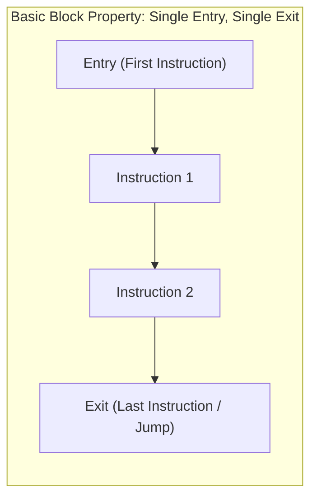
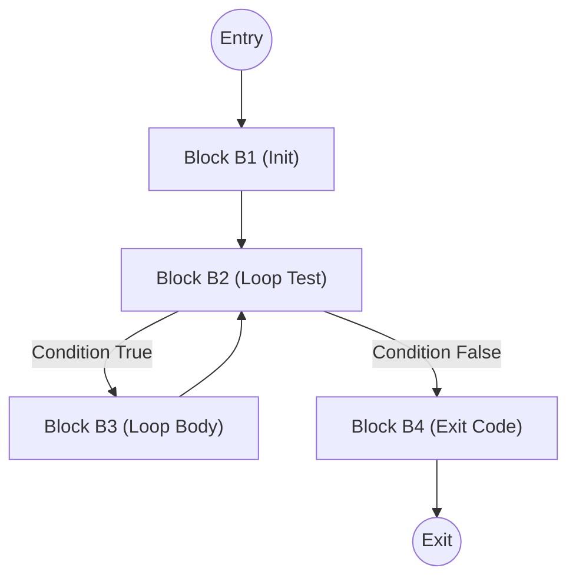
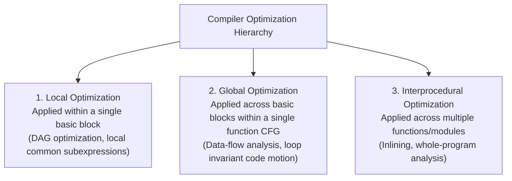

# Basic Blocks and Control Flow Graphs

> 📖 **Reading Order:** Step 33 of 55 | **Module 4:** Code Generation  
> ◄ **Previous:** [[Code Generation Issues and Target Machine Architecture]] | ► **Next:** [[Basic Block Partitioning Algorithm]]

---

---

---

---

---

## Starting Point and the Problem

Optimizing an entire program all at once is computationally intractable. Compilers therefore partition intermediate code into discrete, straight-line units of execution called **Basic Blocks**.

### Formal Definition:
A **Basic Block** is a maximal sequence of consecutive Three-Address Code instructions such that:
1. Control enters the block **only at the first instruction** (no branch jumps into the middle of the block).
2. Control leaves the block **only at the last instruction** (no branch instructions appear in the middle of the block, except possibly at the end).

### Golden Invariant:
If the first instruction of a basic block executes, **every instruction in that basic block will execute in order**, without any branches or halt points in between.

---

---

---

---

---

## Developing the Idea

Once a program's Three-Address Code is partitioned into basic blocks $B_1, B_2, \dots, B_k$, the compiler connects them into a directed graph called a **Control Flow Graph (CFG)**:
- **Nodes:** The basic blocks.
- **Directed Edges:** $B_i \longrightarrow B_j$ indicates that control can transfer immediately from the end of block $B_i$ to the beginning of block $B_j$.

### Edge Construction Rules:
There is a directed edge from $B_i$ to $B_j$ if and only if:
1. There is a conditional or unconditional branch from the last statement of $B_i$ to the first statement of $B_j$.
2. $B_j$ physically immediately succeeds $B_i$ in the original instruction sequence, and $B_i$ does not end with an unconditional jump (`goto`).

---

---

---

---

---

## Definition

**Basic Blocks and Control Flow Graphs** is a formal compiler mechanism that structures syntax-directed translation, intermediate representations, runtime environments, or code generation.

---

---

---

---

## How It Works

### How It Works

### How It Works

### How It Works

### Predecessors and Successors

In a CFG:
- **Predecessors of $B$ ($\text{Pred}(B)$):** All blocks that have an outgoing edge pointing directly into $B$.
- **Successors of $B$ ($\text{Succ}(B)$):** All blocks that can be reached directly via an outgoing edge from $B$.

---
### Loops in Control Flow Graphs

Loops are the most critical regions for compiler optimization because programs spend an estimated $90\%$ of execution time executing loops (the *90/10 Rule*).

### What Constitutes a Loop in a CFG?
A set of basic blocks $L$ forms a **loop** if:
1. It is **strongly connected**: for every pair of nodes $u, v \in L$, there exists a directed path from $u$ to $v$ and from $v$ to $u$.
2. It has a **unique entry node (Loop Header)**: the only edges entering nodes in $L$ from outside the loop point directly into the header node.
3. Every node in $L$ is reachable from the loop header.

---
### Scope of Compiler Optimizations

Partitioning a program into basic blocks and CFGs establishes a three-tiered hierarchy of compiler optimizations:

---

---
### Technical Details

Target architecture and ABI specifications govern low-level alignment and register assignments.

---
### Important Properties and Why They Hold

- **Semantic Soundness:** Preserves program execution equivalence.
- **Algorithmic Efficiency:** Operates in low polynomial or linear time over the program structure.

---
### Related Concepts

- [[Syntax-Directed Definitions and Translation Schemes]]
- [[Intermediate Representations and Three-Address Code]]
- [[Basic Blocks and Control Flow Graphs]]

---
### Prerequisites

- [[Syntax-Directed Definitions and Translation Schemes]]

---
### Problems

- [[Problem — Desk Calculator SDD and Annotated Parse Tree]]
- [[Problem — Array Reference Three-Address Code Generation]]

---

---
### Technical Details

Target architecture and ABI specifications govern low-level alignment and register assignments.

---
### Important Properties and Why They Hold

- **Semantic Soundness:** Preserves program execution equivalence.
- **Algorithmic Efficiency:** Operates in low polynomial or linear time over the program structure.

---
### Related Concepts

- [[Syntax-Directed Definitions and Translation Schemes]]
- [[Intermediate Representations and Three-Address Code]]
- [[Basic Blocks and Control Flow Graphs]]

---
### Prerequisites

- [[Syntax-Directed Definitions and Translation Schemes]]

---
### Problems

- [[Problem — Desk Calculator SDD and Annotated Parse Tree]]
- [[Problem — Array Reference Three-Address Code Generation]]

---

---
### Technical Details

Target architecture and ABI specifications govern low-level alignment and register assignments.

---
### Important Properties and Why They Hold

- **Semantic Soundness:** Preserves program execution equivalence.
- **Algorithmic Efficiency:** Operates in low polynomial or linear time over the program structure.

---
### Related Concepts

- [[Syntax-Directed Definitions and Translation Schemes]]
- [[Intermediate Representations and Three-Address Code]]
- [[Basic Blocks and Control Flow Graphs]]

---
### Prerequisites

- [[Syntax-Directed Definitions and Translation Schemes]]

---
### Problems

- [[Problem — Desk Calculator SDD and Annotated Parse Tree]]
- [[Problem — Array Reference Three-Address Code Generation]]

---

---

## Example

Detailed walkthroughs and traces are provided in the corresponding example and problem notes.

---

## Technical Details

Target architecture and ABI specifications govern low-level alignment and register assignments.

---

## Important Properties and Why They Hold

- **Semantic Soundness:** Preserves program execution equivalence.
- **Algorithmic Efficiency:** Operates in low polynomial or linear time over the program structure.

---

## Common Mistakes

### Common Mistakes

### Common Mistakes

### Common Mistakes

- Confusing syntactic validity with semantic correctness.
- Overlooking variable scoping or memory aliasing side effects.

---

---

---

---

## Exam Relevance

### Example

Detailed walkthroughs and traces are provided in the corresponding example and problem notes.

---
### Exam Relevance

### Example

Detailed walkthroughs and traces are provided in the corresponding example and problem notes.

---
### Exam Relevance

### Example

Detailed walkthroughs and traces are provided in the corresponding example and problem notes.

---
### Exam Relevance

Tested regularly in compiler examinations via syntax-directed translation proofs, activation record diagrams, and control flow optimization problems.

---

---

---

---

## Related Concepts

- [[Syntax-Directed Definitions and Translation Schemes]]
- [[Intermediate Representations and Three-Address Code]]
- [[Basic Blocks and Control Flow Graphs]]

---

## Prerequisites

- [[Syntax-Directed Definitions and Translation Schemes]]

---

## Problems

- [[Problem — Desk Calculator SDD and Annotated Parse Tree]]
- [[Problem — Array Reference Three-Address Code Generation]]

---

## Sources

- **Lecture Slides:** [[cse309/01 - Sources/Lectures/KMS Merged.pdf|KMS Merged.pdf]], Chapter 8 (Slides 322–331).
- **Textbook:** Aho, Lam, Sethi, Ullman, *Compilers: Principles, Techniques, & Tools* (2nd Ed.), Section 8.4.
