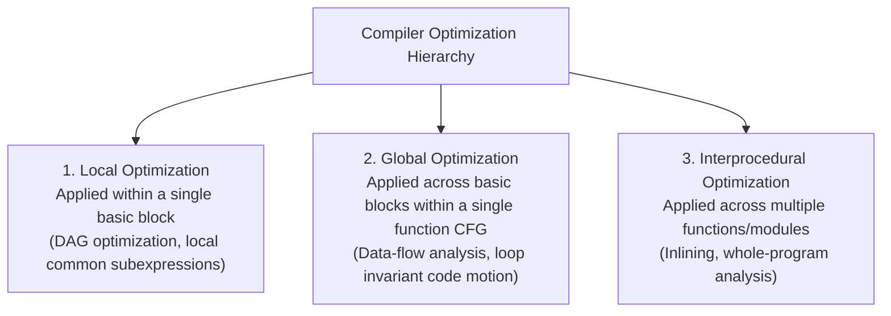

# Basic Blocks and Control Flow Graphs

> 📖 **Reading Order:** Step 33 of 55 | **Module 4:** Code Generation  
> ◄ **Previous:** [[Code Generation Issues and Target Machine Architecture]] | ► **Next:** [[Basic Block Partitioning Algorithm]]

---

## Building the idea

A **basic block** is a maximal straight-line sequence with entry at its first instruction and transfers of control only at its end in the IR model. Inside that sequence, normal execution order is predictable; between sequences, branches create alternatives.

A **control-flow graph (CFG)** makes each block a node and each possible direct transfer an edge. A conditional branch can have a target edge and a fall-through edge. An unconditional jump has its target edge; a return has no ordinary successor in the same function.

[[Intermediate Representations and Three-Address Code]] lists instructions, while the CFG reveals which execution paths connect them. That distinction is essential for deciding whether a value computed earlier is actually available on every route to a later use.

Loops create repeated paths and opportunities for optimization, but not every cycle is a single-entry natural loop. A loop header dominating a back-edge tail gives the conventional natural-loop construction; irreducible control flow needs separate handling.

## How It Works

### Predecessors and Successors

In a CFG:
- **Predecessors of $B$ ($\text{Pred}(B)$):** All blocks that have an outgoing edge pointing directly into $B$.
- **Successors of $B$ ($\text{Succ}(B)$):** All blocks that can be reached directly via an outgoing edge from $B$.

---
### Loops in Control Flow Graphs

Repeated execution can make loops important optimization targets. Actual time concentration depends on the workload, so profile data is preferable to a universal percentage.

### What Constitutes a Loop in a CFG?
A set of basic blocks $L$ forms a **loop** if:
1. It is **strongly connected**: for every pair of nodes $u, v \in L$, there exists a directed path from $u$ to $v$ and from $v$ to $u$.
2. It has a **unique entry node (Loop Header)**: the only edges entering nodes in $L$ from outside the loop point directly into the header node.
3. Every node in $L$ is reachable from the loop header.

---
### Scope of Compiler Optimizations

Partitioning a program into basic blocks and CFGs establishes a three-tiered hierarchy of compiler optimizations:

---

## What to carry forward

[[Basic Block Partitioning Algorithm]] finds the boundaries. [[Global Common Subexpression Elimination and Copy Propagation]] uses multiple predecessor paths, extending the simpler reasoning available inside one block.

## Related notes

- [[Intermediate Representations and Three-Address Code]]
- [[Basic Block Partitioning Algorithm]]
- [[Global Common Subexpression Elimination and Copy Propagation]]

## Sources

- **Lecture Slides:** [[cse309/01 - Sources/Lectures/KMS Merged.pdf|KMS Merged.pdf]], Chapter 8 (Slides 322–331).
- **Textbook:** Aho, Lam, Sethi, Ullman, *Compilers: Principles, Techniques, & Tools* (2nd Ed.), Section 8.4.
