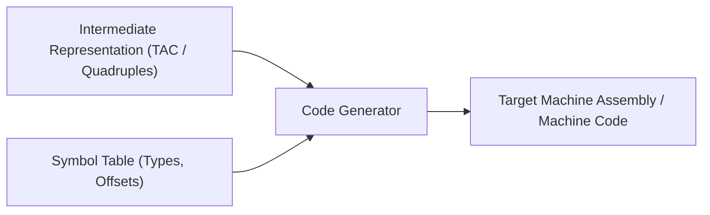
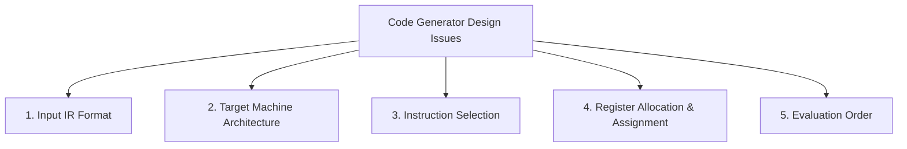

# Code Generation Issues and Target Machine Architecture

> 📖 **Reading Order:** Step 32 of 55 | **Module 4: Code Generation**  
> ◄ **Previous:** [[Problem — Activation Record and Display Table Tracing]] | ► **Next:** [[Basic Blocks and Control Flow Graphs]]

---

## Starting Point and the Problem

The final phase in a compiler is the **Code Generator**. It takes as input the optimized intermediate representation (Three-Address Code, AST, or DAG) along with symbol table information, and maps it into semantically equivalent, efficient **target machine code** (assembly or machine code).

---

## Developing the Idea

Generating optimal code is mathematically **undecidable** in the general case and **NP-complete** for most practical sub-problems. Code generators therefore rely on carefully designed heuristics to balance five fundamental issues:

### 1. Input to the Code Generator
The input IR must be type-checked and syntactically validated. The code generator assumes the IR is correct and free of syntactic/semantic errors.

### 2. Target Machine Architecture
The instruction-set architecture (ISA) dictates the difficulty of code generation:
- **RISC (Reduced Instruction Set Computer):** Fixed-length instructions, load-store architecture (arithmetic operates exclusively on registers), large uniform register set. Easier for compiler code generation.
- **CISC (Complex Instruction Set Computer, e.g., x86):** Variable-length instructions, two-address instructions, memory-to-register arithmetic, specialized registers with non-uniform constraints (e.g., `%eax` for multiplication/division).

### 3. Instruction Selection
Choosing the best machine instruction sequence to implement each IR statement.
- *Example:* For $x = x + 1$:
  - Option A: `LD R0, x; ADD R0, R0, #1; ST x, R0` (Cost: 3)
  - Option B: `INC x` (Cost: 1)
Poor instruction selection produces bloated, slow binaries.

### 4. Register Allocation and Assignment
Registers are the fastest storage units in a computer (sub-nanosecond access). 
- **Register Allocation:** Deciding *which values* should reside in registers at each program point.
- **Register Assignment:** Deciding *which specific physical register* (e.g., `R0` vs. `R1`) each variable will occupy.
- Because hardware registers are strictly limited, excess variables must be spilled to RAM.

### 5. Evaluation Order
The order in which independent computations are executed significantly affects register pressure. Evaluating expressions in one order may require 2 registers, whereas evaluating in another order may require 4 registers!

---

## Definition

**Code Generation Issues and Target Machine Architecture** is a formal compiler mechanism that structures syntax-directed translation, intermediate representations, runtime environments, or code generation.

---

## How It Works

### A Simple Target Machine Model

To study code generation algorithms rigorously, the Dragon Book and BUET syllabus define a representative RISC-like target machine model:

### Memory and Registers:
- $n$ general-purpose hardware registers: $R_0, R_1, \dots, R_{n-1}$.
- Word-addressable memory.

### Instruction Set:
1. **Load:** `LD r, x` ($r = \text{contents of memory location } x$).
2. **Store:** `ST x, r` ($\text{memory location } x = r$).
3. **Arithmetic / Logic:** `ADD r1, r2, r3` ($r1 = r2 + r3$) or two-address format: `ADD r1, r2` ($r1 = r1 + r2$).
4. **Immediate Arithmetic:** `ADD r, r, #c` ($r = r + c$).
5. **Conditional Branch:** `Bcond r, L` (e.g., `BLTZ r, L` branches to label $L$ if $r < 0$).
6. **Unconditional Branch:** `BR L` (jumps to label $L$).

### Addressing Modes and Instruction Costs:
The compiler uses an **Instruction Cost Model**:
$$\text{Cost} = 1 + \sum (\text{Cost of Addressing Modes})$$

| Mode | Format | Address Computation | Mode Cost | Total Instruction Cost |
| :--- | :--- | :--- | :---: | :---: |
| **Register** | `R` | Operand is in register $R$ | $0$ | `ADD R0, R1` $\to$ **1** |
| **Immediate** | `#c` | Operand is constant literal $c$ | $1$ | `LD R0, #100` $\to$ **2** |
| **Direct Memory** | `M` | Operand is in memory address $M$ | $1$ | `LD R0, x` $\to$ **2** |
| **Indexed** | `c(R)` | $\text{Address} = c + \text{contents}(R)$ | $1$ | `LD R0, 4(R1)` $\to$ **2** |
| **Indirect** | `*R` | $\text{Address} = \text{contents}(R)$ | $0$ | `LD R0, *R1` $\to$ **1** |

---

## Example

Detailed walkthroughs and traces are provided in the corresponding example and problem notes.

---

## Technical Details

Target architecture and ABI specifications govern low-level alignment and register assignments.

---

## Important Properties and Why They Hold

- **Semantic Soundness:** Preserves program execution equivalence.
- **Algorithmic Efficiency:** Operates in low polynomial or linear time over the program structure.

---

## Common Mistakes

- Confusing syntactic validity with semantic correctness.
- Overlooking variable scoping or memory aliasing side effects.

---

## Exam Relevance

Tested regularly in compiler examinations via syntax-directed translation proofs, activation record diagrams, and control flow optimization problems.

---

## Related Concepts

- [[Basic Blocks and Control Flow Graphs]]
- [[A Simple Code Generator Algorithm]]
- [[Peephole Optimization Techniques]]

---

## Prerequisites

- [[Intermediate Representations and Three-Address Code]]

---

## Problems

- [[Problem — Basic Block Partitioning and Next-Use Table]]

---

## Sources

- **Lecture Slides:** [[cse309/01 - Sources/Lectures/KMS Merged.pdf|KMS Merged.pdf]], Chapter 8 (Slides 296–321).
- **Textbook:** Aho, Lam, Sethi, Ullman, *Compilers: Principles, Techniques, & Tools* (2nd Ed.), Section 8.1 & 8.2.
