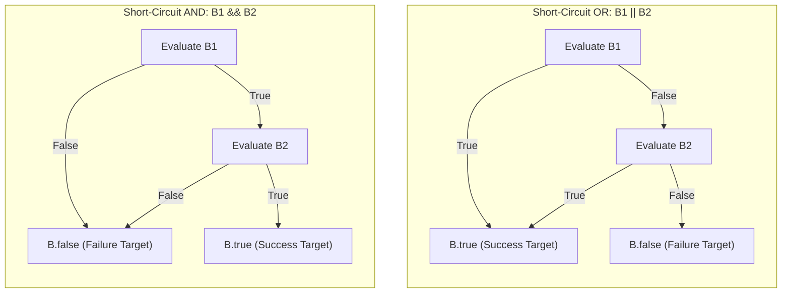
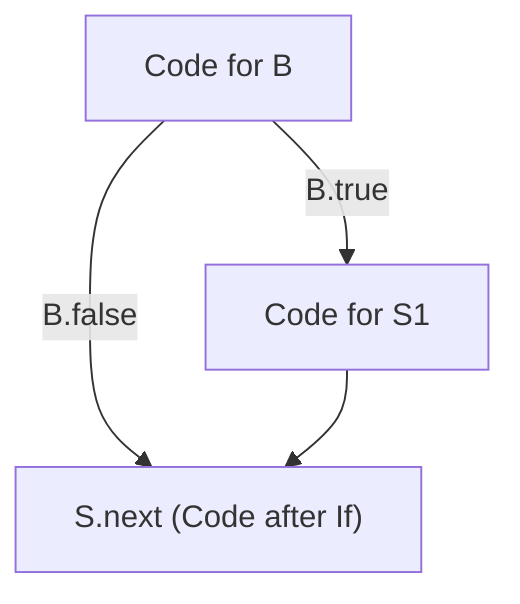
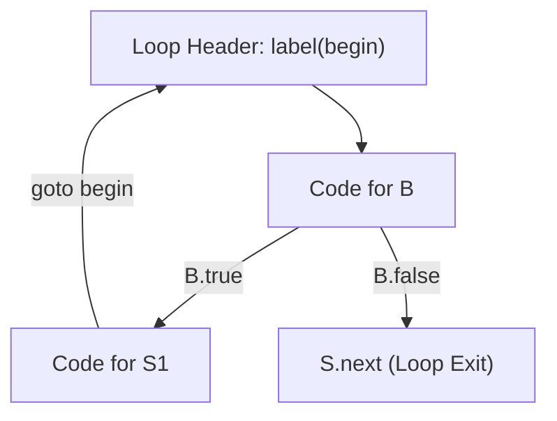

# Control Flow Translation and Boolean Expressions

> 📖 **Reading Order:** Step 15 of 55 | **Module 2: Intermediate Code Generation**  
> ◄ **Previous:** [[Translation of Expressions and Array References]] | ► **Next:** [[Backpatching in Intermediate Code Generation]]

---

## Starting Point and the Problem

In high-level languages, boolean expressions have two completely distinct runtime objectives:
1. **Value Materialization:** Computing a mathematical truth value ($1$ for true, $0$ for false) to store into a variable:
   ```c
   bool flag = (x < y) && (z > 0);
   ```
2. **Flow-of-Control Branching:** Guiding the CPU instruction pointer through conditional statements:
   ```c
   if (p != NULL && p->val > 0) { ... }
   ```

### Why Naive Value Materialization is Disastrous in Control Flow
Consider what happens if a compiler translates `if (p != NULL && p->val > 0)` by computing a boolean value in a register:
1. It computes `t1 = (p != NULL)` ($1$ or $0$).
2. It computes `t2 = (p->val > 0)` ($1$ or $0$).
3. It computes `t3 = t1 & t2`.
4. It checks `if t3 == 1 goto ThenBlock`.

If `p` is `NULL`, Step 2 attempts to dereference `p->val` at memory address `0x00000000`, instantly crashing the operating system process with a Segmentation Fault (`SIGSEGV`)!

Furthermore, burning ALU instructions to compute $0$ or $1$ into a temporary register, only to immediately compare that register against zero to branch, wastes precious CPU clock cycles and pipeline slots.

Modern optimizing compilers solve both safety and performance problems by translating boolean expressions into **Jumping Code (Short-Circuit Evaluation)**. The evaluation branches directly to target labels the exact instant a condition is confirmed true or false!

---

## Developing the Idea

In C, C++, Java, and Python:
- **In $B_1 \text{ || } B_2$:** If $B_1$ evaluates to `true`, the overall truth value is guaranteed to be `true`. **$B_2$ is never executed.**
- **In $B_1 \text{ \&\& } B_2$:** If $B_1$ evaluates to `false`, the overall truth value is guaranteed to be `false`. **$B_2$ is never executed.**



---

## Definition

**Control Flow Translation and Boolean Expressions** is a formal compiler mechanism that structures syntax-directed translation, intermediate representations, runtime environments, or code generation.

---

## How It Works

### Why Inherited Attributes Are Mandatory for Boolean Expressions

Notice an essential structural fact:
- The subexpression `x < 10` has no idea where it should jump when it succeeds or fails!
- If it appears in `if (x < 10) S1`, it must jump to `S1` on true, and past `S1` on false.
- If it appears in `while (x < 10) S1`, it must jump to `S1` on true, and to the loop exit on false.
- If it appears inside `if (!(x < 10))`, its true and false destinations are inverted!

Because target destinations are determined strictly by the **enclosing context**, boolean non-terminals $B$ must receive their destinations via **Inherited Attributes**:
- `B.true`: The label to branch to if $B$ evaluates to true.
- `B.false`: The label to branch to if $B$ evaluates to false.

Similarly, statement non-terminals $S$ require:
- `S.next`: The label of the instruction immediately following the execution of statement $S$.

---

### Formal SDD for Flow-of-Control Statements

### Helper Functions:
- `newlabel()`: Allocates and returns a fresh assembly jump label (`L1`, `L2`, $\dots$).
- `label(L)`: Emits a label definition `L:` into the instruction stream.
- `||`: Denotes string concatenation of generated intermediate code chunks.

---

### 4.1 If-Then Statement: $S \longrightarrow \mathbf{if} \; ( B ) \; S_1$



#### Semantic Rules:
```
B.true  = newlabel()
B.false = S.next
S1.next = S.next
S.code  = B.code || label(B.true) || S1.code
```
- **Intuition:** If $B$ is true, jump to `B.true`, which begins `S1`. If $B$ is false, jump directly to `S.next` (bypassing `S1` entirely).

---

### 4.2 If-Then-Else Statement: $S \longrightarrow \mathbf{if} \; ( B ) \; S_1 \; \mathbf{else} \; S_2$

#### Semantic Rules:
```
B.true  = newlabel()
B.false = newlabel()
S1.next = S.next
S2.next = S.next
S.code  = B.code 
         || label(B.true)  || S1.code || gen('goto ' S.next) 
         || label(B.false) || S2.code
```
- **Intuition:** Notice the critical unconditional jump `goto S.next` appended after `S1.code`! Without this jump, the CPU would fall through into `S2.code` and execute both branches!

---

### 4.3 While Loop: $S \longrightarrow \mathbf{while} \; ( B ) \; S_1$



#### Semantic Rules:
```
begin   = newlabel()
B.true  = newlabel()
B.false = S.next
S1.next = begin
S.code  = label(begin) 
         || B.code 
         || label(B.true) || S1.code || gen('goto ' begin)
```
- **Intuition:** Every iteration starts at `begin`. $B$ is tested; if true, `S1` executes and unconditionally loops back to `begin`. If false, control exits immediately to `S.next`.

---

### Formal SDD for Boolean Expressions

Now let us define how inherited exit labels flow downwards through logical operators:

### 5.1 Relational Expression: $B \longrightarrow E_1 \text{ relop } E_2$
```
B.code = gen('if ' E1.addr relop.op E2.addr ' goto ' B.true)
         || gen('goto ' B.false)
```

### 5.2 Logical OR: $B \longrightarrow B_1 \text{ || } B_2$
```
B1.true  = B.true          /* Short-circuit: If B1 is true, entire OR is true! */
B1.false = newlabel()      /* If B1 is false, fall through to test B2 */
B2.true  = B.true          /* If B2 is true, entire OR is true */
B2.false = B.false         /* If B2 is false, entire OR is false */
B.code   = B1.code || label(B1.false) || B2.code
```

### 5.3 Logical AND: $B \longrightarrow B_1 \text{ \&\& } B_2$
```
B1.true  = newlabel()      /* If B1 is true, proceed to test B2 */
B1.false = B.false         /* Short-circuit: If B1 is false, entire AND fails! */
B2.true  = B.true          /* If B2 is true, entire AND succeeds */
B2.false = B.false         /* If B2 is false, entire AND fails */
B.code   = B1.code || label(B1.true) || B2.code
```

### 5.4 Logical NOT: $B \longrightarrow ! B_1$
```
B1.true  = B.false         /* Swap destination labels */
B1.false = B.true
B.code   = B1.code
```
> [!TIP] The Zero-Instruction Inversion
> Look at the rule for `! B1`: **Zero instructions are emitted!** Inverting a boolean condition simply swaps the destination labels `B1.true` and `B1.false`. It incurs zero runtime cost.

---

## Example

Detailed walkthroughs and traces are provided in the corresponding example and problem notes.

---

## Technical Details

Target architecture and ABI specifications govern low-level alignment and register assignments.

---

## Important Properties and Why They Hold

- **Semantic Soundness:** Preserves program execution equivalence.
- **Algorithmic Efficiency:** Operates in low polynomial or linear time over the program structure.

---

## Common Mistakes

- Confusing syntactic validity with semantic correctness.
- Overlooking variable scoping or memory aliasing side effects.

---

## Exam Relevance

Tested regularly in compiler examinations via syntax-directed translation proofs, activation record diagrams, and control flow optimization problems.

---

## Related Concepts

- [[Backpatching in Intermediate Code Generation]]
- [[Basic Blocks and Control Flow Graphs]]

---

## Prerequisites

- [[Intermediate Representations and Three-Address Code]]

---

## Problems

- [[Problem — Backpatching Boolean Expression Translation]]

---

## Sources

- **Lecture Slides:** [[cse309/01 - Sources/Lectures/KMS Merged.pdf|KMS Merged.pdf]], Chapter 6 (Slides 154–185).
- **Textbook:** Aho, Lam, Sethi, Ullman, *Compilers: Principles, Techniques, & Tools* (2nd Ed.), Section 6.6 (Control Flow).
