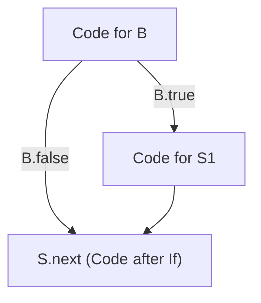
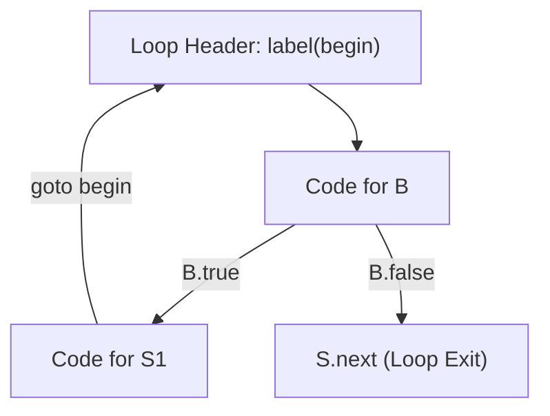

# Control Flow Translation and Boolean Expressions

> 📖 **Reading Order:** Step 15 of 55 | **Module 2:** Intermediate Code Generation  
> ◄ **Previous:** [[Translation of Expressions and Array References]] | ► **Next:** [[Backpatching in Intermediate Code Generation]]

---

## Building the idea

A Boolean condition can control execution without first materializing 0 or 1. In `if (a<b) S`, the comparison can branch directly to S or to the continuation. **Jumping code** represents truth through the path taken.

For `B1 && B2`, false B1 already determines the result, so only B1's true path reaches B2. For `B1 || B2`, only B1's false path needs B2. For `!B`, exchange true and false destinations. These rules explain short-circuit evaluation as control flow rather than an arithmetic combination of two eager results.

An illustrative `i<10 && a[i]>max` uses that ordering to avoid the second test when i is already too large, under the array-bound assumptions. [[Translation of Expressions and Array References]] supplies the load, but this translation decides whether it executes.

One implementation passes destination labels as inherited context. [[Backpatching in Intermediate Code Generation]] shows another: generate unresolved jumps and connect them later.

## How It Works

### Why this label-passing scheme uses inherited attributes

Notice an essential structural fact:
- The subexpression `x < 10` has no idea where it should jump when it succeeds or fails!
- If it appears in `if (x < 10) S1`, it must jump to `S1` on true, and past `S1` on false.
- If it appears in `while (x < 10) S1`, it must jump to `S1` on true, and to the loop exit on false.
- If it appears inside `if (!(x < 10))`, its true and false destinations are inverted!

Because target destinations are determined strictly by the **enclosing context**, boolean non-terminals $B$ must receive their destinations via **Inherited Attributes**:
- `B.true`: The label to branch to if $B$ evaluates to true.
- `B.false`: The label to branch to if $B$ evaluates to false.

Similarly, statement non-terminals $S$ require:
- `S.next`: The label of the instruction immediately following the execution of statement $S$.

---
### Helper Functions:
- `newlabel()`: Allocates and returns a fresh assembly jump label (`L1`, `L2`, $\dots$).
- `label(L)`: Emits a label definition `L:` into the instruction stream.
- `||`: Denotes string concatenation of generated intermediate code chunks.

---

### 4.1 If-Then Statement: $S \longrightarrow \mathbf{if} \; ( B ) \; S_1$



#### Semantic Rules:
```
B.true  = newlabel()
B.false = S.next
S1.next = S.next
S.code  = B.code || label(B.true) || S1.code
```
- **Intuition:** If $B$ is true, jump to `B.true`, which begins `S1`. If $B$ is false, jump directly to `S.next` (bypassing `S1` entirely).

---

### 4.2 If-Then-Else Statement: $S \longrightarrow \mathbf{if} \; ( B ) \; S_1 \; \mathbf{else} \; S_2$

#### Semantic Rules:
```
B.true  = newlabel()
B.false = newlabel()
S1.next = S.next
S2.next = S.next
S.code  = B.code 
         || label(B.true)  || S1.code || gen('goto ' S.next) 
         || label(B.false) || S2.code
```
- **Intuition:** Notice the critical unconditional jump `goto S.next` appended after `S1.code`! Without this jump, the CPU would fall through into `S2.code` and execute both branches!

---

### 4.3 While Loop: $S \longrightarrow \mathbf{while} \; ( B ) \; S_1$



#### Semantic Rules:
```
begin   = newlabel()
B.true  = newlabel()
B.false = S.next
S1.next = begin
S.code  = label(begin) 
         || B.code 
         || label(B.true) || S1.code || gen('goto ' begin)
```
- **Intuition:** Every iteration starts at `begin`. $B$ is tested; if true, `S1` executes and unconditionally loops back to `begin`. If false, control exits immediately to `S.next`.

---
### Formal SDD for Boolean Expressions

Now let us define how inherited exit labels flow downwards through logical operators:

### 5.1 Relational Expression: $B \longrightarrow E_1 \text{ relop } E_2$
```
B.code = gen('if ' E1.addr relop.op E2.addr ' goto ' B.true)
         || gen('goto ' B.false)
```

### 5.2 Logical OR: $B \longrightarrow B_1 \text{ || } B_2$
```
B1.true  = B.true          /* Short-circuit: If B1 is true, entire OR is true! */
B1.false = newlabel()      /* If B1 is false, fall through to test B2 */
B2.true  = B.true          /* If B2 is true, entire OR is true */
B2.false = B.false         /* If B2 is false, entire OR is false */
B.code   = B1.code || label(B1.false) || B2.code
```

### 5.3 Logical AND: $B \longrightarrow B_1 \text{ \&\& } B_2$
```
B1.true  = newlabel()      /* If B1 is true, proceed to test B2 */
B1.false = B.false         /* Short-circuit: If B1 is false, entire AND fails! */
B2.true  = B.true          /* If B2 is true, entire AND succeeds */
B2.false = B.false         /* If B2 is false, entire AND fails */
B.code   = B1.code || label(B1.true) || B2.code
```

### 5.4 Logical NOT: $B \longrightarrow ! B_1$
```
B1.true  = B.false         /* Swap destination labels */
B1.false = B.true
B.code   = B1.code
```
> [!TIP] The Zero-Instruction Inversion
> Look at the rule for `! B1`: **Zero instructions are emitted!** Inverting a boolean condition simply swaps the destination labels `B1.true` and `B1.false`. It incurs zero runtime cost.

---

## Exam Relevance

---

### End-to-End Walkthrough: Complex Conditional

Consider translating:
$$\mathbf{if \; (x < 100 \; || \; x > 200 \; \&\& \; x \neq y) \; x = 0;}$$

Following standard operator precedence, `&&` binds tighter than `||`:
$$B = B_1 \text{ || } (B_2 \text{ \&\& } B_3)$$
Let the overall statement have `S.next = L_after`.

1. **Outer `if` Setup:**
   - `B.true = L_then`
   - `B.false = L_after`
2. **Top-Level OR ($B_1 \text{ || } B_{and}$):**
   - $B_1 = (x < 100)$:
     - `B1.true = B.true = L_then`
     - `B1.false = L_test_and`
   - $B_{and} = (x > 200 \text{ \&\& } x \neq y)$:
     - `Band.true = B.true = L_then`
     - `Band.false = B.false = L_after`
3. **Inner AND ($B_2 \text{ \&\& } B_3$):**
   - $B_2 = (x > 200)$:
     - `B2.true = L_test_neq`
     - `B2.false = Band.false = L_after`
   - $B_3 = (x \neq y)$:
     - `B3.true = Band.true = L_then`
     - `B3.false = Band.false = L_after`

### Emitted Three-Address Code:
```text
      if x < 100 goto L_then        // B1: If true, short-circuit entire condition!
      goto L_test_and

L_test_and:
      if x > 200 goto L_test_neq    // B2: If true, test B3
      goto L_after                  // Short-circuit: B2 failed, so AND failed!

L_test_neq:
      if x != y goto L_then         // B3: If true, condition succeeded!
      goto L_after                  // B3 failed, entire condition failed!

L_then:
      x = 0

L_after:
      // Execution continues...
```

Notice how the control flow strictly mirrors the mathematical truth table while never executing a single unnecessary check at runtime!

---

## What to carry forward

Inherited labels are a method, not mandatory for all Boolean translation. Short-circuit behavior must match the source language, including side effects and evaluation order. A branch expression is not automatically interchangeable with eager bitwise operations.

## Related notes

- [[Translation of Expressions and Array References]]
- [[Backpatching in Intermediate Code Generation]]

## Sources

- **Lecture Slides:** [[cse309/01 - Sources/Lectures/KMS Merged.pdf|KMS Merged.pdf]], Chapter 6 (Slides 154–185).
- **Textbook:** Aho, Lam, Sethi, Ullman, *Compilers: Principles, Techniques, & Tools* (2nd Ed.), Section 6.6 (Control Flow).
