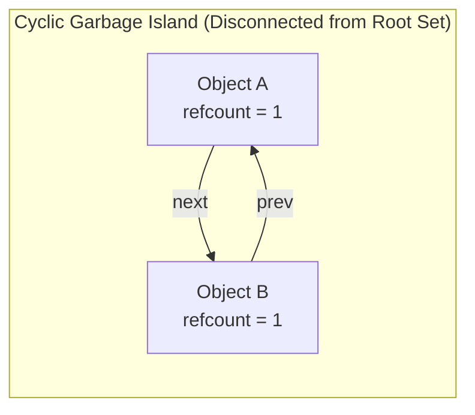

# Garbage Collection Fundamentals and Reference Counting

> 📖 **Reading Order:** Step 25 of 55 | **Module 3:** Run-Time Environments  
> ◄ **Previous:** [[Heap Memory Management and Allocation Strategies]] | ► **Next:** [[Trace-Based Garbage Collection Algorithms]]

---

## Building the idea

An allocated object can remain in memory after the program has lost every way to reach it. **Garbage collection** reclaims objects according to a runtime's liveness criterion, commonly reachability from roots such as active stacks, globals, and registers.

Reference counting uses a local proxy: record incoming references and reclaim an object when its count reaches zero, updating the counts of objects it referenced. This can reclaim acyclic structures promptly as their last owners disappear.

An illustrative cycle exposes the limitation. A points to B and B points to A; the program drops its only external pointer. Both counts remain one, yet neither object is reachable from a root. Counting incoming edges is not the same as tracing a path from a root.

[[Heap Memory Management and Allocation Strategies]] manages regions; a collector decides which allocations can be returned to that manager. The mutator is the running application that changes references, and the collector must coordinate with those changes.

## How It Works

The mechanism executes in designated compiler passes.

---
## What to carry forward

[[Trace-Based Garbage Collection Algorithms]] solves the unreachable-cycle problem by starting from roots. Reachable objects may still be useless to the programmer, so tracing garbage collection does not prevent every application-level memory leak.

## Related notes

- [[Heap Memory Management and Allocation Strategies]]
- [[Trace-Based Garbage Collection Algorithms]]

## Sources

### The Core Idea:
Instead of traversing the heap graph periodically, augment every heap object header with an integer field:
$$\text{refcount}(v) = \text{number of active pointers directed into } v$$

```
Anatomy of an Object Header under Reference Counting:
┌───────────────────────────────────────────────┐
│ refcount = 3  | Type Descriptor Pointer       │
├───────────────────────────────────────────────┤
│ Payload Data / Pointers to other objects      │
└───────────────────────────────────────────────┘
```

### The Mutation Protocol:
Whenever pointers change, the compiler inserts code to adjust counts:
1. **Pointer Reassignment ($p = q$):**
   ```python
   def assign_pointer(p_slot, new_target):
       old_target = p_slot.target
       if new_target is not None:
           new_target.refcount += 1
       p_slot.target = new_target
       if old_target is not None:
           old_target.refcount -= 1
           if old_target.refcount == 0:
               reclaim(old_target)

   def reclaim(obj):
       for child in obj.referenced_pointers:
           child.refcount -= 1
           if child.refcount == 0:
               reclaim(child)
       free_memory(obj)
   ```
2. **Stack Frame Pop:** When a function exits, `refcount` is decremented for every local pointer variable.

---
Why cannot pure reference counting be used as the sole memory manager in general-purpose languages?

### Theorem: Inability to Collect Cyclic Structures
*Pure reference counting cannot reclaim any isolated strongly connected component $C \subseteq V$ of size $|C| \ge 2$, even when $C$ becomes completely unreachable from the root set $R$.*



### Formal Proof:
1. Let $C \subseteq V$ be a strongly connected subgraph (or directed cycle) in $G$, such that $|C| \ge 2$.
2. For every vertex $v \in C$, by definition of strong connectivity, there exists at least one incoming edge originating from another vertex $u \in C$:
   $$\forall v \in C, \quad \exists u \in C \text{ such that } (u, v) \in E$$
3. The reference count of $v$ is the total in-degree of $v$ in $G$:
   $$\text{refcount}(v) = \text{in-deg}(v) = |\{ w \in V \mid (w, v) \in E \}|$$
4. Decomposing incoming edges into internal cycle edges and external edges:
   $$\text{refcount}(v) = |\{ u \in C \mid (u, v) \in E \}| + |\{ w \in (V \setminus C) \mid (w, v) \in E \}|$$
5. From Step 2, $|\{ u \in C \mid (u, v) \in E \}| \ge 1$ for every $v \in C$.
6. Now suppose all external references to $C$ are severed:
   $$\forall w \in (V \setminus C), \; (w, v) \notin E \implies |\{ w \in (V \setminus C) \mid (w, v) \in E \}| = 0$$
   The subgraph $C$ is now strictly unreachable from the root set: $C \subseteq \text{Garbage}(G, R)$.
7. However, calculating the reference count for each $v \in C$:
   $$\forall v \in C, \quad \text{refcount}(v) \ge 1 + 0 = 1 > 0$$
8. The reference counting deallocation trigger requires $\text{refcount}(v) == 0$.
9. Because no vertex in $C$ ever drops to zero, `reclaim()` is never called on any member of $C$.
10. Therefore, the entire subgraph $C$ remains permanently uncollected in heap memory, leaking space for the lifetime of the process. $\blacksquare$

---
| Feature | Engineering Reality |
| :--- | :--- |
| **Deterministic Latency** | Memory is freed the microsecond its count hits zero. Ideal for real-time systems (audio DSP, Apple Swift UI). |
| **Memory Cycle Leakage** | Leaks cyclic graphs (e.g., doubly linked lists, DOM trees) unless mitigated by manual "Weak References" (`std::weak_ptr`, Swift `unowned`). |
| **Atomic Cache Contention** | Shared-reference counts may need atomic updates and generate coherence traffic. Costs depend on ownership, implementation, and contention; thread-local or proven-exclusive counts need not use the same synchronization. |
| **Cascade Free Latency** | Freeing a large linked list with zero references can cause a long, unexpected recursive cascade pause, destroying predictable frame times in games. |

To conquer cyclic leaks and eliminate pointer assignment overhead, modern runtimes (JVM, Go, .NET, V8) turn to **[[Trace-Based Garbage Collection Algorithms]]**.

---
- **Lecture Slides:** [[cse309/01 - Sources/Lectures/KMS Merged.pdf|KMS Merged.pdf]], Chapter 7 (Slides 253–265).
- **Textbook:** Aho, Lam, Sethi, Ullman, *Compilers: Principles, Techniques, & Tools* (2nd Ed.), Section 7.5 (Introduction to Garbage Collection).
