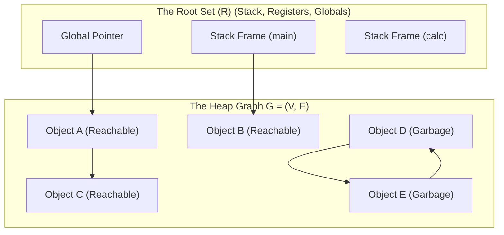
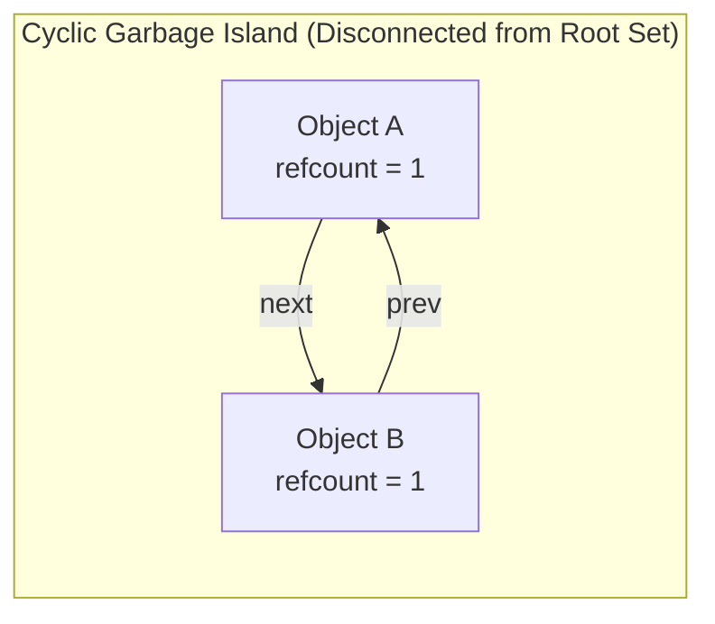

# Garbage Collection Fundamentals and Reference Counting

> 📖 **Reading Order:** Step 25 of 55 | **Module 3:** Run-Time Environments  
> ◄ **Previous:** [[Heap Memory Management and Allocation Strategies]] | ► **Next:** [[Trace-Based Garbage Collection Algorithms]]

---

---

---

---

---

## Starting Point and the Problem

For decades, systems languages like C and C++ placed complete responsibility for heap memory in the hands of the programmer via manual primitives: `malloc()` / `free()` or `new` / `delete`.

In practice, humans are mathematically incapable of tracking millions of transient object references across complex asynchronous applications without error. Microsoft Security Response Center and Chromium security audits consistently reveal that **over 70% of all high-severity vulnerabilities across major operating systems are memory safety errors**:
1. **Dangling Pointers (Use-After-Free):** A programmer frees memory chunk $A$, but forgets that pointer $p$ still references it. Later, new object $B$ is placed at that address. When $p$ writes to $A$, it corrupts $B$, causing silent financial miscalculations, erratic crashes, or arbitrary code execution exploits.
2. **Double-Free Hazards:** Calling `free()` twice on the same pointer corrupts the memory manager's internal free-list linked lists.
3. **Memory Leaks:** Forgetting to free heap memory when references drop. The process slowly balloons in memory until the operating system's Out-Of-Memory (OOM) killer abruptly terminates it.

**Garbage Collection (GC)** eliminates these bugs by transferring memory reclamation from fallible humans to a mathematically rigorous runtime subsystem.

---

---

---

---

---

## Developing the Idea

Compilers formalize automatic memory management as a graph reachability problem:

Let the program heap at any execution instant be modeled as a **Directed Graph**:
$$G = (V, E)$$
where:
- **$V$ (Vertices):** The set of all dynamically allocated heap memory objects.
- **$E$ (Directed Edges):** The set of active memory references (pointers):
  $$(u, v) \in E \iff \text{Object } u \text{ contains a field pointing to Object } v$$

### The Root Set ($R$)
The **Root Set** $R \subseteq V$ consists of all memory locations that can be read **directly by the CPU** without dereferencing any heap pointer:
1. All physical CPU registers currently holding object addresses.
2. All global and static reference variables.
3. All local reference variables residing in any active activation record across the entire call stack.



### Formal Reachability Theorem:
1. **Reachable Set:**
   $$\text{Reachable}(G, R) = \{ v \in V \mid \exists r \in R, \; r \rightsquigarrow v \}$$
   where $r \rightsquigarrow v$ denotes a directed path of length $\ge 0$ from root $r$ to object $v$.
2. **Garbage Set:**
   $$\text{Garbage}(G, R) = V \setminus \text{Reachable}(G, R)$$

#### Theorem: Safety of Garbage Reclamation
*Any object $g \in \text{Garbage}(G, R)$ can never again be read or written by the mutator (program). Reclaiming its physical memory is 100% safe and can never produce a dangling pointer error.*

#### Proof:
- The CPU can only execute instructions whose operands originate from registers, static memory, or the stack (the Root Set $R$), or via an address dereferenced through an existing pointer.
- By induction: An object at distance $k$ from $R$ can only be reached if an object at distance $k-1$ is already reached.
- Since $g \notin \text{Reachable}(G, R)$, there exists no directed path from any node in $R$ to $g$.
- Therefore, the CPU instruction pointer has no physical sequence of dereferences that could ever resolve the address of $g$.
- Hence, $g$ is dead to the execution universe, and its storage can be safely repurposed. $\blacksquare$

---

---

---

---

---

## Definition

**Garbage Collection Fundamentals and Reference Counting** is a formal compiler mechanism that structures syntax-directed translation, intermediate representations, runtime environments, or code generation.

---

---

---

---

## How It Works

### How It Works

### How It Works

### How It Works

The mechanism executes in designated compiler passes.

---
### Technical Details

Target architecture and ABI specifications govern low-level alignment and register assignments.

---
### Important Properties and Why They Hold

- **Semantic Soundness:** Preserves program execution equivalence.
- **Algorithmic Efficiency:** Operates in low polynomial or linear time over the program structure.

---
### Related Concepts

- [[Syntax-Directed Definitions and Translation Schemes]]
- [[Intermediate Representations and Three-Address Code]]
- [[Basic Blocks and Control Flow Graphs]]

---
### Prerequisites

- [[Syntax-Directed Definitions and Translation Schemes]]

---
### Problems

- [[Problem — Desk Calculator SDD and Annotated Parse Tree]]
- [[Problem — Array Reference Three-Address Code Generation]]

---

---
### Technical Details

Target architecture and ABI specifications govern low-level alignment and register assignments.

---
### Important Properties and Why They Hold

- **Semantic Soundness:** Preserves program execution equivalence.
- **Algorithmic Efficiency:** Operates in low polynomial or linear time over the program structure.

---
### Related Concepts

- [[Syntax-Directed Definitions and Translation Schemes]]
- [[Intermediate Representations and Three-Address Code]]
- [[Basic Blocks and Control Flow Graphs]]

---
### Prerequisites

- [[Syntax-Directed Definitions and Translation Schemes]]

---
### Problems

- [[Problem — Desk Calculator SDD and Annotated Parse Tree]]
- [[Problem — Array Reference Three-Address Code Generation]]

---

---
### Technical Details

Target architecture and ABI specifications govern low-level alignment and register assignments.

---
### Important Properties and Why They Hold

- **Semantic Soundness:** Preserves program execution equivalence.
- **Algorithmic Efficiency:** Operates in low polynomial or linear time over the program structure.

---
### Related Concepts

- [[Syntax-Directed Definitions and Translation Schemes]]
- [[Intermediate Representations and Three-Address Code]]
- [[Basic Blocks and Control Flow Graphs]]

---
### Prerequisites

- [[Syntax-Directed Definitions and Translation Schemes]]

---
### Problems

- [[Problem — Desk Calculator SDD and Annotated Parse Tree]]
- [[Problem — Array Reference Three-Address Code Generation]]

---

---

## Example

Detailed walkthroughs and traces are provided in the corresponding example and problem notes.

---

## Technical Details

Target architecture and ABI specifications govern low-level alignment and register assignments.

---

## Important Properties and Why They Hold

- **Semantic Soundness:** Preserves program execution equivalence.
- **Algorithmic Efficiency:** Operates in low polynomial or linear time over the program structure.

---

## Common Mistakes

### Common Mistakes

### Common Mistakes

### Common Mistakes

- Confusing syntactic validity with semantic correctness.
- Overlooking variable scoping or memory aliasing side effects.

---

---

---

---

## Exam Relevance

### Example

Detailed walkthroughs and traces are provided in the corresponding example and problem notes.

---
### Exam Relevance

### Example

Detailed walkthroughs and traces are provided in the corresponding example and problem notes.

---
### Exam Relevance

### Example

Detailed walkthroughs and traces are provided in the corresponding example and problem notes.

---
### Exam Relevance

Tested regularly in compiler examinations via syntax-directed translation proofs, activation record diagrams, and control flow optimization problems.

---

---

---

---

## Related Concepts

- [[Syntax-Directed Definitions and Translation Schemes]]
- [[Intermediate Representations and Three-Address Code]]
- [[Basic Blocks and Control Flow Graphs]]

---

## Prerequisites

- [[Syntax-Directed Definitions and Translation Schemes]]

---

## Problems

- [[Problem — Desk Calculator SDD and Annotated Parse Tree]]
- [[Problem — Array Reference Three-Address Code Generation]]

---

## Sources

### The Core Idea:
Instead of traversing the heap graph periodically, augment every heap object header with an integer field:
$$\text{refcount}(v) = \text{number of active pointers directed into } v$$

```
Anatomy of an Object Header under Reference Counting:
┌───────────────────────────────────────────────┐
│ refcount = 3  | Type Descriptor Pointer       │
├───────────────────────────────────────────────┤
│ Payload Data / Pointers to other objects      │
└───────────────────────────────────────────────┘
```

### The Mutation Protocol:
Whenever pointers change, the compiler inserts code to adjust counts:
1. **Pointer Reassignment ($p = q$):**
   ```python
   def assign_pointer(p_slot, new_target):
       old_target = p_slot.target
       if new_target is not None:
           new_target.refcount += 1
       p_slot.target = new_target
       if old_target is not None:
           old_target.refcount -= 1
           if old_target.refcount == 0:
               reclaim(old_target)

   def reclaim(obj):
       for child in obj.referenced_pointers:
           child.refcount -= 1
           if child.refcount == 0:
               reclaim(child)
       free_memory(obj)
   ```
2. **Stack Frame Pop:** When a function exits, `refcount` is decremented for every local pointer variable.

---
Why cannot pure reference counting be used as the sole memory manager in general-purpose languages?

### Theorem: Inability to Collect Cyclic Structures
*Pure reference counting cannot reclaim any isolated strongly connected component $C \subseteq V$ of size $|C| \ge 2$, even when $C$ becomes completely unreachable from the root set $R$.*



### Formal Proof:
1. Let $C \subseteq V$ be a strongly connected subgraph (or directed cycle) in $G$, such that $|C| \ge 2$.
2. For every vertex $v \in C$, by definition of strong connectivity, there exists at least one incoming edge originating from another vertex $u \in C$:
   $$\forall v \in C, \quad \exists u \in C \text{ such that } (u, v) \in E$$
3. The reference count of $v$ is the total in-degree of $v$ in $G$:
   $$\text{refcount}(v) = \text{in-deg}(v) = |\{ w \in V \mid (w, v) \in E \}|$$
4. Decomposing incoming edges into internal cycle edges and external edges:
   $$\text{refcount}(v) = |\{ u \in C \mid (u, v) \in E \}| + |\{ w \in (V \setminus C) \mid (w, v) \in E \}|$$
5. From Step 2, $|\{ u \in C \mid (u, v) \in E \}| \ge 1$ for every $v \in C$.
6. Now suppose all external references to $C$ are severed:
   $$\forall w \in (V \setminus C), \; (w, v) \notin E \implies |\{ w \in (V \setminus C) \mid (w, v) \in E \}| = 0$$
   The subgraph $C$ is now strictly unreachable from the root set: $C \subseteq \text{Garbage}(G, R)$.
7. However, calculating the reference count for each $v \in C$:
   $$\forall v \in C, \quad \text{refcount}(v) \ge 1 + 0 = 1 > 0$$
8. The reference counting deallocation trigger requires $\text{refcount}(v) == 0$.
9. Because no vertex in $C$ ever drops to zero, `reclaim()` is never called on any member of $C$.
10. Therefore, the entire subgraph $C$ remains permanently uncollected in heap memory, leaking space for the lifetime of the process. $\blacksquare$

---
| Feature | Engineering Reality |
| :--- | :--- |
| **Deterministic Latency** | Memory is freed the microsecond its count hits zero. Ideal for real-time systems (audio DSP, Apple Swift UI). |
| **Memory Cycle Leakage** | Leaks cyclic graphs (e.g., doubly linked lists, DOM trees) unless mitigated by manual "Weak References" (`std::weak_ptr`, Swift `unowned`). |
| **Atomic Cache Contention** | On multi-core CPUs, every increment/decrement requires atomic bus-locking instructions (`LOCK XADD` on x86). In high-concurrency environments, memory bus saturation degrades throughput by 30–50%. |
| **Cascade Free Latency** | Freeing a large linked list with zero references can cause a long, unexpected recursive cascade pause, destroying predictable frame times in games. |

To conquer cyclic leaks and eliminate pointer assignment overhead, modern runtimes (JVM, Go, .NET, V8) turn to **[[Trace-Based Garbage Collection Algorithms]]**.

---
- **Lecture Slides:** [[cse309/01 - Sources/Lectures/KMS Merged.pdf|KMS Merged.pdf]], Chapter 7 (Slides 253–265).
- **Textbook:** Aho, Lam, Sethi, Ullman, *Compilers: Principles, Techniques, & Tools* (2nd Ed.), Section 7.5 (Introduction to Garbage Collection).
