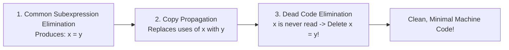

# Global Common Subexpression Elimination and Copy Propagation

> 📖 **Reading Order:** Step 52 of 55 | **Module 6:** Machine-Independent Optimization  
> ◄ **Previous:** [[Principal Sources of Code Optimization]] | ► **Next:** [[Loop Optimizations and Strength Reduction]]

---

## Building the idea

Local CSE can look within one straight-line block. Global CSE must ask whether an earlier computation is available on **every** path reaching a later occurrence and whether its operands remain unchanged along those paths.

An illustrative diamond has `a+b` computed on one branch and not the other. At the merge, textual proximity to that computation does not make its result available for all executions. Available-expression information therefore intersects predecessor facts: only facts true on every incoming route survive.

Copy propagation has a related requirement. After `x=y`, replacing later x with y is valid only while the relevant value relation holds; redefining x or y can invalidate it. [[Basic Blocks and Control Flow Graphs]] supplies the paths on which these changes must be checked.

Removing redundant computations can produce copies, and propagating those copies can expose dead definitions. Apply each pass with updated analysis rather than assuming an earlier fact stays true after arbitrary transformations.

## How It Works

### The Virtuous Optimization Cycle

Copy propagation rarely makes code faster on its own. Its true brilliance lies in **triggering dead code elimination**!



1. **Step 1:** Common Subexpression Elimination eliminates $4 * i$, leaving `t6 = t2`.
2. **Step 2:** Copy Propagation replaces all uses of `t6` with `t2`.
3. **Step 3:** Because `t6` is now never read anywhere in the program, `t6 = t2` is completely **dead code**.
4. **Step 4:** Dead Code Elimination deletes `t6 = t2`, removing an entire instruction from the program!

---
### Constant Propagation and Constant Folding

- **Constant Folding:** Deducing at compile time that an expression involves only constant literals, and evaluating it directly at compile time:
  $$x = 3 + 5 \quad \Longrightarrow \quad x = 8$$
  $$x = 2 * 3.14159 * r \quad \Longrightarrow \quad x = 6.28318 * r$$
- **Constant Propagation:** Given an assignment $x = c$ where $c$ is a constant, replacing all subsequent uses of $x$ with $c$:
  ```c
  // Before:
  debug = 0;
  ...
  if (debug) print_log();

  // After Constant Propagation:
  if (0) print_log();

  // After Dead Code Elimination:
  // (print_log block is completely deleted!)
  ```

---

## What to carry forward

Availability of an expression and existence of a usable saved result are separate implementation obligations. For loads and calls, include memory effects and aliasing. [[Loop Optimizations and Strength Reduction]] adds repeated execution and loop-entry conditions.

## Related notes

- [[Basic Blocks and Control Flow Graphs]]
- [[Loop Optimizations and Strength Reduction]]

## Sources

- **Lecture Slides:** [[cse309/01 - Sources/Lectures/KMS Merged.pdf|KMS Merged.pdf]], Chapter 9 (Slides 541–557).
- **Textbook:** Aho, Lam, Sethi, Ullman, *Compilers: Principles, Techniques, & Tools* (2nd Ed.), Section 9.1.1 & 9.1.2.
