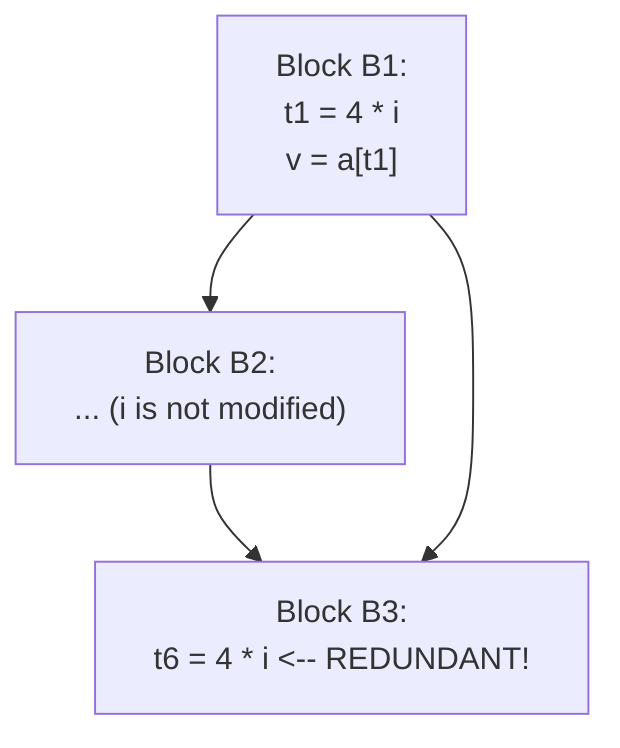
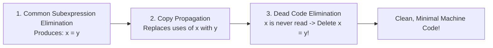

# Global Common Subexpression Elimination and Copy Propagation

> 📖 **Reading Order:** Step 52 of 55 | **Module 6: Machine-Independent Optimization**  
> ◄ **Previous:** [[Principal Sources of Code Optimization]] | ► **Next:** [[Loop Optimizations and Strength Reduction]]

---

## Starting Point and the Problem

An occurrence of an expression $E$ (e.g., $x + y$) at statement $s$ is a **Global Common Subexpression** if:
1. $E$ was previously evaluated along **every execution path** reaching statement $s$.
2. None of the operand variables ($x$ or $y$) have been redefined on any path between the prior evaluation and $s$.



### The Transformation:
1. In block $B_1$, assign the computation to a new temporary: $u = 4 * i$.
2. At statement $s$ in block $B_3$, replace the calculation $4 * i$ with the temporary variable $u$:
   $$t_6 = u$$

---

## Developing the Idea

### Motivation:
Notice that eliminating a common subexpression frequently leaves behind a simple **copy statement** of the form:
$$x = y$$
(e.g., $t_6 = t_2$). If statement $x = y$ is followed by instructions using $x$ (e.g., $a[t_6] = \dots$), leaving $x$ intact wastes registers and execution cycles.

### Definition and Rule:
**Copy Propagation** replaces subsequent uses of variable $x$ directly with variable $y$, provided that:
- Neither $x$ nor $y$ has been modified between the copy statement and the use.
- The copy reaches the use along all execution paths.

```
Before Copy Propagation:
t6 = t2
a[t6] = val

After Copy Propagation:
t6 = t2          ; (now dead code!)
a[t2] = val      ; (direct use of t2)
```

---

## Definition

**Global Common Subexpression Elimination and Copy Propagation** is a formal compiler mechanism that structures syntax-directed translation, intermediate representations, runtime environments, or code generation.

---

## How It Works

### The Virtuous Optimization Cycle

Copy propagation rarely makes code faster on its own. Its true brilliance lies in **triggering dead code elimination**!



1. **Step 1:** Common Subexpression Elimination eliminates $4 * i$, leaving `t6 = t2`.
2. **Step 2:** Copy Propagation replaces all uses of `t6` with `t2`.
3. **Step 3:** Because `t6` is now never read anywhere in the program, `t6 = t2` is completely **dead code**.
4. **Step 4:** Dead Code Elimination deletes `t6 = t2`, removing an entire instruction from the program!

---

### Constant Propagation and Constant Folding

- **Constant Folding:** Deducing at compile time that an expression involves only constant literals, and evaluating it directly at compile time:
  $$x = 3 + 5 \quad \Longrightarrow \quad x = 8$$
  $$x = 2 * 3.14159 * r \quad \Longrightarrow \quad x = 6.28318 * r$$
- **Constant Propagation:** Given an assignment $x = c$ where $c$ is a constant, replacing all subsequent uses of $x$ with $c$:
  ```c
  // Before:
  debug = 0;
  ...
  if (debug) print_log();

  // After Constant Propagation:
  if (0) print_log();

  // After Dead Code Elimination:
  // (print_log block is completely deleted!)
  ```

---

## Example

Detailed walkthroughs and traces are provided in the corresponding example and problem notes.

---

## Technical Details

Target architecture and ABI specifications govern low-level alignment and register assignments.

---

## Important Properties and Why They Hold

- **Semantic Soundness:** Preserves program execution equivalence.
- **Algorithmic Efficiency:** Operates in low polynomial or linear time over the program structure.

---

## Common Mistakes

- Confusing syntactic validity with semantic correctness.
- Overlooking variable scoping or memory aliasing side effects.

---

## Exam Relevance

Tested regularly in compiler examinations via syntax-directed translation proofs, activation record diagrams, and control flow optimization problems.

---

## Related Concepts

- [[DAG Construction and Local Optimization of Basic Blocks]]
- [[Loop Optimizations and Strength Reduction]]

---

## Prerequisites

- [[Principal Sources of Code Optimization]]

---

## Problems

- [[Problem — Quicksort Loop Induction Variable Strength Reduction]]

---

## Sources

- **Lecture Slides:** [[cse309/01 - Sources/Lectures/KMS Merged.pdf|KMS Merged.pdf]], Chapter 9 (Slides 541–557).
- **Textbook:** Aho, Lam, Sethi, Ullman, *Compilers: Principles, Techniques, & Tools* (2nd Ed.), Section 9.1.1 & 9.1.2.
