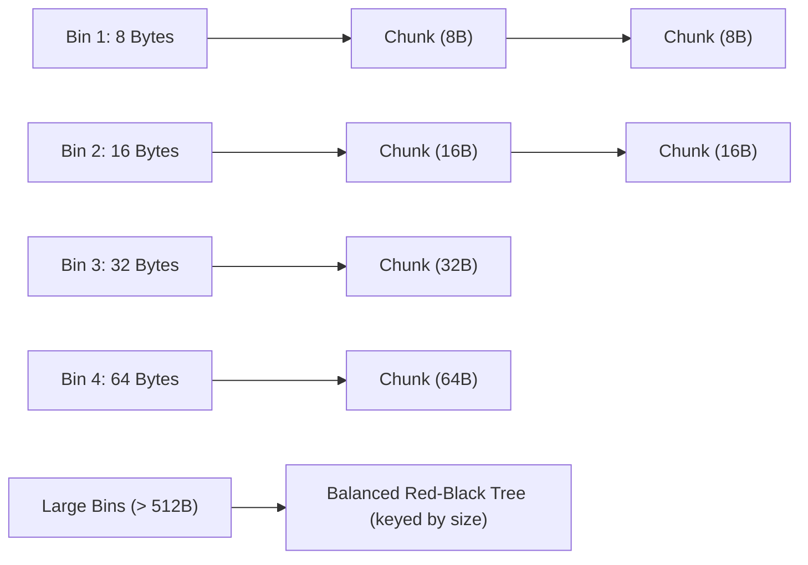

# Heap Memory Management and Allocation Strategies

> 📖 **Reading Order:** Step 24 of 55 | **Module 3:** Run-Time Environments  
> ◄ **Previous:** [[Non-Local Variable Access in Static and Dynamic Scopes]] | ► **Next:** [[Garbage Collection Fundamentals and Reference Counting]]

---

---

---

---

---

## Starting Point and the Problem

In any long-running application—such as a database engine, a web server, or a 3D game engine—objects are constantly instantiated and destroyed across days or months:
- Unlike the Stack, which operates in strict LIFO order, heap objects have **arbitrary lifetimes**. Object $A$ allocated at 9:00 AM may live for 10 seconds, while Object $B$ allocated at 9:01 AM may live for 3 weeks.
- Over time, as objects of varying sizes are allocated and freed, the heap turns into **Swiss cheese**: a patchwork of tiny active allocations separated by small free voids.

Consider a server with 16 gigabytes of physical RAM:
```
Heap Memory State:
[ 100 KB Allocated ] [ 200 KB Free ] [ 50 KB Allocated ] [ 300 KB Free ] ... [ 100 KB Free ]
```
Suppose total free space sums up to **8 gigabytes**. Yet when the server attempts to allocate a single contiguous **500-kilobyte** image buffer, the operating system throws a fatal `std::bad_alloc` / `OutOfMemoryError` crash!

How can a server with 8 gigabytes of free RAM fail to allocate 500 kilobytes?
Because of **External Fragmentation**: the 8GB of free memory is pulverized into millions of tiny, non-contiguous fragments, and not a single contiguous block of 500KB exists!

The **Heap Memory Manager** is the low-level systems software layer (e.g., `glibc ptmalloc`, Google `tcmalloc`, FreeBSD/Facebook `jemalloc`) designed to conquer fragmentation while keeping allocation times in single-digit nanoseconds.

---

---

---

---

---

## Developing the Idea

```
                             Memory Fragmentation
                       ┌───────────────┴───────────────┐
                       ▼                               ▼
             Internal Fragmentation          External Fragmentation
        (Wasted space INSIDE block)      (Wasted space BETWEEN blocks)
```

### 2.1 Internal Fragmentation
- **Definition:** Occurs when the memory manager allocates a chunk whose physical size is strictly greater than the payload requested by the program.
- **Root Causes:**
  1. **Hardware Bus Alignment:** On modern 64-bit architectures, pointers and words must be 8-byte or 16-byte aligned. If an application requests `malloc(13)`, the allocator rounds up to 16 bytes. The 3 trailing padding bytes are wasted.
  2. **Minimum Chunk Size:** Every block requires internal bookkeeping pointers (header, footer, free list links). An allocator cannot create a chunk smaller than its header size (typically 16 to 32 bytes).

### 2.2 External Fragmentation
- **Definition:** Occurs when total unallocated heap memory is abundantly sufficient to satisfy a request, but the memory is fractured into disjointed slices such that **no single contiguous block is large enough**.
- **Root Cause:** Uneven lifetimes and variable sizes of dynamic data.

---

---

---

---

---

## Definition

**Heap Memory Management and Allocation Strategies** is a formal compiler mechanism that structures syntax-directed translation, intermediate representations, runtime environments, or code generation.

---

---

---

---

## How It Works

### How It Works

### How It Works

### How It Works

### Dynamic Heap Placement Strategies

When satisfying an allocation request of $K$ bytes from a collection of free blocks, allocators utilize three classic search heuristics:

| Strategy | Search Mechanics | Time Complexity | Real-World Performance Profile |
| :--- | :--- | :---: | :--- |
| **First-Fit** | Scans free list from the beginning; selects the **first block** of size $\ge K$. | $O(N)$ worst-case | **Fast in practice.** Leaves large contiguous blocks intact toward the end of the heap. However, it tends to accumulate small, unusable slivers at the front of the free list. |
| **Best-Fit** | Exhaustively searches the entire list; selects the **smallest block** of size $\ge K$. | $O(N)$ full scan | **Minimizes wasted leftover space** per allocation. Counter-intuitively, it produces severe external fragmentation over time because it creates thousands of tiny, microscopic "dust" fragments that are too small for any future allocation. |
| **Next-Fit** | Like First-Fit, but begins searching from the location of the **most recent allocation** (circular scan). | $O(N)$ worst-case | Avoids cluttering the front of the heap by distributing allocations evenly. Empirically, simulations show it suffers from worse fragmentation than standard First-Fit. |

---
### Modern Allocators: Segregated Free Lists (Bin-Based Heaps)

To eliminate the unacceptable $O(N)$ pointer-chasing latency of linear free lists, production memory managers organize free memory into **Segregated Free Lists (Bins)**:



### How Binning Achieves Instantaneous $O(1)$ Allocation:
1. **Small Sizes (Fast Bins):** Over 90% of dynamic allocations in typical C/C++ programs are tiny ($\le 64$ bytes). Allocators dedicate separate singly-linked lists for exact sizes: 8, 16, 24, 32, $\dots$, 128 bytes.
   - An allocation request for 24 bytes maps via bit-shift directly to `Bin[3]`.
   - The allocator pops the head chunk from `Bin[3]`: **strictly $O(1)$ time with zero searching!**
2. **Medium Sizes:** Bins group sizes in small logarithmic intervals.
3. **Large Sizes:** Chunks $> 512$ bytes are indexed inside a balanced binary search tree (Red-Black tree or Radix tree) sorted by size, allowing $O(\log M)$ Best-Fit retrieval.

---

---
### Technical Details

### Free Space Coalescing: Donald Knuth's Boundary Tag Method

When an application calls `free(p)`, the freed block must be merged with its immediate physical neighbors (if they are free) to reconstitute larger contiguous blocks.

### The Left-Neighbor Dilemma:
- Finding the **right neighbor** in physical memory is easy: its address is simply $p + \text{size}(p)$.
- But how do you find the **left neighbor**? In linear memory, you only have pointer $p$. You have no idea whether the left neighbor is an 8-byte chunk or a 4096-byte chunk! Without extra information, locating the left neighbor requires scanning the entire heap from address $0$, taking catastrophic $O(N)$ time!

### Knuth's Genius Insight: The Footer Tag
Donald Knuth introduced **Boundary Tags**: placing a bookkeeping tag at **both the start (Header) and end (Footer)** of every memory block:

```
                      Anatomy of a Memory Chunk
       ┌────────────────────────────────────────────────────────┐ ◄── Chunk Header
       │ Chunk Size (e.g., 64 bytes)   | Allocated Flag (0 / 1) │
       ├────────────────────────────────────────────────────────┤
       │ User Payload Space (if allocated)                      │
       │ OR                                                     │
       │ Free List Pointers: Prev / Next (if free)              │
       ├────────────────────────────────────────────────────────┤
       │ Chunk Size (e.g., 64 bytes)   | Allocated Flag (0 / 1) │ ◄── Chunk Footer
       └────────────────────────────────────────────────────────┘
```

```
Physical Layout of Two Adjacent Blocks:
┌───────────────────────────┐ ┌───────────────────────────┐
│       Block A (Left)      │ │      Block B (Right)      │
│ Header: [Size_A | Alloc]  │ │ Header: [Size_B | Alloc]  │
│ User Data ...             │ │ User Data ...             │
│ Footer: [Size_A | Alloc]  │ │ Footer: [Size_B | Alloc]  │
└───────────────────────────┘ └───────────────────────────┘
               ▲
               │ Exactly 1 word backward from Block B's Header!
```

---

---
### Important Properties and Why They Hold

### The $O(1)$ Coalescing Algorithm & Correctness Invariant

When `free(p)` is executed on chunk $P$:

```python
def free_and_coalesce(p):
    size_p = p.header.size
    p.header.allocated = False
    p.footer.allocated = False

    # 1. Inspect Right Physical Neighbor:
    right_neighbor = p + size_p
    if not right_neighbor.header.allocated:
        # Right neighbor is free! Merge it:
        unlink_from_freelist(right_neighbor)
        size_p += right_neighbor.header.size
        # Update P's footer location
        p.footer = p + size_p - FOOTER_SIZE
        p.header.size = size_p
        p.footer.size = size_p

    # 2. Inspect Left Physical Neighbor:
    # Look at the memory word immediately preceding p's header!
    left_footer = p - WORD_SIZE
    if not left_footer.allocated:
        # Left neighbor is free! Retrieve its size from its footer:
        size_left = left_footer.size
        left_header = p - size_left
        unlink_from_freelist(left_header)
        # Merge left neighbor into p:
        size_p += size_left
        left_header.size = size_p
        p.footer.size = size_p
        p = left_header  # New head of coalesced block

    # 3. Insert unified block into appropriate free list bin:
    insert_into_freelist(p)
```

### Formal Theorem: Coalescing Invariant
*Under the Boundary Tag Coalescing algorithm, the heap maintains the strict invariant that no two physically adjacent memory blocks are ever simultaneously marked as free:*
$$\forall i, \; \neg (\text{is\_free}(\text{block}_i) \land \text{is\_free}(\text{block}_{i+1}))$$

#### Proof:
1. At program startup, the initial heap is a single large free block. The invariant holds vacuously.
2. An allocation splits a free block into an allocated block and (optionally) a smaller free block. The allocated block physically separates the remaining free block from any preceding allocated memory. Thus, no two free blocks become adjacent during allocation.
3. When block $P$ is freed:
   - If its right neighbor is free, step 1 merges them into a single continuous free block.
   - If its left neighbor is free, step 2 merges them into a single continuous free block.
   - Therefore, any adjacent free blocks on either side are absorbed immediately into the newly freed chunk before the operation finishes.
4. Hence, by induction on the sequence of allocation and deallocation operations, no two adjacent free blocks can ever coexist. $\blacksquare$

---

---
### Related Concepts

- [[Syntax-Directed Definitions and Translation Schemes]]
- [[Intermediate Representations and Three-Address Code]]
- [[Basic Blocks and Control Flow Graphs]]

---
### Prerequisites

- [[Syntax-Directed Definitions and Translation Schemes]]

---
### Problems

- [[Problem — Desk Calculator SDD and Annotated Parse Tree]]
- [[Problem — Array Reference Three-Address Code Generation]]

---

---
### Technical Details

Target architecture and ABI specifications govern low-level alignment and register assignments.

---
### Important Properties and Why They Hold

- **Semantic Soundness:** Preserves program execution equivalence.
- **Algorithmic Efficiency:** Operates in low polynomial or linear time over the program structure.

---
### Related Concepts

- [[Syntax-Directed Definitions and Translation Schemes]]
- [[Intermediate Representations and Three-Address Code]]
- [[Basic Blocks and Control Flow Graphs]]

---
### Prerequisites

- [[Syntax-Directed Definitions and Translation Schemes]]

---
### Problems

- [[Problem — Desk Calculator SDD and Annotated Parse Tree]]
- [[Problem — Array Reference Three-Address Code Generation]]

---

---
### Technical Details

Target architecture and ABI specifications govern low-level alignment and register assignments.

---
### Important Properties and Why They Hold

- **Semantic Soundness:** Preserves program execution equivalence.
- **Algorithmic Efficiency:** Operates in low polynomial or linear time over the program structure.

---
### Related Concepts

- [[Syntax-Directed Definitions and Translation Schemes]]
- [[Intermediate Representations and Three-Address Code]]
- [[Basic Blocks and Control Flow Graphs]]

---
### Prerequisites

- [[Syntax-Directed Definitions and Translation Schemes]]

---
### Problems

- [[Problem — Desk Calculator SDD and Annotated Parse Tree]]
- [[Problem — Array Reference Three-Address Code Generation]]

---

---

## Example

Detailed walkthroughs and traces are provided in the corresponding example and problem notes.

---

## Technical Details

Target architecture and ABI specifications govern low-level alignment and register assignments.

---

## Important Properties and Why They Hold

- **Semantic Soundness:** Preserves program execution equivalence.
- **Algorithmic Efficiency:** Operates in low polynomial or linear time over the program structure.

---

## Common Mistakes

### Common Mistakes

### Common Mistakes

### Common Mistakes

- Confusing syntactic validity with semantic correctness.
- Overlooking variable scoping or memory aliasing side effects.

---

---

---

---

## Exam Relevance

### Example

Detailed walkthroughs and traces are provided in the corresponding example and problem notes.

---
### Exam Relevance

### Example

Detailed walkthroughs and traces are provided in the corresponding example and problem notes.

---
### Exam Relevance

### Example

Detailed walkthroughs and traces are provided in the corresponding example and problem notes.

---
### Exam Relevance

Tested regularly in compiler examinations via syntax-directed translation proofs, activation record diagrams, and control flow optimization problems.

---

---

---

---

## Related Concepts

- [[Syntax-Directed Definitions and Translation Schemes]]
- [[Intermediate Representations and Three-Address Code]]
- [[Basic Blocks and Control Flow Graphs]]

---

## Prerequisites

- [[Syntax-Directed Definitions and Translation Schemes]]

---

## Problems

- [[Problem — Desk Calculator SDD and Annotated Parse Tree]]
- [[Problem — Array Reference Three-Address Code Generation]]

---

## Sources

- **Lecture Slides:** [[cse309/01 - Sources/Lectures/KMS Merged.pdf|KMS Merged.pdf]], Chapter 7 (Slides 231–245).
- **Textbook:** Aho, Lam, Sethi, Ullman, *Compilers: Principles, Techniques, & Tools* (2nd Ed.), Section 7.4 (Heap Management).
- **Knuth, D. E.:** *The Art of Computer Programming*, Vol. 1: Fundamental Algorithms (Boundary Tag Method).
