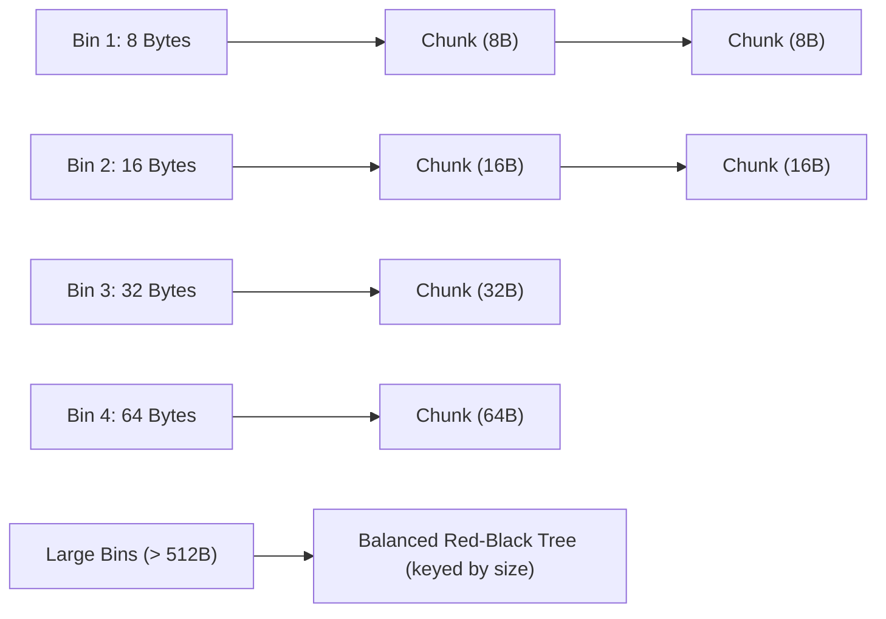

# Heap Memory Management and Allocation Strategies

> 📖 **Reading Order:** Step 24 of 55 | **Module 3:** Run-Time Environments  
> ◄ **Previous:** [[Non-Local Variable Access in Static and Dynamic Scopes]] | ► **Next:** [[Garbage Collection Fundamentals and Reference Counting]]

---

## Building the idea

Heap objects can outlive the function that creates them, so allocation cannot rely on popping the last stack frame. A heap allocator must find a suitably sized free region and remember how to reclaim it later.

For an illustrative 12-byte request among holes of 8, 20, and 40 bytes, first-fit skips 8 and chooses 20. Best-fit also chooses 20 here because it is the smallest sufficient hole. Another request history can make their future layouts differ; one local choice does not prove a universal winner.

**Internal fragmentation** is unused space inside an allocated block. **External fragmentation** is free space split across separated holes. A request can fail despite enough total free bytes if no suitable contiguous block exists.

Boundary tags record size and allocation information near block boundaries so adjacent free regions can be found and coalesced. [[Run-Time Storage Organization and Activation Records]] explains why heap lifetimes differ from stack lifetimes; this note explains how that flexibility costs bookkeeping.

## How It Works

### Dynamic Heap Placement Strategies

When satisfying an allocation request of $K$ bytes from a collection of free blocks, allocators utilize three classic search heuristics:

| Strategy | Search Mechanics | Time Complexity | Real-World Performance Profile |
| :--- | :--- | :---: | :--- |
| **First-Fit** | Scans free list from the beginning; selects the **first block** of size $\ge K$. | $O(N)$ worst-case | **Fast in practice.** Leaves large contiguous blocks intact toward the end of the heap. However, it tends to accumulate small, unusable slivers at the front of the free list. |
| **Best-Fit** | Exhaustively searches the entire list; selects the **smallest block** of size $\ge K$. | $O(N)$ full scan | **Minimizes wasted leftover space** per allocation. Counter-intuitively, it produces severe external fragmentation over time because it creates thousands of tiny, microscopic "dust" fragments that are too small for any future allocation. |
| **Next-Fit** | Like First-Fit, but begins searching from the location of the **most recent allocation** (circular scan). | $O(N)$ worst-case | Avoids cluttering the front of the heap by distributing allocations evenly. Empirically, simulations show it suffers from worse fragmentation than standard First-Fit. |

---
### Modern Allocators: Segregated Free Lists (Bin-Based Heaps)

To eliminate the unacceptable $O(N)$ pointer-chasing latency of linear free lists, production memory managers organize free memory into **Segregated Free Lists (Bins)**:



### How Binning Achieves Instantaneous $O(1)$ Allocation:
1. **Small Sizes (Fast Bins):** Over 90% of dynamic allocations in typical C/C++ programs are tiny ($\le 64$ bytes). Allocators dedicate separate singly-linked lists for exact sizes: 8, 16, 24, 32, $\dots$, 128 bytes.
   - An allocation request for 24 bytes maps via bit-shift directly to `Bin[3]`.
   - The allocator pops the head chunk from `Bin[3]`: **strictly $O(1)$ time with zero searching!**
2. **Medium Sizes:** Bins group sizes in small logarithmic intervals.
3. **Large Sizes:** Chunks $> 512$ bytes are indexed inside a balanced binary search tree (Red-Black tree or Radix tree) sorted by size, allowing $O(\log M)$ Best-Fit retrieval.

---

### Free Space Coalescing: Donald Knuth's Boundary Tag Method

When an application calls `free(p)`, the freed block must be merged with its immediate physical neighbors (if they are free) to reconstitute larger contiguous blocks.

### The Left-Neighbor Dilemma:
- Finding the **right neighbor** in physical memory is easy: its address is simply $p + \text{size}(p)$.
- But how do you find the **left neighbor**? In linear memory, you only have pointer $p$. You have no idea whether the left neighbor is an 8-byte chunk or a 4096-byte chunk! Without extra information, locating the left neighbor requires scanning the entire heap from address $0$, taking serious $O(N)$ time!

### Knuth's Genius Insight: The Footer Tag
Donald Knuth introduced **Boundary Tags**: placing a bookkeeping tag at **both the start (Header) and end (Footer)** of every memory block:

```
                      Anatomy of a Memory Chunk
       ┌────────────────────────────────────────────────────────┐ ◄── Chunk Header
       │ Chunk Size (e.g., 64 bytes)   | Allocated Flag (0 / 1) │
       ├────────────────────────────────────────────────────────┤
       │ User Payload Space (if allocated)                      │
       │ OR                                                     │
       │ Free List Pointers: Prev / Next (if free)              │
       ├────────────────────────────────────────────────────────┤
       │ Chunk Size (e.g., 64 bytes)   | Allocated Flag (0 / 1) │ ◄── Chunk Footer
       └────────────────────────────────────────────────────────┘
```

```
Physical Layout of Two Adjacent Blocks:
┌───────────────────────────┐ ┌───────────────────────────┐
│       Block A (Left)      │ │      Block B (Right)      │
│ Header: [Size_A | Alloc]  │ │ Header: [Size_B | Alloc]  │
│ User Data ...             │ │ User Data ...             │
│ Footer: [Size_A | Alloc]  │ │ Footer: [Size_B | Alloc]  │
└───────────────────────────┘ └───────────────────────────┘
               ▲
               │ Exactly 1 word backward from Block B's Header!
```

---

### The $O(1)$ Coalescing Algorithm & Correctness Invariant

When `free(p)` is executed on chunk $P$:

```python
def free_and_coalesce(p):
    size_p = p.header.size
    p.header.allocated = False
    p.footer.allocated = False

    # 1. Inspect Right Physical Neighbor:
    right_neighbor = p + size_p
    if not right_neighbor.header.allocated:
        # Right neighbor is free! Merge it:
        unlink_from_freelist(right_neighbor)
        size_p += right_neighbor.header.size
        # Update P's footer location
        p.footer = p + size_p - FOOTER_SIZE
        p.header.size = size_p
        p.footer.size = size_p

    # 2. Inspect Left Physical Neighbor:
    # Look at the memory word immediately preceding p's header!
    left_footer = p - WORD_SIZE
    if not left_footer.allocated:
        # Left neighbor is free! Retrieve its size from its footer:
        size_left = left_footer.size
        left_header = p - size_left
        unlink_from_freelist(left_header)
        # Merge left neighbor into p:
        size_p += size_left
        left_header.size = size_p
        p.footer.size = size_p
        p = left_header  # New head of coalesced block

    # 3. Insert unified block into appropriate free list bin:
    insert_into_freelist(p)
```

### Formal Theorem: Coalescing Invariant
*Under the Boundary Tag Coalescing algorithm, the heap maintains the strict invariant that no two physically adjacent memory blocks are ever simultaneously marked as free:*
$$\forall i, \; \neg (\text{is\_free}(\text{block}_i) \land \text{is\_free}(\text{block}_{i+1}))$$

#### Proof:
1. At program startup, the initial heap is a single large free block. The invariant holds vacuously.
2. An allocation splits a free block into an allocated block and (optionally) a smaller free block. The allocated block physically separates the remaining free block from any preceding allocated memory. Thus, no two free blocks become adjacent during allocation.
3. When block $P$ is freed:
   - If its right neighbor is free, step 1 merges them into a single continuous free block.
   - If its left neighbor is free, step 2 merges them into a single continuous free block.
   - Therefore, any adjacent free blocks on either side are absorbed immediately into the newly freed chunk before the operation finishes.
4. Hence, by induction on the sequence of allocation and deallocation operations, no two adjacent free blocks can ever coexist. $\blacksquare$

---

## What to carry forward

Allocation strategy, alignment, metadata, and free-list structure all affect performance. Coalescing physical neighbors can be constant time with appropriate metadata, but updating the chosen free-list structure may add work. [[Garbage Collection Fundamentals and Reference Counting]] asks when reclamation should occur automatically.

## Related notes

- [[Run-Time Storage Organization and Activation Records]]
- [[Garbage Collection Fundamentals and Reference Counting]]

## Sources

- **Lecture Slides:** [[cse309/01 - Sources/Lectures/KMS Merged.pdf|KMS Merged.pdf]], Chapter 7 (Slides 231–245).
- **Textbook:** Aho, Lam, Sethi, Ullman, *Compilers: Principles, Techniques, & Tools* (2nd Ed.), Section 7.4 (Heap Management).
- **Knuth, D. E.:** *The Art of Computer Programming*, Vol. 1: Fundamental Algorithms (Boundary Tag Method).
