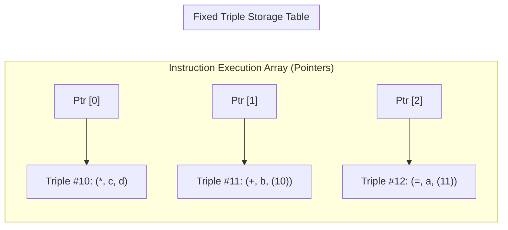

# Intermediate Representations and Three-Address Code

> 📖 **Reading Order:** Step 10 of 55 | **Module 2:** Intermediate Code Generation  
> ◄ **Previous:** [[Problem — Desk Calculator SDD and Annotated Parse Tree]] | ► **Next:** [[Value-Number Method for DAG Construction]]

---

## Building the idea

Source expressions are convenient for programmers, while machine instructions are specific to one target. An **intermediate representation (IR)** gives the compiler a common structure on which to analyze and transform programs before selecting target instructions.

Three-address code breaks an illustrative `a=b+c*d` into `t1=c*d` followed by `a=b+t1`. Each step exposes an operation and its inputs. A temporary name connects the produced value with later uses; it is not necessarily a physical register or memory slot yet.

Quadruples store explicit result names. Triples refer to results through instruction positions, making rearrangement require careful reference maintenance. Indirect triples add a separate instruction ordering structure. These are storage choices for the IR, not different meanings of the expression.

[[Abstract Syntax Tree Construction with SDDs]] retains expression hierarchy. TAC instead exposes an execution sequence, preparing for [[Basic Blocks and Control Flow Graphs]] and later register allocation.

## How It Works

### The 3 Physical Data Structures for Three-Address Code

How does a compiler store Three-Address Code in memory? There are three classic representations:

### 1. Quadruples ("Quads")
A quadruple is a struct with four explicit fields: `(op, arg1, arg2, result)`.

```
Statement: a = b + c * d

Quad # | op | arg1 | arg2 | result
---------------------------------
(0)    | *  | c    | d    | t1
(1)    | +  | b    | t1   | a
```
- **The Good:** Temporary names (`t1`) are explicit. If the optimizer moves instruction (0) down or reorders instructions, instruction (1) still safely refers to `t1` without breaking!
- **The Bad:** Consumes extra memory allocating string/symbol table entries for dozens of temporary variables.

---

### 2. Triples: Eliminating Temporary Variables
To save memory, a **Triple** record uses only three fields: `(op, arg1, arg2)`. 

Where does the result go? **The result of the operation is implicitly referred to by the array index of the triple itself!**

```
Statement: a = b + c * d

Triple # | op | arg1 | arg2
---------------------------
(0)      | *  | c    | d
(1)      | +  | b    | (0)     <-- Refers to the result of Triple (0)!
(2)      | =  | a    | (1)
```
- **The Good:** Saves memory. No temporary variable names exist.
- **The Nightmare (Why Optimizers Hate Triples):**  
  Suppose the optimizer decides to move Triple (0) to index (4) or delete an unused instruction at index (0). 
  Every single instruction across the entire function that referenced `(0)` now becomes broken and must be searched and rewritten! Code motion with Triples is an $O(N^2)$ software disaster.

---

### 3. Indirect Triples: The Compromise of the Gods
How can you avoid temporary variable names *and* allow effortless instruction reordering during optimization?

**Indirect Triples** decouple the instructions from their physical memory array by introducing an **array of pointers**:



- Triples are stored in a fixed, immovable table.
- The actual program order is dictated purely by the **Pointer Array**.
- **Want to reorder instructions?** You never modify the triples! You simply swap two pointers in the pointer array!

---

### Static Single Assignment (SSA) Form: The Modern Compiler Revolution

In traditional code, a variable can be assigned multiple times:
```
y = 1
y = y + 2
...
print(y)
```
If you want to know whether `print(y)` can be replaced with `print(3)` (Constant Propagation), you have to perform a complex, slow data-flow analysis to ensure no other branch ever reassigned `y`.

In **Static Single Assignment (SSA)** form, the compiler enforces two revolutionary invariants:
1. **Every variable is assigned a value EXACTLY ONCE.**
2. **Every use of a variable is dominated by exactly one definition.**

Whenever variable $y$ is reassigned, the compiler mints a new subscripted variable name ($y_1, y_2, y_3$):
```
y1 = 1
y2 = y1 + 2
...
print(y2)
```
Now, because $y_1$ is never reassigned, the compiler knows with **$100\%$ certainty** that $y_1$ is *always* 1, and $y_2$ is *always* 3, everywhere!

---

### The Mystery of Branch Merges: The $\phi$-Function
What happens when code branches and merges?
```
if (condition) {
    x = 1;
} else {
    x = 2;
}
print(x);
```
In SSA form:
```
if (condition) {
    x1 = 1;
} else {
    x2 = 2;
}
x3 = phi(x1, x2);   // Which one does x3 get?
print(x3);
```

The mathematical operator **$\phi$ (phi)** is placed at the control-flow join point. It dynamically selects between $x_1$ and $x_2$ depending on which incoming branch reached this block at runtime!

SSA form is the foundational representation inside GCC, LLVM, Java HotSpot, and the JavaScript V8 JIT engine.

---

## What to carry forward

“Three-address” describes the usual bounded operand/result structure, not a requirement that every instruction contain exactly three addresses. Jumps, copies, calls, and loads have their own forms.

## Related notes

- [[Abstract Syntax Tree Construction with SDDs]]
- [[Basic Blocks and Control Flow Graphs]]

## Sources

- **Lecture Slides:** [[cse309/01 - Sources/Lectures/KMS Merged.pdf|KMS Merged.pdf]], Chapter 6 (Slides 82–117).
- **Textbook:** Aho, Lam, Sethi, Ullman, *Compilers: Principles, Techniques, & Tools* (2nd Ed.), Section 6.1 & 6.2.
