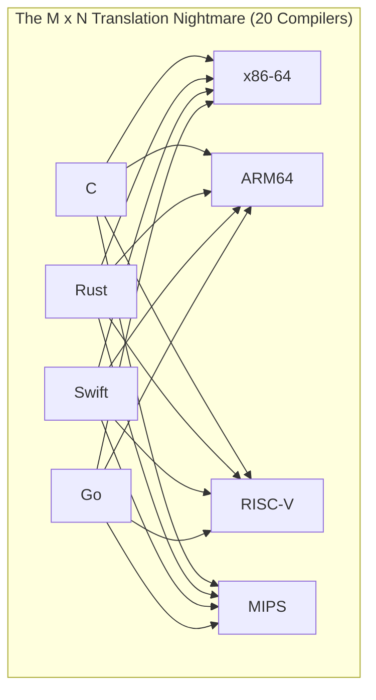
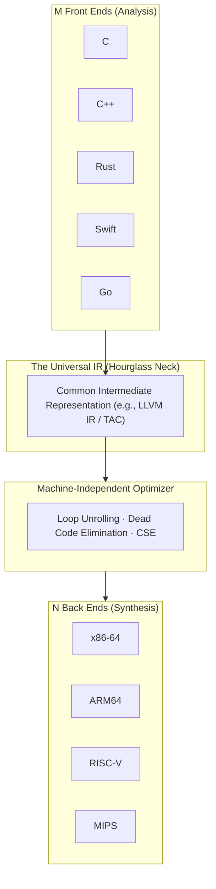
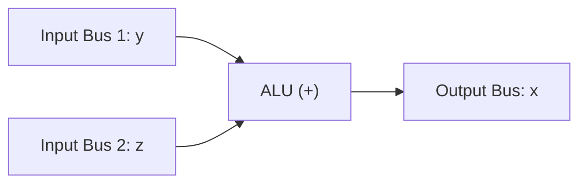
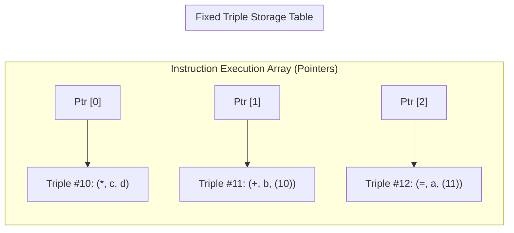

# Intermediate Representations and Three-Address Code

> 📖 **Reading Order:** Step 10 of 55 | **Module 2: Intermediate Code Generation**  
> ◄ **Previous:** [[Problem — Desk Calculator SDD and Annotated Parse Tree]] | ► **Next:** [[Value-Number Method for DAG Construction]]

---

## Starting Point and the Problem

To appreciate why Intermediate Representations (IR) exist, imagine life without them.

Suppose you want to build compilers for 5 modern source languages (C, C++, Rust, Swift, Go) targeting 4 different hardware microprocessors (x86-64, ARM64, RISC-V, MIPS).

### The $M \times N$ Nightmare:
If you translate source code directly to machine assembly, you must write a dedicated compiler for every single (Language, Architecture) pair:
$$\text{Compilers to write} = 5 \times 4 = \mathbf{20 \text{ monolithic compilers!}}$$



Every time someone invents a new language (like Julia), they must write 4 separate back ends. Every time hardware engineers release a new chip architecture, they must rewrite 5 separate front ends!

Even worse: where do you put code optimization? If you discover a brilliant algorithm to optimize loops, you would have to reimplement it 20 times!

---

### The Hourglass Architectural Breakthrough:
Instead of direct translation, we introduce a universal, machine-independent pivot point in the middle: the **Intermediate Representation (IR)**.



Now, the total number of components drops from $M \times N$ to:
$$M + N = 5 + 4 = \mathbf{9 \text{ components!}}$$

This is the architectural foundation of the **LLVM Compiler Infrastructure**:
- Clang (C/C++), `rustc` (Rust), and `swiftc` (Swift) all compile down to the **exact same LLVM IR**.
- A single optimizer optimizes LLVM IR for everyone.
- The back ends translate optimized LLVM IR into machine code for all CPUs.

---

## Developing the Idea

Why do compilers linearize trees into **Three-Address Code**? Why specifically **THREE** addresses?

### The Silicon Hardware Reality:
Look inside a physical microprocessor. At the center of the CPU sits the **Arithmetic Logic Unit (ALU)**. 
- An ALU has **two input buses** and **one output bus**.
- It can add two numbers and produce one result:
  $$\text{Input}_1 + \text{Input}_2 \longrightarrow \text{Output}$$



A hardware ALU **cannot** evaluate $a + b * c - d / e$ all at once! 

Therefore, a compiler must decompose complex high-level expressions into an assembly-like stream of atomic operations where each instruction references **at most two operands and one result**:
$$\mathbf{x = y \text{ op } z}$$

To hold intermediate results between steps, the compiler invents synthetic variables called **temporaries** (`t1`, `t2`, etc.).

---

## Definition

**Intermediate Representations and Three-Address Code** is a formal compiler mechanism that structures syntax-directed translation, intermediate representations, runtime environments, or code generation.

---

## How It Works

### The 3 Physical Data Structures for Three-Address Code

How does a compiler store Three-Address Code in memory? There are three classic representations:

### 1. Quadruples ("Quads")
A quadruple is a struct with four explicit fields: `(op, arg1, arg2, result)`.

```
Statement: a = b + c * d

Quad # | op | arg1 | arg2 | result
---------------------------------
(0)    | *  | c    | d    | t1
(1)    | +  | b    | t1   | a
```
- **The Good:** Temporary names (`t1`) are explicit. If the optimizer moves instruction (0) down or reorders instructions, instruction (1) still safely refers to `t1` without breaking!
- **The Bad:** Consumes extra memory allocating string/symbol table entries for dozens of temporary variables.

---

### 2. Triples: Eliminating Temporary Variables
To save memory, a **Triple** record uses only three fields: `(op, arg1, arg2)`. 

Where does the result go? **The result of the operation is implicitly referred to by the array index of the triple itself!**

```
Statement: a = b + c * d

Triple # | op | arg1 | arg2
---------------------------
(0)      | *  | c    | d
(1)      | +  | b    | (0)     <-- Refers to the result of Triple (0)!
(2)      | =  | a    | (1)
```
- **The Good:** Saves memory. No temporary variable names exist.
- **The Nightmare (Why Optimizers Hate Triples):**  
  Suppose the optimizer decides to move Triple (0) to index (4) or delete an unused instruction at index (0). 
  Every single instruction across the entire function that referenced `(0)` now becomes broken and must be searched and rewritten! Code motion with Triples is an $O(N^2)$ software disaster.

---

### 3. Indirect Triples: The Compromise of the Gods
How can you avoid temporary variable names *and* allow effortless instruction reordering during optimization?

**Indirect Triples** decouple the instructions from their physical memory array by introducing an **array of pointers**:



- Triples are stored in a fixed, immovable table.
- The actual program order is dictated purely by the **Pointer Array**.
- **Want to reorder instructions?** You never modify the triples! You simply swap two pointers in the pointer array!

---

### Technical Details

### Static Single Assignment (SSA) Form: The Modern Compiler Revolution

In traditional code, a variable can be assigned multiple times:
```
y = 1
y = y + 2
...
print(y)
```
If you want to know whether `print(y)` can be replaced with `print(3)` (Constant Propagation), you have to perform a complex, slow data-flow analysis to ensure no other branch ever reassigned `y`.

In **Static Single Assignment (SSA)** form, the compiler enforces two revolutionary invariants:
1. **Every variable is assigned a value EXACTLY ONCE.**
2. **Every use of a variable is dominated by exactly one definition.**

Whenever variable $y$ is reassigned, the compiler mints a new subscripted variable name ($y_1, y_2, y_3$):
```
y1 = 1
y2 = y1 + 2
...
print(y2)
```
Now, because $y_1$ is never reassigned, the compiler knows with **$100\%$ certainty** that $y_1$ is *always* 1, and $y_2$ is *always* 3, everywhere!

---

### The Mystery of Branch Merges: The $\phi$-Function
What happens when code branches and merges?
```
if (condition) {
    x = 1;
} else {
    x = 2;
}
print(x);
```
In SSA form:
```
if (condition) {
    x1 = 1;
} else {
    x2 = 2;
}
x3 = phi(x1, x2);   // Which one does x3 get?
print(x3);
```

The mathematical operator **$\phi$ (phi)** is placed at the control-flow join point. It dynamically selects between $x_1$ and $x_2$ depending on which incoming branch reached this block at runtime!

SSA form is the foundational representation inside GCC, LLVM, Java HotSpot, and the JavaScript V8 JIT engine.

---

## Example

Detailed walkthroughs and traces are provided in the corresponding example and problem notes.

---

## Technical Details

Target architecture and ABI specifications govern low-level alignment and register assignments.

---

## Important Properties and Why They Hold

- **Semantic Soundness:** Preserves program execution equivalence.
- **Algorithmic Efficiency:** Operates in low polynomial or linear time over the program structure.

---

## Common Mistakes

- Confusing syntactic validity with semantic correctness.
- Overlooking variable scoping or memory aliasing side effects.

---

## Exam Relevance

Tested regularly in compiler examinations via syntax-directed translation proofs, activation record diagrams, and control flow optimization problems.

---

## Related Concepts

- [[Value-Number Method for DAG Construction]]
- [[Type Expressions and Storage Layout]]
- [[Control Flow Translation and Boolean Expressions]]

---

## Prerequisites

- [[Syntax-Directed Definitions and Translation Schemes]]

---

## Problems

- [[Problem — Array Reference Three-Address Code Generation]]

---

## Sources

- **Lecture Slides:** [[cse309/01 - Sources/Lectures/KMS Merged.pdf|KMS Merged.pdf]], Chapter 6 (Slides 82–117).
- **Textbook:** Aho, Lam, Sethi, Ullman, *Compilers: Principles, Techniques, & Tools* (2nd Ed.), Section 6.1 & 6.2.
