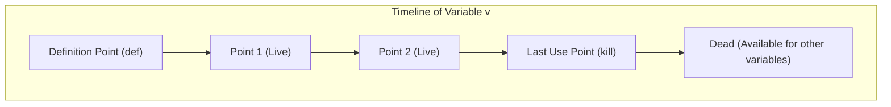

# Live Ranges and Live Intervals in Register Allocation

> 📖 **Reading Order:** Step 43 of 55 | **Module 5:** Register Allocation  
> ◄ **Previous:** [[Problem — DAG Optimization of Basic Block with Array Store]] | ► **Next:** [[Register Interference Graphs and Graph Coloring Principles]]

---

---

---

---

---

## Starting Point and the Problem

In high-level languages, programs can contain hundreds or thousands of variables and temporaries. However, physical microprocessors typically possess only a modest number of general-purpose hardware registers (e.g., 16 in x86-64, 32 in ARM64 or RISC-V).

To execute the program without running out of registers, the compiler must allocate physical registers so that **two variables share the same hardware register if and only if they are never needed at the same time**.

To determine when variables are in use, compilers compute **Live Ranges** and **Live Intervals**.

---

---

---

---

---

## Developing the Idea



### 1. Live Variable
A variable $v$ is **live** at a program point $p$ if its current value may be read along some future execution path before it is overwritten by a new definition.

### 2. Live Range
The exact set of program points $\{ p_1, p_2, \dots, p_k \}$ where variable $v$ is live. In general flow graphs with branches and loops, a live range may have holes or disjoint branches.

### 3. Live Interval
A 1-dimensional, contiguous approximation of a variable's live range represented as a numeric interval:
$$[ \text{start}, \text{end} ]$$
- $\text{start}$: The earliest instruction index where the variable is defined or becomes live.
- $\text{end}$: The latest instruction index where the variable is used for the last time.

```
Program Point: 0    1    2    3    4    5    6    7    8    9    10
a:             |====|                                                [0, 1]
b:             |=========|                                           [0, 3]
c:             |========================|                            [0, 7]
d:             |=============================|                       [0, 8]
e:                  |=============================|                  [1, 9]
f:                       |========================|                  [2, 9]
g:                                                |====|             [9, 10]
```

---

---

---

---

---

## Definition

**Live Ranges and Live Intervals in Register Allocation** is a formal compiler mechanism that structures syntax-directed translation, intermediate representations, runtime environments, or code generation.

---

---

---

---

## How It Works

### How It Works

### How It Works

### How It Works

### Live Range Splitting

When register pressure is high, a single variable with a long live interval may conflict with many other variables:

```
Variable x:   [------------------ Long Live Interval ------------------]
Contenders:        [-- a --]        [-- b --]        [-- c --]
```
If we must spill $x$, spilling $x$ across the *entire* program generates heavy memory traffic.

**Live Range Splitting** divides the long interval of $x$ into smaller independent sub-intervals $[s_1, e_1]$ and $[s_2, e_2]$ separated by explicit spill stores and loads. This allows $x$ to occupy a register during critical inner loops and spill to memory only during intermediate dormant periods.

---

---
### Technical Details

### Register Interference

Two variables $u$ and $v$ **interfere** with each other if their live intervals **overlap**:
$$[ \text{start}_u, \text{end}_u ] \cap [ \text{start}_v, \text{end}_v ] \ne \emptyset$$

### The Golden Rule of Register Allocation:
If two variables interfere, they **CANNOT** be assigned the same physical hardware register. If their live intervals are completely disjoint ($[ \text{start}_u, \text{end}_u ] \cap [ \text{start}_v, \text{end}_v ] = \emptyset$), they can safely share the same physical register!

---
### Trade-Off: Precise Live Ranges vs. Live Intervals

| Representation | Precision | Algorithmic Paradigm | Primary Use Case |
| :--- | :--- | :--- | :--- |
| **Live Intervals** ($[s, e]$) | Conservative (ignores holes between uses) | [[Linear Scan Register Allocation Algorithm]] | Just-In-Time (JIT) Compilers (V8, JVM HotSpot) where compilation speed is paramount. |
| **Exact Live Ranges** | Highly precise | [[Chaitin's Graph Coloring Register Allocation Algorithm]] | Ahead-of-Time (AOT) Compilers (GCC, Clang/LLVM) optimizing for maximum execution performance. |

---

---
### Important Properties and Why They Hold

- **Semantic Soundness:** Preserves program execution equivalence.
- **Algorithmic Efficiency:** Operates in low polynomial or linear time over the program structure.

---
### Related Concepts

- [[Syntax-Directed Definitions and Translation Schemes]]
- [[Intermediate Representations and Three-Address Code]]
- [[Basic Blocks and Control Flow Graphs]]

---
### Prerequisites

- [[Syntax-Directed Definitions and Translation Schemes]]

---
### Problems

- [[Problem — Desk Calculator SDD and Annotated Parse Tree]]
- [[Problem — Array Reference Three-Address Code Generation]]

---

---
### Technical Details

Target architecture and ABI specifications govern low-level alignment and register assignments.

---
### Important Properties and Why They Hold

- **Semantic Soundness:** Preserves program execution equivalence.
- **Algorithmic Efficiency:** Operates in low polynomial or linear time over the program structure.

---
### Related Concepts

- [[Syntax-Directed Definitions and Translation Schemes]]
- [[Intermediate Representations and Three-Address Code]]
- [[Basic Blocks and Control Flow Graphs]]

---
### Prerequisites

- [[Syntax-Directed Definitions and Translation Schemes]]

---
### Problems

- [[Problem — Desk Calculator SDD and Annotated Parse Tree]]
- [[Problem — Array Reference Three-Address Code Generation]]

---

---
### Technical Details

Target architecture and ABI specifications govern low-level alignment and register assignments.

---
### Important Properties and Why They Hold

- **Semantic Soundness:** Preserves program execution equivalence.
- **Algorithmic Efficiency:** Operates in low polynomial or linear time over the program structure.

---
### Related Concepts

- [[Syntax-Directed Definitions and Translation Schemes]]
- [[Intermediate Representations and Three-Address Code]]
- [[Basic Blocks and Control Flow Graphs]]

---
### Prerequisites

- [[Syntax-Directed Definitions and Translation Schemes]]

---
### Problems

- [[Problem — Desk Calculator SDD and Annotated Parse Tree]]
- [[Problem — Array Reference Three-Address Code Generation]]

---

---

## Example

Detailed walkthroughs and traces are provided in the corresponding example and problem notes.

---

## Technical Details

Target architecture and ABI specifications govern low-level alignment and register assignments.

---

## Important Properties and Why They Hold

- **Semantic Soundness:** Preserves program execution equivalence.
- **Algorithmic Efficiency:** Operates in low polynomial or linear time over the program structure.

---

## Common Mistakes

### Common Mistakes

### Common Mistakes

### Common Mistakes

- Confusing syntactic validity with semantic correctness.
- Overlooking variable scoping or memory aliasing side effects.

---

---

---

---

## Exam Relevance

### Example

Detailed walkthroughs and traces are provided in the corresponding example and problem notes.

---
### Exam Relevance

### Example

Detailed walkthroughs and traces are provided in the corresponding example and problem notes.

---
### Exam Relevance

### Example

Detailed walkthroughs and traces are provided in the corresponding example and problem notes.

---
### Exam Relevance

Tested regularly in compiler examinations via syntax-directed translation proofs, activation record diagrams, and control flow optimization problems.

---

---

---

---

## Related Concepts

- [[Syntax-Directed Definitions and Translation Schemes]]
- [[Intermediate Representations and Three-Address Code]]
- [[Basic Blocks and Control Flow Graphs]]

---

## Prerequisites

- [[Syntax-Directed Definitions and Translation Schemes]]

---

## Problems

- [[Problem — Desk Calculator SDD and Annotated Parse Tree]]
- [[Problem — Array Reference Three-Address Code Generation]]

---

## Sources

- **Lecture Slides:** [[cse309/01 - Sources/Lectures/KMS Merged.pdf|KMS Merged.pdf]], Register Allocation (Slides 366–390).
- **Textbook / Papers:** Poletto & Sarkar, "Linear Scan Register Allocation", ACM TOPLAS 1999; Aho, Lam, Sethi, Ullman, *Compilers: Principles, Techniques, & Tools* (2nd Ed.), Section 8.8.
