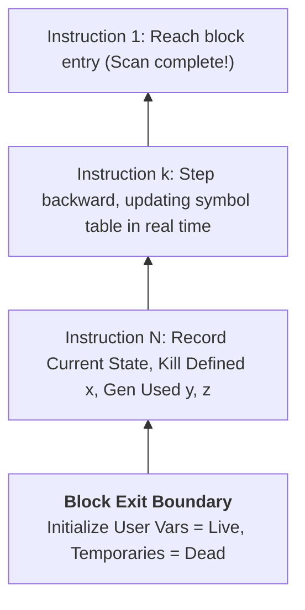

# Liveness and Next-Use Analysis within Basic Blocks

> 📖 **Reading Order:** Step 35 of 55 | **Module 4:** Code Generation  
> ◄ **Previous:** [[Basic Block Partitioning Algorithm]] | ► **Next:** [[DAG Construction and Local Optimization of Basic Blocks]]

---

## Building the idea

A value is **live** at a point when some possible continuation uses that value before overwriting it. **Next use** identifies the next relevant read in the chosen local instruction order. This information tells a generator which register contents can be discarded.

Scan backward because the suffix has already been analyzed when you reach an earlier instruction. For `x=y+z`, the assignment kills the incoming value of x, while the right-hand-side uses require y and z immediately before the instruction. In set form, `live_before = uses ∪ (live_after - defs)`.

Record the after-state for the instruction, then compute its before-state. This order matters for `x=x+1`: the new x is defined, but the old x is read. Applying uses after the definition kill restores that required incoming value.

[[Basic Blocks and Control Flow Graphs]] supplies the straight-line region. Live-out assumptions come from surrounding code or global analysis; user variables are not automatically all live and temporaries are not automatically all dead.

## How It Works

### The Backward Scan: Traveling Against the Arrow of Time

How do we compute the next-use of a variable?

> [!TIP] The Time-Travel Intuition: Why Scan Backwards?
> Can you know whether you will need an umbrella tomorrow by looking at what you did yesterday? Obviously not! Future needs cannot be seen by looking backward into the past.
> 
> If the compiler scanned instructions **forward** (from instruction $1$ to $N$), when it reached $t_1 = a * b$, it would have to pause and search through future instructions to see where $t_1$ was next used.
> 
> By scanning **backwards** (from instruction $N$ down to $1$), the compiler travels *against the arrow of time*! When it passes instruction $j$ that reads $t_1$, it records: *"I just witnessed a need for $t_1$ at line $j$!"* As it continues walking backward toward line $i$, it carries that future knowledge with it. The instant it arrives at line $i$, it already knows exactly when line $j$ will use it!



---
### Step 1: Initialization at Block Exit
Inspect the symbol table at the exit boundary of basic block $B$:
- **User / Named Variables (`a, b, x`):** Assume they are **live** at block exit (since other basic blocks in the CFG might read them later), with next-use set to **none**.
- **Compiler Temporaries (`t1, t2`):** Assume they are **dead** at block exit with next-use **none** (temporaries generated within a block do not survive outside the block unless explicitly global).

### Step 2: Backward Iteration
For each instruction $i: x = y + z$, scanning from the last instruction of $B$ backwards to the first instruction:

1. **Attach Current Information to Instruction $i$:**
   - Record the current status of $x, y, z$ in the instruction's metadata:
     $$\text{attach}(i, \; x: \text{status}(x), \; y: \text{status}(y), \; z: \text{status}(z))$$
2. **Process the Defined Variable ($x$):**
   - In the symbol table:
     $$\text{liveness}(x) = \mathbf{Dead}$$
     $$\text{next\_use}(x) = \mathbf{None}$$
   - *Rationale:* Statement $i$ generates a fresh definition of $x$. Any computation occurring *before* statement $i$ cannot read this newly computed value of $x$. The definition kills the preceding live range!
3. **Process the Used Variables ($y$ and $z$):**
   - In the symbol table:
     $$\text{liveness}(y) = \mathbf{Live}, \quad \text{next\_use}(y) = i$$
     $$\text{liveness}(z) = \mathbf{Live}, \quad \text{next\_use}(z) = i$$
   - *Rationale:* Statement $i$ reads the values of $y$ and $z$. Therefore, looking backward from statement $i$, both variables must be alive, and their next use is precisely statement $i$!

---
### The Final Annotated Instruction Stream

| Line # | Instruction | Attached Liveness & Next-Use Metadata |
| :---: | :---: | :--- |
| **(1)** | `t1 = a * b` | $t_1$: Dead, Next-Use: none <br> $a$: Live, Next-Use: **(3)** <br> $b$: Live, Next-Use: none |
| **(2)** | `t2 = t1 + c` | $t_2$: Dead, Next-Use: none <br> $t_1$: Live, Next-Use: **(2)** <br> $c$: Live, Next-Use: none |
| **(3)** | `d = t2 * a` | $d$: Live, Next-Use: none <br> $t_2$: Live, Next-Use: **(3)** <br> $a$: Live, Next-Use: none |

> [!NOTE] Compiler Decision from Metadata
> Look at Line (2): $t_1$ is marked as having its next use at Line (2). Once Line (2) finishes executing, $t_1$'s physical register can be **immediately freed or reused** without storing $t_1$ to RAM, because $t_1$ is never read again!

---

### Theorem:
*At the instant the backward scan reaches statement $i$, the symbol table correctly reflects the liveness and next-use of every variable at the program point immediately preceding statement $i$.*

### Proof by Mathematical Induction:
Let the basic block contain $N$ instructions: $\langle I_1, I_2, \dots, I_N \rangle$. We induct on the number of backward steps $k = N - i + 1$.

1. **Base Case ($k = 0$, Block Exit):**
   - By definition of basic block boundaries, user variables are preserved across blocks, and local temporaries are dead. The initial table state matches the boundary definition.
2. **Inductive Hypothesis:**
   - Assume that after scanning backwards from $I_N$ up to $I_{m+1}$, the symbol table accurately reflects the liveness and next-use immediately preceding instruction $I_{m+1}$.
3. **Inductive Step (Processing $I_m: x = y \oplus z$):**
   - The state immediately following $I_m$ is identical to the state immediately preceding $I_{m+1}$ (straight-line sequential execution).
   - Instruction $I_m$ writes to $x$. Any variable read occurring before $I_m$ cannot read the value produced by $I_m$. If $x$ was used in $I_m$, that was a use; but $x$ is defined on the LHS, so any value of $x$ prior to $I_m$ is killed. Thus, setting $x = (\text{Dead}, \text{None})$ correctly reflects the state before $I_m$.
   - Instruction $I_m$ reads $y$ and $z$. Therefore, in any code preceding $I_m$, $y$ and $z$ must be preserved in registers/memory to reach $I_m$. The next instruction reading them is $I_m$. Setting $y = (\text{Live}, m)$ and $z = (\text{Live}, m)$ accurately updates their state.
   - For all other variables $w \notin \{x, y, z\}$, $I_m$ neither defines nor uses $w$. Their liveness and next-use values pass through unchanged, which is correct.
4. By induction, when the scan reaches instruction 1, the attached metadata at every statement is mathematically exact. $\blacksquare$

---

## Exam Relevance

---

### Comprehensive Trace: 3-Instruction Block

Consider the basic block:
```text
(1)  t1 = a * b
(2)  t2 = t1 + c
(3)  d = t2 * a
```
Assume user variables $a, b, c, d$ are live at block exit, and temporaries $t_1, t_2$ are dead.

### Step-by-Step Backward Scan Walkthrough:

```
Initial State (at exit after line 3):
Symbol Table: { a: (L, -),  b: (L, -),  c: (L, -),  d: (L, -),  t1: (D, -),  t2: (D, -) }
```

#### 1. Processing Line (3): `d = t2 * a`
- **Attach Info:**
  - $d$: Live, Next-Use: None
  - $t_2$: Dead, Next-Use: None
  - $a$: Live, Next-Use: None
- **Update Table:**
  - $d$ defined $\implies d$: **(Dead, None)**
  - $t_2$ used $\implies t_2$: **(Live, 3)**
  - $a$ used $\implies a$: **(Live, 3)**
- **Table State:** `{ a: (L, 3), b: (L, -), c: (L, -), d: (D, -), t1: (D, -), t2: (L, 3) }`

#### 2. Processing Line (2): `t2 = t1 + c`
- **Attach Info:**
  - $t_2$: Live, Next-Use: (3)
  - $t_1$: Dead, Next-Use: None
  - $c$: Live, Next-Use: None
- **Update Table:**
  - $t_2$ defined $\implies t_2$: **(Dead, None)**
  - $t_1$ used $\implies t_1$: **(Live, 2)**
  - $c$ used $\implies c$: **(Live, 2)**
- **Table State:** `{ a: (L, 3), b: (L, -), c: (L, 2), d: (D, -), t1: (L, 2), t2: (D, -) }`

#### 3. Processing Line (1): `t1 = a * b`
- **Attach Info:**
  - $t_1$: Live, Next-Use: (2)
  - $a$: Live, Next-Use: (3)
  - $b$: Live, Next-Use: None
- **Update Table:**
  - $t_1$ defined $\implies t_1$: **(Dead, None)**
  - $a$ used $\implies a$: **(Live, 1)**
  - $b$ used $\implies b$: **(Live, 1)**
- **Final Table at Entry:** `{ a: (L, 1), b: (L, 1), c: (L, 2), d: (D, -), t1: (D, -), t2: (D, -) }`

---

## What to carry forward

[[A Simple Code Generator Algorithm]] uses the resulting information to preserve needed values and reuse dead registers. Specify whether each table row describes the state before or after its instruction; otherwise two correct conventions can appear contradictory.

## Related notes

- [[Basic Blocks and Control Flow Graphs]]
- [[A Simple Code Generator Algorithm]]

## Sources

- **Lecture Slides:** [[cse309/01 - Sources/Lectures/KMS Merged.pdf|KMS Merged.pdf]], Chapter 8 (Slides 332–334).
- **Textbook:** Aho, Lam, Sethi, Ullman, *Compilers: Principles, Techniques, & Tools* (2nd Ed.), Section 8.4.2 (Next-Use Information).
