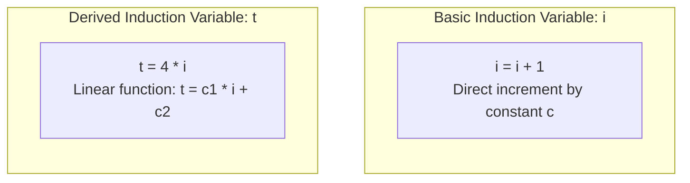

# Loop Optimizations and Strength Reduction

> 📖 **Reading Order:** Step 53 of 55 | **Module 6: Machine-Independent Optimization**  
> ◄ **Previous:** [[Global Common Subexpression Elimination and Copy Propagation]] | ► **Next:** [[Quicksort Partition Loop Complete Optimization Example]]

---

## Starting Point and the Problem

In computer systems, the empirical **90/10 Rule** states:
> *A computer program spends 90% of its execution time executing only 10% of its code—specifically, inside inner loops!*

Optimizing straight-line code executed once at program startup delivers negligible user-visible impact. In contrast, removing even a **single instruction** or replacing an expensive ALU operation inside an inner loop executed 10,000,000 times saves tens of millions of CPU clock cycles!

Loop optimization focuses on three primary transformations:
1. **Loop-Invariant Code Motion (Hoisting):** Moving computations that yield the identical result in every iteration outside the loop.
2. **Induction Variable Strength Reduction:** Replacing expensive CPU operations (multiplication) with cheaper operations (addition).
3. **Induction Variable Elimination:** Completely eliminating redundant loop counter variables and their branch instructions.

---

## Developing the Idea

By establishing clear semantic rules and evaluation invariants, the compiler evaluates attributes, manages memory layouts, or optimizes instruction sequences.

---

## Definition

**Loop Optimizations and Strength Reduction** is a formal compiler mechanism that structures syntax-directed translation, intermediate representations, runtime environments, or code generation.

---

## How It Works

### Induction Variables: Basic vs. Derived

Inside loops, variables that track loop progress (such as loop indices and array byte offsets) are called **Induction Variables**:



### 3.1 Basic Induction Variable (BIV)
A variable $i$ is a **Basic Induction Variable** of loop $L$ if its only definitions inside $L$ are assignments of the form:
$$i = i \pm c$$
where $c$ is a loop-invariant constant.

### 3.2 Derived Induction Variable (DIV)
A variable $j$ is a **Derived Induction Variable** of loop $L$ if its value is a linear function of a basic induction variable $i$:
$$j = c_1 \times i + c_2$$
where $c_1$ and $c_2$ are loop-invariant constants.
- *Origin:* Derived induction variables are automatically synthesized in intermediate code whenever source code indexes an array: `a[i]` generates `t = 4 * i`.

---

### Induction Variable Elimination: Deleting the Loop Counter

Once strength reduction converts all array index multiplications into additions:
```text
; Before Elimination:
t = t + 4
x = a[t]
i = i + 1
if i <= 100 goto Loop
```
Notice something extraordinary:
- Variable $i$ is incremented (`i = i + 1`) and compared (`i <= 100`), but **its value is never used anywhere else in the loop**!
- We are running CPU instructions and burning a hardware register solely to maintain an abstract counter!

### Eliminating the Counter via Test Replacement:
Since $t = 4 \times i$, the inequality $i \le 100$ is mathematically equivalent to:
$$4 \times i \le 4 \times 100 \iff t \le 400$$

The compiler transforms the loop exit test:
$$\text{if } i \le 100 \text{ goto Loop} \quad \Longrightarrow \quad \mathbf{\text{if } t \le 400 \text{ goto Loop}}$$

Now, the instruction $i = i + 1$ has zero readers! **Dead Code Elimination deletes $i = i + 1$ completely.**

### The Cumulative Silicon Victory:
1. Multiplication `t = 4 * i` ($4$ cycles) $\longrightarrow$ Replaced by Addition `t = t + 4` ($1$ cycle).
2. Counter increment `i = i + 1` ($1$ cycle) $\longrightarrow$ **Completely Deleted** ($0$ cycles).
3. Physical register holding `i` $\longrightarrow$ **Freed for other variables**, preventing register spilling!

---

## Example

Detailed walkthroughs and traces are provided in the corresponding example and problem notes.

---

## Technical Details

Target architecture and ABI specifications govern low-level alignment and register assignments.

---

## Important Properties and Why They Hold

- **Semantic Soundness:** Preserves program execution equivalence.
- **Algorithmic Efficiency:** Operates in low polynomial or linear time over the program structure.

---

## Common Mistakes

- Confusing syntactic validity with semantic correctness.
- Overlooking variable scoping or memory aliasing side effects.

---

## Exam Relevance

Tested regularly in compiler examinations via syntax-directed translation proofs, activation record diagrams, and control flow optimization problems.

---

## Related Concepts

- [[Global Common Subexpression Elimination and Copy Propagation]]
- [[Quicksort Partition Loop Complete Optimization Example]]

---

## Prerequisites

- [[Principal Sources of Code Optimization]]

---

## Problems

- [[Problem — Quicksort Loop Induction Variable Strength Reduction]]

---

## Sources

- **Lecture Slides:** [[cse309/01 - Sources/Lectures/KMS Merged.pdf|KMS Merged.pdf]], Chapter 9 (Slides 558–565).
- **Textbook:** Aho, Lam, Sethi, Ullman, *Compilers: Principles, Techniques, & Tools* (2nd Ed.), Section 9.1.3 (Loop Invariant Code Motion) & Section 9.1.4 (Induction Variables and Strength Reduction).
