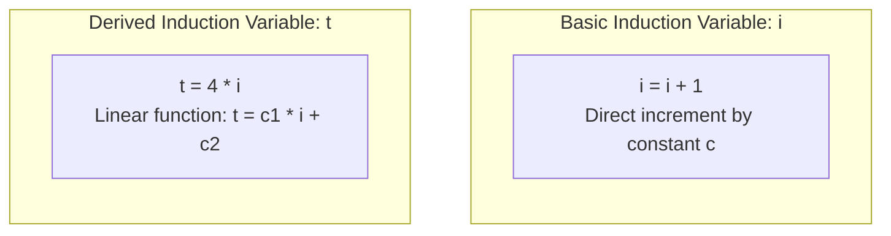

# Loop Optimizations and Strength Reduction

> 📖 **Reading Order:** Step 53 of 55 | **Module 6:** Machine-Independent Optimization  
> ◄ **Previous:** [[Global Common Subexpression Elimination and Copy Propagation]] | ► **Next:** [[Quicksort Partition Loop Complete Optimization Example]]

---

## Building the idea

Loops repeat work, so a small legal saving per iteration can accumulate. **Loop-invariant code motion** moves a computation whose value does not change, but must also preserve whether and when observable effects or exceptions occur. Hoisting a possibly trapping division into a preheader can change a zero-iteration execution.

**Strength reduction** tracks a value incrementally. If i increases by c and t=a·i+b, then t changes by a·c. Initialize t consistently before the loop, and replace each repeated multiplication with the corresponding addition at the correct point.

The proof is an invariant: t=a·i+b holds initially; updating i by c and t by a·c preserves it algebraically. [[Principal Sources of Code Optimization]] supplies the equivalence obligation, and [[Multi-Dimensional Array Addressing Formulas]] explains why address offsets often have this form.

Removing i afterward is a separate step: all its uses, including the termination test and any live-out value, must be replaced or preserved.

## How It Works

### Induction Variables: Basic vs. Derived

Inside loops, variables that track loop progress (such as loop indices and array byte offsets) are called **Induction Variables**:



### 3.1 Basic Induction Variable (BIV)
A variable $i$ is a **Basic Induction Variable** of loop $L$ if its only definitions inside $L$ are assignments of the form:
$$i = i \pm c$$
where $c$ is a loop-invariant constant.

### 3.2 Derived Induction Variable (DIV)
A variable $j$ is a **Derived Induction Variable** of loop $L$ if its value is a linear function of a basic induction variable $i$:
$$j = c_1 \times i + c_2$$
where $c_1$ and $c_2$ are loop-invariant constants.
- *Origin:* Derived induction variables are automatically synthesized in intermediate code whenever source code indexes an array: `a[i]` generates `t = 4 * i`.

---
### Induction Variable Elimination: Deleting the Loop Counter

Once strength reduction converts all array index multiplications into additions:
```text
; Before Elimination:
t = t + 4
x = a[t]
i = i + 1
if i <= 100 goto Loop
```
Notice something extraordinary:
- Variable $i$ is incremented (`i = i + 1`) and compared (`i <= 100`), but **its value is never used anywhere else in the loop**!
- We are running CPU instructions and burning a hardware register solely to maintain an abstract counter!

### Eliminating the Counter via Test Replacement:
Since $t = 4 \times i$, the inequality $i \le 100$ is mathematically equivalent to:
$$4 \times i \le 4 \times 100 \iff t \le 400$$

The compiler transforms the loop exit test:
$$\text{if } i \le 100 \text{ goto Loop} \quad \Longrightarrow \quad \mathbf{\text{if } t \le 400 \text{ goto Loop}}$$

Now, the instruction $i = i + 1$ has zero readers! **Dead Code Elimination deletes $i = i + 1$ completely.**

### The Cumulative Silicon Victory:
1. Multiplication `t = 4 * i` ($4$ cycles) $\longrightarrow$ Replaced by Addition `t = t + 4` ($1$ cycle).
2. Counter increment `i = i + 1` ($1$ cycle) $\longrightarrow$ **Completely Deleted** ($0$ cycles).
3. Physical register holding `i` $\longrightarrow$ **Freed for other variables**, preventing register spilling!

---

### Loop-Invariant Code Motion (Hoisting)

An expression $x + y$ is **loop-invariant** if neither operand $x$ nor $y$ is modified anywhere inside the loop body.

```c
// Before Optimization:
for (int i = 0; i < 1000000; i++) {
    a[i] = x + y;       // CPU re-adds x and y ONE MILLION TIMES!
}

// After Code Motion (Hoisted to Loop Pre-Header):
int t = x + y;          // Added ONCE outside!
for (int i = 0; i < 1000000; i++) {
    a[i] = t;
}
```

### Formal Safety Criteria for Code Motion:
Moving an assignment $s: x = y + z$ out of loop $L$ into its pre-header is safe if and only if:
1. Statement $s$ **dominates all loop exits** where variable $x$ is live after the loop. (Otherwise, if the loop executed zero times, hoisting would execute $s$ when it shouldn't have!).
2. No other statement in loop $L$ assigns to $x$.
3. All uses of $x$ inside loop $L$ are reached solely by the definition in $s$.

---
### Formal Proof: Strength Reduction Equivalence

In CPU silicon, an integer multiplication instruction (`IMUL`) requires 3 to 4 clock cycles and consumes significant arithmetic logic unit (ALU) circuitry, whereas an integer addition (`ADD`) requires only **1 clock cycle**.

**Strength Reduction** replaces the repeated multiplication of a derived induction variable with a simple, rapid addition.

### Theorem: Mathematical Equivalence of Strength Reduction
*Let $i$ be a basic induction variable updated in each iteration as $i_{k} = i_{k-1} + c$. Replacing the derived calculation $t_k = c_1 \times i_k + c_2$ with the recurrence:*
$$t_0 = c_1 \times i_0 + c_2 \quad (\text{in pre-header})$$
$$t_k = t_{k-1} + (c_1 \times c) \quad (\text{in loop body})$$
*produces an identical numerical value for $t_k$ in every iteration $k \ge 0$.*

### Proof by Mathematical Induction:
1. **Base Case ($k = 0$, Loop Entry):**
   - The loop pre-header computes:
     $$t_0 = c_1 \times i_0 + c_2$$
   - This matches the closed-form definition for $k = 0$. The base case holds.
2. **Inductive Hypothesis:**
   - Assume that at iteration $k - 1$, the value in $t$ matches the closed-form definition:
     $$t_{k-1} = c_1 \times i_{k-1} + c_2$$
3. **Inductive Step (Iteration $k$):**
   - In iteration $k$, the basic variable is updated:
     $$i_k = i_{k-1} + c$$
   - The true mathematical value of the derived induction variable is:
     $$t_k^{\text{true}} = c_1 \times i_k + c_2 = c_1 \times (i_{k-1} + c) + c_2$$
   - Distributing the multiplication:
     $$t_k^{\text{true}} = (c_1 \times i_{k-1} + c_2) + (c_1 \times c)$$
   - By the inductive hypothesis, the parenthesized term $(c_1 \times i_{k-1} + c_2)$ is precisely $t_{k-1}$:
     $$t_k^{\text{true}} = t_{k-1} + (c_1 \times c)$$
   - Notice that $(c_1 \times c)$ is the product of two loop-invariant constants, which the compiler evaluates **once at compile time** (constant folding)!
   - Therefore, executing the addition $t = t + (c_1 \times c)$ inside the loop yields the exact mathematical value of $c_1 \times i_k + c_2$.
4. By induction, the transformation is sound for all iterations. $\blacksquare$

---

## What to carry forward

Check overflow and numeric semantics before using an algebraic equivalence as a compiler transformation. [[Quicksort Partition Loop Complete Optimization Example]] shows how several individually justified passes combine.

## Related notes

- [[Principal Sources of Code Optimization]]
- [[Multi-Dimensional Array Addressing Formulas]]
- [[Quicksort Partition Loop Complete Optimization Example]]

## Sources

- **Lecture Slides:** [[cse309/01 - Sources/Lectures/KMS Merged.pdf|KMS Merged.pdf]], Chapter 9 (Slides 558–565).
- **Textbook:** Aho, Lam, Sethi, Ullman, *Compilers: Principles, Techniques, & Tools* (2nd Ed.), Section 9.1.3 (Loop Invariant Code Motion) & Section 9.1.4 (Induction Variables and Strength Reduction).
