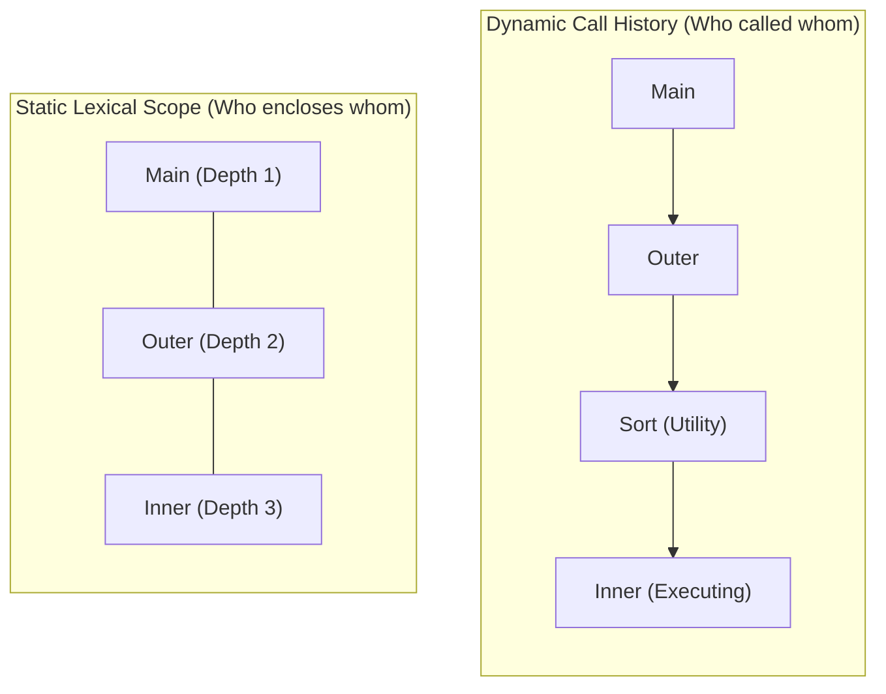

# Non-Local Variable Access in Static and Dynamic Scopes

> 📖 **Reading Order:** Step 23 of 55 | **Module 3:** Run-Time Environments  
> ◄ **Previous:** [[Calling Sequences and Stack Frame Management]] | ► **Next:** [[Heap Memory Management and Allocation Strategies]]

---

---

---

---

---

## Starting Point and the Problem

In block-structured programming languages (such as Pascal, Ada, Python, JavaScript, and GNU C), functions can be nested within other functions to arbitrary depths:

```pascal
program Main;
  var x: integer;
  procedure Outer;
    var y: integer;
    procedure Inner;
    begin
      x := x + y;  { Accessing non-local variables x (from Main) and y (from Outer)! }
    end;
  begin ... end;
begin ... end.
```

Now consider the runtime call stack when `Inner` is executing:
- `Main` called `Outer`.
- But what if `Outer` passed `Inner` as a callback to an unrelated utility function `Sort`, which called `Helper`, which finally invoked `Inner`?
- On the physical stack, `Inner` sits at the top. Below it are `Helper` and `Sort`, and buried deep down near the bottom are `Outer` and `Main`!

How can `Inner` find variable `y` in `Outer`'s activation record without accidentally reading garbage from `Sort` or `Helper`?

The compiler must distinguish between two fundamentally distinct pointer chains:
1. **Dynamic Link (Control Link):** "Who called me?" Tracks the runtime call history.
2. **Static Link (Access Link):** "Who textually encloses me?" Tracks the compile-time lexical nesting hierarchy.



---

---

---

---

---

## Developing the Idea

Under **Static Scope (Lexical Scope)**, variable bindings are determined entirely by the textual nesting of procedures in the source code, independent of runtime call sequences.

### 2.1 The Access Link Mechanism
Every activation record contains a dedicated pointer field: the **Access Link (Static Link)**:
- The Static Link points directly to the activation record of the **lexically enclosing procedure**!
- If procedure $P$ is declared immediately inside procedure $Q$, then every time $P$ is activated, its static link is set to point to the most recent activation record of $Q$.

```
Physical Stack with Access Links:
┌─────────────────────────────────┐
│ Frame of Main (Depth 1)         │ ◄──────────┐
├─────────────────────────────────┤            │ Static Link
│ Frame of Outer (Depth 2)        │ ◄────┐     │
│ [Static Link -> Main]           │ ─────┼─────┘
├─────────────────────────────────┤      │ Static Link
│ Frame of Sort (Depth 2)         │      │
│ [Static Link -> Main]           │      │
├─────────────────────────────────┤      │
│ Frame of Inner (Depth 3)        │      │
│ [Static Link -> Outer]          │ ─────┘
└─────────────────────────────────┘ ◄── Current Frame Pointer ($fp)
```

### 2.2 Navigating Non-Local Variables with Lexical Distance $\Delta$
Suppose procedure $P$ at nesting depth $n_P$ references a variable $v$ declared in procedure $Q$ at nesting depth $n_Q$ (where $n_P \ge n_Q$):
1. **Static Difference ($\Delta$):** The compiler calculates at compile time:
   $$\Delta = n_P - n_Q$$
2. **Runtime Pointer Dereference:** To find $v$, the compiled machine code dereferences exactly $\Delta$ static links:
   ```c
   // At runtime:
   Frame* target_frame = current_fp;
   for (int i = 0; i < Delta; i++) {
       target_frame = target_frame->static_link;
   }
   int* var_ptr = (int*)((char*)target_frame + offset_v);
   ```
- If $\Delta = 0$: $v$ is local (0 hops, direct access via `$fp`).
- If $\Delta = 1$: $v$ is in the immediate enclosing procedure (1 hop).
- If $\Delta = 2$: $v$ is in the grandparent procedure (2 hops).

---

---

---

---

---

## Definition

**Non-Local Variable Access in Static and Dynamic Scopes** is a formal compiler mechanism that structures syntax-directed translation, intermediate representations, runtime environments, or code generation.

---

---

---

---

## How It Works

### How It Works

### How It Works

### How It Works

### High-Performance Static Scope: The Display Array

While static links are simple, traversing $\Delta$ pointers takes $O(\Delta)$ time per variable read/write. If a deeply nested inner loop accesses variables from the outer procedure, chasing memory links degrades CPU cache performance.

Compilers optimize this using a **Display**.

A **Display** is a small global array of frame pointers indexed by lexical nesting depth:
$$\text{Display}[d]$$
stores a pointer to the activation record of the **most recent active execution** of the procedure at lexical depth $d$.

```
Display Array:
  Depth 1: Display[1] ──────> [ Frame of Main  ] (Depth 1)
  Depth 2: Display[2] ──────> [ Frame of Outer ] (Depth 2)
  Depth 3: Display[3] ──────> [ Frame of Inner ] (Depth 3, Active)
```

### 3.1 The $O(1)$ Access Guarantee
With a display, **every non-local access executes in strictly $O(1)$ time** using a single indexed memory load:
$$\text{Physical Address}(v) = \text{Display}[\text{depth}(v)] + \text{offset}(v)$$
No link chasing! The CPU simply indexes into `Display[d]` and adds the known compile-time offset.

### 3.2 Maintaining the Display: Save-and-Restore Invariant
When procedure $Q$ at nesting depth $d$ is invoked:
1. $Q$ saves the current value of $\text{Display}[d]$ into a dedicated slot in its own activation record (`saved_display_entry`).
2. $Q$ updates the display to point to its own frame:
   $$\text{Display}[d] = fp$$
3. When $Q$ terminates and returns, its epilogue restores the previous pointer:
   $$\text{Display}[d] = \text{saved\_display\_entry}$$

### Formal Proof: Display Correctness Invariant

#### Theorem:
*At any moment during the execution of procedure $P$ at nesting depth $k$, $\text{Display}[d]$ for every $1 \le d \le k$ contains the address of the unique lexically enclosing activation record at depth $d$.*

#### Proof:
1. Let the lexical nesting tree have depth $k$. At program startup, `main()` is entered at depth $1$. $\text{Display}[1]$ is set to `main`'s frame. The invariant holds for $k = 1$.
2. **Inductive Hypothesis:** Assume the invariant holds for all procedures active at depth $< k$.
3. When procedure $P$ at depth $k$ is called:
   - By lexical scope rules, $P$ can only be called by an ancestor in the lexical tree or by a sibling sharing the same lexical parent at depth $k-1$.
   - In either case, the active frames at depths $1, 2, \dots, k-1$ are the valid enclosing scopes for $P$. By the induction hypothesis, $\text{Display}[1 \dots k-1]$ already point to these exact frames.
   - $P$ saves $\text{Display}[k]$ and sets $\text{Display}[k] = fp_P$.
   - Thus, all entries $1 \le d \le k$ now point to the correct active scopes for $P$.
4. When $P$ returns:
   - $P$ restores $\text{Display}[k]$ from its saved slot.
   - The display reverts to the exact state expected by the caller.
5. Therefore, by structural induction on the call graph, the display invariant is maintained across all calls and returns. $\blacksquare$

---
### Dynamic Scoping: Deep Access vs. Shallow Access

Under **Dynamic Scope** (used in early Lisp, Emacs Lisp, Perl, and Unix shell scripts), non-local names are resolved based on the **runtime call stack**, not textual placement:
- A non-local variable reference searches backward through the chain of calling functions until a matching name is found.

```
Dynamic Scoping Implementation Approaches:
┌─────────────────────────────────┐       ┌─────────────────────────────────┐
│           Deep Access           │       │         Shallow Access          │
├─────────────────────────────────┤       ├─────────────────────────────────┤
│ Walk backward along Dynamic     │       │ Maintain a central global table │
│ Links (call stack) at runtime.  │       │ of current variable values.     │
│ Access: O(stack depth)          │       │ Access: O(1)                    │
│ Call overhead: O(1)             │       │ Call overhead: O(locals count)  │
└─────────────────────────────────┘       └─────────────────────────────────┘
```

### 4.1 Deep Access (Call Stack Traversal)
- When a variable $x$ is referenced, the runtime walks backward through the **Control Links (Dynamic Links)** of the call stack.
- It inspects each frame's local symbol table until an identifier named $x$ is located.
- **Trade-off:** Procedure calls are instant ($O(1)$), but variable access is slow ($O(\text{stack depth})$).

### 4.2 Shallow Access (Central Name Directory)
- The runtime maintains a global hash table mapping every identifier name to its currently active value/location.
- When procedure $P$ declares local variable $x$:
  1. $P$ pushes the old binding of $x$ onto a private hidden stack for $x$.
  2. $P$ writes its new local value of $x$ into the central table.
- When $P$ exits, it pops $x$'s private stack to restore the caller's binding.
- **Trade-off:** Variable access is instantaneous ($O(1)$), but function calls and returns incur overhead saving and restoring symbol bindings.

---
### Architectural Comparison Matrix

| Method | Scoping Discipline | Non-Local Access Time | Call/Return Overhead | Memory Overhead |
| :--- | :--- | :---: | :---: | :---: |
| **Static Links (Access Links)** | Static (Lexical) | $O(\Delta)$ link hops | $O(1)$ pointer copy | 1 pointer word per AR |
| **Display Array** | Static (Lexical) | **$O(1)$ direct indexed load** | $O(1)$ save/restore entry | Small global array ($D_{max}$ words) |
| **Deep Access** | Dynamic | $O(\text{Call Stack Depth})$ | **$O(1)$ zero setup** | Zero extra memory |
| **Shallow Access** | Dynamic | **$O(1)$ central table lookup**| $O(\text{number of locals})$ | Central name directory + binding stacks |

---

---
### Technical Details

Target architecture and ABI specifications govern low-level alignment and register assignments.

---
### Important Properties and Why They Hold

- **Semantic Soundness:** Preserves program execution equivalence.
- **Algorithmic Efficiency:** Operates in low polynomial or linear time over the program structure.

---
### Related Concepts

- [[Syntax-Directed Definitions and Translation Schemes]]
- [[Intermediate Representations and Three-Address Code]]
- [[Basic Blocks and Control Flow Graphs]]

---
### Prerequisites

- [[Syntax-Directed Definitions and Translation Schemes]]

---
### Problems

- [[Problem — Desk Calculator SDD and Annotated Parse Tree]]
- [[Problem — Array Reference Three-Address Code Generation]]

---

---
### Technical Details

Target architecture and ABI specifications govern low-level alignment and register assignments.

---
### Important Properties and Why They Hold

- **Semantic Soundness:** Preserves program execution equivalence.
- **Algorithmic Efficiency:** Operates in low polynomial or linear time over the program structure.

---
### Related Concepts

- [[Syntax-Directed Definitions and Translation Schemes]]
- [[Intermediate Representations and Three-Address Code]]
- [[Basic Blocks and Control Flow Graphs]]

---
### Prerequisites

- [[Syntax-Directed Definitions and Translation Schemes]]

---
### Problems

- [[Problem — Desk Calculator SDD and Annotated Parse Tree]]
- [[Problem — Array Reference Three-Address Code Generation]]

---

---
### Technical Details

Target architecture and ABI specifications govern low-level alignment and register assignments.

---
### Important Properties and Why They Hold

- **Semantic Soundness:** Preserves program execution equivalence.
- **Algorithmic Efficiency:** Operates in low polynomial or linear time over the program structure.

---
### Related Concepts

- [[Syntax-Directed Definitions and Translation Schemes]]
- [[Intermediate Representations and Three-Address Code]]
- [[Basic Blocks and Control Flow Graphs]]

---
### Prerequisites

- [[Syntax-Directed Definitions and Translation Schemes]]

---
### Problems

- [[Problem — Desk Calculator SDD and Annotated Parse Tree]]
- [[Problem — Array Reference Three-Address Code Generation]]

---

---

## Example

Detailed walkthroughs and traces are provided in the corresponding example and problem notes.

---

## Technical Details

Target architecture and ABI specifications govern low-level alignment and register assignments.

---

## Important Properties and Why They Hold

- **Semantic Soundness:** Preserves program execution equivalence.
- **Algorithmic Efficiency:** Operates in low polynomial or linear time over the program structure.

---

## Common Mistakes

### Common Mistakes

### Common Mistakes

### Common Mistakes

- Confusing syntactic validity with semantic correctness.
- Overlooking variable scoping or memory aliasing side effects.

---

---

---

---

## Exam Relevance

### Example

Detailed walkthroughs and traces are provided in the corresponding example and problem notes.

---
### Exam Relevance

### Example

Detailed walkthroughs and traces are provided in the corresponding example and problem notes.

---
### Exam Relevance

### Example

Detailed walkthroughs and traces are provided in the corresponding example and problem notes.

---
### Exam Relevance

Tested regularly in compiler examinations via syntax-directed translation proofs, activation record diagrams, and control flow optimization problems.

---

---

---

---

## Related Concepts

- [[Syntax-Directed Definitions and Translation Schemes]]
- [[Intermediate Representations and Three-Address Code]]
- [[Basic Blocks and Control Flow Graphs]]

---

## Prerequisites

- [[Syntax-Directed Definitions and Translation Schemes]]

---

## Problems

- [[Problem — Desk Calculator SDD and Annotated Parse Tree]]
- [[Problem — Array Reference Three-Address Code Generation]]

---

## Sources

- **Lecture Slides:** [[cse309/01 - Sources/Lectures/KMS Merged.pdf|KMS Merged.pdf]], Chapter 7 (Slides 211–228).
- **Textbook:** Aho, Lam, Sethi, Ullman, *Compilers: Principles, Techniques, & Tools* (2nd Ed.), Section 7.3 (Access to Nonlocal Data on the Stack).
