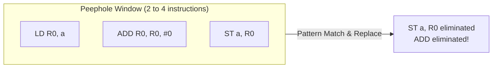

# Peephole Optimization Techniques

> 📖 **Reading Order:** Step 38 of 55 | **Module 4: Code Generation**  
> ◄ **Previous:** [[A Simple Code Generator Algorithm]] | ► **Next:** [[Basic Block Partitioning and Next-Use Computation Example]]

---

## Starting Point and the Problem

**Peephole Optimization** is a simple yet remarkably effective post-code-generation technique. It examines a short sliding window of consecutive target assembly instructions (called the **peephole**, typically 2 to 4 instructions wide) and replaces inefficient patterns with shorter, faster instruction sequences.

The peephole slides progressively through the generated machine code. Whenever a transformation is applied, the optimizer can re-examine the modified window to identify secondary optimization opportunities!



---

## Developing the Idea

### 1. Redundant Load and Store Elimination
Naive code generators frequently store a register value into memory and then immediately reload it back into the same (or another) register:

```assembly
; Before:
ST  x, R0
LD  R0, x         ; Redundant! R0 already contains x

; After Optimization:
ST  x, R0
```
If instruction `LD R1, x` follows `ST x, R0`, it can be simplified to a direct register copy: `MOV R1, R0`.

---

### 2. Unreachable Code Elimination
Instructions that immediately follow an unconditional jump or return and do not have an attached target label can never be reached during execution:

```assembly
; Before:
BR   L2
ADD  R1, R1, #1    ; Dead instruction (no label targets it)
L2:  SUB R2, R2, #1

; After Optimization:
BR   L2
L2:  SUB R2, R2, #1
```

---

### 3. Flow-of-Control Optimizations (Jump Chains)
Programs often generate jumps to instructions that merely jump to another label:

```assembly
; Before:
goto L1
...
L1: goto L2

; After Optimization (Jumping directly to L2):
goto L2
...
L1: goto L2
```
If no other instruction jumps to `L1`, the label and statement `L1: goto L2` can be completely eliminated.

---

### 4. Algebraic Simplifications & Reduction in Strength
Replacing expensive instructions with algebraically equivalent cheaper instructions:
- **Identity Elimination:**
  - $x + 0 = x \implies$ eliminate `ADD R0, R0, #0`.
  - $x * 1 = x \implies$ eliminate `MUL R0, R0, #1`.
- **Strength Reduction:**
  - Multiplying by a power of 2 ($x * 8$) is replaced with a fast bitwise left shift:
    ```assembly
    SHL R0, #3      ; 8x faster than MUL on most hardware
    ```
  - Dividing by a power of 2 ($x / 4$) is replaced with a bitwise right shift:
    ```assembly
    SHR R0, #2
    ```
  - Squaring ($x^2$) replaced with multiplication: $x * x$.

---

### 5. Use of Machine Hardware Idioms
Target architectures provide specialized hardware instructions that perform complex operations in a single clock cycle:
- In x86:
  - Replacing `ADD R0, #1` with `INC R0`.
  - Replacing `MOV R0, #0` with `XOR R0, R0` (clears register without loading immediate constants from instruction memory, taking fewer bytes).
  - Utilizing auto-increment / auto-decrement addressing modes (`LD R0, (R1)+`).

---

## Definition

**Peephole Optimization Techniques** is a formal compiler mechanism that structures syntax-directed translation, intermediate representations, runtime environments, or code generation.

---

## How It Works

### Advantages and Limitations of Peephole Optimization

| Advantages | Limitations |
| :--- | :--- |
| **Simplicity:** Can be implemented using straightforward string matching or pattern tables. | **Limited Scope:** Blind to anything outside its small 2–4 instruction window. |
| **Decoupled:** Can clean up messy assembly generated by simple, fast code generators. | **Local Only:** Cannot eliminate global redundancies across distant basic blocks. |
| **High Return on Investment:** Delivers significant speedups with minimal compiler execution overhead. | **Hardware Dependent:** Must be customized for every target processor ISA. |

---

## Example

Detailed walkthroughs and traces are provided in the corresponding example and problem notes.

---

## Technical Details

Target architecture and ABI specifications govern low-level alignment and register assignments.

---

## Important Properties and Why They Hold

- **Semantic Soundness:** Preserves program execution equivalence.
- **Algorithmic Efficiency:** Operates in low polynomial or linear time over the program structure.

---

## Common Mistakes

- Confusing syntactic validity with semantic correctness.
- Overlooking variable scoping or memory aliasing side effects.

---

## Exam Relevance

Tested regularly in compiler examinations via syntax-directed translation proofs, activation record diagrams, and control flow optimization problems.

---

## Related Concepts

- [[A Simple Code Generator Algorithm]]
- [[Principal Sources of Code Optimization]]

---

## Prerequisites

- [[Code Generation Issues and Target Machine Architecture]]

---

## Problems

- [[Problem — Basic Block Partitioning and Next-Use Table]]

---

## Sources

- **Lecture Slides:** [[cse309/01 - Sources/Lectures/KMS Merged.pdf|KMS Merged.pdf]], Chapter 8 (Slides 359–363).
- **Textbook:** Aho, Lam, Sethi, Ullman, *Compilers: Principles, Techniques, & Tools* (2nd Ed.), Section 8.7.
