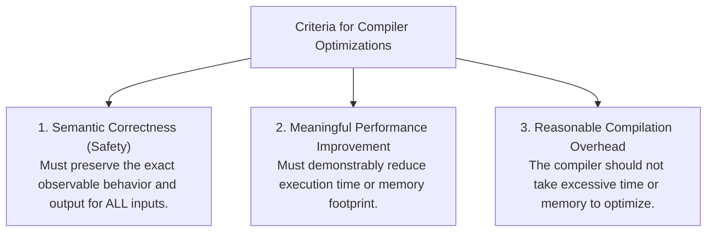
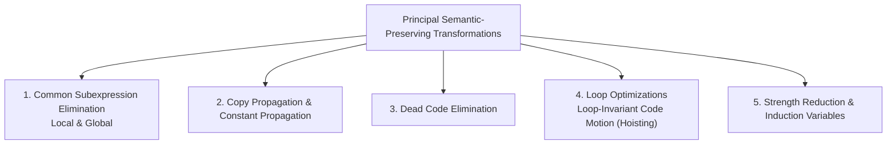

# Principal Sources of Code Optimization

> 📖 **Reading Order:** Step 51 of 55 | **Module 6: Machine-Independent Optimization**  
> ◄ **Previous:** [[Problem — Chaitin Graph Coloring Register Allocation]] | ► **Next:** [[Global Common Subexpression Elimination and Copy Propagation]]

---

## Starting Point and the Problem

High-level programming languages encourage abstraction, modularity, and clean software engineering (e.g., multi-dimensional arrays, objects, encapsulation). However, when a front end naively translates each high-level construct independently into Three-Address Code, it generates massive runtime overhead:
- Array indexing introduces repeated multiplications by element widths ($i \times 4$).
- Field accesses introduce repeated pointer offsets.
- Macro expansions and inlined code create redundant subexpressions and unreachable dead code.

The **Machine-Independent Optimizer** inspects the program's Control Flow Graph and applies semantics-preserving transformations to eliminate these redundancies without altering the observable behavior of the program.

---

## Developing the Idea

Any optimizing transformation implemented in a compiler must satisfy three inviolable criteria:

> [!CAUTION] The Golden Rule of Compiler Optimization
> An optimization must **never change the meaning of the program**. For example, hoisting a division out of a loop (`t = x / y`) is illegal if $y$ could be zero when the loop executes zero times, because hoisting it introduces a division-by-zero crash that would never have occurred in the original program!

---

## Definition

**Principal Sources of Code Optimization** is a formal compiler mechanism that structures syntax-directed translation, intermediate representations, runtime environments, or code generation.

---

## How It Works

### Causes of Redundancy

Why do programs contain so much redundant code?
1. **High-Level Abstractions:** In $A[i][j] = A[i][j] + 1$, the programmer writes concise syntax, but naive IR translation generates the address offset $(i \times n_2 + j) \times 4$ twice!
2. **Programmer Style:** Programmers prioritize readability, modularity, and reusability over micro-optimizations (e.g., using helper functions or named constants).
3. **Cascading Effects of Prior Compiler Passes:** Eliminating one subexpression creates copy statements ($x = y$), which enables copy propagation, which in turn exposes dead code ($x$ is never read), which enables dead code elimination!

---

### The Principal Families of Transformations

1. **Common Subexpression Elimination:** Identifies an expression $E$ that was previously calculated and whose operands have not changed since. Reuses the earlier value instead of recalculating $E$.
2. **Copy Propagation:** Given an assignment $x = y$, replaces subsequent uses of $x$ with $y$ as long as neither $x$ nor $y$ is reassigned.
3. **Dead Code Elimination:** Removes statements that compute values that are never used along any future execution path.
4. **Code Motion (Loop-Invariant Hoisting):** Moves computations whose operands never change inside a loop to the loop pre-header.
5. **Induction Variable Elimination & Strength Reduction:** Replaces expensive multiplications inside loops with inexpensive additions.

---

### Local vs. Global Optimization

| Dimension | Local Optimization | Global Optimization |
| :--- | :--- | :--- |
| **Scope** | Within a single **Basic Block** | Across multiple basic blocks in a **CFG** |
| **Mechanisms** | Value Numbering, DAG transformations | **Data-Flow Analysis (DFA)** (reaching definitions, available expressions, live variables) |
| **Control Flow** | Purely sequential straight-line code | Handles arbitrary branches, loops, and merge points |
| **Complexity** | Very fast ($O(N)$) | Iterative fixed-point algorithms ($O(N^2)$ to $O(N^3)$) |

---

## Example

Detailed walkthroughs and traces are provided in the corresponding example and problem notes.

---

## Technical Details

Target architecture and ABI specifications govern low-level alignment and register assignments.

---

## Important Properties and Why They Hold

- **Semantic Soundness:** Preserves program execution equivalence.
- **Algorithmic Efficiency:** Operates in low polynomial or linear time over the program structure.

---

## Common Mistakes

- Confusing syntactic validity with semantic correctness.
- Overlooking variable scoping or memory aliasing side effects.

---

## Exam Relevance

Tested regularly in compiler examinations via syntax-directed translation proofs, activation record diagrams, and control flow optimization problems.

---

## Related Concepts

- [[Global Common Subexpression Elimination and Copy Propagation]]
- [[Loop Optimizations and Strength Reduction]]
- [[Peephole Optimization Techniques]]

---

## Prerequisites

- [[Basic Blocks and Control Flow Graphs]]

---

## Problems

- [[Problem — Quicksort Loop Induction Variable Strength Reduction]]

---

## Sources

- **Lecture Slides:** [[cse309/01 - Sources/Lectures/KMS Merged.pdf|KMS Merged.pdf]], Chapter 9 (Slides 532–540).
- **Textbook:** Aho, Lam, Sethi, Ullman, *Compilers: Principles, Techniques, & Tools* (2nd Ed.), Section 9.1.
