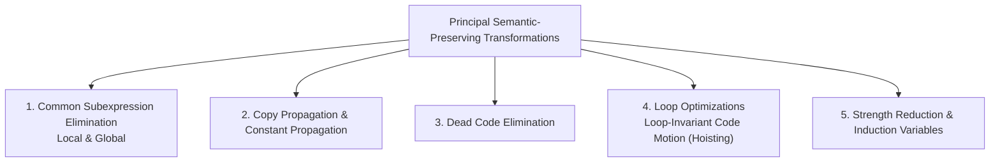

# Principal Sources of Code Optimization

> 📖 **Reading Order:** Step 51 of 55 | **Module 6:** Machine-Independent Optimization  
> ◄ **Previous:** [[Problem — Chaitin Graph Coloring Register Allocation]] | ► **Next:** [[Global Common Subexpression Elimination and Copy Propagation]]

---

## Building the idea

Optimization changes how a program computes while preserving the behavior the language and compiler are required to preserve. It begins with redundancy: repeated expressions, unnecessary copies, unused results, or work repeated inside a loop despite unchanged inputs.

An illustrative array update can calculate its address twice in naive TAC. Reusing that address can remove work, provided the operands and relevant memory assumptions remain valid. One optimization can expose another: eliminating a repeated calculation creates a copy, propagating the copy can make a temporary unused, and dead-code elimination can then remove its definition.

[[Intermediate Representations and Three-Address Code]] exposes those opportunities. [[Basic Blocks and Control Flow Graphs]] determines whether the supporting facts hold locally or across multiple paths.

Three questions guide every transformation: is it legal, what cost can it reduce, and is the analysis itself affordable? “Optimal” in an optimization label usually names a goal or local criterion, not a promise of the best possible machine program.

## How It Works

### Causes of Redundancy

Why do programs contain so much redundant code?
1. **High-Level Abstractions:** In $A[i][j] = A[i][j] + 1$, the programmer writes concise syntax, but naive IR translation generates the address offset $(i \times n_2 + j) \times 4$ twice!
2. **Programmer Style:** Programmers prioritize readability, modularity, and reusability over micro-optimizations (e.g., using helper functions or named constants).
3. **Cascading Effects of Prior Compiler Passes:** Eliminating one subexpression creates copy statements ($x = y$), which enables copy propagation, which in turn exposes dead code ($x$ is never read), which enables dead code elimination!

---
### The Principal Families of Transformations

1. **Common Subexpression Elimination:** Identifies an expression $E$ that was previously calculated and whose operands have not changed since. Reuses the earlier value instead of recalculating $E$.
2. **Copy Propagation:** Given an assignment $x = y$, replaces subsequent uses of $x$ with $y$ as long as neither $x$ nor $y$ is reassigned.
3. **Dead Code Elimination:** Removes statements that compute values that are never used along any future execution path.
4. **Code Motion (Loop-Invariant Hoisting):** Moves computations whose operands never change inside a loop to the loop pre-header.
5. **Induction Variable Elimination & Strength Reduction:** Replaces expensive multiplications inside loops with inexpensive additions.

---
### Local vs. Global Optimization

| Dimension | Local Optimization | Global Optimization |
| :--- | :--- | :--- |
| **Scope** | Within a single **Basic Block** | Across multiple basic blocks in a **CFG** |
| **Mechanisms** | Value Numbering, DAG transformations | **Data-Flow Analysis (DFA)** (reaching definitions, available expressions, live variables) |
| **Control Flow** | Purely sequential straight-line code | Handles arbitrary branches, loops, and merge points |
| **Complexity** | Very fast ($O(N)$) | Iterative fixed-point algorithms ($O(N^2)$ to $O(N^3)$) |

---

## What to carry forward

[[Global Common Subexpression Elimination and Copy Propagation]] follows values across paths. [[Loop Optimizations and Strength Reduction]] targets repeatedly executed work. Preserve side effects, exceptions, overflow, and memory semantics rather than comparing only ordinary arithmetic outputs.

## Related notes

- [[Intermediate Representations and Three-Address Code]]
- [[Basic Blocks and Control Flow Graphs]]
- [[Global Common Subexpression Elimination and Copy Propagation]]
- [[Loop Optimizations and Strength Reduction]]

## Sources

- **Lecture Slides:** [[cse309/01 - Sources/Lectures/KMS Merged.pdf|KMS Merged.pdf]], Chapter 9 (Slides 532–540).
- **Textbook:** Aho, Lam, Sethi, Ullman, *Compilers: Principles, Techniques, & Tools* (2nd Ed.), Section 9.1.
