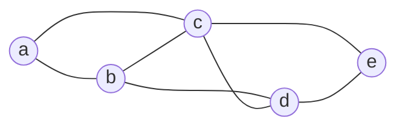
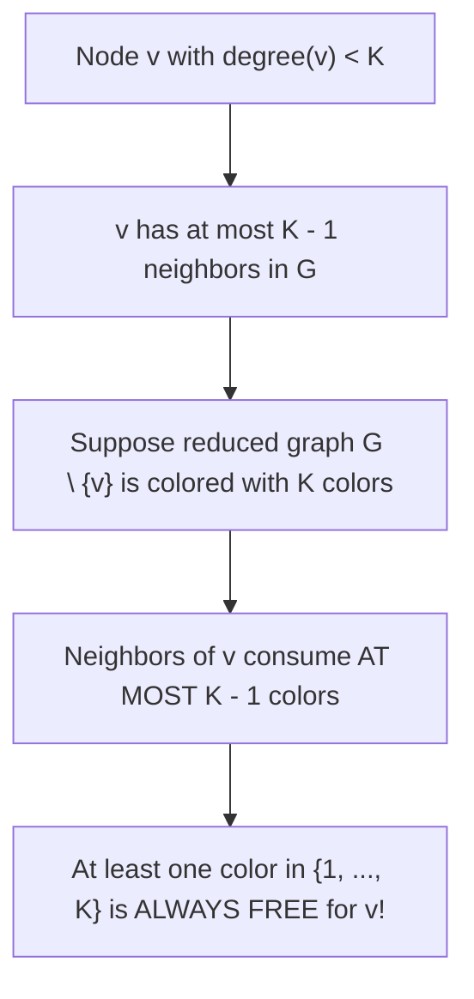

# Register Interference Graphs and Graph Coloring Principles

> 📖 **Reading Order:** Step 44 of 55 | **Module 5:** Register Allocation  
> ◄ **Previous:** [[Live Ranges and Live Intervals in Register Allocation]] | ► **Next:** [[Linear Scan Register Allocation Algorithm]]

---

---

---

---

---

## Starting Point and the Problem

Modern CPUs (like x86-64 or ARM64) possess only 16 to 32 general-purpose hardware registers. Yet, a complex function in C, C++, or Java might declare dozens of local variables and generate hundreds of intermediate compiler temporaries:
- Accessing a register takes **sub-nanosecond latency** (0–1 CPU clock cycles).
- Accessing main DRAM takes **50 to 100 nanoseconds** (hundreds of clock cycles).
- If the compiler spills a hot loop variable into RAM, performance plummets by a factor of $10\times$ or more.

How can a compiler map hundreds of variables into a tiny set of $K$ physical registers without data corruption?

The breakthrough realization is that **variables do not all exist simultaneously**:
- Variable $a$ may be used in lines 1–5 and then die.
- Variable $b$ may be born at line 10 and die at line 15.
- Because their lifetimes never overlap, **variable $a$ and variable $b$ can share the exact same physical silicon register!**

In 1981, **Gregory Chaitin** at IBM proved that deciding which variables can share registers without conflict is mathematically identical to one of the most famous problems in pure graph theory: **Graph $K$-Coloring**!

```
                  Mapping Register Allocation to Graph Coloring
       COMPILER DOMAIN                              GRAPH THEORY DOMAIN
  ┌─────────────────────────┐                    ┌─────────────────────────┐
  │ Variables / Live Ranges │ ◄────────────────► │ Graph Vertices (V)      │
  │ Simultaneous Liveness   │ ◄────────────────► │ Undirected Edges (E)    │
  │ K Physical Registers    │ ◄────────────────► │ K Distinct Colors       │
  └─────────────────────────┘                    └─────────────────────────┘
```

---

---

---

---

---

## Developing the Idea

A **Register Interference Graph (RIG)** is an undirected graph:
$$G = (V, E)$$
constructed as follows:
1. **Vertices ($V$):** Each variable, temporary, or live range in the program is represented by a unique vertex $v \in V$.
2. **Edges ($E$):** There is an undirected edge $(u, v) \in E$ if and only if variable $u$ and variable $v$ **interfere**—meaning they are simultaneously live at some program point.



### The Graph Coloring Invariant:
An edge $(u, v)$ means $u$ and $v$ are live at the same time and therefore **cannot occupy the same physical register**. 

Assigning $K$ hardware registers to variables is formally equivalent to assigning $K$ colors to the vertices of $G$ such that:
$$\forall (u, v) \in E, \quad \text{color}(u) \neq \text{color}(v)$$

---

---

---

---

---

## Definition

**Register Interference Graphs and Graph Coloring Principles** is a formal compiler mechanism that structures syntax-directed translation, intermediate representations, runtime environments, or code generation.

---

---

---

---

## How It Works

### How It Works

### How It Works

### How It Works

### The Theoretical Obstacle: NP-Completeness

Graph $K$-coloring is one of Richard Karp's 21 classic **NP-complete** problems for any fixed $K \ge 3$:
- Determining whether an arbitrary graph can be colored with $K$ colors has no known polynomial-time solution ($P \ne NP$).
- In fact, Bellare, Goldreich, and Sudan proved that even finding an approximate coloring within a constant factor is NP-hard.

A production compiler running inside an IDE cannot pause for 4 hours trying exponential brute-force algorithms to find an optimal coloring!

To solve this in linear time, compilers leverage a brilliant mathematical theorem discovered in 1879 by the British mathematician **Alfred Kempe**.

---
### The Simplification Stack Protocol

Kempe's theorem gives the compiler an unstoppable recursive strategy:
1. **Simplify:** Find any node $v$ with $\text{degree}(v) < K$.
2. **Push to Stack:** Remove $v$ from the graph and push $v$ onto a LIFO stack.
3. **Cascade Degree Reductions:** Removing $v$ removes all its incident edges, which **lowers the degrees of all its neighbors**!
   - A neighbor that previously had degree $K$ now drops to degree $K - 1$.
   - It becomes eligible for simplification!
4. **Repeat:** Continue pushing nodes until the entire graph is empty.
5. **Select (Color):** Pop nodes from the stack in reverse order. By Kempe's theorem, as each node is popped, at least one color is guaranteed to be available among its neighbors. Assign it!

---
### What Happens When Kempe Gets Stuck: The Spill Decision

What happens if the compiler encounters a graph state where **every single remaining node has degree $\ge K$**?

```
Graph State: All remaining nodes have degree >= K
                           │
                           ▼
              Kempe's Theorem Cannot Guarantee Coloring!
                           │
                           ▼
              Must choose a node to SPILL to RAM!
```

When all remaining degrees $\ge K$:
1. The compiler must select a **Spill Candidate** $s$ to be evicted to memory (RAM).
2. To minimize performance loss, Chaitin defines the **Spill Cost Metric**:
   $$\text{Spill Priority}(v) = \frac{\text{Def/Use Count}(v) \times 10^{\text{loop\_nesting\_depth}}}{\text{degree}(v)}$$
   - A variable inside a triple-nested loop executed $1000\times$ has massive spill cost; it must **never** be spilled.
   - A variable with high degree that is rarely read has low cost; spilling it eliminates many interference edges, unblocking the coloring algorithm!
3. The chosen variable is marked for spill, removed from the graph, and the compiler continues.

---

---
### Technical Details

Target architecture and ABI specifications govern low-level alignment and register assignments.

---
### Important Properties and Why They Hold

### Formal Proof: Alfred Kempe's Degree $< K$ Theorem

In 1879, Alfred Kempe published a paper on the Four Color Theorem containing an ingenious reduction lemma. In 1981, Gregory Chaitin adapted this lemma to create the core engine of modern register allocators.

### Theorem: Kempe's Reduction Theorem
*Let $G = (V, E)$ be an undirected interference graph, and let $K \in \mathbb{Z}^+$ be the number of available physical registers (colors). If there exists a node $v \in V$ whose degree satisfies:*
$$\text{degree}(v) < K$$
*then $G$ is $K$-colorable if and only if the subgraph $G \setminus \{v\}$ is $K$-colorable.*



### Formal Mathematical Proof:

#### 1. Forward Direction ($\implies$):
- Suppose graph $G$ has a valid $K$-coloring $c: V \longrightarrow \{1, 2, \dots, K\}$.
- Consider the induced subgraph $G' = G \setminus \{v\}$.
- The restricted function $c' = c|_{V \setminus \{v\}}$ assigns each node in $V \setminus \{v\}$ its original color in $c$.
- Since $c$ was valid for all edges in $E$, and $G'$ contains a strict subset of $E$, no two adjacent nodes in $G'$ share the same color under $c'$.
- Therefore, $G \setminus \{v\}$ is trivially $K$-colorable.

#### 2. Reverse Direction ($\impliedby$):
- Suppose the reduced subgraph $G \setminus \{v\}$ has a valid $K$-coloring:
  $$c': (V \setminus \{v\}) \longrightarrow \{1, 2, \dots, K\}$$
- Now, consider placing node $v$ back into the graph with its incident edges.
- Let $N(v)$ denote the set of neighbors of $v$ in $G$:
  $$N(v) = \{ u \in V \setminus \{v\} \mid (u, v) \in E \}$$
- By the premise of the theorem, the degree of $v$ is strictly less than $K$:
  $$|N(v)| = \text{degree}(v) \le K - 1$$
- Let $C_{\text{neighbors}}$ be the set of colors already assigned by $c'$ to the neighbors of $v$:
  $$C_{\text{neighbors}} = \{ c'(u) \mid u \in N(v) \}$$
- The maximum number of distinct colors consumed by $v$'s neighbors cannot exceed the number of neighbors:
  $$|C_{\text{neighbors}}| \le |N(v)| \le K - 1$$
- The total number of available colors in our register set is $|\{1, 2, \dots, K\}| = K$.
- The number of available colors remaining that are **not** used by any neighbor of $v$ is:
  $$|\{1, 2, \dots, K\} \setminus C_{\text{neighbors}}| \ge K - (K - 1) = \mathbf{1}$$
- Therefore, there exists at least one color $c^* \in \{1, 2, \dots, K\}$ that is completely free and unused by any neighbor of $v$!
- We extend $c'$ to include $v$ by setting:
  $$c(v) = c^*, \quad \text{and } c(u) = c'(u) \quad \forall u \ne v$$
- Under $c$, $v$ differs in color from all its neighbors $N(v)$, and all other edges are preserved.
- Thus, $c$ is a valid $K$-coloring of $G$. $\blacksquare$

---

---
### Related Concepts

- [[Syntax-Directed Definitions and Translation Schemes]]
- [[Intermediate Representations and Three-Address Code]]
- [[Basic Blocks and Control Flow Graphs]]

---
### Prerequisites

- [[Syntax-Directed Definitions and Translation Schemes]]

---
### Problems

- [[Problem — Desk Calculator SDD and Annotated Parse Tree]]
- [[Problem — Array Reference Three-Address Code Generation]]

---

---
### Technical Details

Target architecture and ABI specifications govern low-level alignment and register assignments.

---
### Important Properties and Why They Hold

- **Semantic Soundness:** Preserves program execution equivalence.
- **Algorithmic Efficiency:** Operates in low polynomial or linear time over the program structure.

---
### Related Concepts

- [[Syntax-Directed Definitions and Translation Schemes]]
- [[Intermediate Representations and Three-Address Code]]
- [[Basic Blocks and Control Flow Graphs]]

---
### Prerequisites

- [[Syntax-Directed Definitions and Translation Schemes]]

---
### Problems

- [[Problem — Desk Calculator SDD and Annotated Parse Tree]]
- [[Problem — Array Reference Three-Address Code Generation]]

---

---
### Technical Details

Target architecture and ABI specifications govern low-level alignment and register assignments.

---
### Important Properties and Why They Hold

- **Semantic Soundness:** Preserves program execution equivalence.
- **Algorithmic Efficiency:** Operates in low polynomial or linear time over the program structure.

---
### Related Concepts

- [[Syntax-Directed Definitions and Translation Schemes]]
- [[Intermediate Representations and Three-Address Code]]
- [[Basic Blocks and Control Flow Graphs]]

---
### Prerequisites

- [[Syntax-Directed Definitions and Translation Schemes]]

---
### Problems

- [[Problem — Desk Calculator SDD and Annotated Parse Tree]]
- [[Problem — Array Reference Three-Address Code Generation]]

---

---

## Example

Detailed walkthroughs and traces are provided in the corresponding example and problem notes.

---

## Technical Details

Target architecture and ABI specifications govern low-level alignment and register assignments.

---

## Important Properties and Why They Hold

- **Semantic Soundness:** Preserves program execution equivalence.
- **Algorithmic Efficiency:** Operates in low polynomial or linear time over the program structure.

---

## Common Mistakes

### Common Mistakes

### Common Mistakes

### Common Mistakes

- Confusing syntactic validity with semantic correctness.
- Overlooking variable scoping or memory aliasing side effects.

---

---

---

---

## Exam Relevance

### Example

Detailed walkthroughs and traces are provided in the corresponding example and problem notes.

---
### Exam Relevance

### Example

Detailed walkthroughs and traces are provided in the corresponding example and problem notes.

---
### Exam Relevance

### Example

Detailed walkthroughs and traces are provided in the corresponding example and problem notes.

---
### Exam Relevance

Tested regularly in compiler examinations via syntax-directed translation proofs, activation record diagrams, and control flow optimization problems.

---

---

---

---

## Related Concepts

- [[Syntax-Directed Definitions and Translation Schemes]]
- [[Intermediate Representations and Three-Address Code]]
- [[Basic Blocks and Control Flow Graphs]]

---

## Prerequisites

- [[Syntax-Directed Definitions and Translation Schemes]]

---

## Problems

- [[Problem — Desk Calculator SDD and Annotated Parse Tree]]
- [[Problem — Array Reference Three-Address Code Generation]]

---

## Sources

- **Lecture Slides:** [[cse309/01 - Sources/Lectures/KMS Merged.pdf|KMS Merged.pdf]], Register Allocation (Slides 436–443).
- **Textbook:** Aho, Lam, Sethi, Ullman, *Compilers: Principles, Techniques, & Tools* (2nd Ed.), Section 8.8 (Register Allocation and Assignment).
- **Chaitin, G. J., et al.:** *Register Allocation via Coloring*, Computer Languages, Vol. 6, 1981.
- **Kempe, A. B.:** *How to Colour a Map with Four Colours*, Nature, 1879.
