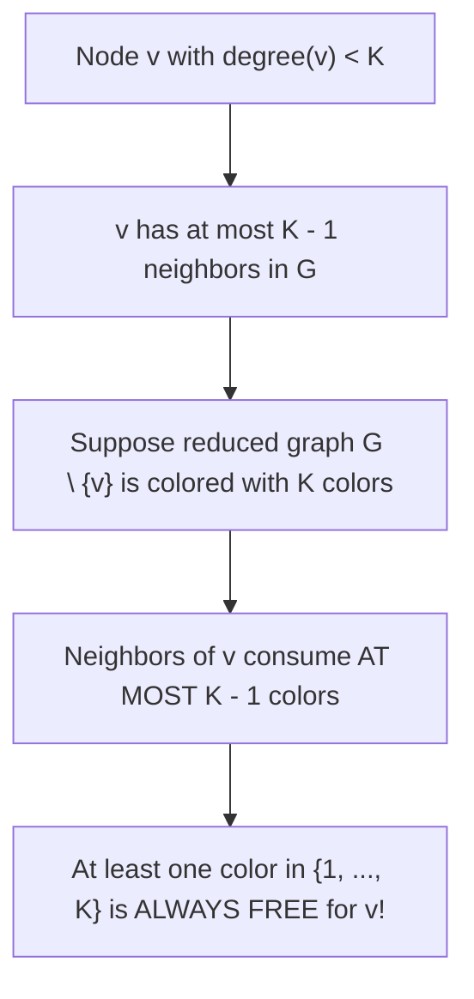

# Register Interference Graphs and Graph Coloring Principles

> 📖 **Reading Order:** Step 44 of 55 | **Module 5:** Register Allocation  
> ◄ **Previous:** [[Live Ranges and Live Intervals in Register Allocation]] | ► **Next:** [[Linear Scan Register Allocation Algorithm]]

---

## Building the idea

A register interference graph turns storage conflicts into edges. Each node is a live range; an edge connects two ranges that cannot occupy the same physical register under the target's constraints. A color represents a register.

Why can a node with fewer than K neighbors be removed safely? If the remaining graph has a K-coloring, at most K−1 colors are forbidden by those neighbors when we reinsert the node, so at least one remains. This is a conditional extension guarantee, not a statement that all graphs contain such a node.

When every remaining node has degree at least K, simplification stalls. The graph may still be K-colorable; the degree test has simply stopped proving easy extendability. [[Chaitin's Graph Coloring Register Allocation Algorithm]] adds heuristics and possible spilling.

[[Live Ranges and Live Intervals in Register Allocation]] explains what a node denotes. Real machines can have precolored registers and register classes, so the simple interchangeable-color model needs additional constraints.

## How It Works

### The Theoretical Obstacle: NP-Completeness

For fixed $K\ge3$, K-colorability is NP-complete on arbitrary graphs. No polynomial-time solution is known; whether P equals NP remains open. Compilers therefore use practical heuristics rather than generally solving every instance optimally.

A production compiler running inside an IDE cannot pause for 4 hours trying exponential brute-force algorithms to find an optimal coloring!

To solve this in linear time, compilers leverage a brilliant mathematical theorem discovered in 1879 by the British mathematician **Alfred Kempe**.

---
### The Simplification Stack Protocol

Kempe's theorem gives the compiler an unstoppable recursive strategy:
1. **Simplify:** Find any node $v$ with $\text{degree}(v) < K$.
2. **Push to Stack:** Remove $v$ from the graph and push $v$ onto a LIFO stack.
3. **Cascade Degree Reductions:** Removing $v$ removes all its incident edges, which **lowers the degrees of all its neighbors**!
   - A neighbor that previously had degree $K$ now drops to degree $K - 1$.
   - It becomes eligible for simplification!
4. **Repeat:** Continue pushing nodes until the entire graph is empty.
5. **Select (Color):** Pop nodes from the stack in reverse order. By Kempe's theorem, as each node is popped, at least one color is guaranteed to be available among its neighbors. Assign it!

---
### What Happens When Kempe Gets Stuck: The Spill Decision

What happens if the compiler encounters a graph state where **every single remaining node has degree $\ge K$**?

```
Graph State: All remaining nodes have degree >= K
                           │
                           ▼
              Kempe's Theorem Cannot Guarantee Coloring!
                           │
                           ▼
              Must choose a node to SPILL to RAM!
```

When all remaining degrees $\ge K$:
1. The compiler must select a **Spill Candidate** $s$ to be evicted to memory (RAM).
2. To minimize performance loss, Chaitin defines the **Spill Cost Metric**:
   $$\text{Spill Priority}(v) = \frac{\text{Def/Use Count}(v) \times 10^{\text{loop\_nesting\_depth}}}{\text{degree}(v)}$$
   - A frequently used value in a deeply nested loop can have a high estimated spill cost, so a heuristic prefers a cheaper candidate when possible. Register constraints can still require spilling an expensive value.
   - A variable with high degree that is rarely read has low cost; spilling it eliminates many interference edges, unblocking the coloring algorithm!
3. The chosen variable is marked for spill, removed from the graph, and the compiler continues.

---

### Formal Proof: Alfred Kempe's Degree $< K$ Theorem

In 1879, Alfred Kempe published a paper on the Four Color Theorem containing an ingenious reduction lemma. In 1981, Gregory Chaitin adapted this lemma to create the core engine of modern register allocators.

### Theorem: Kempe's Reduction Theorem
*Let $G = (V, E)$ be an undirected interference graph, and let $K \in \mathbb{Z}^+$ be the number of available physical registers (colors). If there exists a node $v \in V$ whose degree satisfies:*
$$\text{degree}(v) < K$$
*then $G$ is $K$-colorable if and only if the subgraph $G \setminus \{v\}$ is $K$-colorable.*



### Formal Mathematical Proof:

#### 1. Forward Direction ($\implies$):
- Suppose graph $G$ has a valid $K$-coloring $c: V \longrightarrow \{1, 2, \dots, K\}$.
- Consider the induced subgraph $G' = G \setminus \{v\}$.
- The restricted function $c' = c|_{V \setminus \{v\}}$ assigns each node in $V \setminus \{v\}$ its original color in $c$.
- Since $c$ was valid for all edges in $E$, and $G'$ contains a strict subset of $E$, no two adjacent nodes in $G'$ share the same color under $c'$.
- Therefore, $G \setminus \{v\}$ is trivially $K$-colorable.

#### 2. Reverse Direction ($\impliedby$):
- Suppose the reduced subgraph $G \setminus \{v\}$ has a valid $K$-coloring:
  $$c': (V \setminus \{v\}) \longrightarrow \{1, 2, \dots, K\}$$
- Now, consider placing node $v$ back into the graph with its incident edges.
- Let $N(v)$ denote the set of neighbors of $v$ in $G$:
  $$N(v) = \{ u \in V \setminus \{v\} \mid (u, v) \in E \}$$
- By the premise of the theorem, the degree of $v$ is strictly less than $K$:
  $$|N(v)| = \text{degree}(v) \le K - 1$$
- Let $C_{\text{neighbors}}$ be the set of colors already assigned by $c'$ to the neighbors of $v$:
  $$C_{\text{neighbors}} = \{ c'(u) \mid u \in N(v) \}$$
- The maximum number of distinct colors consumed by $v$'s neighbors cannot exceed the number of neighbors:
  $$|C_{\text{neighbors}}| \le |N(v)| \le K - 1$$
- The total number of available colors in our register set is $|\{1, 2, \dots, K\}| = K$.
- The number of available colors remaining that are **not** used by any neighbor of $v$ is:
  $$|\{1, 2, \dots, K\} \setminus C_{\text{neighbors}}| \ge K - (K - 1) = \mathbf{1}$$
- Therefore, there exists at least one color $c^* \in \{1, 2, \dots, K\}$ that is completely free and unused by any neighbor of $v$!
- We extend $c'$ to include $v$ by setting:
  $$c(v) = c^*, \quad \text{and } c(u) = c'(u) \quad \forall u \ne v$$
- Under $c$, $v$ differs in color from all its neighbors $N(v)$, and all other edges are preserved.
- Thus, $c$ is a valid $K$-coloring of $G$. $\blacksquare$

---

## What to carry forward

K-colorability is NP-complete for fixed K≥3 on arbitrary graphs; this does not prove P≠NP or make every compiler instance equally difficult. Verify final colors against every interference edge.

## Related notes

- [[Chaitin's Graph Coloring Register Allocation Algorithm]]
- [[Live Ranges and Live Intervals in Register Allocation]]

## Sources

- **Lecture Slides:** [[cse309/01 - Sources/Lectures/KMS Merged.pdf|KMS Merged.pdf]], Register Allocation (Slides 436–443).
- **Textbook:** Aho, Lam, Sethi, Ullman, *Compilers: Principles, Techniques, & Tools* (2nd Ed.), Section 8.8 (Register Allocation and Assignment).
- **Chaitin, G. J., et al.:** *Register Allocation via Coloring*, Computer Languages, Vol. 6, 1981.
- **Kempe, A. B.:** *How to Colour a Map with Four Colours*, Nature, 1879.
