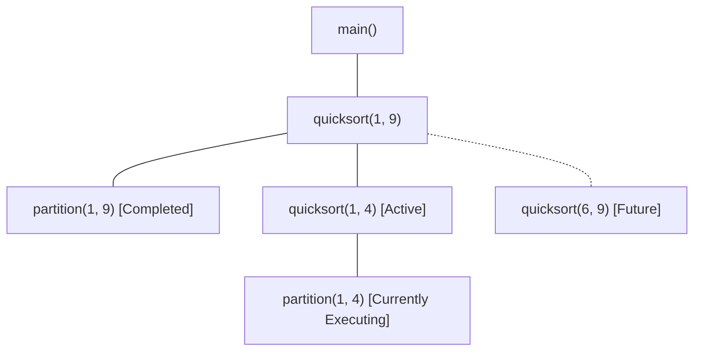

# Run-Time Storage Organization and Activation Records

> 📖 **Reading Order:** Step 21 of 55 | **Module 3:** Run-Time Environments  
> ◄ **Previous:** [[Problem — Backpatching Boolean Expression Translation]] | ► **Next:** [[Calling Sequences and Stack Frame Management]]

---

## Building the idea

A procedure's source declaration is one thing; each call creates another **activation** with its own parameters, locals, return location, and saved state. Recursive calls therefore need distinct activation records even though they execute the same code.

For conventional synchronous calls, B called by A returns before A's activation ends. The still-active calls form a path through the activation tree, making a stack a natural representation. Push a frame on entry and remove it on return.

An activation record stores what this call must remember. The dynamic link relates it to its caller; a static link, when needed for nested lexical scopes, relates it to its enclosing environment. These links can point to different frames.

[[Type Expressions and Storage Layout]] provides offsets within a frame. Runtime storage also includes static data and heap objects whose lifetimes do not follow call-return nesting. Escaping closures are an important reason that not every environment can remain solely on the control stack.

## How It Works

### Activation Trees: The Mathematics of Procedure Lifetimes

Each execution of a procedure is termed an **activation**. The lifetime of an activation begins when control transfers into the procedure's entry point and terminates when control yields back to the caller.

### Fundamental Lifetime Properties:
1. **LIFO Discipline:** If procedure $A$ calls procedure $B$, then $B$ must complete and return *before* $A$ can finish. The lifetimes of procedure activations are strictly nested.
2. **The Activation Tree:** The execution history of any program forms a tree:
   - The root represents the activation of `main()`.
   - Each node represents a procedure activation.
   - Children of node $u$ represent the procedures called directly by $u$.
   - Sibling order from left to right corresponds to the chronological order of calls.



### Theorem: Invariance of the Control Stack
*At any given instant during program execution, the sequence of active activation records residing on the physical call stack corresponds strictly and precisely to the path from the root of the Activation Tree to the currently executing node.*

#### Proof:
1. Let the program begin execution at `main()`. The activation tree consists solely of root $R$. The physical stack contains exactly $[R]$.
2. **Inductive Hypothesis:** Assume that when node $u$ is executing, the physical stack contains the exact sequence of ancestors from $R$ to $u$: $\langle R, v_1, v_2, \dots, u \rangle$.
3. **Case 1 (Procedure Call):** When $u$ calls child $w$:
   - By operational semantics, control transfers to $w$. In the activation tree, $w$ becomes the new active node as a child of $u$.
   - The runtime pushes $w$'s frame onto the call stack.
   - The stack now holds $\langle R, v_1, \dots, u, w \rangle$, which is exactly the path from $R$ to $w$.
4. **Case 2 (Procedure Return):** When $w$ completes and returns:
   - Control returns to its caller $u$.
   - By LIFO stack discipline, $w$'s frame is popped from the top of the stack.
   - The stack reverts to $\langle R, v_1, \dots, u \rangle$, which is the path from $R$ to $u$.
5. By induction over the sequence of calls and returns, the active stack frames always mirror the root-to-leaf path in the activation tree. $\blacksquare$

---

### The Anatomy of an Activation Record (Stack Frame)

An **Activation Record (AR)** (or **Stack Frame**) is a contiguous block of stack memory allocated exclusively for a single procedure execution:

```
                  ┌────────────────────────────────────────┐ ◄── High Addresses
                  │ Actual Parameters (Passed by Caller)   │
                  ├────────────────────────────────────────┤
                  │ Return Address (Saved PC)              │
                  ├────────────────────────────────────────┤
                  │ Control Link (Dynamic Link -> Prev FP) │
                  ├────────────────────────────────────────┤ ◄── Frame Pointer ($fp)
                  │ Access Link (Static Link -> Scope FP)  │
                  ├────────────────────────────────────────┤
                  │ Saved Machine Registers (Callee-saved) │
                  ├────────────────────────────────────────┤
                  │ Local Automatic Data / Variables       │
                  ├────────────────────────────────────────┤
                  │ Temporary Evaluation Slots             │
                  └────────────────────────────────────────┘ ◄── Low Addresses ($sp)
```

### Detailed Functional Breakdown:
1. **Actual Parameters:** Arguments evaluated and pushed by the **caller** before branching.
2. **Return Address:** The address of the next machine instruction in the caller's code segment where execution must resume after the callee terminates.
3. **Control Link (Dynamic Link):** Stores the caller's old Frame Pointer value. Essential for restoring the caller's stack frame upon function return.
4. **Access Link (Static Link):** In languages allowing nested function declarations (Pascal, Ada, Python, GNU C), stores a pointer to the activation record of the **lexically enclosing** function. Used to access non-local variables.
5. **Saved Machine Registers:** Hardware registers ($r_4, r_5, \dots$) whose previous values are preserved so the callee can use them without destroying the caller's context.
6. **Local Variables:** Storage for variables declared inside the current function block.
7. **Temporaries:** Scratch memory used by the code generator when evaluating complex intermediate expressions or register spilling.

---
### Frame Pointer ($fp$) vs. Stack Pointer ($sp$) Mechanics

Why do CPUs have both a Stack Pointer register (`$sp` / `esp` / `rsp`) and a Frame Pointer register (`$fp` / `ebp` / `rbp`)?

### The Problem with Relying Only on `$sp`:
- The Stack Pointer `$sp` is highly volatile. It moves dynamically as temporary values are pushed onto the stack during expression evaluation or variable-length arrays (`alloca()`, `int arr[n]`) are allocated.
- If the compiler addressed a local variable $x$ relative to `$sp` (e.g., `MOV [sp + 8], R1`), the required offset would change after every single push and pop! Tracking dynamic `$sp` offsets across every instruction severely complicates code generation.

### The Solution: The Anchored Frame Pointer:
- Upon entering a procedure, the compiler captures the stack position into `$fp`.
- Throughout the entire execution of the procedure, **`$fp` remains completely stationary**.
- Local variables and arguments are referenced using fixed, compile-time **constant offsets** from `$fp`:
  $$\text{Address of Parameter } j = fp + \text{offset}_j$$
  $$\text{Address of Local Variable } i = fp - \text{offset}_i$$

---

## What to carry forward

[[Calling Sequences and Stack Frame Management]] explains how caller and callee build and remove the frame. The activation-tree stack property assumes the conventional call-return model; coroutines and asynchronous continuations need additional lifetime machinery.

## Related notes

- [[Type Expressions and Storage Layout]]
- [[Calling Sequences and Stack Frame Management]]

## Sources

- **Lecture Slides:** [[cse309/01 - Sources/Lectures/KMS Merged.pdf|KMS Merged.pdf]], Chapter 7 (Slides 202–221).
- **Textbook:** Aho, Lam, Sethi, Ullman, *Compilers: Principles, Techniques, & Tools* (2nd Ed.), Section 7.1 (Storage Organization) & Section 7.2 (Stack Allocation of Space).
