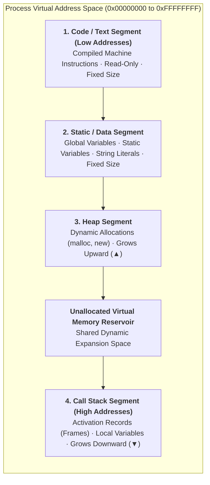
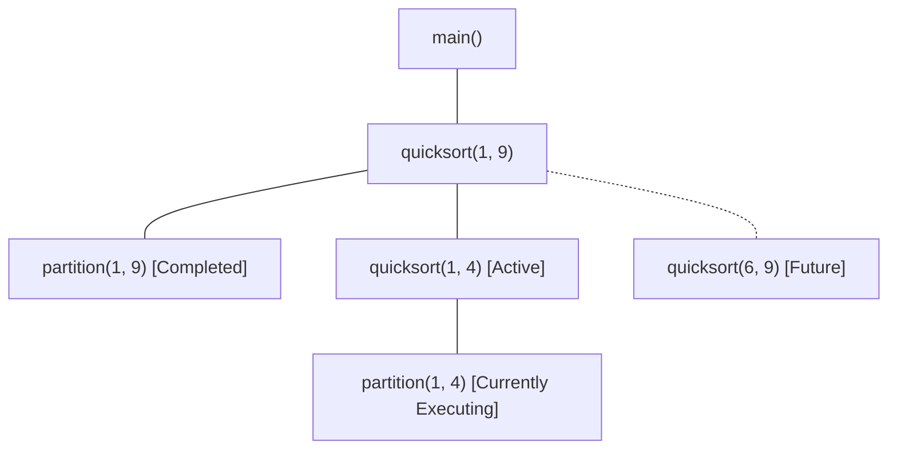

# Run-Time Storage Organization and Activation Records

> 📖 **Reading Order:** Step 21 of 55 | **Module 3: Run-Time Environments**  
> ◄ **Previous:** [[Problem — Backpatching Boolean Expression Translation]] | ► **Next:** [[Calling Sequences and Stack Frame Management]]

---

## Starting Point and the Problem

When you launch an executable binary in an operating system (e.g., typing `./a.out` in Linux or double-clicking an `.exe` in Windows), the OS kernel does not simply dump bytes into RAM. It constructs a **Virtual Memory Space** (typically 4GB on 32-bit architectures or 256TB on 64-bit architectures) managed by hardware page tables:
- The CPU hardware does not understand high-level concepts like "recursion", "objects", "local variables", or "lexical scope".
- The compiler is the architect that organizes this flat virtual address space into distinct memory regions, ensuring that procedures can invoke each other, allocate dynamic structures, and recurse infinitely without corrupting program code or clobbering each other's data.

---

## Developing the Idea

The runtime address space of a process is partitioned into four major logical zones:



### Why Do the Stack and Heap Grow Toward Each Other?
This is one of the most brilliant architectural designs in computer history:
- When writing a program, neither the programmer nor the compiler knows in advance whether the application will be **stack-heavy** (e.g., deep recursion in tree traversal, backtracking) or **heap-heavy** (e.g., allocating large graph datasets, databases).
- If the operating system partitioned fixed quotas for Stack and Heap (say, 50MB each), a program allocating 60MB of heap would crash with "Out of Memory", even if 49MB of stack space sat completely empty and idle!
- By anchoring the Heap at the bottom growing **upward** ($\uparrow$) toward higher addresses, and anchoring the Stack at the ceiling growing **downward** ($\downarrow$) toward lower addresses, both dynamic regions share a single large, elastic reservoir of free memory. A program runs out of memory only when the two colliding boundaries meet!

---

## Definition

**Run-Time Storage Organization and Activation Records** is a formal compiler mechanism that structures syntax-directed translation, intermediate representations, runtime environments, or code generation.

---

## How It Works

### Activation Trees: The Mathematics of Procedure Lifetimes

Each execution of a procedure is termed an **activation**. The lifetime of an activation begins when control transfers into the procedure's entry point and terminates when control yields back to the caller.

### Fundamental Lifetime Properties:
1. **LIFO Discipline:** If procedure $A$ calls procedure $B$, then $B$ must complete and return *before* $A$ can finish. The lifetimes of procedure activations are strictly nested.
2. **The Activation Tree:** The execution history of any program forms a tree:
   - The root represents the activation of `main()`.
   - Each node represents a procedure activation.
   - Children of node $u$ represent the procedures called directly by $u$.
   - Sibling order from left to right corresponds to the chronological order of calls.



### Theorem: Invariance of the Control Stack
*At any given instant during program execution, the sequence of active activation records residing on the physical call stack corresponds strictly and precisely to the path from the root of the Activation Tree to the currently executing node.*

#### Proof:
1. Let the program begin execution at `main()`. The activation tree consists solely of root $R$. The physical stack contains exactly $[R]$.
2. **Inductive Hypothesis:** Assume that when node $u$ is executing, the physical stack contains the exact sequence of ancestors from $R$ to $u$: $\langle R, v_1, v_2, \dots, u \rangle$.
3. **Case 1 (Procedure Call):** When $u$ calls child $w$:
   - By operational semantics, control transfers to $w$. In the activation tree, $w$ becomes the new active node as a child of $u$.
   - The runtime pushes $w$'s frame onto the call stack.
   - The stack now holds $\langle R, v_1, \dots, u, w \rangle$, which is exactly the path from $R$ to $w$.
4. **Case 2 (Procedure Return):** When $w$ completes and returns:
   - Control returns to its caller $u$.
   - By LIFO stack discipline, $w$'s frame is popped from the top of the stack.
   - The stack reverts to $\langle R, v_1, \dots, u \rangle$, which is the path from $R$ to $u$.
5. By induction over the sequence of calls and returns, the active stack frames always mirror the root-to-leaf path in the activation tree. $\blacksquare$

---

### Technical Details

### The Anatomy of an Activation Record (Stack Frame)

An **Activation Record (AR)** (or **Stack Frame**) is a contiguous block of stack memory allocated exclusively for a single procedure execution:

```
                  ┌────────────────────────────────────────┐ ◄── High Addresses
                  │ Actual Parameters (Passed by Caller)   │
                  ├────────────────────────────────────────┤
                  │ Return Address (Saved PC)              │
                  ├────────────────────────────────────────┤
                  │ Control Link (Dynamic Link -> Prev FP) │
                  ├────────────────────────────────────────┤ ◄── Frame Pointer ($fp)
                  │ Access Link (Static Link -> Scope FP)  │
                  ├────────────────────────────────────────┤
                  │ Saved Machine Registers (Callee-saved) │
                  ├────────────────────────────────────────┤
                  │ Local Automatic Data / Variables       │
                  ├────────────────────────────────────────┤
                  │ Temporary Evaluation Slots             │
                  └────────────────────────────────────────┘ ◄── Low Addresses ($sp)
```

### Detailed Functional Breakdown:
1. **Actual Parameters:** Arguments evaluated and pushed by the **caller** before branching.
2. **Return Address:** The address of the next machine instruction in the caller's code segment where execution must resume after the callee terminates.
3. **Control Link (Dynamic Link):** Stores the caller's old Frame Pointer value. Essential for restoring the caller's stack frame upon function return.
4. **Access Link (Static Link):** In languages allowing nested function declarations (Pascal, Ada, Python, GNU C), stores a pointer to the activation record of the **lexically enclosing** function. Used to access non-local variables.
5. **Saved Machine Registers:** Hardware registers ($r_4, r_5, \dots$) whose previous values are preserved so the callee can use them without destroying the caller's context.
6. **Local Variables:** Storage for variables declared inside the current function block.
7. **Temporaries:** Scratch memory used by the code generator when evaluating complex intermediate expressions or register spilling.

---

### Frame Pointer ($fp$) vs. Stack Pointer ($sp$) Mechanics

Why do CPUs have both a Stack Pointer register (`$sp` / `esp` / `rsp`) and a Frame Pointer register (`$fp` / `ebp` / `rbp`)?

### The Problem with Relying Only on `$sp`:
- The Stack Pointer `$sp` is highly volatile. It moves dynamically as temporary values are pushed onto the stack during expression evaluation or variable-length arrays (`alloca()`, `int arr[n]`) are allocated.
- If the compiler addressed a local variable $x$ relative to `$sp` (e.g., `MOV [sp + 8], R1`), the required offset would change after every single push and pop! Tracking dynamic `$sp` offsets across every instruction severely complicates code generation.

### The Solution: The Anchored Frame Pointer:
- Upon entering a procedure, the compiler captures the stack position into `$fp`.
- Throughout the entire execution of the procedure, **`$fp` remains completely stationary**.
- Local variables and arguments are referenced using fixed, compile-time **constant offsets** from `$fp`:
  $$\text{Address of Parameter } j = fp + \text{offset}_j$$
  $$\text{Address of Local Variable } i = fp - \text{offset}_i$$

---

## Example

Detailed walkthroughs and traces are provided in the corresponding example and problem notes.

---

## Technical Details

Target architecture and ABI specifications govern low-level alignment and register assignments.

---

## Important Properties and Why They Hold

- **Semantic Soundness:** Preserves program execution equivalence.
- **Algorithmic Efficiency:** Operates in low polynomial or linear time over the program structure.

---

## Common Mistakes

- Confusing syntactic validity with semantic correctness.
- Overlooking variable scoping or memory aliasing side effects.

---

## Exam Relevance

Tested regularly in compiler examinations via syntax-directed translation proofs, activation record diagrams, and control flow optimization problems.

---

## Related Concepts

- [[Calling Sequences and Stack Frame Management]]
- [[Non-Local Variable Access in Static and Dynamic Scopes]]
- [[Heap Memory Management and Allocation Strategies]]

---

## Prerequisites

- [[Type Expressions and Storage Layout]]

---

## Problems

- [[Problem — Activation Record and Display Table Tracing]]

---

## Sources

- **Lecture Slides:** [[cse309/01 - Sources/Lectures/KMS Merged.pdf|KMS Merged.pdf]], Chapter 7 (Slides 202–221).
- **Textbook:** Aho, Lam, Sethi, Ullman, *Compilers: Principles, Techniques, & Tools* (2nd Ed.), Section 7.1 (Storage Organization) & Section 7.2 (Stack Allocation of Space).
