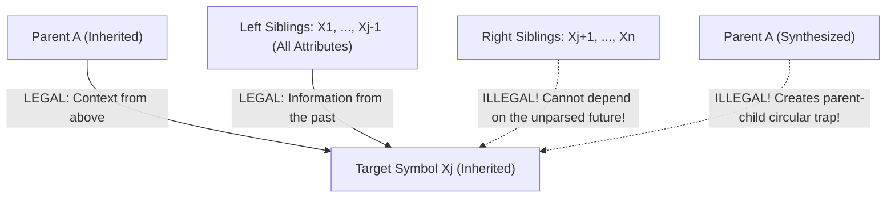
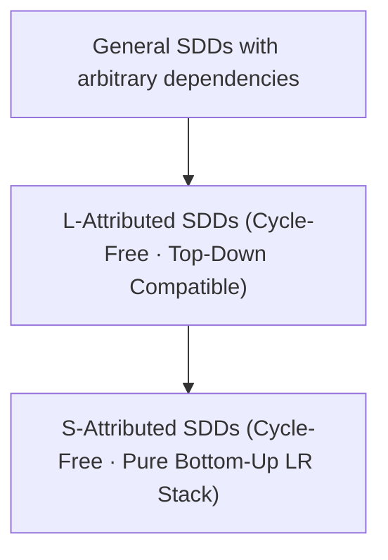

# S-Attributed and L-Attributed SDDs

> 📖 **Reading Order:** Step 3 of 55 | **Module 1:** Syntax-Directed Translation  
> ◄ **Previous:** [[Synthesized and Inherited Attributes]] | ► **Next:** [[Abstract Syntax Tree Construction with SDDs]]

---

## Building the idea

A semantic rule is usable only when its inputs exist. **S-attributed** definitions use synthesized attributes, so children can finish before their parent: a postorder traversal supplies the needed schedule.

**L-attributed** definitions also permit inherited information, but constrain it so a child's context can be obtained from the parent's inherited information and already available information to its left, with the standard permitted local dependencies remaining acyclic. This supports a depth-first, left-to-right evaluation.

An illustrative `D -> T L` makes the scheduling point clear. First evaluate T's type, then pass that type into the identifier list L. If L instead required a not-yet-evaluated right sibling, this simple traversal would have to stop or change strategy.

[[Synthesized and Inherited Attributes]] identifies the direction of individual dependencies. S- and L-attributed classifications answer whether a convenient overall schedule exists. Every S-attributed definition is L-attributed, but an L-attributed definition need not be S-attributed.

## Definition

### The Intuition: What Does the "L" Stand For?
The letter **"L" stands for Left-to-Right**.

Think about how a human reads code, or how a recursive-descent LL(1) parser executes. It moves strictly from left to right. When the parser is currently examining the $j$-th symbol $X_j$ in a production:
$$A \longrightarrow X_1 \; X_2 \; \dots \; X_{j-1} \; \mathbf{X_j} \; X_{j+1} \; \dots \; X_n$$
- It has already visited the parent $A$.
- It has already completely parsed the sibling symbols to the left: $X_1, X_2, \dots, X_{j-1}$.
- It has **NEVER SEEN** the symbols to the right: $X_{j+1}, \dots, X_n$. They exist only in the unread future!

Therefore, if $X_j$ needs inherited context to do its job, where can that context legally come from?
- It can come from the parent $A$.
- It can come from its older siblings to the left ($X_1 \dots X_{j-1}$).
- It **CAN NEVER** come from its unborn siblings to the right ($X_{j+1} \dots X_n$)!



### Formal Definition:
An SDD is **L-attributed** if each attribute of every grammar symbol is either:
1. A **synthesized attribute**, OR
2. An **inherited attribute** such that, for every production:
   $$A \longrightarrow X_1 X_2 \dots X_n$$
   the inherited attribute $X_j.i$ depends **only** on:
   - The inherited attributes of the head $A$.
   - The attributes (synthesized or inherited) of the symbols $X_1, X_2, \dots, X_{j-1}$ appearing to the **left** of $X_j$.
   - Attributes of $X_j$ itself, provided that no cycles are created between attributes of $X_j$.

> [!CAUTION] The Subtle Restriction on Parent Attributes
> Notice carefully: $X_j.i$ can depend on **inherited** attributes of $A$ ($A.inh$), but **NOT on synthesized attributes of $A$ ($A.syn$)**! Why? Because $A.syn$ is computed from its children. If child $X_j$ depended on $A.syn$, you would create an immediate circular dependency: $X_j$ needs $A.syn$, but $A.syn$ needs $X_j$!

---

## How It Works

### The Recursive-Descent Mapping (Why L-Attributed Feels Natural)

In a top-down recursive-descent parser, every non-terminal symbol $X$ is written as a programming language function: `parse_X()`.

How do attributes map into code? It is a thing of pure beauty:
- **Inherited Attributes** become **Input Arguments** to the function!
- **Synthesized Attributes** become **Return Values** of the function!

```python
# Production: A -> X Y
# Semantic Rules:
#   X.inh = A.inh + 1        (Inherited: passed as argument to X)
#   Y.inh = X.syn * 2        (Inherited: depends on left sibling X's synthesized value!)
#   A.syn = Y.syn + 5        (Synthesized: returned to caller)

def parse_A(A_inh):
    # 1. Compute X's inherited attribute from our argument
    X_inh = A_inh + 1
    
    # 2. Call left child function, passing X_inh, and capture its synthesized return value
    X_syn = parse_X(X_inh)
    
    # 3. Compute Y's inherited attribute using X's synthesized result!
    Y_inh = X_syn * 2
    
    # 4. Call right child function, passing Y_inh, and capture its synthesized return value
    Y_syn = parse_Y(Y_inh)
    
    # 5. Synthesize our own return value
    A_syn = Y_syn + 5
    return A_syn
```

Look at that code. Does it feel natural? **It is impossible to write this function if $X$ depended on $Y$**, because line 2 would require `Y_syn`, which hasn't been called yet! That is why L-attribution is the natural mathematical law of top-down computing.

---
### The Fundamental Subset Hierarchy



> **Theorem:** $\text{S-Attributed SDDs} \subset \text{L-Attributed SDDs}$.  
> **Every S-attributed definition is trivially an L-attributed definition!**  
> *Proof:* An S-attributed definition contains *zero* inherited attributes. Since it has no inherited attributes, the restrictions on inherited dependencies are vacuously satisfied for all productions. $\blacksquare$

---
### Summary Comparison for Quick Recall

| Metric | S-Attributed SDD | L-Attributed SDD |
| :--- | :--- | :--- |
| **Allowed Attributes** | Synthesized **ONLY** | Synthesized **AND** Restricted Inherited |
| **Information Flow** | Bottom-up (Leaves $\to$ Root) | Bottom-up **AND** Left-to-Right |
| **Underlying Parser Type** | **Bottom-Up LR Parsers** (SLR, LALR, LR(1)) | **Top-Down LL Parsers** (LL(1), Recursive Descent) |
| **Implementation Vehicle** | Parser Stack values during reduction | Function parameters (inh) and return values (syn) |
| **LR implementation** | Synthesized values can be computed at reductions for a compatible grammar. | Applicable cases need careful timing, markers, and stack access; arbitrary combinations are not guaranteed. |

---

### The Mathematical Proof of Cycle-Freeness

> **Theorem:** Every L-attributed Syntax-Directed Definition is guaranteed to be **acyclic** (contains no circular dependencies for ANY parse tree).
>
> **Proof:**  
> We prove that a valid topological evaluation order always exists by constructing a depth-first, left-to-right traversal order that evaluates every attribute instance:
> 1. For any node $N$ labeled with non-terminal $A$:
>    - When control first arrives at $N$ from its parent, all inherited attributes $A.inh$ have already been computed by the parent.
> 2. The traversal visits the children $X_1, X_2, \dots, X_n$ strictly in order from left to right ($1 \le j \le n$):
>    - Before descending into child $X_j$, the rule for $X_j.i$ evaluates. By the L-attributed definition, $X_j.i$ depends only on $A.inh$ (already evaluated in Step 1) and attributes of $X_1, \dots, X_{j-1}$ (already fully evaluated because those subtrees were completely traversed).
>    - Thus, all arguments for $X_j.i$ are strictly available.
>    - The subtree at $X_j$ is recursively traversed, evaluating all its internal attributes and its synthesized attributes $X_j.syn$.
> 3. After all children $X_1 \dots X_n$ have returned, the synthesized attributes $A.syn$ evaluate. Their operands are attributes of children $X_1 \dots X_n$, which are all fully computed.
> 
> Because this order visits every attribute instance and every dependency points backwards to an already-evaluated attribute, no directed cycle can exist. $\blacksquare$

---

## What to carry forward

Do not infer that every L-attributed SDD works unchanged with every LR parser. [[Bottom-Up Evaluation of L-Attributed SDDs]] considers the extra timing and stack access needed for applicable bottom-up implementations.

## Related notes

- [[Synthesized and Inherited Attributes]]
- [[Bottom-Up Evaluation of L-Attributed SDDs]]

## Sources

- **Lecture Slides:** [[cse309/01 - Sources/Lectures/KMS Merged.pdf|KMS Merged.pdf]], Chapter 5 (Slides 31–40).
- **Textbook:** Aho, Lam, Sethi, Ullman, *Compilers: Principles, Techniques, & Tools* (2nd Ed.), Section 5.2.
