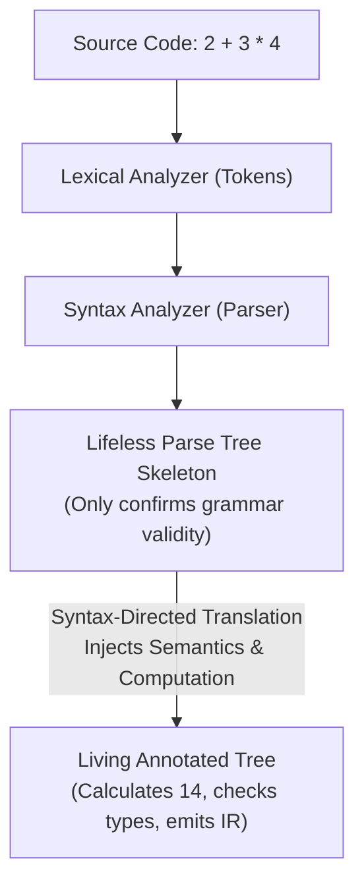
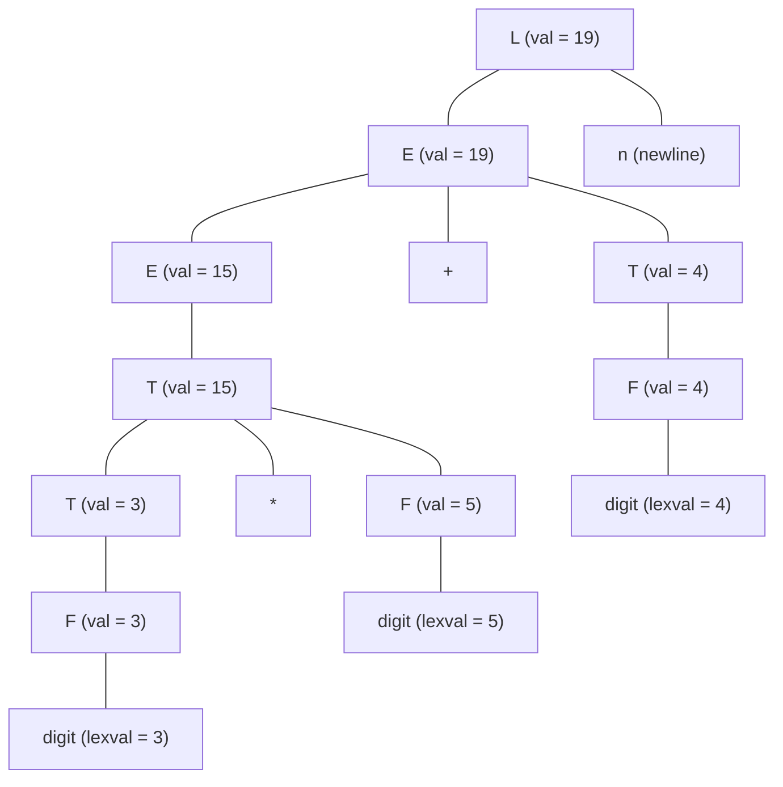
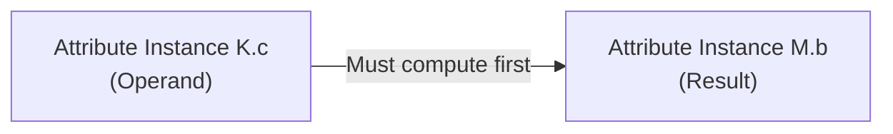
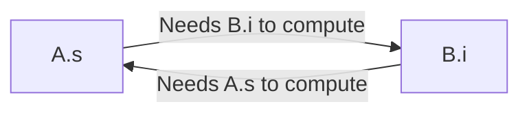

# Syntax-Directed Definitions and Translation Schemes

> 📖 **Reading Order:** Step 01 of 55 | **Module 1: Syntax-Directed Translation**  
> ◄ **Previous:** *Start of Course* | ► **Next:** [[Synthesized and Inherited Attributes]]

---

## Starting Point and the Problem

To understand why Syntax-Directed Translation exists, you have to realize the profound limitation of a parser: **A parser is blind to meaning.**

A parser is like a strict English teacher who checks grammar. If you hand the teacher the sentence:
> *"The green stone sleeps furiously."*

The teacher checks: *Noun phrase? Yes. Verb? Yes. Adverb? Yes.* The sentence is stamped **SYNTACTICALLY VALID**. 

Does it make any sense? No. Does it calculate anything? No. 

When a parser processes the expression `2 + 3 * 4`, all it does is verify that the tokens follow the grammar rules ($E \to E + T, \; T \to T * F$). It produces an abstract, lifeless wooden skeleton called a **Parse Tree**. To the parser, `2`, `3`, and `4` are just terminal tokens. It does not know that `+` means addition, it does not calculate `14`, it does not check if variable types match, and it cannot generate a single line of machine code!



### The Solution: Piggybacking Semantics onto Syntax
We do not want to invent a completely separate, complicated mechanism to traverse code. The parse tree already reflects the hierarchical structure of the language! 

So, compiler designers had an ingenious insight:
> **Let's piggyback semantic meaning directly onto the syntactic structure.**

We attach properties called **Attributes** to grammar symbols (like attaching sticky notes to each node of the parse tree), and we attach mathematical equations or code snippets called **Semantic Rules / Actions** to the grammar productions. As the tree is parsed, these rules fire, computing values, checking types, and generating code.

This unified framework is called **Syntax-Directed Translation (SDT)**.

---

## Developing the Idea

Compilers formalize this concept into two distinct specifications: **Syntax-Directed Definitions (SDD)** and **Syntax-Directed Translation Schemes (SDT)**. 

Students often confuse these two. Here is the intuitive way to feel the difference:

```mermaid
flowchart LR
    SDD["Syntax-Directed Definition (SDD)<br/>THE ARCHITECT'S BLUEPRINT<br/>• Declarative<br/>• States WHAT must be true<br/>• Order is NOT specified"] 
    -->|"Realized into an execution order"| 
    SDT["Syntax-Directed Translation Scheme (SDT)<br/>THE BUILDER'S STEP-BY-STEP RECIPE<br/>• Imperative<br/>• States WHEN and HOW to execute<br/>• Order is STRICTLY left-to-right"]
```

### 1. Syntax-Directed Definition (SDD) = Declarative Blueprint
An SDD associates attributes with grammar symbols and **mathematical equations** with productions. It tells you **WHAT** relationship must hold, but deliberately hides **WHEN** to compute it.
- *Example Production:* $E \longrightarrow E_1 + T$
- *Semantic Rule:* $E.val = E_1.val + T.val$
- *What it means:* "In any valid parse tree, the numerical value at node $E$ must be equal to the sum of the numerical values at its children $E_1$ and $T$."
- Notice that it does *not* say whether to calculate $E_1$ first or $T$ first. It is pure declarative mathematics.

### 2. Syntax-Directed Translation Scheme (SDT) = Imperative Recipe
An SDT takes an SDD and embeds explicit executable program fragments (called **Semantic Actions**) inside curly braces `{ ... }` directly within the production bodies.
- *Example Production with Action:* $E \longrightarrow E_1 + T \quad \{ E.val = E_1.val + T.val; \}$
- *What it means:* "Parse $E_1$, then parse token `+`, then parse $T$, and the moment $T$ finishes, immediately execute this exact line of code!"
- The order is explicit and locked into the parser's traversal.

| Dimension | Syntax-Directed Definition (SDD) | Syntax-Directed Translation Scheme (SDT) |
| :--- | :--- | :--- |
| **Philosophy** | **Declarative** (High-level specification) | **Imperative** (Implementation program) |
| **Semantic Element** | Mathematical rules / equations | Executable code blocks `{ ... }` |
| **Evaluation Order** | **Unspecified** (any order respecting dependencies) | **Strictly Left-to-Right** (tied to parse tree traversal) |
| **Side Effects** | Disallowed or strictly controlled | Allowed (can print to stdout, write to disk, mutate globals) |
| **Primary Utility** | Mathematical reasoning, cycle detection, proofs | Production compiler code generation, Yacc/Bison parser actions |

---

## Definition

**Syntax-Directed Definitions and Translation Schemes** is a formal compiler mechanism that structures syntax-directed translation, intermediate representations, runtime environments, or code generation.

---

## How It Works

### Grammar Attributes: The Data Carriers

An **attribute** is any piece of information attached to a grammar symbol $X$, denoted by $X.a$.

Think of an attribute as a field in a record or an object property. When the symbol $X$ appears at multiple different locations in a parse tree, each occurrence has its own independent instance of the attribute.

Attributes carry everything the compiler cares about:
- **Numerical Values:** Evaluating constants ($E.val = 14$).
- **Data Types:** Type checking ($E.type = \text{'pointer to integer'}$).
- **String Names:** Symbol table lookup ($id.name = \text{'total\_cost'}$).
- **Memory Locations:** Register and stack offsets ($id.offset = 16$).
- **AST Nodes:** Pointers to intermediate tree structures ($E.node = \text{new Node}(\dots)$).
- **Control Labels:** Target jump addresses in control flow ($B.true = L_1, \; B.false = L_2$).

### The Two Directions of Information Flow
How does information move across a tree? There are only two fundamental directions:
1. **From Children Up to Parent:** **[[Synthesized and Inherited Attributes|Synthesized Attributes]]**.
2. **From Parent or Siblings Down to Children:** **[[Synthesized and Inherited Attributes|Inherited Attributes]]**.

---

### The Annotated (Decorated) Parse Tree

When an SDD is evaluated for a specific input string, we can visualize the result by writing the computed attribute values directly inside each node of the parse tree. This is called an **Annotated Parse Tree** (or Decorated Parse Tree).

### Walkthrough: Desk Calculator Grammar
Consider an SDD where every non-terminal has a synthesized attribute `.val`, and terminal `digit` has attribute `.lexval` supplied by the lexer:

1. $L \longrightarrow E \mathbf{n} \quad \{ L.val = E.val \}$
2. $E \longrightarrow E_1 + T \quad \{ E.val = E_1.val + T.val \}$
3. $E \longrightarrow T \quad \{ E.val = T.val \}$
4. $T \longrightarrow T_1 * F \quad \{ T.val = T_1.val \times F.val \}$
5. $T \longrightarrow F \quad \{ T.val = F.val \}$
6. $F \longrightarrow ( E ) \quad \{ F.val = E.val \}$
7. $F \longrightarrow \mathbf{digit} \quad \{ F.val = \mathbf{digit}.lexval \}$

For input `3 * 5 + 4 n`:



### Feel the Execution Flow:
- Notice how numbers start at the bottom leaves (`digit.lexval = 3, 5, 4`).
- They climb up through reductions into $F$, then into $T$.
- At node $T_1$, the multiplication rule multiplies $3 \times 5 = 15$.
- At the root $E$, the addition rule adds $15 + 4 = 19$.
- The final answer $19$ reaches $L.val$ at the very top.

---

### Dependency Graphs and the Evaluation Order

Because an SDD does not specify an evaluation order, how does a compiler figure out which attribute to calculate first?

If node $A$ needs the value of node $B$, you obviously cannot compute $A$ until $B$ is finished!

To formalize this, the compiler builds a **Dependency Graph**:
1. For every node $N$ in the parse tree and every attribute $a$ at $N$, draw a graph vertex $N.a$.
2. If the semantic rule computing attribute $M.b$ references attribute $K.c$, draw a directed edge:
   $$K.c \longrightarrow M.b$$
   *(Read as: "K.c must be computed BEFORE M.b can be evaluated.")*



### The Mathematical Proof: Topological Sorting
> **Theorem:** An attribute dependency graph can be evaluated in a valid sequential order if and only if the graph contains **NO DIRECTED CYCLES** (i.e., it is a Directed Acyclic Graph, or DAG).
>
> **Proof:**  
> A valid evaluation order requires that for every directed edge $(u, v)$, attribute $u$ is evaluated before attribute $v$. This is the exact definition of a **topological sort** of a directed graph.  
> 1. If the graph contains a cycle $u \to v \to \dots \to u$, then by transitivity, $u$ must be evaluated before $v$, which must be evaluated before $u$, requiring $u < u$. This is a logical contradiction. Therefore, no sequential evaluation order can exist for a graph with cycles.  
> 2. If the graph has no cycles (is a DAG), by graph theory, there exists at least one node with in-degree 0 (a node that depends on nothing). We evaluate this node, remove it and its outgoing edges from the graph, and repeat. The remaining subgraph is still a DAG. By induction on the number of vertices, this process always terminates, producing a valid linear evaluation sequence. $\blacksquare$

---

### The Catastrophic Cycle Problem & Why We Need SDD Classes

What if a programmer writes an SDD like this?
- Production: $A \longrightarrow B$
- Rule 1: $A.s = B.i + 1$
- Rule 2: $B.i = A.s * 2$

Here, $A.s$ depends on $B.i$, and $B.i$ depends on $A.s$. This creates a circular death-knot ($A.s \to B.i \to A.s$). The compiler freezes; neither can ever be computed.



### The Shocking Complexity Result:
Can a compiler just check whether an arbitrary SDD will ever produce a cycle?
> **Theorem:** Deciding whether an arbitrary Syntax-Directed Definition (SDD) has *any* parse tree with a circular dependency is **NP-COMPLETE**!

Think about what this means: A compiler cannot afford to spend exponential time running cycle-detection algorithms before compiling every program!

### The Engineering Solution: Well-Behaved Classes
To guarantee that cycles can **never** occur, compiler designers refuse to support arbitrary SDDs. Instead, they restrict grammars to two mathematically guaranteed, cycle-free subclasses:
1. **[[S-Attributed and L-Attributed SDDs|S-Attributed Definitions]]:** Strictly bottom-up (all attributes synthesized). Guaranteed cycle-free!
2. **[[S-Attributed and L-Attributed SDDs|L-Attributed Definitions]]:** Attributes flow strictly from parent and left siblings. Guaranteed cycle-free!

These classes will be explored deeply in the next two notes.

---

## Example

Detailed walkthroughs and traces are provided in the corresponding example and problem notes.

---

## Technical Details

Target architecture and ABI specifications govern low-level alignment and register assignments.

---

## Important Properties and Why They Hold

- **Semantic Soundness:** Preserves program execution equivalence.
- **Algorithmic Efficiency:** Operates in low polynomial or linear time over the program structure.

---

## Common Mistakes

### Common Exam Traps and Pitfalls

> [!WARNING] The 3 Classic Exam Traps
> 1. **Treating SDD rules as assignment code:** In an SDD, writing $E.val = E_1.val + T.val$ is a **declarative mathematical constraint**, NOT an imperative assignment statement. It asserts equality; it does not say when the addition runs.
> 2. **Assigning inherited attributes to terminals:** Terminals **CANNOT** have inherited attributes! A terminal's value (`id.entry`, `num.val`) is manufactured by the Lexer before parsing even begins. A terminal cannot inherit context from grammar non-terminals.
> 3. **Assuming syntax determines semantics:** Two identical parse trees can produce completely different results if their SDDs differ (e.g., one SDD evaluates the numerical result, while another SDD builds an AST, and a third SDD generates assembly code).

---

## Exam Relevance

Tested regularly in compiler examinations via syntax-directed translation proofs, activation record diagrams, and control flow optimization problems.

---

## Related Concepts

- [[Synthesized and Inherited Attributes]]
- [[S-Attributed and L-Attributed SDDs]]
- [[Intermediate Representations and Three-Address Code]]

---

## Prerequisites

- *Start of Course (Compiler Front End & Context-Free Grammars)*

---

## Problems

- [[Problem — Desk Calculator SDD and Annotated Parse Tree]]

---

## Sources

- **Lecture Slides:** [[cse309/01 - Sources/Lectures/KMS Merged.pdf|KMS Merged.pdf]], Chapter 5 (Slides 6–30).
- **Textbook:** Aho, Lam, Sethi, Ullman, *Compilers: Principles, Techniques, & Tools* (2nd Ed.), Chapter 5, Sections 5.1 & 5.2.
