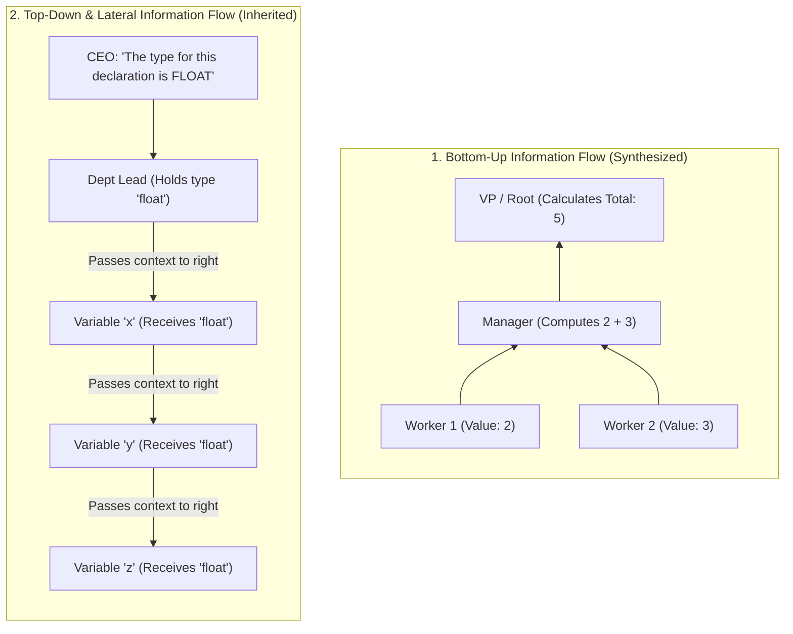
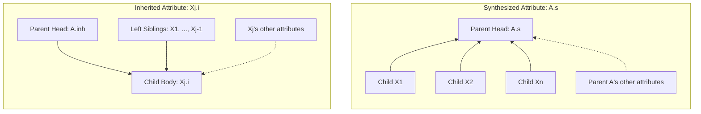
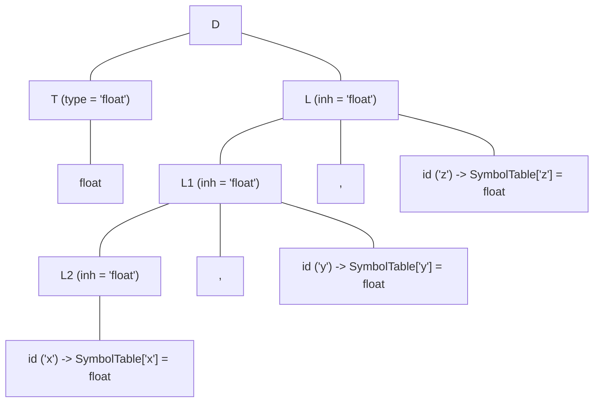

# Synthesized and Inherited Attributes

> 📖 **Reading Order:** Step 2 of 55 | **Module 1:** Syntax-Directed Translation  
> ◄ **Previous:** [[Syntax-Directed Definitions and Translation Schemes]] | ► **Next:** [[S-Attributed and L-Attributed SDDs]]

---

---

---

---

---

## Starting Point and the Problem

To truly feel why we have two distinct types of attributes, consider how information naturally flows in any human hierarchy—such as a large organization:



### The Two Computational Needs of a Programming Language:
1. **Evaluating Expressions (Bottom-Up):**
   When you write `x = 2 + 3 * 4`, the value of `3 * 4` must be computed *before* you can add `2`. The smaller components report their results up to the larger components. This is **Synthesis** (bottom-up aggregation).
2. **Propagating Context & Types (Top-Down & Sideways):**
   When you write `float a, b, c;`, look at the token `float`. It appears once, at the far left. The identifiers `a`, `b`, and `c` have no idea what data type they are supposed to be! They cannot "synthesize" their type from below because they have no children. They must **inherit** their data type from the context established to their left. This is **Inheritance** (top-down and lateral context sharing).

---

---

---

---

---

## Developing the Idea

Let $A \longrightarrow X_1 X_2 \dots X_n$ be a production in a context-free grammar.



### 1. Synthesized Attribute
An attribute $A.s$ associated with the head of a production $A$ is **synthesized** if its value is defined by a semantic rule:
$$A.s = f(X_1.a_1, X_2.a_2, \dots, X_n.a_n, A.a_{\text{other}})$$
- **Defined at:** The **head (LHS)** of the production ($A$).
- **Depends on:** The attribute values of the grammar symbols $X_1, \dots, X_n$ on the **body (RHS)**, and potentially other attributes of $A$ itself.
- **Terminal Symbols:** Terminals can have synthesized attributes, but they are computed **exclusively by the Lexical Analyzer** (e.g., `digit.lexval = 5`, `id.name = 'count'`).

---

### 2. Inherited Attribute
An attribute $X_j.i$ associated with a body symbol $X_j$ ($1 \le j \le n$) is **inherited** if its value is defined by a semantic rule:
$$X_j.i = f(A.a, X_1.a_1, X_2.a_2, \dots, X_{j-1}.a_{j-1}, X_j.a_{\text{other}})$$
- **Defined at:** A **body symbol (RHS)** of the production ($X_j$).
- **Depends on:** The inherited attributes of the **head non-terminal $A$**, and the attributes of the **sibling symbols** appearing to the left or right of $X_j$.
- **Terminals CANNOT have inherited attributes!** Why? (See the Lexer Factory Proof below).

---

---

---

---

---

## Definition

**Synthesized and Inherited Attributes** is a formal compiler mechanism that structures syntax-directed translation, intermediate representations, runtime environments, or code generation.

---

---

---

---

## How It Works

### How It Works

### How It Works

### How It Works

### Architectural Comparison: Synthesized vs. Inherited

| Feature | Synthesized Attributes | Inherited Attributes |
| :--- | :--- | :--- |
| **Direction of Flow** | Strictly **Bottom-Up** (Children $\to$ Parent) | **Top-Down & Lateral** (Parent / Siblings $\to$ Child) |
| **Associated Symbols** | Non-terminals AND Terminals (from lexer) | Non-terminals **ONLY** |
| **Parsing Harmony** | Natural fit for **Bottom-Up (LR) Parsing** | Natural fit for **Top-Down (LL) Parsing** |
| **LR Stack Mechanism** | Automatic: attribute lives on stack, reduced upon match | Requires **Marker Non-Terminals** or stack offset indexing |
| **Primary Use Cases** | Evaluating math, building AST nodes, computing sizes | Propagating types, scope resolution, passing loop break labels |
| **Cycle Vulnerability** | Impossible on its own (tree has finite depth) | High risk if dependencies flow right-to-left or circularly |

---

---
### Technical Details

Target architecture and ABI specifications govern low-level alignment and register assignments.

---
### Important Properties and Why They Hold

### The Lexer Factory Proof: Why Terminals Cannot Inherit

Students frequently ask on exams: *"Why can non-terminals have inherited attributes, but terminals cannot?"*

### The Architectural Proof:
Think of the compiler front end as a two-stage assembly line:
1. **Stage 1 (The Lexer Factory):** The lexer reads raw source characters from disk (`f`, `l`, `o`, `a`, `t`) and stamps out an immutable physical token object `(TOKEN_FLOAT, lexval)`. The lexer does this *completely independently*, before the parser even decides what grammar production to apply!
2. **Stage 2 (The Parser):** The parser receives this already-stamped token widget.
3. If terminals were allowed to have inherited attributes, their values would depend on where the parser places them in the tree. But the token was already manufactured and finalized in Stage 1!
4. Therefore, by architectural causality, terminal attributes can only be **synthesized** by the lexer. They cannot inherit runtime context from grammar non-terminals. $\blacksquare$

---

---
### Related Concepts

- [[Syntax-Directed Definitions and Translation Schemes]]
- [[Intermediate Representations and Three-Address Code]]
- [[Basic Blocks and Control Flow Graphs]]

---
### Prerequisites

- [[Syntax-Directed Definitions and Translation Schemes]]

---
### Problems

- [[Problem — Desk Calculator SDD and Annotated Parse Tree]]
- [[Problem — Array Reference Three-Address Code Generation]]

---

---
### Technical Details

Target architecture and ABI specifications govern low-level alignment and register assignments.

---
### Important Properties and Why They Hold

- **Semantic Soundness:** Preserves program execution equivalence.
- **Algorithmic Efficiency:** Operates in low polynomial or linear time over the program structure.

---
### Related Concepts

- [[Syntax-Directed Definitions and Translation Schemes]]
- [[Intermediate Representations and Three-Address Code]]
- [[Basic Blocks and Control Flow Graphs]]

---
### Prerequisites

- [[Syntax-Directed Definitions and Translation Schemes]]

---
### Problems

- [[Problem — Desk Calculator SDD and Annotated Parse Tree]]
- [[Problem — Array Reference Three-Address Code Generation]]

---

---
### Technical Details

Target architecture and ABI specifications govern low-level alignment and register assignments.

---
### Important Properties and Why They Hold

- **Semantic Soundness:** Preserves program execution equivalence.
- **Algorithmic Efficiency:** Operates in low polynomial or linear time over the program structure.

---
### Related Concepts

- [[Syntax-Directed Definitions and Translation Schemes]]
- [[Intermediate Representations and Three-Address Code]]
- [[Basic Blocks and Control Flow Graphs]]

---
### Prerequisites

- [[Syntax-Directed Definitions and Translation Schemes]]

---
### Problems

- [[Problem — Desk Calculator SDD and Annotated Parse Tree]]
- [[Problem — Array Reference Three-Address Code Generation]]

---

---

## Example

Detailed walkthroughs and traces are provided in the corresponding example and problem notes.

---

## Technical Details

Target architecture and ABI specifications govern low-level alignment and register assignments.

---

## Important Properties and Why They Hold

- **Semantic Soundness:** Preserves program execution equivalence.
- **Algorithmic Efficiency:** Operates in low polynomial or linear time over the program structure.

---

## Common Mistakes

### Common Mistakes

### Common Mistakes

### Common Mistakes

### The Danger Zone: Circular Dependency Traps

Why must compilers be extremely strict about inherited attributes? 

Because the moment you allow an attribute to inherit from *any* sibling, you can write:
```
Production: S -> A B
Rules:      A.inh = B.syn + 1
            B.inh = A.syn + 2
            A.syn = A.inh * 3
            B.syn = B.inh * 4
```

Look at the dependency graph:
$$A.inh \longrightarrow A.syn \longrightarrow B.inh \longrightarrow B.syn \longrightarrow A.inh$$

It's a continuous, unbreakable loop! 
- $A.inh$ cannot be computed without $B.syn$.
- $B.syn$ cannot be computed without $B.inh$.
- $B.inh$ cannot be computed without $A.syn$.
- $A.syn$ cannot be computed without $A.inh$.

This is why the compiler community invented the **L-Attributed restriction**: information is permitted to flow **ONLY from left to right**, completely making cycles impossible!

---

---

---

---

---

## Exam Relevance

### Example

Detailed walkthroughs and traces are provided in the corresponding example and problem notes.

---
### Exam Relevance

### Example

Detailed walkthroughs and traces are provided in the corresponding example and problem notes.

---
### Exam Relevance

### Example

### Deep Walkthrough: Inherited Attributes in Type Declarations

To feel the power of inherited attributes, examine how a compiler processes variable declarations:
```c
float x, y, z;
```

### The Grammar:
1. $D \longrightarrow T \; L$
2. $T \longrightarrow \mathbf{int}$
3. $T \longrightarrow \mathbf{float}$
4. $L \longrightarrow L_1 , \; \mathbf{id}$
5. $L \longrightarrow \mathbf{id}$

If you only had synthesized attributes, how could `id` (e.g., `z`) know it is a `float`? 
- `id` is at the bottom right of the tree.
- `float` is at the bottom left under $T$.
- With pure synthesis, information can only travel *up* to $D$. But `id` needs the information to come *down* to it!

### The SDD Solution with Inherited Attribute `.inh`:
| Production | Semantic Rules | Explanation |
| :--- | :--- | :--- |
| $D \longrightarrow T \; L$ | $L.inh = T.type$ | **Sideways handoff:** $T$ synthesizes its type (`float`), and passes it across into $L$'s inherited attribute! |
| $T \longrightarrow \mathbf{int}$ | $T.type = \text{'integer'}$ | Base type synthesis. |
| $T \longrightarrow \mathbf{float}$ | $T.type = \text{'float'}$ | Base type synthesis. |
| $L \longrightarrow L_1 , \; \mathbf{id}$ | $L_1.inh = L.inh$ <br/> $\text{addType}(\mathbf{id}.entry, L.inh)$ | **Downward propagation:** Passes the type down to the sublist $L_1$, and enters $\mathbf{id}$ into the symbol table with type $L.inh$. |
| $L \longrightarrow \mathbf{id}$ | $\text{addType}(\mathbf{id}.entry, L.inh)$ | Base case: registers the last identifier with the inherited type. |

### The Annotated Parse Tree & Attribute Flow:


### Trace the Information Vector:
1. $T$ reads token `float` and computes $T.type = \text{'float'}$.
2. At the root $D$, rule $L.inh = T.type$ passes `'float'` laterally from $T$ into $L$.
3. Node $L$ passes $L.inh = \text{'float'}$ downward to $L_1$, which passes it to $L_2$.
4. At each step, the rule $\text{addType}(\mathbf{id}.entry, L.inh)$ writes the type into the symbol table for each variable (`x`, then `y`, then `z`).

Without inherited attributes, handling this declaration would require awkward multi-pass global variable hacks!

---

---
### Exam Relevance

Tested regularly in compiler examinations via syntax-directed translation proofs, activation record diagrams, and control flow optimization problems.

---

---

---

---

## Related Concepts

- [[Syntax-Directed Definitions and Translation Schemes]]
- [[Intermediate Representations and Three-Address Code]]
- [[Basic Blocks and Control Flow Graphs]]

---

## Prerequisites

- [[Syntax-Directed Definitions and Translation Schemes]]

---

## Problems

- [[Problem — Desk Calculator SDD and Annotated Parse Tree]]
- [[Problem — Array Reference Three-Address Code Generation]]

---

## Sources

- **Lecture Slides:** [[cse309/01 - Sources/Lectures/KMS Merged.pdf|KMS Merged.pdf]], Chapter 5 (Slides 11–24).
- **Textbook:** Aho, Lam, Sethi, Ullman, *Compilers: Principles, Techniques, & Tools* (2nd Ed.), Section 5.1 (Synthesized and Inherited Attributes).
