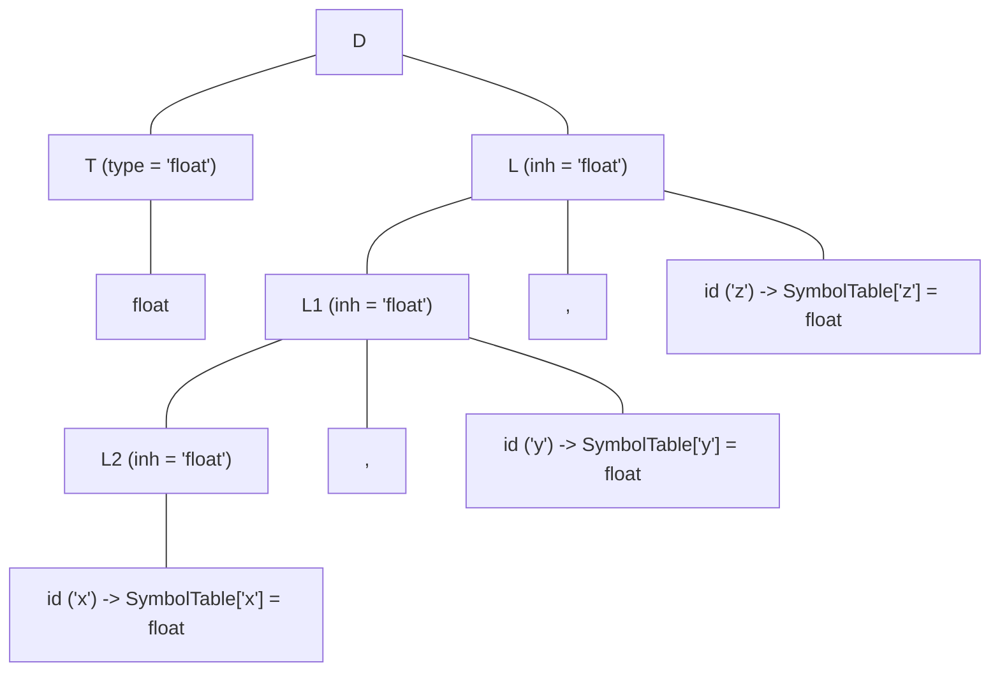

# Synthesized and Inherited Attributes

> 📖 **Reading Order:** Step 2 of 55 | **Module 1:** Syntax-Directed Translation  
> ◄ **Previous:** [[Syntax-Directed Definitions and Translation Schemes]] | ► **Next:** [[S-Attributed and L-Attributed SDDs]]

---

## Building the idea

An expression's value often becomes known after its children have been evaluated. A declaration's type may be known before its identifier list is processed. These are different directions of information flow.

A **synthesized attribute** is computed for a production's left-hand-side occurrence from the permitted information at that node and its children. An **inherited attribute** supplies context to a right-hand-side occurrence from the parent or sibling occurrences, according to the SDD's rules.

In an illustrative declaration `int a,b`, the type comes from `int` and must reach both identifiers. The identifiers cannot infer it from their names. In an illustrative arithmetic expression, each leaf contributes a value and the parent combines it. [[Syntax-Directed Definitions and Translation Schemes]] describes both using attributes; the distinction explains why their evaluation schedules differ.

Attribute direction describes dependencies, not a requirement to move physical memory up or down a tree.

## How It Works

### Architectural Comparison: Synthesized vs. Inherited

| Feature | Synthesized Attributes | Inherited Attributes |
| :--- | :--- | :--- |
| **Direction of Flow** | Strictly **Bottom-Up** (Children $\to$ Parent) | **Top-Down & Lateral** (Parent / Siblings $\to$ Child) |
| **Associated Symbols** | Non-terminals AND Terminals (from lexer) | Non-terminals **ONLY** |
| **Parsing Harmony** | Natural fit for **Bottom-Up (LR) Parsing** | Natural fit for **Top-Down (LL) Parsing** |
| **LR Stack Mechanism** | Automatic: attribute lives on stack, reduced upon match | Requires **Marker Non-Terminals** or stack offset indexing |
| **Primary Use Cases** | Evaluating math, building AST nodes, computing sizes | Propagating types, scope resolution, passing loop break labels |
| **Cycle Vulnerability** | Impossible on its own (tree has finite depth) | High risk if dependencies flow right-to-left or circularly |

---

### The Lexer Factory Proof: Why Terminals Cannot Inherit

Students frequently ask on exams: *"Why can non-terminals have inherited attributes, but terminals cannot?"*

### The Architectural Proof:
Think of the compiler front end as a two-stage assembly line:
1. **Stage 1 (The Lexer Factory):** The lexer reads raw source characters from disk (`f`, `l`, `o`, `a`, `t`) and stamps out an immutable physical token object `(TOKEN_FLOAT, lexval)`. The lexer does this *completely independently*, before the parser even decides what grammar production to apply!
2. **Stage 2 (The Parser):** The parser receives this already-stamped token widget.
3. If terminals were allowed to have inherited attributes, their values would depend on where the parser places them in the tree. But the token was already manufactured and finalized in Stage 1!
4. Therefore, by architectural causality, terminal attributes can only be **synthesized** by the lexer. They cannot inherit runtime context from grammar non-terminals. $\blacksquare$

---

## Common Mistakes

### The Danger Zone: Circular Dependency Traps

Why must compilers be extremely strict about inherited attributes? 

Because the moment you allow an attribute to inherit from *any* sibling, you can write:
```
Production: S -> A B
Rules:      A.inh = B.syn + 1
            B.inh = A.syn + 2
            A.syn = A.inh * 3
            B.syn = B.inh * 4
```

Look at the dependency graph:
$$A.inh \longrightarrow A.syn \longrightarrow B.inh \longrightarrow B.syn \longrightarrow A.inh$$

It's a continuous, unbreakable loop! 
- $A.inh$ cannot be computed without $B.syn$.
- $B.syn$ cannot be computed without $B.inh$.
- $B.inh$ cannot be computed without $A.syn$.
- $A.syn$ cannot be computed without $A.inh$.

This is why the compiler community invented the **L-Attributed restriction**: information is permitted to flow **ONLY from left to right**, completely making cycles impossible!

---

## Exam Relevance

---

### Deep Walkthrough: Inherited Attributes in Type Declarations

To feel the power of inherited attributes, examine how a compiler processes variable declarations:
```c
float x, y, z;
```

### The Grammar:
1. $D \longrightarrow T \; L$
2. $T \longrightarrow \mathbf{int}$
3. $T \longrightarrow \mathbf{float}$
4. $L \longrightarrow L_1 , \; \mathbf{id}$
5. $L \longrightarrow \mathbf{id}$

If you only had synthesized attributes, how could `id` (e.g., `z`) know it is a `float`? 
- `id` is at the bottom right of the tree.
- `float` is at the bottom left under $T$.
- With pure synthesis, information can only travel *up* to $D$. But `id` needs the information to come *down* to it!

### The SDD Solution with Inherited Attribute `.inh`:
| Production | Semantic Rules | Explanation |
| :--- | :--- | :--- |
| $D \longrightarrow T \; L$ | $L.inh = T.type$ | **Sideways handoff:** $T$ synthesizes its type (`float`), and passes it across into $L$'s inherited attribute! |
| $T \longrightarrow \mathbf{int}$ | $T.type = \text{'integer'}$ | Base type synthesis. |
| $T \longrightarrow \mathbf{float}$ | $T.type = \text{'float'}$ | Base type synthesis. |
| $L \longrightarrow L_1 , \; \mathbf{id}$ | $L_1.inh = L.inh$ <br/> $\text{addType}(\mathbf{id}.entry, L.inh)$ | **Downward propagation:** Passes the type down to the sublist $L_1$, and enters $\mathbf{id}$ into the symbol table with type $L.inh$. |
| $L \longrightarrow \mathbf{id}$ | $\text{addType}(\mathbf{id}.entry, L.inh)$ | Base case: registers the last identifier with the inherited type. |

### The Annotated Parse Tree & Attribute Flow:


### Trace the Information Vector:
1. $T$ reads token `float` and computes $T.type = \text{'float'}$.
2. At the root $D$, rule $L.inh = T.type$ passes `'float'` laterally from $T$ into $L$.
3. Node $L$ passes $L.inh = \text{'float'}$ downward to $L_1$, which passes it to $L_2$.
4. At each step, the rule $\text{addType}(\mathbf{id}.entry, L.inh)$ writes the type into the symbol table for each variable (`x`, then `y`, then `z`).

Without inherited attributes, handling this declaration would require awkward multi-pass global variable hacks!

---

## What to carry forward

Build the dependency graph before choosing a traversal. [[S-Attributed and L-Attributed SDDs]] gives restrictions that make particular evaluation orders possible. An unrestricted inherited rule can depend on a right sibling; L-attributed rules restrict such dependencies.

## Related notes

- [[Syntax-Directed Definitions and Translation Schemes]]
- [[S-Attributed and L-Attributed SDDs]]

## Sources

- **Lecture Slides:** [[cse309/01 - Sources/Lectures/KMS Merged.pdf|KMS Merged.pdf]], Chapter 5 (Slides 11–24).
- **Textbook:** Aho, Lam, Sethi, Ullman, *Compilers: Principles, Techniques, & Tools* (2nd Ed.), Section 5.1 (Synthesized and Inherited Attributes).
