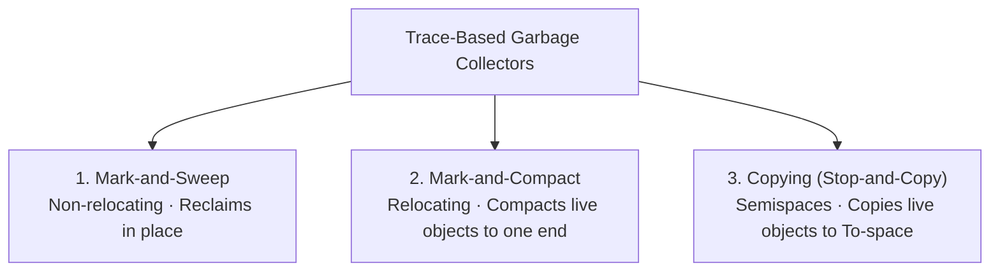

# Trace-Based Garbage Collection Algorithms

> 📖 **Reading Order:** Step 26 of 55 | **Module 3:** Run-Time Environments  
> ◄ **Previous:** [[Garbage Collection Fundamentals and Reference Counting]] | ► **Next:** [[Mark-and-Sweep Garbage Collection Algorithm]]

---

## Building the idea

Tracing starts from the objects the program can directly access, then follows pointers to discover the rest. If an object is not found through any such path, a correct tracing collector can reclaim it even if it participates in a cycle.

The three-color view records progress. White objects have not been reached; gray objects are reached but have unexamined outgoing pointers; black objects have been scanned. In a simple stop-the-world trace, scanning a gray object discovers white children and moves them to gray, then marks the parent black.

Different collectors use this reachability result differently. Mark-and-sweep keeps survivors in place and frees unmarked blocks. Mark-and-compact relocates survivors within the heap. Copying evacuates survivors into another region. Moving collectors must update all relevant references, not merely move bytes.

[[Garbage Collection Fundamentals and Reference Counting]] explains why roots matter. [[Mark-and-Sweep Garbage Collection Algorithm]] and [[Copying Garbage Collection Algorithm]] develop the mechanisms and costs separately.

## How It Works

### Architectural Comparison Table

| Metric | Mark-and-Sweep | Mark-and-Compact | Copying Collector |
| :--- | :--- | :--- | :--- |
| **Object Movement** | Objects **never move** | Objects **move** (relocating) | Objects **move** (relocating) |
| **Heap Fragmentation** | Severe external fragmentation | **Zero** fragmentation | **Zero** fragmentation |
| **Time Complexity** | $O(\text{Heap Size})$ | $O(\text{Heap Size})$ | **$O(\text{Live Objects})$** |
| **Allocation Cost** | Free list search ($O(1)$ to $O(N)$) | Bump pointer ($O(1)$) | Bump pointer ($O(1)$) |
| **Usable Heap Space** | $100\%$ | $100\%$ | **$50\%$** (2 Semispaces) |

---

## Exam Relevance

---

### The Three Major Families of Trace-Based Collectors

### 1. Mark-and-Sweep (McCarthy 1960)
- **Phase 1 (Mark):** Starts at Root Set; marks all reachable objects as live.
- **Phase 2 (Sweep):** Linearly scans the entire heap from beginning to end. Unmarked objects are returned to the free list; marked objects have their mark bits cleared for the next cycle.
- *Pros:* Simple, objects never move (safe for languages with unmanaged C-pointers).
- *Cons:* Leaves heap fragmented; sweep phase cost is proportional to the **total size of the heap**.

---

### 2. Mark-and-Compact (Relocating Collector)
- **Phase 1 (Mark):** Identifies live objects like Mark-and-Sweep.
- **Phase 2 (Compute New Addresses):** Scans heap and calculates the new contiguous address for each live object, sliding them all to the low end of the heap.
- **Phase 3 (Update Pointers):** Updates every pointer in the root set and live objects to point to the new addresses.
- **Phase 4 (Move):** Copies data to the new locations.
- *Pros:* Completely eliminates external fragmentation; restores fast bump-pointer allocation.
- *Cons:* Requires 3 to 4 sequential passes over the entire heap.

---

### 3. Copying Garbage Collector (Stop-and-Copy / Cheney 1970)
- Subdivides heap into two equal-sized halves: **From-space** and **To-space**.
- Mutator allocates exclusively in From-space using a fast bump pointer.
- When From-space fills:
  - Traverses reachable objects from roots and copies them into contiguous locations in To-space.
  - Leaves a **forwarding address** in the old From-space header.
  - Swaps the roles of From-space and To-space.
- *Pros:* Extremely fast; cost is proportional **only to the volume of LIVE data**, not total heap size! Completely defragments memory in a single pass.
- *Cons:* Cuts usable memory capacity in half.

---

## What to carry forward

Compare costs using defined quantities: number of roots, scanned pointers, heap regions swept, and bytes copied. Semispace copying reserves a destination region; “constant auxiliary queue space” does not mean the collector needs no destination memory.

## Related notes

- [[Garbage Collection Fundamentals and Reference Counting]]
- [[Mark-and-Sweep Garbage Collection Algorithm]]
- [[Copying Garbage Collection Algorithm]]

## Sources

- **Lecture Slides:** [[cse309/01 - Sources/Lectures/KMS Merged.pdf|KMS Merged.pdf]], Chapter 7 (Slides 266–293).
- **Textbook:** Aho, Lam, Sethi, Ullman, *Compilers: Principles, Techniques, & Tools* (2nd Ed.), Section 7.6.
