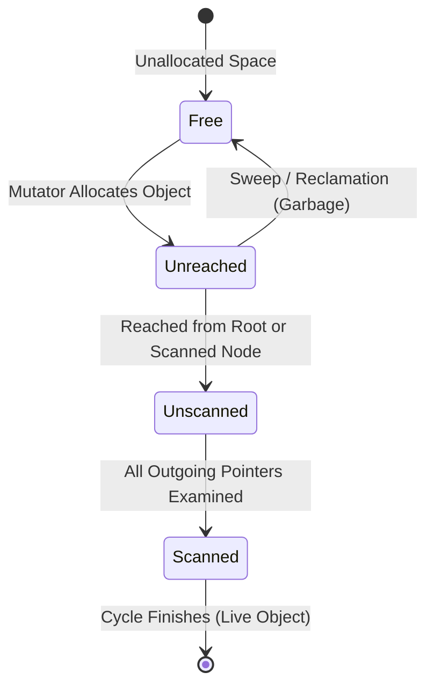
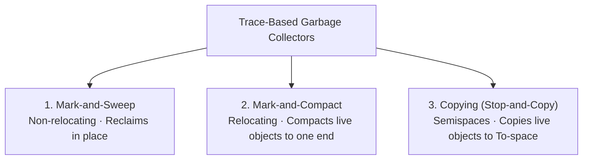

# Trace-Based Garbage Collection Algorithms

> 📖 **Reading Order:** Step 26 of 55 | **Module 3: Run-Time Environments**  
> ◄ **Previous:** [[Garbage Collection Fundamentals and Reference Counting]] | ► **Next:** [[Mark-and-Sweep Garbage Collection Algorithm]]

---

## Starting Point and the Problem

Unlike reference counting, which attempts to detect when objects become unreachable at every assignment, **Trace-Based Garbage Collectors** run periodically (e.g., when the heap is exhausted). 

A trace-based collector traverses the graph of heap references starting from the **Root Set**, discovers all live objects, and concludes that **every unvisited object in the heap is garbage**.

### Core Advantages:
1. **Completely Solves the Cyclic Reference Problem:** Any cyclic island disconnected from the root set is simply never visited and therefore reclaimed automatically!
2. **Zero Overhead on Pointer Assignments:** Mutators perform regular pointer assignments without incrementing or decrementing reference counts.

---

## Developing the Idea

During a trace-based collection cycle, every memory chunk resides in one of four states:

1. **Free:** Memory chunk is unallocated and resides on the free list.
2. **Unreached (White):** Candidate for reclamation; has not yet been visited by the collector during this cycle.
3. **Unscanned (Grey):** Object has been reached by the collector, but its outgoing pointer fields have **not yet been examined**. (Acts as the collector's work queue).
4. **Scanned (Black):** Object has been reached, and **all its outgoing pointer fields have been fully examined**. All objects it points to have transitioned to at least the *Unscanned* state.

### Collector Termination Invariant:
When the work queue is empty (i.e., **no objects remain in the Unscanned state**), reachability tracing is complete:
- Objects in the **Scanned** state are live.
- Objects remaining in the **Unreached** state are unreachable garbage!

---

## Definition

**Trace-Based Garbage Collection Algorithms** is a formal compiler mechanism that structures syntax-directed translation, intermediate representations, runtime environments, or code generation.

---

## How It Works

### The Three Major Families of Trace-Based Collectors

### 1. Mark-and-Sweep (McCarthy 1960)
- **Phase 1 (Mark):** Starts at Root Set; marks all reachable objects as live.
- **Phase 2 (Sweep):** Linearly scans the entire heap from beginning to end. Unmarked objects are returned to the free list; marked objects have their mark bits cleared for the next cycle.
- *Pros:* Simple, objects never move (safe for languages with unmanaged C-pointers).
- *Cons:* Leaves heap fragmented; sweep phase cost is proportional to the **total size of the heap**.

---

### 2. Mark-and-Compact (Relocating Collector)
- **Phase 1 (Mark):** Identifies live objects like Mark-and-Sweep.
- **Phase 2 (Compute New Addresses):** Scans heap and calculates the new contiguous address for each live object, sliding them all to the low end of the heap.
- **Phase 3 (Update Pointers):** Updates every pointer in the root set and live objects to point to the new addresses.
- **Phase 4 (Move):** Copies data to the new locations.
- *Pros:* Completely eliminates external fragmentation; restores fast bump-pointer allocation.
- *Cons:* Requires 3 to 4 sequential passes over the entire heap.

---

### 3. Copying Garbage Collector (Stop-and-Copy / Cheney 1970)
- Subdivides heap into two equal-sized halves: **From-space** and **To-space**.
- Mutator allocates exclusively in From-space using a fast bump pointer.
- When From-space fills:
  - Traverses reachable objects from roots and copies them into contiguous locations in To-space.
  - Leaves a **forwarding address** in the old From-space header.
  - Swaps the roles of From-space and To-space.
- *Pros:* Extremely fast; cost is proportional **only to the volume of LIVE data**, not total heap size! Completely defragments memory in a single pass.
- *Cons:* Cuts usable memory capacity in half.

---

### Architectural Comparison Table

| Metric | Mark-and-Sweep | Mark-and-Compact | Copying Collector |
| :--- | :--- | :--- | :--- |
| **Object Movement** | Objects **never move** | Objects **move** (relocating) | Objects **move** (relocating) |
| **Heap Fragmentation** | Severe external fragmentation | **Zero** fragmentation | **Zero** fragmentation |
| **Time Complexity** | $O(\text{Heap Size})$ | $O(\text{Heap Size})$ | **$O(\text{Live Objects})$** |
| **Allocation Cost** | Free list search ($O(1)$ to $O(N)$) | Bump pointer ($O(1)$) | Bump pointer ($O(1)$) |
| **Usable Heap Space** | $100\%$ | $100\%$ | **$50\%$** (2 Semispaces) |

---

## Example

Detailed walkthroughs and traces are provided in the corresponding example and problem notes.

---

## Technical Details

Target architecture and ABI specifications govern low-level alignment and register assignments.

---

## Important Properties and Why They Hold

- **Semantic Soundness:** Preserves program execution equivalence.
- **Algorithmic Efficiency:** Operates in low polynomial or linear time over the program structure.

---

## Common Mistakes

- Confusing syntactic validity with semantic correctness.
- Overlooking variable scoping or memory aliasing side effects.

---

## Exam Relevance

Tested regularly in compiler examinations via syntax-directed translation proofs, activation record diagrams, and control flow optimization problems.

---

## Related Concepts

- [[Mark-and-Sweep Garbage Collection Algorithm]]
- [[Copying Garbage Collection Algorithm]]
- [[Garbage Collection Fundamentals and Reference Counting]]

---

## Prerequisites

- [[Garbage Collection Fundamentals and Reference Counting]]

---

## Problems

- [[Problem — Activation Record and Display Table Tracing]]

---

## Sources

- **Lecture Slides:** [[cse309/01 - Sources/Lectures/KMS Merged.pdf|KMS Merged.pdf]], Chapter 7 (Slides 266–293).
- **Textbook:** Aho, Lam, Sethi, Ullman, *Compilers: Principles, Techniques, & Tools* (2nd Ed.), Section 7.6.
