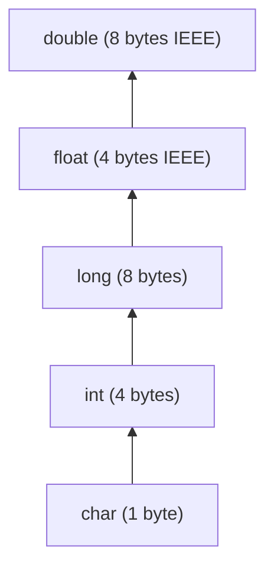

# Translation of Expressions and Array References

> 📖 **Reading Order:** Step 14 of 55 | **Module 2: Intermediate Code Generation**  
> ◄ **Previous:** [[Multi-Dimensional Array Addressing Formulas]] | ► **Next:** [[Control Flow Translation and Boolean Expressions]]

---

## Starting Point and the Problem

Consider a typical high-level language assignment involving multi-dimensional arrays:
$$\mathbf{a[i][j] = b[k][m] + 5}$$

Look carefully at the two array accesses in this single line of code:
1. **$b[k][m]$ is an R-Value (Right-hand value / "Read" context):**
   - The program needs the **contents** stored in memory at the computed address of $b[k][m]$.
   - The compiler must calculate the offset, issue a memory load instruction into a temporary register (`t_load = b[offset]`), and feed that temporary to the arithmetic addition operator.
2. **$a[i][j]$ is an L-Value (Left-hand value / "Location" context):**
   - The program does **not** care about what is currently stored inside $a[i][j]$.
   - Instead, the program requires the **memory destination address** of $a[i][j]$ so that the evaluated right-hand side sum can be written into RAM (`a[offset] = t_sum`).

```
                    a[i][j]             =             b[k][m] + 5
                   ─────────                          ───────────
                   L-VALUE                              R-VALUE
              (Target Location)                     (Evaluated Data)
                     │                                     │
          Calculates byte offset                 Calculates byte offset
         Issues STORE instruction                Issues LOAD instruction
```

> [!CAUTION] The Naive Grammar Trap
> If a compiler naively treats all expressions uniformly as $E$, reducing $a[i][j]$ to $E$ would immediately emit a load instruction: `t1 = a[offset]`. When the parser subsequently encounters the `=` token, it would be faced with `t1 = RHS`. But assigning to a temporary variable `t1` only overwrites a register; it completely fails to update the actual array in memory!
> 
> To solve this, the compiler grammar separates **array references ($L$)** from general **expressions ($E$)**.

---

## Developing the Idea

To emit Three-Address Code (TAC) during syntax-directed translation, the compiler attaches two primary synthesized attributes to grammar symbols:

1. **`addr`:** Represents the runtime location holding the value. It can be:
   - A source identifier (`x`, `y`).
   - A constant literal (`5`, `3.14`).
   - A compiler-allocated temporary register (`t1`, `t2`, generated via `newtemp()`).
2. **`code`:** The linear sequence of TAC instructions generated to compute the subexpression. In practice, compilers either concatenate code strings or immediately stream instructions to disk/memory via helper function `gen(...)`.

### Core Helper Functions:
- `newtemp()`: Allocates and returns a fresh temporary name (`t1`, `t2`, $\dots$).
- `gen(instruction_string)`: Emits a single TAC instruction into the compiler's intermediate representation buffer.

---

## Definition

**Translation of Expressions and Array References** is a formal compiler mechanism that structures syntax-directed translation, intermediate representations, runtime environments, or code generation.

---

## How It Works

### SDD for Arithmetic Expressions

For pure arithmetic, translation synthesizes temporaries bottom-up:

| Production | Semantic Rules | Physical Operation |
| :--- | :--- | :--- |
| $S \longrightarrow \mathbf{id} = E;$ | $\text{gen}(\mathbf{id}.entry \text{ '=' } E.addr);$ | Writes computed temporary into variable's storage. |
| $E \longrightarrow E_1 + E_2$ | $E.addr = \text{newtemp}();$<br>$\text{gen}(E.addr \text{ '=' } E_1.addr \text{ '+' } E_2.addr);$ | Allocates temporary, emits binary addition. |
| $E \longrightarrow - E_1$ | $E.addr = \text{newtemp}();$<br>$\text{gen}(E.addr \text{ '= minus ' } E_1.addr);$ | Emits unary negation. |
| $E \longrightarrow ( E_1 )$ | $E.addr = E_1.addr;$ | Passes through inner address (zero code emitted). |
| $E \longrightarrow \mathbf{id}$ | $E.addr = \mathbf{id}.entry;$ | Returns variable's symbol table address. |
| $E \longrightarrow \mathbf{num}$ | $E.addr = \mathbf{num}.val;$ | Returns literal constant. |

---

### SDD for Multi-Dimensional Array Addressing

To correctly implement the Row-Major addressing formula proved in [[Multi-Dimensional Array Addressing Formulas]], the compiler uses a dedicated non-terminal $L$ with three synthesized attributes:
- `L.array`: Base identifier or symbol table entry of the array.
- `L.type`: The type of the subarray remaining to be indexed.
- `L.addr`: A temporary variable holding the accumulated **byte offset** computed so far.

```
Production                   Semantic Rules
-----------------------------------------------------------------------------------------------------------------------
S -> L = E ;                 /* L-Value Context (Array Store): L[offset] = E */
                             gen(L.array.base '[' L.addr ']' '=' E.addr);

S -> id = E ;                /* Simple Variable Assignment */
                             gen(id.entry '=' E.addr);

E -> L                       /* R-Value Context (Array Load): temp = L[offset] */
                             E.addr = newtemp();
                             gen(E.addr '=' L.array.base '[' L.addr ']');

L -> id [ E ]                /* Base 1st Dimension Index: A[i1] */
                             L.array = id.entry;
                             L.type  = id.type.elem;             /* Elem type after 1st dim */
                             L.addr  = newtemp();
                             gen(L.addr '=' E.addr '*' L.type.width);

L -> L1 [ E ]                /* Inductive Multi-Dimensional Step: A[i1]...[ik] */
                             L.array = L1.array;
                             L.type  = L1.type.elem;            /* Elem type after next dim */
                             t       = newtemp();
                             L.addr  = newtemp();
                             gen(t '=' E.addr '*' L.type.width);
                             gen(L.addr '=' L1.addr '+' t);
```

---

### Type Coercions in Expressions: Widening and Narrowing

Real-world languages permit mixed-mode arithmetic (e.g., `float x; int y; x = x + y;`). The CPU ALU cannot add an integer directly to a floating-point register without hardware conversion.

Compilers define a **Type Hierarchy (Lattice)**:
$$\mathbf{char} \subset \mathbf{int} \subset \mathbf{long} \subset \mathbf{float} \subset \mathbf{double}$$



### Widening vs. Narrowing:
1. **Widening Conversions (Coercions):**
   - Movement **up** the hierarchy (e.g., $\mathbf{int} \to \mathbf{float}$).
   - Safe and value-preserving. Compilers insert these conversions automatically:
     ```text
     t1 = intToFloat y
     t2 = x +float t1
     ```
2. **Narrowing Conversions:**
   - Movement **down** the hierarchy (e.g., $\mathbf{float} \to \mathbf{int}$).
   - Potentially lossy (truncates fractional digits or causes integer overflow). Languages typically require an explicit programmer cast (`(int)x`).

---

## Example

Detailed walkthroughs and traces are provided in the corresponding example and problem notes.

---

## Technical Details

Target architecture and ABI specifications govern low-level alignment and register assignments.

---

## Important Properties and Why They Hold

- **Semantic Soundness:** Preserves program execution equivalence.
- **Algorithmic Efficiency:** Operates in low polynomial or linear time over the program structure.

---

## Common Mistakes

- Confusing syntactic validity with semantic correctness.
- Overlooking variable scoping or memory aliasing side effects.

---

## Exam Relevance

Tested regularly in compiler examinations via syntax-directed translation proofs, activation record diagrams, and control flow optimization problems.

---

## Related Concepts

- [[Type Expressions and Storage Layout]]
- [[Multi-Dimensional Array Addressing Formulas]]
- [[Control Flow Translation and Boolean Expressions]]

---

## Prerequisites

- [[Multi-Dimensional Array Addressing Formulas]]
- [[Intermediate Representations and Three-Address Code]]

---

## Problems

- [[Problem — Array Reference Three-Address Code Generation]]

---

## Sources

- **Lecture Slides:** [[cse309/01 - Sources/Lectures/KMS Merged.pdf|KMS Merged.pdf]], Chapter 6 (Slides 138–153).
- **Textbook:** Aho, Lam, Sethi, Ullman, *Compilers: Principles, Techniques, & Tools* (2nd Ed.), Section 6.4 (Expressions) & Section 6.5 (Type Checking).
