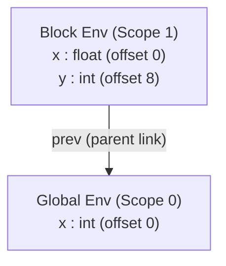

# Type Expressions and Storage Layout

> 📖 **Reading Order:** Step 12 of 55 | **Module 2:** Intermediate Code Generation  
> ◄ **Previous:** [[Value-Number Method for DAG Construction]] | ► **Next:** [[Multi-Dimensional Array Addressing Formulas]]

---

## Building the idea

A declaration supplies both a meaning and a storage requirement. `array(10,int)` describes ten integer elements; if each occupies w bytes in the specified layout, its width is 10w. A record combines fields, but alignment can introduce padding between them.

The compiler records types in the symbol table and assigns relative offsets in a chosen region or frame. An illustrative sequence of widths 4 then 8 does not necessarily give offsets 0 then 4: if the second object needs 8-byte alignment, its offset is rounded to 8 first.

[[Synthesized and Inherited Attributes]] explains how widths and element types flow through declaration grammar rules. The current offset is bookkeeping for placement; the type expression describes the declared object independently of the final absolute address.

Compare structural type equivalence, which examines construction, with name equivalence, which depends on declarations. The language decides which notion applies. Identical byte widths alone never establish identical types.

## How It Works

### Syntax-Directed Translation for Declarations and Offsets

The compiler uses a Syntax-Directed Translation Scheme (SDT) with a global variable `offset` to assign memory offsets to declared variables:

```
Production                   Semantic Rules
---------------------------------------------------------------------------------------------------
P -> { offset = 0; } D       /* Initialize relative offset to 0 */
D -> T id ;                  { enter(id.entry, T.type, offset);
                               offset = offset + T.width; }
     D1
D -> epsilon                 {}
T -> B C                     { T.type = C.type;
                               T.width = C.width; }
B -> int                     { B.type = integer; B.width = 4; }
B -> float                   { B.type = float;   B.width = 8; }
C -> [ num ] C1              { C.type = array(num.val, C1.type);
                               C.width = num.val * C1.width; }
C -> epsilon                 { C.type = B.type;   /* Inherited base type */
                               C.width = B.width; }
```

### 5.1 Step-by-Step Trace for Declaration: `int[2][3] a; float b;`
Let us trace how the compiler calculates widths and assigns offsets:

1. **Initialize:** `offset = 0`.
2. **Process `int[2][3] a;`:**
   - Base type $B \to \mathbf{int} \implies B.type = \mathbf{int}, B.width = 4$.
   - Innermost $C_2 \to \epsilon \implies C_2.type = \mathbf{int}, C_2.width = 4$.
   - Inner dimension $C_1 \to [3] C_2$:
     $$C_1.type = \mathbf{array}(3, \mathbf{int}), \quad C_1.width = 3 \times 4 = 12 \text{ bytes}$$
   - Outer dimension $C \to [2] C_1$:
     $$C.type = \mathbf{array}(2, \mathbf{array}(3, \mathbf{int})), \quad C.width = 2 \times 12 = 24 \text{ bytes}$$
   - Production $T \to B C \implies T.width = 24$.
   - Symbol Table Entry: `enter('a', array(2, array(3, int)), offset=0)`.
   - Update Offset: $\text{offset} = 0 + 24 = \mathbf{24}$.
3. **Process `float b;`:**
   - Base type $B \to \mathbf{float} \implies B.type = \mathbf{float}, B.width = 8$.
   - $C \to \epsilon \implies C.type = \mathbf{float}, C.width = 8$.
   - Symbol Table Entry: `enter('b', float, offset=24)`.
   - Update Offset: $\text{offset} = 24 + 8 = \mathbf{32}$.

Total activation record memory reserved for this block: **32 bytes**.

---
### Nested Scopes and Symbol Table Environments (`Env`)

Block-structured languages (C, C++, Java) permit nested scopes where inner variables shadow outer variables:

```c
int x = 10;
{
    float x = 3.14; // Shadows outer integer x
    int y = 20;
}
// Here, outer integer x is visible again; y is out of scope.
```

To support this cleanly without costly copying, compilers organize symbol tables into an **Environment Tree (Lexical Scope Stack)**:



### 6.1 The `Env` Data Structure
```python
class Env:
    def __init__(self, prev=None):
        self.table = {}     # Maps identifier string -> (type, offset)
        self.prev = prev    # Pointer to immediately enclosing parent Env

    def put(self, name: str, symbol_entry):
        """Declares a variable in the local current scope."""
        self.table[name] = symbol_entry

    def get(self, name: str):
        """Resolves a variable by traversing up the lexical chain."""
        e = self
        while e is not None:
            if name in e.table:
                return e.table[name]
            e = e.prev
        return None  # Undeclared variable error!
```

### 6.2 Scope Entry and Exit Mechanics:
1. **On Block Entry `{`:** A new environment is instantiated: `current_env = new Env(prev=current_env)`. An offset counter is saved on a scope stack.
2. **On Declaration:** Variables are inserted strictly into `current_env.table`.
3. **On Identifier Usage:** `current_env.get(name)` checks the innermost scope first. If shadowed, the inner definition wins. If not found locally, it walks up the `prev` pointers.
4. **On Block Exit `}`:** The current environment is discarded (or preserved for debugging): `current_env = current_env.prev`. The offset counter is restored.

---

### Storage Layout and Relative Addressing

During the declaration phase of compilation, the compiler must allocate physical space for every symbol. It computes two parameters for every declared entity:
1. **Width ($w$):** The number of contiguous bytes required to store an instance of that type.
2. **Offset:** The relative byte offset of each variable from the base pointer of the current activation record or data block.

### 4.1 Recursive Width Calculation
For any type expression $T \in \mathcal{T}$:
$$\text{width}(T) = \begin{cases}
1 & \text{if } T = \mathbf{char} \\
4 & \text{if } T = \mathbf{int} \text{ or } \mathbf{float} \text{ (on 32-bit architecture)} \\
8 & \text{if } T = \mathbf{double} \text{ or } \mathbf{pointer}(T') \text{ (on 64-bit architecture)} \\
N \times \text{width}(T') & \text{if } T = \mathbf{array}(N, T') \\
\sum_{i=1}^k \text{width}(T_i) + \text{pad}_i & \text{if } T = \mathbf{record}(\{f_1:T_1, \dots, f_k:T_k\})
\end{cases}$$

> [!NOTE] Memory Alignment and Hardware Bus Width
> Modern CPUs fetch memory across 32-bit (4-byte) or 64-bit (8-byte) buses. If a 4-byte integer is stored at an unaligned address like `0x1001`, the CPU may require two separate memory bus transactions and bit-shifting logic to assemble the value, severely degrading performance. Therefore, compilers insert **padding bytes** inside structs so each field starts at an address divisible by its natural alignment.

---

### Type Equivalence: Structural vs. Name Equivalence

When two types $T_1$ and $T_2$ appear in an assignment $x = y$, how does the compiler decide if they are equivalent? Two fundamentally distinct philosophies exist in language design:

```
Type Equivalence Philosophies:
┌─────────────────────────────────┐       ┌─────────────────────────────────┐
│     Structural Equivalence      │       │        Name Equivalence         │
├─────────────────────────────────┤       ├─────────────────────────────────┤
│ Types are equal iff their       │       │ Types are equal iff they share  │
│ internal tree structures are    │       │ the exact same declared type    │
│ recursively identical.          │       │ name.                           │
│ (Used in ML, Go structs, TS)    │       │ (Used in C structs, Pascal, Ada)│
└─────────────────────────────────┘       └─────────────────────────────────┘
```

### 3.1 Structural Equivalence Algorithm
Two type expressions $S$ and $T$ are structurally equivalent ($S \equiv_S T$) if:
1. $S$ and $T$ are the same basic type (e.g., both $\mathbf{int}$).
2. $S = \mathbf{array}(N_1, T_1)$ and $T = \mathbf{array}(N_2, T_2)$ with $N_1 = N_2$ and $T_1 \equiv_S T_2$.
3. $S = \mathbf{pointer}(T_1)$ and $T = \mathbf{pointer}(T_2)$ with $T_1 \equiv_S T_2$.
4. $S = (D_1 \to R_1)$ and $T = (D_2 \to R_2)$ with $D_1 \equiv_S D_2$ and $R_1 \equiv_S R_2$.

### 3.2 The Concrete Difference in Practice:
```c
// In C:
typedef struct { int x; int y; } PointA;
typedef struct { int x; int y; } PointB;

PointA a;
PointB b = a; // COMPILE ERROR under Name Equivalence!
              // Even though the fields are identical, 'PointA' != 'PointB'.
```
Under **Structural Equivalence**, `PointA` and `PointB` are identical because their memory shape is identical: $\mathbf{record}(\{x: \mathbf{int}, y: \mathbf{int}\})$. Under **Name Equivalence**, they are distinct types because the programmer declared two distinct type names.

---

## What to carry forward

[[Multi-Dimensional Array Addressing Formulas]] uses dimension widths to locate elements. [[Run-Time Storage Organization and Activation Records]] gives the runtime region in which a relative offset is interpreted.

## Related notes

- [[Synthesized and Inherited Attributes]]
- [[Multi-Dimensional Array Addressing Formulas]]
- [[Run-Time Storage Organization and Activation Records]]

## Sources

- **Lecture Slides:** [[cse309/01 - Sources/Lectures/KMS Merged.pdf|KMS Merged.pdf]], Chapter 6 (Slides 118–137).
- **Textbook:** Aho, Lam, Sethi, Ullman, *Compilers: Principles, Techniques, & Tools* (2nd Ed.), Section 6.3 (Types and Declarations).
