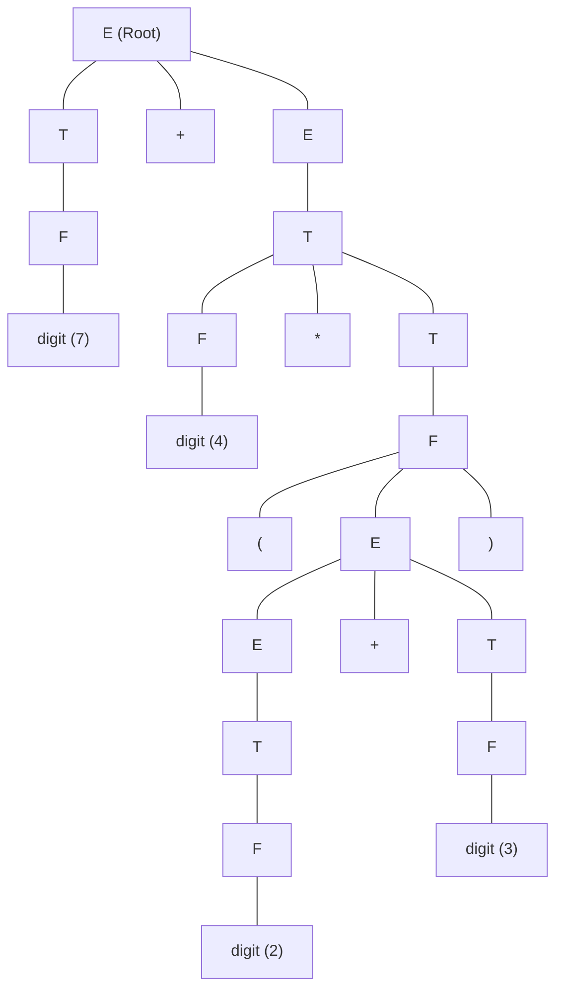

# Arithmetic Expression Desk Calculator SDD Example

> 📖 **Reading Order:** Step 07 of 55 | **Module 1:** Syntax-Directed Translation  
> ◄ **Previous:** [[Bottom-Up Evaluation of L-Attributed SDDs]] | ► **Next:** [[Infix to Postfix and Prefix SDT Translation Example]]

---

## Problem

Imagine building an interactive mathematical calculator or an interpreter for a language like Python or C. When a user enters:
$$(2 + 3) \times 4 + 7$$
a naive text scanner processing tokens left-to-right immediately stumbles:
1. It sees `2`, then `+`, then `3`. If it eagerly adds them, it gets `5`.
2. Next, it sees `* 4`. It multiplies $5 \times 4 = 20$.
3. Next, it sees `+ 7`. It computes $20 + 7 = 27$. (This happens to match only because of the parentheses!).
4. But if the expression were $2 + 3 \times 4 + 7$, a naive left-to-right calculation would compute $(2 + 3) = 5 \implies 5 \times 4 = 20 \implies 20 + 7 = 27$, completely violating mathematical operator precedence (which dictates $3 \times 4 = 12 \implies 2 + 12 + 7 = 21$).

The fundamental issue is that **mathematical expressions possess recursive, hierarchical tree structures, not linear flat structures**. High-precedence operators (`*`, `/`) must execute before low-precedence operators (`+`, `-`), and nested parentheses can defer execution indefinitely.

A **Syntax-Directed Definition (SDD)** solves this by marrying the context-free grammar—which structurally enforces precedence and associativity—with semantic rules that synthesize evaluated numerical results directly from the leaves to the root.

---

## Given

- Grammar productions, semantic rules, basic blocks, or register sets as specified in the problem setup.

---

## Required

- Full step-by-step annotated tree derivation, TAC generation, DAG reduction, or register assignment trace.

---

## Understanding the Problem and Choosing the Method

Analyze the input program structure, identify the governing compiler phase algorithms, and simulate the execution step by step while maintaining all internal invariants.

---

## Solution

### Formal Grammar and Semantic Rules (The SDD)

We use the canonical, unambiguous arithmetic grammar where:
- $E$ models addition (lowest precedence, left-associative).
- $T$ models multiplication (higher precedence, left-associative).
- $F$ models factors, parentheses, and numbers (highest precedence).

Each grammar symbol possesses a single synthesized attribute `val` (representing its evaluated numerical value). Terminals like $\mathbf{digit}$ have an intrinsic lexical value `lexval` provided directly by the lexical analyzer (lexer).

| # | Production | Semantic Rule | Physical Meaning |
| :--- | :--- | :--- | :--- |
| **1** | $E \longrightarrow E_1 + T$ | $E.val = E_1.val + T.val$ | Pull the sum of left sub-expression and right term up to $E$. |
| **2** | $E \longrightarrow T$ | $E.val = T.val$ | Propagate the term's value up to the expression level. |
| **3** | $T \longrightarrow T_1 * F$ | $T.val = T_1.val \times F.val$ | Multiply left factor chain with right factor. |
| **4** | $T \longrightarrow F$ | $T.val = F.val$ | Propagate factor's value up to the term level. |
| **5** | $F \longrightarrow ( E )$ | $F.val = E.val$ | Strip parentheses and elevate the enclosed expression's value. |
| **6** | $F \longrightarrow \mathbf{digit}$ | $F.val = \mathbf{digit}.lexval$ | Convert raw token integer into a factor attribute. |

> [!NOTE] Classification Check
> Notice that **every single attribute definition** computes the attribute of the Left-Hand Side non-terminal using only the attributes of the Right-Hand Side children. There are **zero** inherited attributes. Therefore, this SDD is strictly **S-attributed**.

---
### Concrete Parse Tree vs. Annotated Parse Tree

Let us trace the evaluation for the input string:
$$\mathbf{(2 + 3) * 4 + 7}$$

### 3.1 Concrete Parse Tree (Grammar Structure Only)
The parser groups tokens according to grammar precedence:
- `(2 + 3)` is grouped inside an $F$ factor via $F \to ( E )$.
- That factor becomes a term $T$, which is multiplied by $F(\mathbf{4})$ to form $T \to T * F$.
- Finally, the outer addition combines the multiplication result with $T(F(\mathbf{7}))$.



---

### 3.2 Annotated (Decorated) Parse Tree
When we attach the computed attribute `val` to every node, values propagate upward like sap through a tree:

```
                          [ E.val = 27 ]
                            /    |    \
             [ E.val = 20 ]      +     [ T.val = 7 ]
                 /   \                       \
    [ T.val = 20 ]    \                     [ F.val = 7 ]
       /   |   \       \                         \
[T.val=5]  *  [F.val=4] \                      digit.lexval = 7
    |             \      \
[F.val=5]       digit.lexval = 4
  /   |   \
 ( [E.val=5] )
   /   |   \
[E.val=2] + [T.val=3]
   |           |
[T.val=2]   [F.val=3]
   |           |
[F.val=2]   digit.lexval = 3
   |
digit.lexval = 2
```

---
### Physical Execution: Bottom-Up LR Parser Stack Mechanics

How does an actual bottom-up parser (like Yacc, Bison, or an LR(1)/LALR engine) execute this in silicon?

The parser maintains two parallel synchronized stacks:
1. **The State/Grammar Stack:** Holds grammar symbols and LR state IDs.
2. **The Semantic Value Stack (`val[]`):** Holds the synthesized attributes (`val`).

When a reduction $A \to X_1 X_2 \dots X_k$ occurs:
- The top $k$ entries of the stack are popped.
- The semantic rule is evaluated: e.g., `val[top - 2] + val[top]`.
- Non-terminal $A$ is pushed onto the grammar stack, and the result is pushed onto `val[top]`.

### Concrete Step-by-Step Stack Simulation:

| Step | Grammar / State Stack | Semantic Stack (`val`) | Unconsumed Input | Action Taken |
| :---: | :--- | :--- | :---: | :--- |
| **0** | `$` | `$` | `( 2 + 3 ) * 4 + 7 $` | Shift `(` |
| **1** | `$ (` | `$ -` | `2 + 3 ) * 4 + 7 $` | Shift `2` |
| **2** | `$ ( 2` | `$ - 2` | `+ 3 ) * 4 + 7 $` | Reduce $F \to \mathbf{digit}$ |
| **3** | `$ ( F` | `$ - 2` | `+ 3 ) * 4 + 7 $` | Reduce $T \to F$ |
| **4** | `$ ( T` | `$ - 2` | `+ 3 ) * 4 + 7 $` | Reduce $E \to T$ |
| **5** | `$ ( E` | `$ - 2` | `+ 3 ) * 4 + 7 $` | Shift `+` |
| **6** | `$ ( E +` | `$ - 2 -` | `3 ) * 4 + 7 $` | Shift `3` |
| **7** | `$ ( E + 3` | `$ - 2 - 3` | `) * 4 + 7 $` | Reduce $F \to \mathbf{digit}$ |
| **8** | `$ ( E + F` | `$ - 2 - 3` | `) * 4 + 7 $` | Reduce $T \to F$ |
| **9** | `$ ( E + T` | `$ - 2 - 3` | `) * 4 + 7 $` | Reduce $E \to E + T$ ($2 + 3 = \mathbf{5}$) |
| **10**| `$ ( E` | `$ - 5` | `) * 4 + 7 $` | Shift `)` |
| **11**| `$ ( E )` | `$ - 5 -` | `* 4 + 7 $` | Reduce $F \to ( E )$ (Extract $\mathbf{5}$) |
| **12**| `$ F` | `$ 5` | `* 4 + 7 $` | Reduce $T \to F$ |
| **13**| `$ T` | `$ 5` | `* 4 + 7 $` | Shift `*` |
| **14**| `$ T *` | `$ 5 -` | `4 + 7 $` | Shift `4` |
| **15**| `$ T * 4` | `$ 5 - 4` | `+ 7 $` | Reduce $F \to \mathbf{digit}$ |
| **16**| `$ T * F` | `$ 5 - 4` | `+ 7 $` | Reduce $T \to T * F$ ($5 \times 4 = \mathbf{20}$) |
| **17**| `$ T` | `$ 20` | `+ 7 $` | Reduce $E \to T$ |
| **18**| `$ E` | `$ 20` | `+ 7 $` | Shift `+` |
| **19**| `$ E +` | `$ 20 -` | `7 $` | Shift `7` |
| **20**| `$ E + 7` | `$ 20 - 7` | `$` | Reduce $F \to \mathbf{digit}$ |
| **21**| `$ E + F` | `$ 20 - 7` | `$` | Reduce $T \to F$ |
| **22**| `$ E + T` | `$ 20 - 7` | `$` | Reduce $E \to E + T$ ($20 + 7 = \mathbf{27}$) |
| **23**| `$ E` | `$ 27` | `$` | **ACCEPT!** Output is `27`. |

> [!TIP] The Zero-Overhead Magic of S-Attributed SDDs
> Look at the stack trace above: The evaluation of semantic values does not require a separate tree traversal pass! It occurs strictly on-the-fly inside the parser's existing pushdown automaton. No abstract syntax tree node even needs to be allocated in memory if we only desire the final numerical result.

---
### Formal Mathematical Proof: S-Attributed Acyclicity

Why are we 100% guaranteed that an S-attributed SDD can never encounter circular deadlocks (cycles in its dependency graph)?

### Theorem:
*Every S-attributed Syntax-Directed Definition produces a strictly acyclic dependency graph over any valid parse tree.*

### Formal Proof:
1. Let $\mathcal{T} = (V, E_T)$ be a concrete parse tree derived from context-free grammar $G$.
2. For each node $u \in V$, let $\text{depth}(u)$ denote the distance (number of edges) from the root node $R$ to $u$. 
   - By definition, $\text{depth}(R) = 0$.
   - If node $w$ is a child of node $v$, then $\text{depth}(w) = \text{depth}(v) + 1$. Thus, $\text{depth}(w) > \text{depth}(v)$.
3. Now consider the dependency graph $D = (V_D, E_D)$ induced by an S-attributed SDD on $\mathcal{T}$:
   - In an S-attributed SDD, every semantic rule has the form:
     $$A.s = f(X_1.s_1, X_2.s_2, \dots, X_k.s_k)$$
     where $A$ is the head of the production and $X_1, \dots, X_k$ are symbols in the body.
   - In parse tree $\mathcal{T}$, node $v$ (labeled $A$) is the direct parent of nodes $w_1, \dots, w_k$ (labeled $X_1, \dots, X_k$).
   - Therefore, any dependency edge $e \in E_D$ directed into $A.s$ must originate from some child attribute $X_i.s_i$:
     $$e = (w_i.s_i \longrightarrow v.A.s)$$
   - Notice the depth relationship across this directed edge:
     $$\text{depth}(\text{source}(e)) = \text{depth}(w_i) = \text{depth}(v) + 1 > \text{depth}(v) = \text{depth}(\text{target}(e))$$
   - Hence, **every directed edge in $E_D$ strictly decreases the tree depth of the associated parse tree node**:
     $$\forall (a \to b) \in E_D, \quad \text{depth}(\text{node}(a)) > \text{depth}(\text{node}(b))$$
4. Suppose, for contradiction, that $D$ contains a directed cycle:
   $$c_0 \longrightarrow c_1 \longrightarrow c_2 \longrightarrow \dots \longrightarrow c_m \longrightarrow c_0$$
5. Summing the strict inequalities along the cycle yields:
   $$\text{depth}(\text{node}(c_0)) > \text{depth}(\text{node}(c_1)) > \dots > \text{depth}(\text{node}(c_m)) > \text{depth}(\text{node}(c_0))$$
   which implies:
   $$\text{depth}(\text{node}(c_0)) > \text{depth}(\text{node}(c_0))$$
   This is an impossible strict inequality ($k > k$).
6. Contradiction. Therefore, no cycle can exist in $D$. $D$ is strictly a Directed Acyclic Graph (DAG), and a topological sorting always exists. Furthermore, any standard **post-order depth-first traversal** of $\mathcal{T}$ produces a valid topological evaluation order. $\blacksquare$

---
### Dependency Graph & Topological Order Trace

From our tree, the topological sorting of attribute instances is:
$$\begin{aligned}
& d_2.lexval \to F_2.val \to T_2.val \to E_2.val \\
& d_3.lexval \to F_3.val \to T_3.val \longrightarrow E_{inner}.val \to F_{paren}.val \to T_{paren}.val \\
& d_4.lexval \to F_4.val \longrightarrow \longrightarrow \longrightarrow \longrightarrow \longrightarrow \longrightarrow T_{mult}.val \to E_{left}.val \\
& d_7.lexval \to F_7.val \to T_{right}.val \longrightarrow \longrightarrow \longrightarrow \longrightarrow \longrightarrow \longrightarrow \longrightarrow \longrightarrow \longrightarrow \longrightarrow E_{top}.val
\end{aligned}$$

Because every edge flows monotonically upward, evaluation is deterministic, robust, and lightning-fast.

---

## Result

The compilation pass finishes with verified intermediate representations and correct register assignments.

---

## Why This Works

Every transformation maintains semantic program equivalence while optimizing instruction counts, memory foot-print, or register usage.

---

## Common Mistakes

- Incorrectly calculating stack frame offsets or TAC temporaries.
- Forgetting to spill registers when register demand exceeds hardware pool size.

---

## General Method

Extract the general procedure: parse/partition input, construct intermediate data structures, apply optimizations iteratively, and emit final code.

---

## Related Concepts

- [[Syntax-Directed Definitions and Translation Schemes]]
- [[Basic Blocks and Control Flow Graphs]]

---

## Sources

- **Lecture Slides:** [[cse309/01 - Sources/Lectures/KMS Merged.pdf|KMS Merged.pdf]], Chapter 5 (Slides 7, 8, 10, 21, 22).
- **Textbook:** Aho, Lam, Sethi, Ullman, *Compilers: Principles, Techniques, & Tools* (2nd Ed.), Section 5.1 (Example 5.3), Section 5.2.
